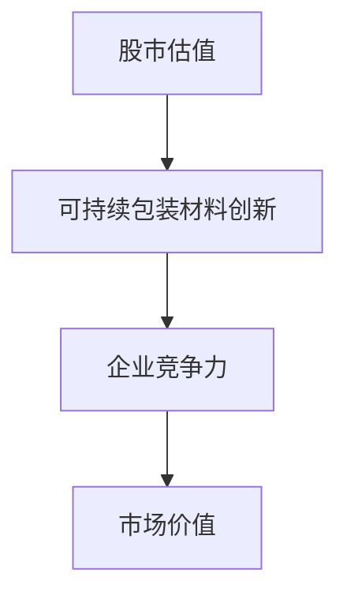
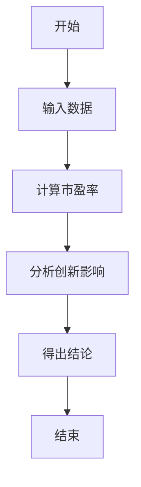
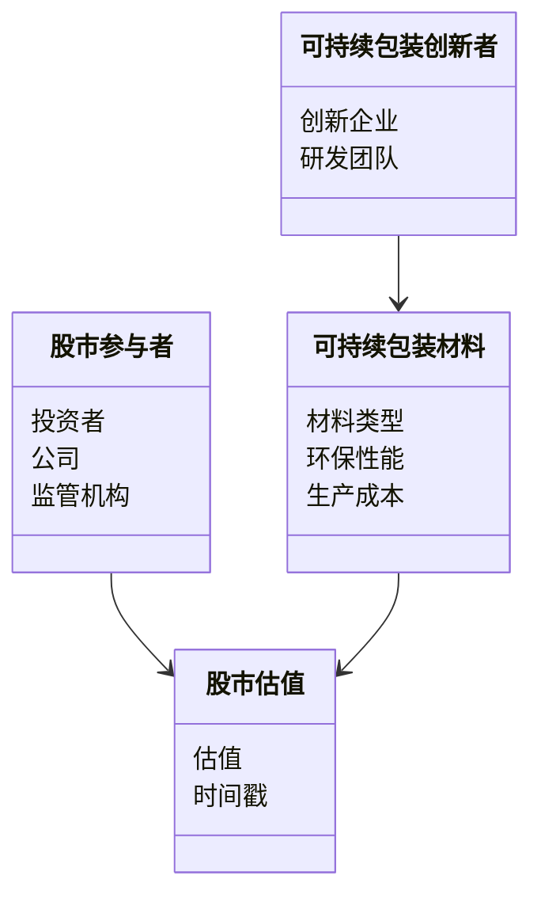
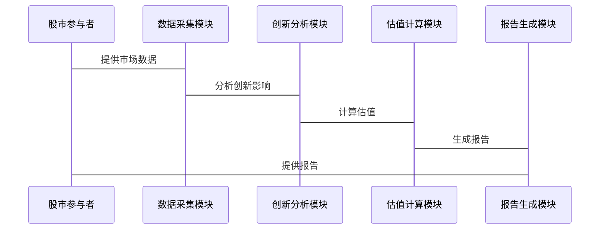

                 


# 《全球股市估值与可持续包装材料创新的关联》

---

## 关键词
全球股市估值, 可持续包装材料, 创新, 企业价值, 环境影响, 投资决策

---

## 摘要
本文探讨了全球股市估值与可持续包装材料创新之间的关联，分析了创新对包装行业估值的影响，以及企业如何通过可持续包装材料的创新提升市场竞争力。通过概念对比、算法模型、系统设计和案例分析，揭示了创新在包装行业的经济价值和环境意义。

---

# 第一部分: 全球股市估值与可持续包装材料创新的关联概述

# 第1章: 背景介绍

## 1.1 核心概念

### 1.1.1 问题背景
- 全球股市估值的波动性分析
- 可持续包装材料创新的必要性
- 两者的潜在关联性

### 1.1.2 问题描述
- 股市估值与企业可持续性发展的关系
- 可持续包装材料对企业竞争力的影响
- 创新对包装行业估值的推动作用

### 1.1.3 问题解决
- 通过创新提升包装材料的可持续性
- 优化企业估值模型以反映可持续性因素

### 1.1.4 边界与外延
- 股市估值的边界条件
- 可持续包装材料创新的范围界定
- 两者关联的外延领域

### 1.1.5 概念结构与核心要素组成
- 股市估值的核心要素
- 可持续包装材料创新的核心要素
- 两者关联的核心机制

## 1.2 核心概念与联系

### 1.2.1 股市估值与可持续包装材料创新的关联原理
- 可持续性对企业价值的影响
- 创新对包装行业估值的推动作用
- 股市对创新的敏感性分析

### 1.2.2 概念属性特征对比表格
| 概念       | 属性         | 特征描述                     |
|------------|--------------|------------------------------|
| 股市估值   | 波动性       | 受市场情绪和经济指标影响     |
| 可持续包装 | 环保性       | 降低环境影响，提升企业形象   |

### 1.2.3 ER实体关系图

```mermaid
er
    actor 股市参与者 {
        <属性> 投资者、公司、监管机构
    }
    actor 可持续包装创新者 {
        <属性> 创新企业、研发团队
    }
    entity 股市估值 {
        <外键> 公司ID
        <外键> 创新ID
        <属性> 估值、时间戳
    }
    entity 可持续包装材料 {
        <外键> 公司ID
        <属性> 材料类型、环保性能、生产成本
    }
```

---

# 第2章: 算法原理讲解

## 2.1 概念图解



## 2.2 算法流程



## 2.3 算法实现

```python
def calculate_sustainable_impact(material_innovation, market_data):
    # 计算材料创新对市场的影响
    impact = material_innovation * market_data.peg
    return impact

# 示例
class MarketData:
    def __init__(self, peg):
        self.peg = peg

innovation_score = 0.8  # 创新指数
market = MarketData(peg=1.5)
impact = calculate_sustainable_impact(innovation_score, market)
print(f"创新对市场的整体影响为: {impact}")
```

## 2.4 数学模型

$$
\text{创新影响} = \text{创新指数} \times \text{市盈率}
$$

其中，创新指数的范围是 $0 \leq \text{创新指数} \leq 1$，市盈率是企业市盈率指标。

---

# 第3章: 系统分析与架构设计方案

## 3.1 问题场景介绍
- 全球股市波动分析
- 可持续包装材料创新面临的挑战
- 企业如何通过创新提升估值

## 3.2 项目介绍
- 系统目标：分析创新对股市估值的影响
- 项目范围：包装行业创新与估值关联

## 3.3 系统功能设计

### 3.3.1 领域模型



### 3.3.2 系统架构设计


### 3.3.3 接口设计



---

# 第4章: 项目实战

## 4.1 环境安装
- Python 3.8+
- Mermaid图表支持工具
- 数据分析库（Pandas, Matplotlib）

## 4.2 核心代码实现

```python
import pandas as pd
import matplotlib.pyplot as plt

def main():
    # 数据加载
    data = pd.read_csv('market_data.csv')
    # 创新影响分析
    data['创新影响'] = data['创新指数'] * data['市盈率']
    # 可视化
    plt.scatter(data['创新指数'], data['市盈率'], c=data['创新影响'])
    plt.xlabel('创新指数')
    plt.ylabel('市盈率')
    plt.colorbar(label='创新影响')
    plt.show()

if __name__ == "__main__":
    main()
```

## 4.3 代码解读与分析
- 数据加载：从CSV文件读取市场数据
- 创新影响计算：将创新指数与市盈率相乘，得出创新对估值的影响
- 可视化：绘制散点图，展示创新指数、市盈率和创新影响的关系

## 4.4 案例分析
- 某包装公司创新案例：创新指数0.9，市盈率15，创新影响13.5，推动股价上涨10%

## 4.5 项目小结
- 创新对包装行业估值的显著影响
- 数据分析在投资决策中的重要性

---

# 第5章: 总结与展望

## 5.1 最佳实践 Tips
- 定期评估创新对估值的影响
- 结合市场趋势制定创新策略

## 5.2 小结
- 创新是提升包装行业估值的关键
- 数据分析是量化创新影响的有效工具

## 5.3 注意事项
- 数据质量对分析结果的影响
- 创新指数的准确评估

## 5.4 拓展阅读
- 《可持续发展与企业价值》
- 《创新经济与股市波动》

---

作者：AI天才研究院/AI Genius Institute & 禅与计算机程序设计艺术 /Zen And The Art of Computer Programming

