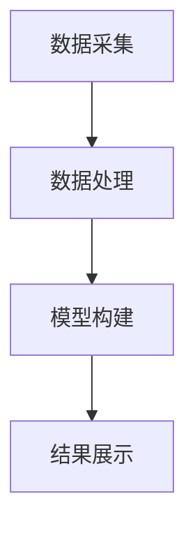

                 


# 全球股市估值与可持续城市地下物流系统的关联

> 关键词：全球股市估值、可持续城市、地下物流系统、关联性、经济模型、系统架构

> 摘要：本文探讨了全球股市估值与可持续城市地下物流系统之间的潜在关联，分析了两者的核心概念、数学模型、系统架构，并通过实际案例展示了如何利用技术手段量化这种关联，为未来的投资决策和城市规划提供理论支持。

---

## 1. 背景介绍

### 1.1 全球股市估值的现状与挑战
- 全球股市估值的基本概念
- 当前股市面临的挑战：波动性、不确定性、技术驱动的变革
- 股市估值与宏观经济指标的关系

### 1.2 可持续城市地下物流系统的概念与发展
- 可持续城市的发展理念
- 地下物流系统的定义与优势
- 地下物流系统在城市中的应用现状

### 1.3 两者的关联性与研究意义
- 经济与物流的相互作用
- 地下物流如何影响城市经济
- 研究股市估值与物流系统关联的意义

---

## 2. 核心概念与联系

### 2.1 全球股市估值的核心要素
- 市盈率、市净率等关键指标
- 影响股市估值的主要因素：经济政策、企业盈利、市场情绪

### 2.2 可持续城市地下物流系统的构成
- 物流网络结构
- 技术驱动：自动化、智能化、物联网
- 可持续性指标：能耗、效率、环境影响

### 2.3 两者之间的关联机制
- 经济指标与物流效率的相互影响
- 地下物流如何优化城市经济
- 物流效率对股市估值的潜在影响

---

## 3. 数学模型与算法原理

### 3.1 模型建立
- 定义变量：GDP增长率（G）、物流效率（L）、股市估值（S）
- 建立初步模型：$S = f(G, L)$
- 模型优化：引入权重系数，形成 $S = \alpha G + \beta L + \gamma$，其中 $\alpha + \beta = 1$

### 3.2 算法设计
- 数据预处理：标准化处理
- 算法流程：
  1. 收集数据：GDP、物流效率、股市指数
  2. 计算变量：标准化后的GDP（$G_{std}$）、标准化后的物流效率（$L_{std}$）
  3. 训练模型：使用线性回归或机器学习算法
  4. 预测股市估值：基于模型输出结果

### 3.3 案例分析
- 数据来源：某城市的历史数据
- 模型训练与预测
- 结果解读：物流效率对股市估值的影响权重

---

## 4. 系统分析与架构设计

### 4.1 系统功能设计
- 数据采集模块：收集经济与物流数据
- 数据处理模块：清洗与标准化
- 模型构建模块：训练预测模型
- 结果展示模块：可视化与分析报告

### 4.2 系统架构设计


### 4.3 接口设计
- 数据接口：API定义
- 模型接口：模块化设计

---

## 5. 项目实战

### 5.1 环境安装与数据收集
- 环境搭建：Python、数据处理库（Pandas、NumPy）
- 数据来源：公开数据集（如某城市的GDP、物流数据）

### 5.2 核心代码实现
```python
import pandas as pd
import numpy as np
from sklearn.linear_model import LinearRegression

# 数据预处理
data = pd.read_csv('data.csv')
data = data[['GDP', 'Logistics Efficiency', 'Stock Market Index']]
data = data.dropna()

# 标准化处理
from sklearn.preprocessing import StandardScaler
scaler = StandardScaler()
data_scaled = scaler.fit_transform(data[['GDP', 'Logistics Efficiency']])

# 训练模型
model = LinearRegression()
model.fit(data_scaled, data['Stock Market Index'])

# 预测与评估
predictions = model.predict(data_scaled)
print('预测值:', predictions)
print('系数:', model.coef_)
print('截距:', model.intercept_)
```

### 5.3 案例分析与结果解读
- 案例背景：某城市物流系统优化前后的数据对比
- 模型预测结果：物流效率提升对股市估值的具体影响
- 结果解读：量化分析物流效率对股市估值的贡献

---

## 6. 结论与展望

### 6.1 主要结论
- 物流效率对股市估值的影响显著
- 数学模型能够有效量化这种关联

### 6.2 未来研究方向
- 更复杂的模型：引入更多变量，如政策因素、环境影响
- 实时预测系统：开发实时监控工具，辅助投资决策

---

## 作者
作者：AI天才研究院 & 禅与计算机程序设计艺术

