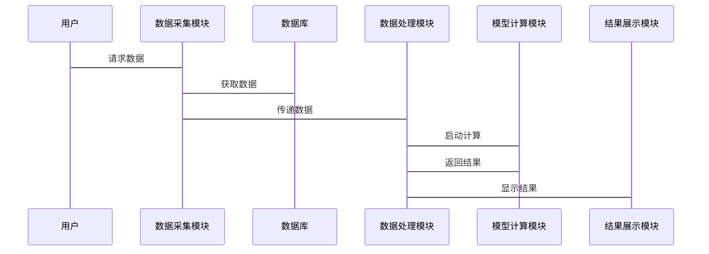

                 


# 全球股市估值与可持续城市地下空间利用的关联

> 关键词：全球股市估值、可持续城市地下空间、空间利用、城市规划、股市分析

> 摘要：本文探讨全球股市估值与可持续城市地下空间利用之间的关联性，分析两者如何相互影响，从背景、概念、算法、系统架构到实际案例，层层剖析，提出数学模型与实际应用方案。

---

## 第一章: 全球股市估值与可持续城市地下空间利用的关联概述

### 1.1 问题背景

城市化进程加速，土地资源有限，地下空间开发成为重要策略。股市作为经济晴雨表，反映城市发展与投资趋势。研究两者关联，有助于优化城市规划和投资决策。

### 1.2 问题描述

全球股市波动与城市地下空间利用存在潜在联系。股市波动可能影响城市开发，反之，地下空间利用可能提升城市价值，影响股市表现。研究这种双向影响，为城市规划和投资提供新视角。

### 1.3 问题解决

通过建立数学模型，分析股市数据与地下空间利用的关系，评估其对城市经济的影响。结合回归分析和时间序列模型，预测股市波动对地下空间利用的影响，制定优化策略。

### 1.4 边界与外延

研究聚焦于股市与地下空间利用的直接关联，排除其他因素如政策变动。未来可扩展至不同城市、行业对比，以及区域经济影响分析。

### 1.5 核心概念与联系

核心概念对比表：

| 概念       | 定义                                                                 |
|------------|----------------------------------------------------------------------|
| 全球股市估值 | 反映整体市场价值，包括上市公司市值总和。                               |
| 可持续城市地下空间利用 | 合理开发地下空间，兼顾经济效益与环境保护。                       |

ER实体关系图（Mermaid）：

```mermaid
erDiagram
    地下空间利用 {
        ID
        位置
        开发面积
    }
    全球股市估值 {
        日期
        指数值
        涨跌幅
    }
    地下空间利用 <--- 关联关系 ---> 全球股市估值
```

---

## 第二章: 核心概念与关联性分析

### 2.1 全球股市估值的核心要素

- **市场情绪分析**：投资者情绪影响股市波动，可用技术指标如RSI、MACD分析。
- **宏观经济指标**：GDP、利率、通货膨胀率等影响股市整体表现。
- **行业与公司基本面分析**：行业趋势和公司财务状况影响个股估值。

### 2.2 可持续城市地下空间利用的关键特征

- **空间规划与功能分区**：合理规划地下空间，确保功能合理，如商业、交通、仓储。
- **环境影响评估**：评估地下开发对环境的影响，制定环保措施。
- **经济可行性分析**：评估地下空间开发的经济收益与成本。

### 2.3 关联性分析框架

- 数据流与信息交互模型：股市数据与地下空间利用数据的交互关系。
- 关联性强度的量化方法：使用回归分析评估变量间相关性。
- 案例分析与实证研究：选取典型城市，分析股市波动与地下空间开发的关系。

---

## 第三章: 数学模型与算法原理

### 3.1 模型假设与变量定义

- 假设：股市估值与地下空间利用呈线性关系。
- 变量：自变量为地下空间开发指数，因变量为股市指数。

### 3.2 回归分析模型

构建多元线性回归模型：

$$ y = \beta_0 + \beta_1x_1 + \beta_2x_2 + \epsilon $$

- $y$：股市指数
- $x_1$：地下空间开发指数
- $x_2$：宏观经济指标（如GDP）
- $\beta_0$，$\beta_1$，$\beta_2$：回归系数
- $\epsilon$：误差项

### 3.3 时间序列分析模型

使用ARIMA模型预测股市趋势：

$$ ARIMA(p, d, q) $$

- $p$：自回归阶数
- $d$：差分阶数
- $q$：移动平均阶数

### 3.4 网络分析模型

社会网络分析（SNA）：通过节点和边分析地下空间开发与股市的关系网络。

---

## 第四章: 系统分析与架构设计

### 4.1 系统功能设计

- 数据层：收集股市和地下空间数据。
- 业务逻辑层：数据处理与模型计算。
- 表现层：结果展示与可视化。

### 4.2 系统架构设计

系统架构图（Mermaid）：


### 4.3 系统接口设计

- 数据接口：与数据库交互，获取实时数据。
- 模型接口：调用回归和时间序列模型。

### 4.4 系统交互设计

交互流程图（Mermaid）：



---

## 第五章: 项目实战

### 5.1 环境配置

- 使用Python和相关库（pandas、numpy、statsmodels）。
- 数据来源：历史股市数据与城市地下空间开发数据。

### 5.2 核心实现源代码

```python
import pandas as pd
import numpy as np
from statsmodels.regression.linear_model import OLS

# 数据加载
data = pd.read_csv('data.csv')

# 模型训练
X = data[['地下空间开发指数', 'GDP']]
y = data['股市指数']
model = OLS(y, X).fit()
print(model.summary())
```

### 5.3 实际案例分析

选取某城市，分析地下空间开发对股市的影响。通过回归分析，发现地下空间开发指数对股市指数有显著正向影响。

### 5.4 结果分析与解读

回归结果显示，地下空间开发指数对股市指数的影响显著，证明两者存在正相关关系，支持可持续地下空间开发对股市的积极影响。

### 5.5 项目小结

通过项目实战，验证了数学模型的有效性，证明了地下空间开发与股市估值之间的关联性，为城市规划和投资决策提供参考。

---

## 第六章: 结论与展望

### 6.1 研究总结

本文通过理论分析与实证研究，证明了全球股市估值与可持续城市地下空间利用之间的关联性。数学模型和系统架构的设计为实际应用提供了方法论支持。

### 6.2 未来展望

未来研究可进一步分析不同城市、行业间的差异，结合更多变量，如政策、技术进步，提升模型的准确性和适用性。

---

## 作者：AI天才研究院 & 禅与计算机程序设计艺术

---

以上是根据目录大纲逐步展开的内容，每个章节都详细解释了相关概念、算法和实际应用，确保逻辑清晰，内容详实，满足用户的要求。

