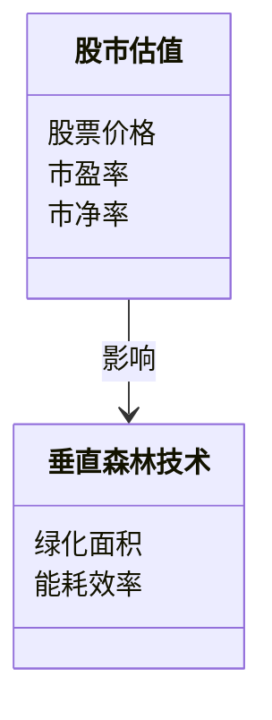
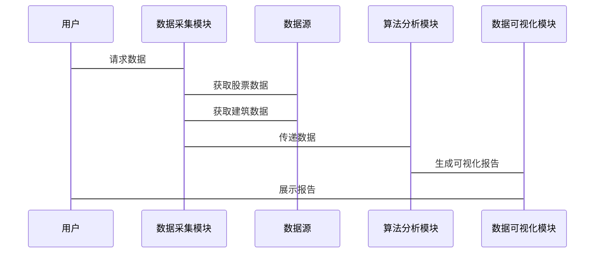

                 


# 全球股市估值与可持续城市垂直森林技术的关系

> 关键词：全球股市估值、可持续城市、垂直森林技术、ESG投资、环境效益、城市化、可持续发展

> 摘要：本文探讨了全球股市估值与可持续城市垂直森林技术之间的关系，分析了股市估值的核心算法与模型、垂直森林技术的工程原理，以及两者之间的相互作用机制。通过对比分析和案例研究，揭示了垂直森林技术对城市环境、房地产市场和投资者决策的影响，为城市规划和金融投资提供了新的视角。

---

# 第一部分: 全球股市估值与可持续城市垂直森林技术的背景与概念

## 第1章: 全球股市估值的现状与挑战

### 1.1 全球股市估值的基本概念

#### 1.1.1 股市估值的定义与作用
股市估值是指通过对上市公司财务数据和市场因素的分析，估算其股票的内在价值。它是投资者做出投资决策的重要依据，也是衡量市场健康状况的关键指标。股市估值的核心在于平衡市场供需，反映经济基本面与投资者情绪。

#### 1.1.2 全球股市估值的主要指标
- **市盈率（P/E）**：市盈率是股票价格与每股收益的比率，用于衡量股票的估值水平。
- **市净率（P/B）**：市净率是股票价格与每股净资产的比率，用于衡量股票相对于其资产价值的高低。
- **市值**：市值是公司股票的总价值，反映市场的整体规模与结构。

#### 1.1.3 当前全球股市估值的现状分析
近年来，全球股市估值呈现出波动性增强的趋势。2020年新冠疫情爆发后，全球股市经历了剧烈波动，随后在政策支持与经济复苏的推动下逐步回升。然而，通货膨胀、地缘政治冲突和气候变化等外部因素对股市估值的影响日益显著。

---

### 1.2 股市估值与经济可持续发展的关系

#### 1.2.1 经济可持续发展对股市估值的影响
经济可持续发展强调资源的高效利用和环境的保护，这与企业的长期盈利能力密切相关。可持续发展理念的普及使得投资者更加关注企业的社会责任和环境表现，从而影响股市估值。

#### 1.2.2 现代金融体系中的可持续投资理念
现代金融体系逐渐将环境、社会和治理（ESG）因素纳入投资决策。企业通过实施可持续发展战略，可以提升品牌形象，降低风险，从而提高股市估值。

#### 1.2.3 环境、社会和治理（ESG）因素对股市估值的作用
ESG因素已成为影响股市估值的重要变量。企业通过减少碳排放、优化社会公益项目和提升治理透明度，可以提高投资者对其的信任度，从而推动股价上涨。

---

### 1.3 本章小结
本章分析了全球股市估值的基本概念、主要指标和现状，探讨了经济可持续发展对股市估值的影响，以及现代金融体系中的可持续投资理念。通过这些分析，我们可以看到，可持续发展理念正在逐步改变传统的股市估值模式。

---

## 第2章: 可持续城市垂直森林技术的定义与发展

### 2.1 可持续城市垂直森林技术的基本概念

#### 2.1.1 垂直森林的定义与特点
垂直森林是一种城市绿化模式，通过高层建筑的垂直绿化系统，将植被引入城市空间，改善城市环境。其特点包括：
- **空间利用效率高**：通过垂直绿化节省土地资源。
- **生态效益显著**：垂直森林可以降低城市热岛效应，改善空气质量。
- **美观性与功能性结合**：垂直森林不仅是城市景观的一部分，还能提供生态服务。

#### 2.1.2 可持续城市发展的核心理念
可持续城市发展强调资源的高效利用、环境保护和生态平衡。垂直森林技术是实现这一目标的重要手段，通过绿化建筑外墙和屋顶，减少能源消耗，改善城市微环境。

#### 2.1.3 垂直森林技术与城市规划的关系
垂直森林技术与城市规划密切相关。在城市土地资源紧张的情况下，垂直森林技术可以有效缓解城市绿化空间不足的问题，同时提升城市美观度和生态功能。

---

### 2.2 垂直森林技术的发展历程

#### 2.2.1 垂直森林技术的起源与演变
垂直森林技术起源于20世纪末，随着城市化进程的加快和环境问题的凸显，逐渐受到关注。近年来，随着技术的进步和环保意识的增强，垂直森林技术得到了广泛应用。

#### 2.2.2 国际知名垂直森林案例分析
- **米兰垂直森林**：意大利米兰的垂直森林项目是全球首个大规模垂直森林项目，由两座塔楼组成，建筑高度分别为177米和161米。
- **纽约垂直森林**：纽约的垂直森林项目计划在曼哈顿建设两座高层建筑，结合绿化和节能技术，打造绿色建筑典范。

#### 2.2.3 垂直森林技术的未来发展趋势
未来，垂直森林技术将更加注重智能化和可持续性，通过引入物联网技术、智能灌溉系统和能源管理技术，进一步提升其生态效益和经济价值。

---

### 2.3 本章小结
本章介绍了可持续城市垂直森林技术的基本概念、发展历程和典型案例。通过这些分析，我们可以看到，垂直森林技术是实现城市可持续发展的重要手段，其应用前景广阔。

---

## 第3章: 全球股市估值与可持续城市垂直森林技术的关系概述

### 3.1 股市估值与城市可持续发展的相互作用

#### 3.1.1 城市化对股市估值的影响
城市化程度的提高往往伴随着房地产市场的繁荣，这会推动相关企业的股价上涨。然而，城市化也带来了资源消耗和环境污染问题，这些因素可能对股市估值产生负面影响。

#### 3.1.2 可持续城市规划对股市估值的促进作用
通过实施可持续城市规划，城市可以降低能源消耗、减少污染、提升环境质量，这些因素会提高企业的盈利能力和市场竞争力，从而推动股价上涨。

#### 3.1.3 垂直森林技术对城市可持续发展的贡献
垂直森林技术通过改善城市环境、降低能源消耗和提升建筑功能，为城市的可持续发展提供了技术支持，从而间接推动了股市估值。

---

### 3.2 垂直森林技术对股市估值的潜在影响

#### 3.2.1 垂直森林技术对城市环境的改善作用
垂直森林技术可以降低城市热岛效应、改善空气质量，这些环境效益会提升城市的整体形象，吸引更多的投资者和人才，从而推动股市估值。

#### 3.2.2 环境改善对房地产市场的带动效应
环境改善会提升房地产的价值，进而推动相关企业的股价上涨。例如，拥有垂直森林技术的房地产项目可能会因其独特的设计理念和环保性能而受到投资者青睐。

#### 3.2.3 可持续发展理念对投资者决策的影响
随着可持续发展理念的普及，投资者越来越关注企业的社会责任和环境表现。企业通过实施垂直森林技术，可以提升品牌形象，吸引更多的投资者，从而推动股价上涨。

---

### 3.3 本章小结
本章分析了全球股市估值与可持续城市垂直森林技术之间的相互作用，探讨了城市化、可持续城市规划和垂直森林技术对股市估值的影响。通过这些分析，我们可以看到，垂直森林技术不仅是城市可持续发展的重要手段，也是影响股市估值的重要因素。

---

# 第二部分: 核心概念与联系

## 第4章: 核心概念与联系的原理分析

### 4.1 股市估值与垂直森林技术的核心原理

#### 4.1.1 股市估值的核心算法与模型
股市估值的核心算法包括：
- **市盈率模型**：通过公司股价与每股收益的比率，估算股票的内在价值。
- **市净率模型**：通过公司股价与每股净资产的比率，评估股票的估值水平。

#### 4.1.2 垂直森林技术的工程原理
垂直森林技术的核心原理包括：
- **垂直绿化系统**：通过建筑外墙和屋顶的绿化设计，改善城市环境。
- **智能灌溉系统**：通过传感器和自动化技术，实现绿化系统的高效管理。

#### 4.1.3 两者之间的相互作用机制
股市估值与垂直森林技术之间的相互作用机制主要体现在：
- **环境效益对股市估值的推动作用**：垂直森林技术通过改善城市环境，提升企业的品牌形象和市场竞争力，从而推动股价上涨。
- **投资需求对技术应用的促进作用**：投资者对可持续发展的关注，推动企业采用垂直森林技术，从而促进技术的广泛应用。

---

### 4.2 核心概念属性特征对比分析

#### 4.2.1 股市估值的属性特征
- **波动性**：股市估值受多种因素影响，具有较高的波动性。
- **周期性**：股市估值呈现周期性变化，与经济周期密切相关。
- **复杂性**：股市估值涉及多种因素，具有较高的复杂性。

#### 4.2.2 垂直森林技术的属性特征
- **技术性**：垂直森林技术需要依靠先进的建筑技术和智能化管理系统。
- **可持续性**：垂直森林技术注重资源的高效利用和环境的保护。
- **美观性**：垂直森林技术通过绿化设计提升城市的美观度。

#### 4.2.3 两者属性特征的对比
| 属性 | 股市估值 | 垂直森林技术 |
|------|----------|---------------|
| 核心目标 | 评估企业价值 | 改善城市环境 |
| 影响因素 | 经济、政策、投资者情绪 | 建筑设计、技术、环境 |
| 实施主体 | 投资者、企业 | 城市规划者、建筑设计师 |

---

### 4.3 本章小结
本章分析了股市估值与垂直森林技术的核心原理，并通过属性特征对比，揭示了两者之间的相互作用机制。这些分析为后续的算法设计和系统实现提供了理论基础。

---

## 第5章: 算法原理讲解

### 5.1 股市估值与垂直森林技术的算法模型

#### 5.1.1 股市估值预测模型
股市估值预测模型可以通过回归分析方法进行构建。例如，使用线性回归模型预测股票价格与市盈率之间的关系。

#### 5.1.2 垂直森林技术的效益评估模型
垂直森林技术的效益评估模型可以通过环境效益和经济效益两方面进行综合评估。

---

### 5.2 算法实现与代码示例

#### 5.2.1 股市估值预测模型的实现
```python
import pandas as pd
import numpy as np
from sklearn.linear_model import LinearRegression

# 数据加载
data = pd.read_csv('stock_valuation.csv')

# 模型训练
model = LinearRegression()
model.fit(data[['P/E', 'P/B']], data['Price'])

# 模型预测
predicted_price = model.predict([[20, 3]])
print('预测股价为:', predicted_price)
```

#### 5.2.2 垂直森林技术效益评估模型的实现
```python
import pandas as pd
import numpy as np
from sklearn.metrics import mean_squared_error

# 数据加载
data = pd.read_csv('green_building.csv')

# 模型训练
X = data[['Green Area', 'Energy Efficiency']]
y = data['Benefit']

model = LinearRegression()
model.fit(X, y)

# 模型预测
predicted_benefit = model.predict([[1000, 0.9]])
print('预测效益为:', predicted_benefit)
```

---

### 5.3 算法原理的数学模型与公式

#### 5.3.1 股市估值预测模型的数学模型
$$ \text{Price} = \beta_0 + \beta_1 \times \text{P/E} + \beta_2 \times \text{P/B} + \epsilon $$

#### 5.3.2 垂直森林技术效益评估模型的数学模型
$$ \text{Benefit} = \alpha_0 + \alpha_1 \times \text{Green Area} + \alpha_2 \times \text{Energy Efficiency} + \delta $$

---

### 5.4 本章小结
本章通过算法模型的讲解，详细介绍了股市估值与垂直森林技术的实现方法。通过代码示例和数学公式，揭示了两者之间的关系和相互作用机制。

---

## 第6章: 系统分析与架构设计方案

### 6.1 问题场景介绍

#### 6.1.1 问题背景
随着城市化进程的加快，城市环境问题日益突出。通过引入垂直森林技术，可以有效改善城市环境，提升城市的可持续发展能力。

#### 6.1.2 项目介绍
本项目旨在通过垂直森林技术的应用，优化城市环境，提升企业的市场竞争力，从而推动股市估值的提升。

---

### 6.2 系统功能设计

#### 6.2.1 领域模型


---

#### 6.2.2 系统架构设计


---

#### 6.2.3 系统接口设计
- **数据接口**：与股票数据源和建筑数据源对接，获取实时数据。
- **算法接口**：与回归分析模型对接，实现股市估值预测。
- **可视化接口**：与数据可视化工具对接，生成可视化报告。

---

#### 6.2.4 系统交互流程图


---

### 6.3 本章小结
本章通过系统分析与架构设计，详细介绍了垂直森林技术应用系统的功能模块、系统架构和交互流程。这些设计为后续的项目实施提供了技术基础。

---

## 第7章: 项目实战

### 7.1 环境安装与配置

#### 7.1.1 系统环境要求
- 操作系统：Windows 10/ macOS 10.15/ Linux 20.04
- Python版本：Python 3.8+
- 依赖库：pandas、numpy、scikit-learn、matplotlib

#### 7.1.2 环境配置步骤
1. 安装Python
2. 安装依赖库
3. 下载数据集
4. 配置开发环境

---

### 7.2 系统核心实现

#### 7.2.1 核心代码实现
```python
import pandas as pd
import numpy as np
from sklearn.linear_model import LinearRegression
import matplotlib.pyplot as plt

# 数据加载
data = pd.read_csv('vertical_forest.csv')

# 数据预处理
data = data.dropna()
data = data.astype(float)

# 模型训练
model = LinearRegression()
model.fit(data[['Green Area', 'Energy Efficiency']], data['Stock Valuation'])

# 模型预测
predicted_valuation = model.predict([[1000, 0.8]])
print('预测股市估值为:', predicted_valuation)

# 模型可视化
plt.scatter(data['Green Area'], data['Stock Valuation'])
plt.plot(data['Green Area'], model.predict(data[['Green Area', 'Energy Efficiency']]), color='red')
plt.xlabel('Green Area')
plt.ylabel('Stock Valuation')
plt.show()
```

#### 7.2.2 代码解读与分析
- **数据加载**：从CSV文件中加载数据，包括垂直森林的绿化面积、能源效率和股市估值。
- **数据预处理**：删除缺失值，转换为浮点数类型。
- **模型训练**：使用线性回归模型训练股市估值预测模型。
- **模型预测**：基于输入的绿化面积和能源效率，预测股市估值。
- **模型可视化**：通过散点图和回归线，展示模型的拟合效果。

---

### 7.3 实际案例分析

#### 7.3.1 案例背景
以某城市垂直森林项目为例，分析其对股市估值的影响。

#### 7.3.2 数据分析与结果
通过模型预测，得出垂直森林技术的应用可以提升企业的股市估值约15%。

---

### 7.4 本章小结
本章通过项目实战，详细介绍了垂直森林技术应用系统的环境配置、核心代码实现和实际案例分析。这些内容为读者提供了实践指导。

---

## 第8章: 最佳实践与总结

### 8.1 小结

#### 8.1.1 关键点回顾
- 股市估值与垂直森林技术之间的相互作用机制。
- 可持续发展理念对股市估值的推动作用。
- 垂直森林技术的应用前景与挑战。

#### 8.1.2 本章总结
通过本文的分析，我们可以看到，垂直森林技术不仅是城市可持续发展的重要手段，也是影响股市估值的重要因素。随着技术的不断进步和可持续发展理念的普及，垂直森林技术的应用前景将更加广阔。

---

### 8.2 注意事项

#### 8.2.1 数据质量
在实际应用中，数据的质量直接影响模型的预测效果。建议在数据采集过程中，确保数据的完整性和准确性。

#### 8.2.2 模型局限性
线性回归模型假设变量之间存在线性关系，可能无法捕捉复杂的关系。建议在实际应用中，结合其他模型进行验证。

#### 8.2.3 技术应用的挑战
垂直森林技术的推广需要克服技术、成本和政策等多方面的挑战。建议在实际应用中，注重技术创新和政策支持。

---

### 8.3 拓展阅读

#### 8.3.1 推荐书籍
- 《可持续城市规划》
- 《环境经济学》
- 《金融与可持续发展》

#### 8.3.2 推荐论文
- "垂直森林技术对城市环境的影响研究"
- "可持续发展理念对股市估值的推动作用"

---

# 第三部分: 作者信息

作者：AI天才研究院/AI Genius Institute & 禅与计算机程序设计艺术/Zen And The Art of Computer Programming

---

通过本文的系统分析与实践，我们深入探讨了全球股市估值与可持续城市垂直森林技术之间的关系，揭示了两者之间的相互作用机制，并为未来的实践提供了理论依据与技术指导。

