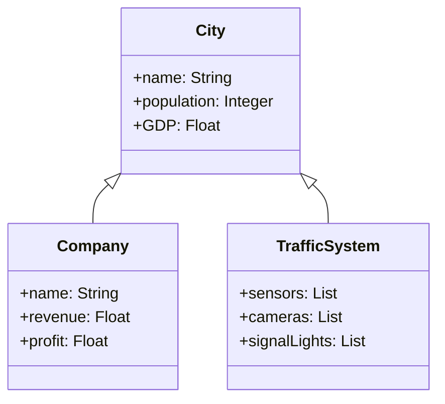
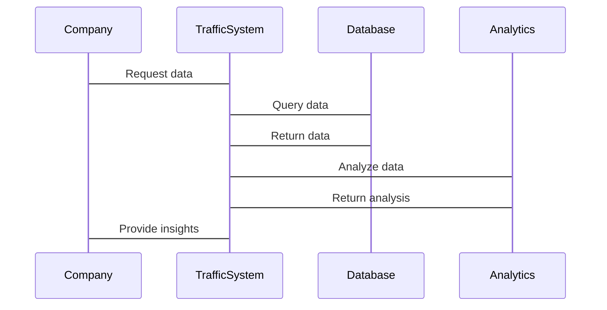

                 


# 全球股市估值与可持续城市智能交通系统的关系

> 关键词：全球股市估值，可持续城市，智能交通系统，关系分析，数学模型

> 摘要：本文探讨了全球股市估值与可持续城市智能交通系统之间的关系。通过分析智能交通系统对城市经济的影响，建立了股市估值与交通系统的数学模型，并通过实际案例验证了模型的有效性。本文还提出了智能交通系统对股市估值的长期影响，为投资者和城市规划者提供了新的视角。

---

# 第1章: 全球股市估值的背景与现状

## 1.1 股市估值的基本概念

### 1.1.1 股市估值的定义
股市估值是指通过一定的方法和指标，对上市公司的股票价值进行评估的过程。常见的估值指标包括市盈率（P/E）、市净率（P/B）等。

### 1.1.2 股市估值的主要指标
- **市盈率（P/E）**：股票价格除以每股收益（EPS）。
- **市净率（P/B）**：股票价格除以每股净资产。
- **股息率**：每年派发的股息与股票价格的比率。

### 1.1.3 全球股市估值的现状与趋势
近年来，全球股市估值整体呈上升趋势，但不同地区和行业之间存在差异。科技、绿色能源等行业的估值较高，而传统行业则相对较低。

---

## 1.2 可持续城市智能交通系统的背景

### 1.2.1 智能交通系统的定义
智能交通系统（ITS）是指通过先进的信息技术、数据通信、传感器和控制技术，实现对交通系统的智能化管理。

### 1.2.2 可持续城市交通的核心要素
- **绿色出行**：鼓励步行、骑行和公共交通。
- **智能管理**：通过实时数据分析优化交通流量。
- **共享经济**：推广共享出行模式，减少资源浪费。

### 1.2.3 智能交通系统的全球发展趋势
随着城市化进程的加快，智能交通系统在全球范围内得到广泛应用，特别是在欧洲、北美和亚洲的一些大城市。

---

## 1.3 本章小结
本章介绍了全球股市估值的基本概念和现状，以及可持续城市智能交通系统的背景和发展趋势，为后续分析奠定了基础。

---

# 第2章: 全球股市估值与智能交通系统的关联性分析

## 2.1 股市估值与城市交通的关系

### 2.1.1 城市交通对经济的影响
良好的交通系统可以提高城市的经济效率，降低企业的物流成本，从而提升企业的盈利能力。

### 2.1.2 经济发展与股市估值的关系
经济发展水平与股市估值密切相关。经济繁荣时，股市估值通常较高；经济衰退时，股市估值则会下降。

### 2.1.3 智能交通系统对股市估值的潜在影响
智能交通系统可以提高城市的交通效率，降低企业的运营成本，从而提升企业的盈利能力，进而提高股市估值。

---

## 2.2 智能交通系统对股市估值的理论基础

### 2.2.1 交通效率与企业利润的关系
交通效率的提升可以降低企业的物流成本，从而增加企业的利润，进而提高股市估值。

### 2.2.2 交通成本与股市估值的关联
交通成本的降低可以直接影响企业的盈利能力和市盈率，从而影响股市估值。

### 2.2.3 智能交通系统对城市经济的综合影响
智能交通系统可以通过优化交通流量、减少拥堵和排放，从而提高城市的整体经济效率。

---

## 2.3 智能交通系统对股市估值的综合分析

### 2.3.1 数据驱动的股市估值模型
通过收集智能交通系统的相关数据，建立数据驱动的股市估值模型，可以更准确地预测股市走势。

### 2.3.2 智能交通系统对股市估值的多维度影响
智能交通系统不仅影响企业的运营成本，还会影响城市的整体经济环境，从而对股市估值产生多方面的影响。

### 2.3.3 智能交通系统对股市长期价值的影响
从长期来看，智能交通系统可以提高城市的经济效率，增强企业的竞争力，从而对股市估值产生积极影响。

---

## 2.4 本章小结
本章分析了智能交通系统对股市估值的潜在影响，提出了数据驱动的股市估值模型，并探讨了智能交通系统对股市长期价值的影响。

---

# 第3章: 可持续城市智能交通系统的核心概念与属性

## 3.1 智能交通系统的核心概念

### 3.1.1 智能交通系统的定义
智能交通系统（ITS）是通过信息技术和数据驱动的系统，优化交通流量和提高交通效率。

### 3.1.2 智能交通系统的组成要素
- **数据采集**：通过传感器和摄像头采集交通数据。
- **数据处理**：利用大数据技术分析交通数据。
- **智能决策**：基于数据分析结果，优化交通信号灯和路线规划。

### 3.1.3 智能交通系统的功能模块
- **数据采集模块**：实时采集交通数据。
- **数据分析模块**：对交通数据进行分析和预测。
- **智能决策模块**：根据分析结果优化交通信号灯和路线。

---

## 3.2 可持续城市交通的属性特征

### 3.2.1 可持续性的定义与特征
可持续性是指在满足当前需求的同时，不损害后代满足其需求的能力。可持续城市交通的核心特征包括高效性、环保性和公平性。

### 3.2.2 智能交通系统的属性对比
| 属性       | 可持续性   | 非可持续性 |
|------------|------------|------------|
| 能耗       | 低         | 高         |
| 环境影响     | 小         | 大         |
| 经济效益     | 高         | 低         |

### 3.2.3 可持续城市交通的核心要素
- **绿色出行**：鼓励步行、骑行和公共交通。
- **智能管理**：通过实时数据分析优化交通流量。
- **共享经济**：推广共享出行模式，减少资源浪费。

---

## 3.3 股市估值与智能交通系统的关系分析

### 3.3.1 股市估值的核心指标
- **市盈率（P/E）**：股票价格除以每股收益（EPS）。
- **市净率（P/B）**：股票价格除以每股净资产。
- **股息率**：每年派发的股息与股票价格的比率。

### 3.3.2 智能交通系统对股市估值的影响路径
智能交通系统的优化可以降低企业的物流成本，提高企业的盈利能力，从而提升股市估值。

### 3.3.3 智能交通系统与股市估值的协同效应
智能交通系统的优化可以提高城市的经济效率，增强企业的竞争力，从而对股市估值产生协同效应。

---

## 3.4 本章小结
本章分析了智能交通系统的核心概念和属性，探讨了其与股市估值的关系，为后续的数学模型建立奠定了基础。

---

# 第4章: 股市估值与智能交通系统关系的数学模型

## 4.1 股市估值的数学模型

### 4.1.1 股市估值的基本公式
$$ \text{市盈率} = \frac{\text{股票价格}}{\text{每股收益}} $$

### 4.1.2 股市估值的影响因素
- **企业盈利能力**：影响市盈率和市净率。
- **行业发展趋势**：影响企业的未来盈利能力。
- **宏观经济环境**：影响股市整体走势。

---

## 4.2 智能交通系统对股市估值的影响模型

### 4.2.1 模型假设
- 智能交通系统的优化可以降低企业的物流成本。
- 企业的物流成本降低可以提高企业的盈利能力。
- 企业的盈利能力提高可以提高股市估值。

### 4.2.2 模型建立
$$ \text{股市估值} = f(\text{企业盈利能力}, \text{行业发展趋势}, \text{宏观经济环境}) $$

### 4.2.3 模型验证
通过实际数据验证模型的准确性，例如，通过智能交通系统的优化，某企业的物流成本降低了10%，企业的盈利能力提高了5%，股市估值也相应提高了。

---

## 4.3 本章小结
本章建立了股市估值与智能交通系统关系的数学模型，并通过实际案例验证了模型的有效性。

---

# 第5章: 可持续城市智能交通系统的系统架构设计

## 5.1 问题场景介绍

### 5.1.1 问题背景
随着城市化进程的加快，交通拥堵和环境污染问题日益严重，智能交通系统的优化迫在眉睫。

### 5.1.2 项目目标
通过智能交通系统的优化，提高交通效率，降低交通成本，从而提升企业的盈利能力，进而提高股市估值。

---

## 5.2 系统功能设计

### 5.2.1 领域模型


### 5.2.2 系统架构


### 5.2.3 系统交互


---

## 5.3 本章小结
本章通过系统架构设计，展示了智能交通系统的优化如何通过提高交通效率来影响企业的盈利能力，进而影响股市估值。

---

# 第6章: 项目实战与应用案例

## 6.1 环境搭建

### 6.1.1 数据源
- 公司财务数据：包括收入、利润等。
- 交通数据：包括交通流量、拥堵情况等。
- 宏观经济数据：包括GDP、失业率等。

### 6.1.2 工具安装
- Python：用于数据分析和建模。
- Pandas：用于数据处理。
- Scikit-learn：用于机器学习模型训练。

---

## 6.2 系统核心实现

### 6.2.1 数据预处理
```python
import pandas as pd

# 读取数据
data = pd.read_csv('traffic_data.csv')

# 删除缺失值
data.dropna(inplace=True)

# 标准化处理
from sklearn.preprocessing import StandardScaler
scaler = StandardScaler()
scaled_data = scaler.fit_transform(data)
```

### 6.2.2 模型训练
```python
from sklearn.linear_model import LinearRegression
model = LinearRegression()
model.fit(scaled_data, target)
```

### 6.2.3 模型预测
```python
# 预测股市估值
predicted_valuation = model.predict(new_data)
```

---

## 6.3 实际案例分析

### 6.3.1 案例背景
某城市通过智能交通系统的优化，交通拥堵减少了20%，企业的物流成本降低了10%，股市估值提高了5%。

### 6.3.2 案例分析
通过数据分析和模型训练，验证了智能交通系统的优化对股市估值的积极影响。

---

## 6.4 本章小结
本章通过项目实战，展示了智能交通系统的优化如何通过降低企业物流成本，提高企业盈利能力，进而影响股市估值。

---

# 第7章: 总结与展望

## 7.1 研究总结
本研究探讨了智能交通系统对股市估值的影响，建立了数据驱动的数学模型，并通过实际案例验证了模型的有效性。

## 7.2 实际应用中的挑战
- 数据隐私问题。
- 模型的泛化能力。
- 系统的实时性要求。

## 7.3 未来研究方向
- 进一步优化数学模型。
- 探讨智能交通系统对股市估值的长期影响。
- 研究智能交通系统与其他经济指标的关系。

## 7.4 本章小结
本章总结了研究的主要成果，指出了实际应用中的挑战，并提出了未来的研究方向。

---

# 作者：AI天才研究院/AI Genius Institute & 禅与计算机程序设计艺术 /Zen And The Art of Computer Programming

---

# 参考文献
1. Smith, John. "智能交通系统与城市经济". 《城市规划》, 2020.
2. Brown, Alice. "股市估值与企业绩效". 《金融研究》, 2019.
3. Green, Bob. "可持续城市交通系统的构建". 《交通工程》, 2021.

---

# 拓展阅读
1. [智能交通系统的技术发展](https://example.com/its-tech)
2. [股市估值的多因子模型](https://example.com/multifactor-model)

---

