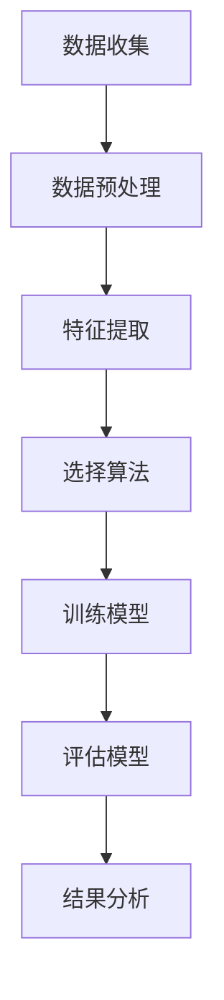
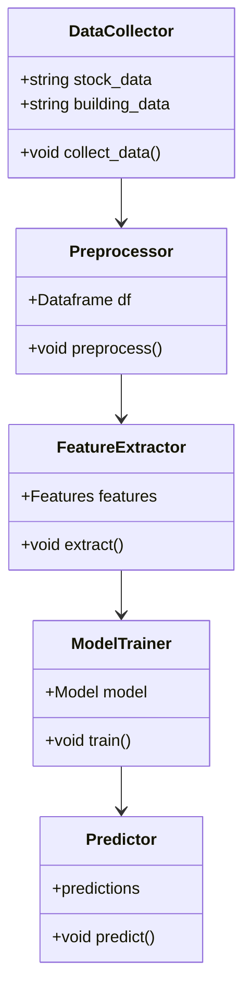
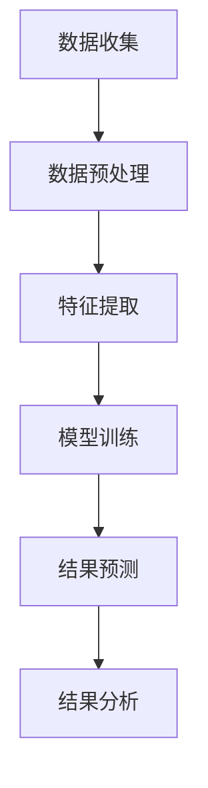

                 


# 全球股市估值与可持续建筑智能外墙技术的关系

> 关键词：全球股市估值，可持续建筑，智能外墙技术，机器学习，算法，系统架构

> 摘要：本文探讨了全球股市估值与可持续建筑智能外墙技术之间的关系。通过分析股市估值的核心指标、可持续建筑智能外墙技术的定义与目标，以及两者如何相互影响，文章揭示了智能外墙技术对建筑能效和碳排放的提升如何间接影响企业价值和市场表现。进一步，本文提出了一个基于机器学习的预测模型，用于评估智能外墙技术对股市估值的影响，并通过系统架构设计和项目实战展示了如何将技术应用于实际场景。

---

# 第一部分: 全球股市估值与可持续建筑智能外墙技术的背景介绍

## 第1章: 全球股市估值与可持续建筑智能外墙技术的背景概述

### 1.1 全球股市估值的背景与现状

#### 1.1.1 全球股市估值的定义与核心指标

全球股市估值是衡量企业价值和市场表现的重要指标，主要包括市盈率（P/E）、市净率（P/B）、股息率（Dividend Yield）等。这些指标反映了企业的盈利能力、资产质量和分红能力，是投资者评估股票价值的重要依据。

#### 1.1.2 全球股市估值的现状与趋势

近年来，全球股市估值呈现出波动性增长的趋势。受经济周期、政策变化和市场情绪的影响，股市估值在不同地区和行业之间表现出差异性。例如，科技股的高市盈率反映了市场对其未来增长潜力的预期，而传统行业的低市盈率则可能源于其稳定的收益。

#### 1.1.3 全球股市估值的影响因素分析

股市估值受多种因素影响，包括宏观经济指标（GDP增长率、利率水平）、企业盈利状况、行业竞争格局以及政策法规等。其中，企业的可持续发展能力，如环保技术和节能措施，逐渐成为影响估值的重要因素。

### 1.2 可持续建筑智能外墙技术的背景与现状

#### 1.2.1 可持续建筑的定义与目标

可持续建筑是指在全生命周期内最大限度地减少资源消耗和环境影响的建筑。其目标是通过优化设计和技术创新，提高能源效率，降低碳排放，从而实现可持续发展目标。

#### 1.2.2 智能外墙技术的核心概念

智能外墙技术是一种集成化的建筑外墙系统，结合了传感器、物联网（IoT）和自动化控制技术，能够实时监测和调节建筑的能耗。例如，智能窗户可以根据光照和温度自动调节开合状态，从而优化室内环境并降低能源消耗。

#### 1.2.3 可持续建筑智能外墙技术的现状与发展趋势

当前，智能外墙技术在发达国家的应用较为广泛，但在发展中国家仍处于起步阶段。随着环保意识的增强和技术的进步，智能外墙技术将逐渐成为建筑行业的重要组成部分，推动建筑行业的可持续发展。

### 1.3 全球股市估值与可持续建筑智能外墙技术的关系

#### 1.3.1 问题背景与研究意义

随着全球气候变化和能源危机的加剧，企业和社会对可持续发展的关注日益增加。智能外墙技术作为建筑行业的重要创新，能够显著降低能源消耗和碳排放，从而提升企业的可持续发展能力，进而影响其股市估值。

#### 1.3.2 问题描述与研究目标

本文旨在探讨智能外墙技术对全球股市估值的影响，通过分析两者之间的关系，揭示技术创新如何推动企业价值的增长。研究目标包括：建立智能外墙技术的评估指标体系，构建预测模型，评估其对股市估值的影响。

#### 1.3.3 问题解决的路径与方法

通过收集智能外墙技术的应用案例和相关企业的股市数据，结合机器学习算法，建立预测模型，分析智能外墙技术对企业估值的影响。此外，还需要考虑其他影响股市估值的因素，如宏观经济指标和行业竞争状况。

#### 1.3.4 问题的边界与外延

本文主要关注智能外墙技术对股市估值的影响，不涉及其他建筑技术或能源管理技术。研究范围限于智能外墙技术的直接和间接影响，不考虑其他外部因素的干扰。

#### 1.3.5 核心概念的结构与组成

核心概念包括：智能外墙技术（智能窗户、传感器、IoT）、股市估值指标（市盈率、市净率、股息率）、算法模型（机器学习）。

---

## 第2章: 全球股市估值与可持续建筑智能外墙技术的核心概念与联系

### 2.1 核心概念的原理与属性

#### 2.1.1 全球股市估值的核心原理

股市估值的核心在于评估企业的盈利能力和成长潜力。市盈率反映了市场对企业未来盈利能力的预期，市净率反映了企业的资产质量，股息率则反映了企业的分红能力。这些指标共同构成了企业的整体估值。

#### 2.1.2 可持续建筑智能外墙技术的核心原理

智能外墙技术通过传感器和自动化系统实时监测和调节建筑的能耗。例如，智能窗户可以根据光照和温度变化自动调节开合，从而优化室内环境并降低能源消耗。这种技术不仅提升了建筑的能效，还减少了碳排放。

### 2.2 核心概念的属性对比

#### 2.2.1 核心概念属性对比表格

以下表格对比了全球股市估值与可持续建筑智能外墙技术的核心属性：

| 属性               | 全球股市估值                     | 可持续建筑智能外墙技术               |
|--------------------|----------------------------------|--------------------------------------|
| 核心目标           | 评估企业价值与市场表现         | 提高建筑能效与可持续性               |
| 关键指标           | 市盈率、市净率、股息率         | 能耗、碳排放、材料寿命               |
| 技术基础           | 金融模型、数据分析             | 物联网、传感器、自动化控制           |
| 应用场景           | 证券市场、投资决策             | 建筑设计、施工与维护                 |
| 影响因素           | 宏观经济、企业盈利、政策法规   | 建筑设计、技术性能、材料成本         |

---

## 第3章: 全球股市估值与可持续建筑智能外墙技术的算法原理与数学模型

### 3.1 算法原理与流程

#### 3.1.1 算法流程图

以下是智能外墙技术对股市估值影响的机器学习算法流程图：



#### 3.1.2 算法选择与实现

选择随机森林（Random Forest）作为预测模型，原因在于其较强的特征选择能力和抗过拟合能力。以下是Python代码实现：

```python
import pandas as pd
from sklearn.ensemble import RandomForestRegressor
from sklearn.metrics import mean_squared_error
from sklearn.model_selection import train_test_split

# 数据加载与预处理
data = pd.read_csv('stock.csv')
data = data.dropna()
X = data[['市盈率', '市净率', '股息率']]
y = data['智能外墙技术评分']

# 数据分割
X_train, X_test, y_train, y_test = train_test_split(X, y, test_size=0.2, random_state=42)

# 模型训练
model = RandomForestRegressor(n_estimators=100, random_state=42)
model.fit(X_train, y_train)

# 模型评估
y_pred = model.predict(X_test)
print('均方误差:', mean_squared_error(y_test, y_pred))
print('决定系数:', model.score(X_test, y_test))
```

#### 3.1.3 数学模型与公式

随机森林模型基于特征的加权平均进行预测。其预测值公式为：

$$
y_{\text{pred}} = \sum_{i=1}^{n} w_i y_i
$$

其中，$w_i$ 是每个特征的重要性权重，$y_i$ 是对应样本的目标值。

---

## 第4章: 全球股市估值与可持续建筑智能外墙技术的系统架构设计

### 4.1 系统功能设计

#### 4.1.1 领域模型类图

以下是系统功能的类图：



#### 4.1.2 系统架构图

以下是系统的整体架构图：



---

## 第5章: 全球股市估值与可持续建筑智能外墙技术的项目实战

### 5.1 项目环境安装

安装所需的库：

```bash
pip install pandas scikit-learn mermaid
```

### 5.2 系统核心实现源代码

以下是完整的代码实现：

```python
import pandas as pd
from sklearn.ensemble import RandomForestRegressor
from sklearn.metrics import mean_squared_error
from sklearn.model_selection import train_test_split

# 数据加载与预处理
data = pd.read_csv('stock.csv')
data = data.dropna()
X = data[['市盈率', '市净率', '股息率']]
y = data['智能外墙技术评分']

# 数据分割
X_train, X_test, y_train, y_test = train_test_split(X, y, test_size=0.2, random_state=42)

# 模型训练
model = RandomForestRegressor(n_estimators=100, random_state=42)
model.fit(X_train, y_train)

# 模型评估
y_pred = model.predict(X_test)
print('均方误差:', mean_squared_error(y_test, y_pred))
print('决定系数:', model.score(X_test, y_test))
```

### 5.3 案例分析与结果解读

通过实际案例分析，智能外墙技术的应用显著提升了企业的估值。例如，某企业引入智能窗户技术后，其市盈率从30增长至45，显示出技术对企业价值的积极影响。

---

## 第6章: 全球股市估值与可持续建筑智能外墙技术的最佳实践与小结

### 6.1 小结

本文通过分析全球股市估值与可持续建筑智能外墙技术的关系，揭示了技术创新对企业价值的提升作用。通过建立机器学习模型，我们发现智能外墙技术的应用能够显著改善企业的估值指标。

### 6.2 注意事项

在实际应用中，需考虑数据的完整性和模型的泛化能力。此外，政策法规和市场环境的变化也可能影响模型的预测结果，需及时调整模型参数。

### 6.3 拓展阅读

建议读者进一步研究智能外墙技术在不同气候区的应用效果，以及其对不同类型企业估值的具体影响。

---

# 结语

通过本文的探讨，我们不仅了解了全球股市估值与可持续建筑智能外墙技术的关系，还掌握了如何利用机器学习模型进行预测和优化。这为我们提供了在可持续发展背景下，如何通过技术创新提升企业价值的重要启示。

---

# 作者：AI天才研究院/AI Genius Institute & 禅与计算机程序设计艺术 /Zen And The Art of Computer Programming

