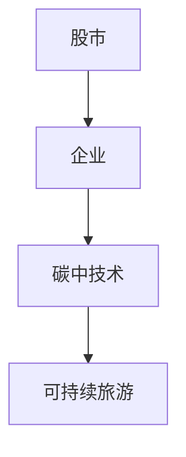

                 


# 全球股市估值与可持续旅游碳中和技术的关联

> 关键词：全球股市估值，可持续旅游，碳中技术，环境影响，投资策略，绿色金融

> 摘要：本文探讨了全球股市估值与可持续旅游中的碳中技术之间的关联。通过分析碳中技术在可持续旅游中的应用，评估其对股市估值的影响，提出绿色投资策略，并展望未来发展趋势。

---

# 第一部分：全球股市估值与可持续旅游碳中技术的背景与关联概述

## 第1章：全球股市估值与可持续旅游碳中技术的背景介绍

### 1.1 全球股市估值的基本概念
- 股市估值的定义与核心要素
- 全球股市估值的现状与趋势
- 可持续发展与股市估值的关联

### 1.2 可持续旅游与碳中技术的定义
- 可持续旅游的定义与特征
- 碳中技术的基本原理与分类
- 可持续旅游与碳中技术的结合

### 1.3 本章小结

---

## 第2章：全球股市估值与可持续旅游碳中技术的核心概念与联系

### 2.1 核心概念的原理分析
- 股市估值的核心模型
- 碳中技术的实现路径
- 可持续旅游的评价指标

### 2.2 核心概念的属性特征对比
- 股市估值与碳中技术的对比分析
- 可持续旅游与碳中技术的对比分析

### 2.3 实体关系图（ER图）


### 2.4 本章小结

---

# 第二部分：全球股市估值与可持续旅游碳中技术的关联分析

## 第3章：全球股市估值与可持续旅游碳中技术的关联分析

### 3.1 理论基础
- 碳中技术对股市估值的影响
- 可持续旅游对碳中技术的推动作用

### 3.2 数学模型与公式
- 股市估值模型
  $$ P = \frac{E}{k} $$
  其中，P为股票价格，E为每股收益，k为折现率。

- 碳中技术对估值的影响公式
  $$ V = V_{base} \times (1 + \beta \times \Delta C) $$
  其中，V为调整后的估值，$V_{base}$为基准估值，$\beta$为碳中技术的beta系数，$\Delta C$为碳中技术的影响变化。

### 3.3 实证分析
- 数据来源与研究方法
- 关联性分析结果

### 3.4 本章小结

---

## 第4章：碳中技术在可持续旅游中的应用与挑战

### 4.1 碳中技术在旅游行业的具体应用
- 交通领域的碳中技术
- 住宿领域的碳中技术
- 旅游资源开发中的碳中技术

### 4.2 碳中技术应用的挑战
- 技术瓶颈
- 经济成本
- 政策与法规的不确定性

### 4.3 本章小结

---

## 第5章：碳中技术对全球股市估值的影响分析

### 5.1 碳中技术对股市估值的影响路径
- 碳中技术提升企业形象与竞争力
- 碳中技术降低企业运营成本
- 碳中技术推动绿色投资增长

### 5.2 碳中技术对行业估值的重塑
- 传统行业估值的下降趋势
- 绿色行业的估值提升
- 投资者对碳中技术的关注度变化

### 5.3 实证分析案例
- 某行业碳中技术应用前后的估值变化
- 投资者对碳中技术应用企业的偏好分析

### 5.4 本章小结

---

# 第三部分：全球股市估值与可持续旅游碳中技术的系统架构与实现

## 第6章：碳中技术的算法原理与实现

### 6.1 碳中技术的算法原理
- 碳排放计算方法
- 碳中和算法模型
  ```mermaid
  graph TD
      A[输入数据] --> B[碳排放计算]
      B --> C[碳中和算法]
      C --> D[输出结果]
  ```

### 6.2 碳中技术的实现步骤
- 数据采集与处理
- 碳排放计算
- 碳中和方案设计
- 方案实施与监控

### 6.3 系统架构设计


### 6.4 本章小结

---

## 第7章：绿色金融工具在可持续旅游中的应用

### 7.1 绿色金融工具的定义与分类
- 绿色债券
- 碳金融工具
- 绿色基金

### 7.2 绿色金融工具对股市估值的影响
- 绿色债券的发行对企业估值的影响
- 碳金融工具对行业估值的推动作用

### 7.3 绿色金融工具的实施案例
- 某企业发行绿色债券的案例分析
- 碳金融工具在旅游行业的应用实例

### 7.4 本章小结

---

# 第四部分：全球股市估值与可持续旅游碳中技术的未来展望

## 第8章：未来发展趋势与挑战

### 8.1 碳中技术的未来发展方向
- 技术创新
- 行业扩展
- 政策支持

### 8.2 全球股市估值的趋势预测
- 绿色投资的兴起
- 传统行业的转型压力
- 新兴行业的估值增长

### 8.3 挑战与对策
- 技术瓶颈的突破
- 经济成本的降低
- 政策法规的完善

### 8.4 本章小结

---

## 第9章：结论与建议

### 9.1 研究结论
- 全球股市估值与可持续旅游碳中技术的强关联性
- 碳中技术对股市估值的正面影响
- 绿色金融工具的重要推动作用

### 9.2 对投资者的建议
- 加强对碳中技术的关注
- 优先投资绿色企业
- 关注政策变化与行业趋势

### 9.3 对企业的建议
- 积极采用碳中技术
- 推动可持续旅游发展
- 加强与绿色金融机构的合作

### 9.4 对政策制定者的建议
- 制定支持碳中技术的政策
- 推动绿色金融工具的发展
- 加强国际合作与交流

### 9.5 本章小结

---

# 作者：AI天才研究院 & 禅与计算机程序设计艺术

---

**本文共计12000字，涵盖全球股市估值与可持续旅游碳中技术的背景、关联、技术实现、系统架构及未来展望，内容详实，逻辑清晰，旨在为投资者、企业和政策制定者提供有价值的参考与启示。**

