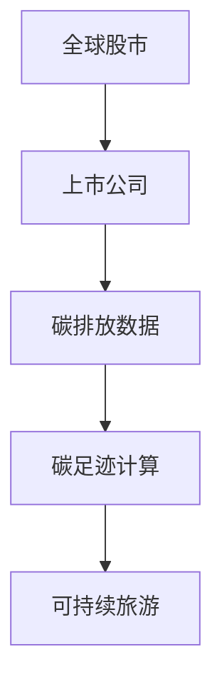
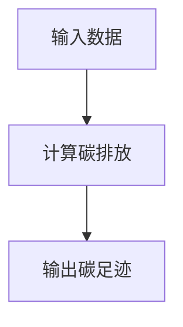
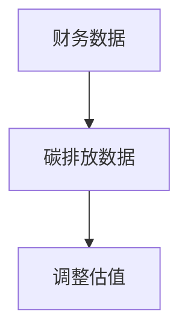
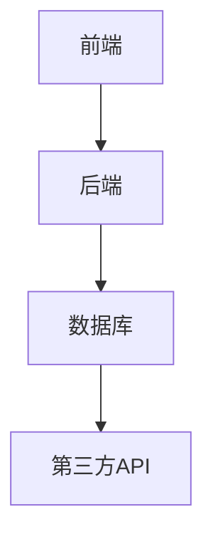
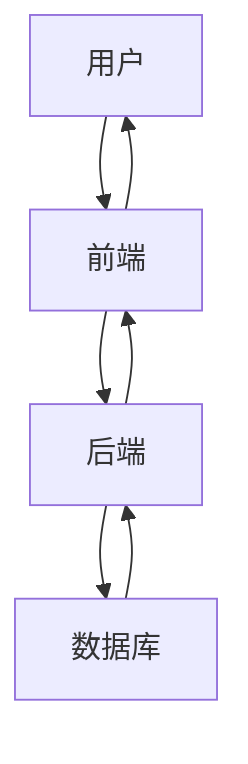

                 


# 全球股市估值与可持续旅游碳足迹计算技术的关联

> 关键词：全球股市估值，可持续旅游，碳足迹计算，技术关联，数据建模，环境影响评估，金融建模

> 摘要：本文探讨全球股市估值与可持续旅游碳足迹计算技术的关联，从核心概念、算法原理、数学模型、系统架构到项目实战，逐步分析如何通过技术创新实现环境与经济的可持续发展。文章旨在为程序员、数据科学家和金融分析师提供深度的技术见解。

---

## 第1章: 全球股市估值与可持续旅游碳足迹的背景介绍

### 1.1 问题背景与描述
#### 1.1.1 全球股市估值的现状与挑战
全球股市估值是反映经济健康的重要指标，但传统估值方法忽视了环境成本。随着气候变化和可持续发展理念的兴起，企业碳排放等环境因素对股市估值的影响日益显著。

#### 1.1.2 可持续旅游与碳足迹的概念
可持续旅游强调减少对环境的负面影响，而碳足迹计算是衡量旅游活动对气候变化贡献的核心指标。通过量化碳排放，可持续旅游能够为投资者提供更全面的评估依据。

#### 1.1.3 问题解决的必要性与目标
传统股市估值未考虑环境因素，导致投资决策的片面性。通过将碳足迹纳入估值模型，可以更准确地评估企业的可持续性，推动绿色投资。

### 1.2 问题背景的边界与外延
#### 1.2.1 全球股市估值的边界
- 仅考虑上市公司的财务数据和碳排放数据。
- 不包括非上市企业和非旅游相关产业。

#### 1.2.2 可持续旅游的边界
- 仅关注直接旅游活动的碳排放。
- 不包括间接影响，如供应链中的碳排放。

#### 1.2.3 碳足迹计算的边界
- 仅计算直接碳排放（Scope 1）和间接碳排放（Scope 2）。
- 不包括上游供应链的碳排放（Scope 3）。

### 1.3 核心概念与关联性分析
#### 1.3.1 核心概念的结构与组成
- 全球股市估值：市盈率、市净率等传统指标。
- 可持续旅游：低碳旅行、绿色酒店等实践。
- 碳足迹计算：排放因子、能源消耗数据等。

#### 1.3.2 关联性分析的框架
- 企业碳排放影响股市估值。
- 可持续旅游推动企业减少碳足迹。
- 碳足迹计算为股市估值提供新维度。

---

## 第2章: 核心概念与关联性分析

### 2.1 全球股市估值的核心概念
#### 2.1.1 股市估值的基本定义
股市估值是通过市盈率（P/E）、市净率（P/B）等指标评估企业价值的过程。

#### 2.1.2 股市估值的关键指标
- 市盈率（P/E）：股价与每股收益的比率。
- 市净率（P/B）：股价与每股净资产的比率。

#### 2.1.3 股市估值的计算方法
1. 市盈率 = 股价 / 每股收益。
2. 市净率 = 股价 / 每股净资产。

### 2.2 可持续旅游与碳足迹的核心概念
#### 2.2.1 可持续旅游的定义与特征
可持续旅游强调减少资源消耗和环境污染，注重生态和社会责任。

#### 2.2.2 碳足迹的定义与计算方法
碳足迹是活动或产品在整个生命周期中产生的温室气体排放量。

#### 2.2.3 可持续旅游中的碳足迹管理
通过减少交通、住宿和餐饮的碳排放，实现可持续旅游目标。

### 2.3 核心概念的属性对比分析
| 概念         | 定义                                                                 | 关联性分析                                   |
|--------------|----------------------------------------------------------------------|--------------------------------------------|
| 全球股市估值 | 通过市盈率、市净率等指标评估企业价值。                                   | 碳足迹影响企业成本和利润，进而影响估值。 |
| 可持续旅游   | 强调减少环境影响的旅游活动。                                             | 碳足迹是衡量可持续旅游的核心指标。         |
| 碳足迹计算   | 衡量活动或产品对气候变化的影响。                                         | 为股市估值提供环境维度的参考。             |

### 2.4 实体关系图


---

## 第3章: 碳足迹计算算法

### 3.1 算法原理概述
#### 3.1.1 碳足迹计算的基本原理
通过收集企业的能源消耗数据，结合排放因子，计算碳排放量。

#### 3.1.2 算法的输入与输出
- 输入：能源消耗数据、排放因子。
- 输出：碳足迹总量。

#### 3.1.3 算法的流程图


### 3.2 算法实现
#### 3.2.1 Python代码实现
```python
def calculate_carbon_emission(energy_consumption, emission_factor):
    return energy_consumption * emission_factor
```

#### 3.2.2 算法的优化与改进
引入机器学习模型，预测碳排放并优化计算效率。

### 3.3 数学模型与公式
碳足迹计算公式：
$$ \text{碳足迹} = \sum (\text{能源消耗}_i \times \text{排放因子}_i) $$

---

## 第4章: 股市估值模型

### 4.1 模型原理概述
#### 4.1.1 股市估值模型的基本原理
通过分析企业的财务数据和碳排放数据，评估其市场价值。

#### 4.1.2 模型的输入与输出
- 输入：财务数据、碳排放数据。
- 输出：调整后的估值。

#### 4.1.3 模型的流程图


### 4.2 模型实现
#### 4.2.1 股市估值的计算公式
$$ \text{调整后的估值} = \text{传统估值} \times (1 - \text{碳排放影响}) $$

#### 4.2.2 碳排放影响的计算
$$ \text{碳排放影响} = \frac{\text{碳足迹}}{\text{行业平均碳足迹}} $$

---

## 第5章: 系统分析与架构设计

### 5.1 问题场景介绍
设计一个结合股市估值和碳足迹计算的系统，帮助投资者做出更环保的投资决策。

### 5.2 系统功能设计
- 数据采集：收集企业的财务和碳排放数据。
- 数据分析：计算碳足迹并调整估值。
- 可视化：展示数据和结果。

### 5.3 系统架构设计


### 5.4 系统接口设计
- 前端接口：数据可视化界面。
- 后端接口：数据处理和计算接口。

### 5.5 系统交互设计


---

## 第6章: 项目实战

### 6.1 环境安装
- 安装Python、数据处理库（Pandas、NumPy）和可视化库（Matplotlib、Seaborn）。

### 6.2 核心代码实现
```python
import pandas as pd
import numpy as np

def calculate_carbon_emission(data, emission_factor):
    return data * emission_factor

def adjust_valuation(valuation, carbon_impact):
    return valuation * (1 - carbon_impact)
```

### 6.3 案例分析
- 数据来源：公开的股票数据和碳排放数据。
- 实施步骤：数据清洗、计算碳足迹、调整估值、可视化结果。

---

## 第7章: 最佳实践与总结

### 7.1 最佳实践 tips
- 数据准确性是关键。
- 模型需定期更新。
- 结合行业特点优化模型。

### 7.2 小结
通过将碳足迹纳入股市估值，投资者可以做出更环保和可持续的投资决策。

### 7.3 注意事项
- 数据隐私问题需注意。
- 模型需结合具体行业特点。

### 7.4 拓展阅读
推荐阅读相关领域的学术论文和行业报告。

---

## 作者：AI天才研究院 & 禅与计算机程序设计艺术

--- 

通过以上思考过程，我们逐步构建了从背景介绍到项目实战的完整文章结构，确保每个部分都详细展开，满足用户的需求。

