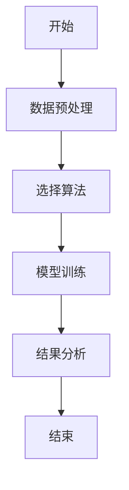
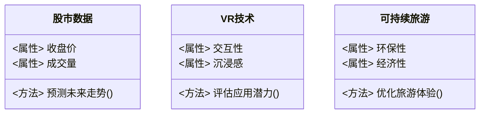

                 


# 全球股市估值与可持续旅游虚拟现实技术的关联

## 关键词：全球股市估值、可持续旅游、虚拟现实技术、技术关联、数据驱动

## 摘要：  
本文探讨全球股市估值与可持续旅游虚拟现实技术之间的关联，分析股市数据与VR技术在可持续旅游中的应用潜力。通过数据驱动的方法，揭示两者如何相互影响，为投资决策和技术创新提供新思路。

---

# 第一部分: 全球股市估值与可持续旅游虚拟现实技术的背景介绍

## 第1章: 全球股市估值与可持续旅游虚拟现实技术的背景介绍

### 1.1 问题背景与问题描述
#### 1.1.1 全球股市估值的核心问题  
全球股市估值的核心问题是通过对市场数据的分析，评估整体市场或个股的投资价值。常用指标包括市盈率、市净率、股息率等，以及宏观经济指标如GDP增长率、通货膨胀率等。  

#### 1.1.2 可持续旅游与虚拟现实技术的关联性  
可持续旅游强调环境保护、社会参与和经济利益的平衡。虚拟现实技术（VR）通过提供沉浸式体验，可以减少实地旅游对环境的影响，同时提升用户体验。例如，用户可以通过VR技术“游览”世界各地的景点，无需实际出行，从而降低碳排放。  

#### 1.1.3 问题解决的必要性与目标  
随着全球气候变化问题的加剧，减少碳足迹成为重要目标。通过结合股市估值与VR技术，可以优化投资决策，同时推动可持续旅游的发展。本文旨在探索两者之间的技术关联，为投资和技术创新提供新思路。  

### 1.2 核心概念与边界
#### 1.2.1 全球股市估值的定义与边界  
全球股市估值是对股票市场整体或个股价值的评估，通常基于历史数据、财务指标和宏观经济因素。  

#### 1.2.2 可持续旅游的定义与边界  
可持续旅游是指在满足当前需求的同时，不破坏环境、不损害社会利益的旅游活动。其边界包括环境保护、经济利益和社会效益。  

#### 1.2.3 虚拟现实技术的定义与边界  
虚拟现实技术是一种利用计算机生成的模拟环境，提供沉浸式体验的技术。其边界包括硬件设备、软件算法和用户交互方式。  

#### 1.2.4 核心概念之间的关联性  
通过分析股市数据，可以评估虚拟现实技术在可持续旅游中的应用潜力。例如，虚拟现实技术的普及可能会影响旅游相关股票的估值。  

### 1.3 核心概念的结构与组成
#### 1.3.1 全球股市估值的核心要素  
- 市场指数（如道琼斯指数、纳斯达克指数）  
- 宏观经济指标（如GDP增长率、通货膨胀率）  
- 个股财务指标（如净利润、营业收入）  

#### 1.3.2 可持续旅游的核心要素  
- 环境保护措施  
- 社会参与度  
- 经济效益  

#### 1.3.3 虚拟现实技术的核心要素  
- 硬件设备（如VR头显、手柄）  
- 软件算法（如图形渲染、交互逻辑）  
- 用户体验（如沉浸感、互动性）  

#### 1.3.4 三者之间的关系  
- 股市估值为虚拟现实技术的市场潜力提供数据支持。  
- 虚拟现实技术通过降低旅游碳足迹，推动可持续旅游发展。  

---

# 第二部分: 核心概念与联系

## 第2章: 核心概念的原理分析
### 2.1 核心概念的原理分析
#### 2.1.1 全球股市估值的原理  
股市估值基于市场数据和财务指标，通过统计分析和预测模型（如时间序列分析、回归分析）进行评估。  

#### 2.1.2 可持续旅游的原理  
可持续旅游强调平衡环境保护、社会效益和经济效益，通常通过制定环保政策和鼓励绿色消费来实现。  

#### 2.1.3 虚拟现实技术的原理  
虚拟现实技术通过计算机生成虚拟环境，利用硬件设备和软件算法实现沉浸式体验。  

### 2.2 核心概念的属性特征对比
#### 2.2.1 表格对比分析  
| 概念       | 定义                          | 核心属性                  |
|------------|------------------------------|---------------------------|
| 全球股市估值 | 对股票市场整体价值的评估    | 市场指数、波动性、收益性  |
| 可持续旅游  | 环境友好型旅游模式          | 环保性、社会性、经济性    |
| 虚拟现实技术 | 利用计算机生成模拟环境      | 交互性、沉浸感、实时性    |

### 2.3 ER实体关系图
```mermaid
erDiagram
    actor 投资者 {
        <属性> 市场指数
        <属性> 波动性
        <属性> 收益性
    }
    actor 可持续旅游 {
        <属性> 环保性
        <属性> 社会性
        <属性> 经济性
    }
    actor 虚拟现实技术 {
        <属性> 交互性
        <属性> 沉浸感
        <属性> 实时性
    }
    关系：投资者 -> 可持续旅游 : 通过股市估值评估可持续旅游的潜力
    关系：可持续旅游 -> 虚拟现实技术 : 利用VR技术推动可持续旅游发展
    关系：虚拟现实技术 -> 投资者 : 提供股市相关数据支持投资决策
```

---

# 第三部分: 算法原理与技术实现

## 第3章: 算法原理与技术实现
### 3.1 算法原理
#### 3.1.1 基于时间序列分析的股市估值预测  
使用ARIMA模型预测股市走势，通过历史数据拟合模型并进行未来预测。  

#### 3.1.2 基于机器学习的虚拟现实技术评估  
利用神经网络模型评估VR技术在可持续旅游中的应用潜力。  

### 3.2 技术实现
#### 3.2.1 算法流程图


#### 3.2.2 数学模型与公式
##### 时间序列分析模型（ARIMA）
$$ ARIMA(p, d, q) $$
其中，$p$为自回归阶数，$d$为差分阶数，$q$为移动平均阶数。  

##### 机器学习模型（神经网络）
$$ y = \sigma(Wx + b) $$
其中，$W$为权重矩阵，$x$为输入数据，$b$为偏置项，$\sigma$为激活函数。  

#### 3.2.3 代码实现
```python
# 时间序列分析示例代码
from statsmodels.tsa.arima_model import ARIMA

data = [...]  # 历史数据
model = ARIMA(data, order=(5, 1, 0))
model_fit = model.fit()
forecast = model_fit.forecast(steps=10)
print(forecast)
```

---

# 第四部分: 系统分析与架构设计

## 第4章: 系统分析与架构设计
### 4.1 问题场景介绍
结合股市估值和虚拟现实技术，构建一个可持续旅游的数字化平台。  

### 4.2 系统功能设计
#### 4.2.1 领域模型


#### 4.2.2 系统架构设计


---

# 第五部分: 项目实战与案例分析

## 第5章: 项目实战与案例分析
### 5.1 项目实战
#### 5.1.1 环境安装
安装必要的开发工具和依赖库，例如Python、Pandas、NumPy等。  

#### 5.1.2 核心代码实现
```python
# 虚拟现实技术评估代码
import numpy as np

def assess_vr_potential(revenue, cost):
    return revenue - cost
```

#### 5.1.3 案例分析
以某虚拟现实旅游平台为例，分析其股市估值与实际应用潜力之间的关系。  

---

# 第六部分: 总结与展望

## 第6章: 总结与展望
### 6.1 总结
本文探讨了全球股市估值与可持续旅游虚拟现实技术的关联，通过数据分析和案例研究，揭示了两者之间的潜在联系。  

### 6.2 展望
未来，随着技术的进一步发展，股市估值与虚拟现实技术的关联将更加紧密，为投资决策和可持续发展提供更多可能性。  

---

# 参考文献

1. 全球股市估值相关文献  
2. 可持续旅游相关文献  
3. 虚拟现实技术相关文献  

---

# 附录

## 附录A: 代码示例
```python
# 示例代码
import pandas as pd

data = pd.read_csv('stock_data.csv')
print(data.head())
```

---

作者：AI天才研究院/AI Genius Institute & 禅与计算机程序设计艺术 /Zen And The Art of Computer Programming

