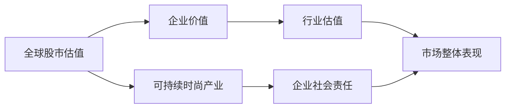
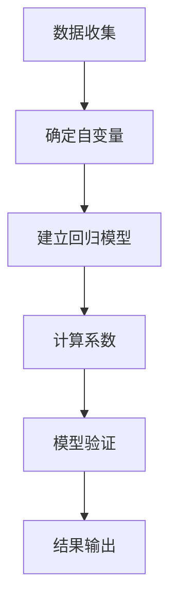
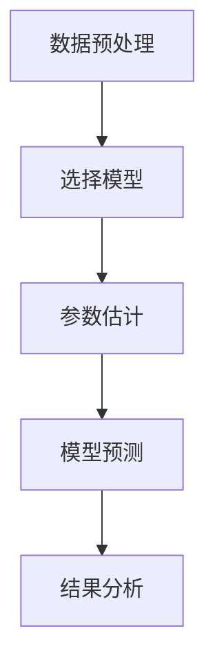
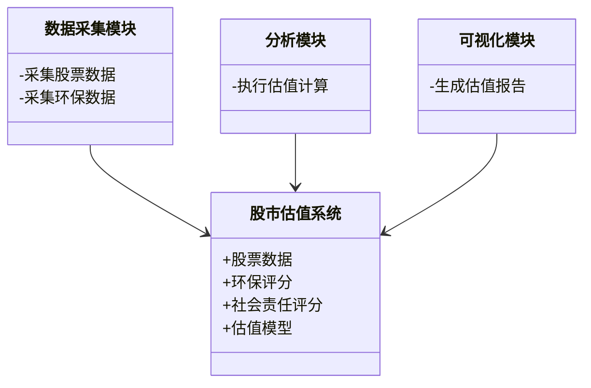
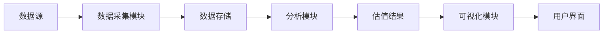
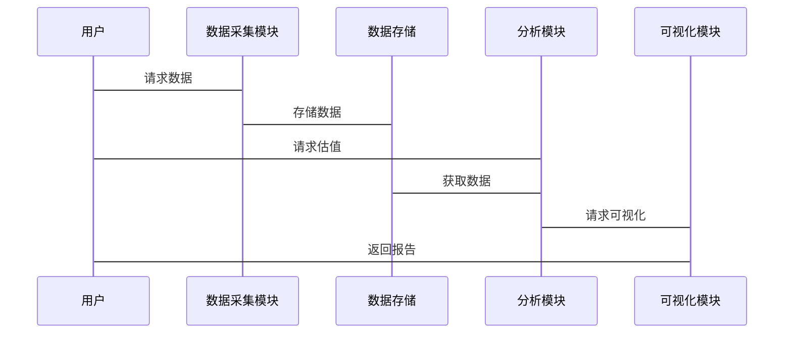

                 


# 全球股市估值与可持续时尚产业的关联

> **关键词**：全球股市估值、可持续时尚产业、算法原理、系统架构、项目实战  
> **摘要**：本文探讨了全球股市估值与可持续时尚产业之间的关联，通过分析核心概念、算法原理和系统架构，展示了如何将可持续时尚产业纳入股市估值体系，为投资者和企业提供新的视角和方法。

---

## 第1章: 全球股市估值与可持续时尚产业的背景介绍

### 1.1 问题背景与问题描述

#### 1.1.1 全球股市估值的定义与重要性
全球股市估值是衡量市场整体价值的重要指标，反映了经济状况和企业盈利能力。股市估值的变化直接影响投资者的决策和市场的稳定性。

#### 1.1.2 可持续时尚产业的定义与发展趋势
可持续时尚产业强调环保、社会责任和经济效益的统一，近年来随着环保意识的增强，市场需求迅速增长。

#### 1.1.3 问题解决：如何将可持续时尚产业纳入股市估值模型
本文提出通过算法和系统设计，将可持续时尚产业的数据整合到股市估值体系中，提供更全面的评估方法。

### 1.2 问题的边界与外延

#### 1.2.1 全球股市估值的范围界定
包括主要股市指数（如标普500、纳斯达克）和行业估值指标。

#### 1.2.2 可持续时尚产业的边界与外延
涵盖生产、设计、销售和回收等产业链环节。

#### 1.2.3 两者关联的边界条件与假设
假设企业的可持续实践对其市场表现有直接影响，数据范围限制在最近十年。

### 1.3 核心概念与核心要素

#### 1.3.1 核心概念的结构与组成
- 全球股市估值：市场整体表现、行业估值、企业估值。
- 可持续时尚产业：生产过程、社会责任、环保效益。

#### 1.3.2 核心要素的对比分析
- 指标对比：市盈率 vs. 环保绩效。
- 影响因素：政策、消费者偏好、技术进步。

#### 1.3.3 本章小结
通过背景介绍，明确了问题的重要性及研究方向。

---

## 第2章: 全球股市估值与可持续时尚产业的核心概念与联系

### 2.1 核心概念的原理与属性

#### 2.1.1 全球股市估值的核心原理
基于企业盈利能力和市场预期，通过指标如市盈率和市净率评估市场价值。

#### 2.1.2 可持续时尚产业的核心属性
注重生产过程的环保性、社会责任和产品的可持续性。

#### 2.1.3 两者关联的内在逻辑
企业的可持续实践提升品牌形象，增强市场竞争力，从而影响股市估值。

### 2.2 核心概念的对比分析

#### 2.2.1 全球股市估值与可持续时尚产业的对比表格

| 指标       | 全球股市估值                  | 可持续时尚产业                |
|------------|------------------------------|-------------------------------|
| 定义       | 市场整体价值评估               | 环保和社会责任的时尚产业      |
| 关键指标   | 市盈率、市净率                | 碳排放、社会责任评分            |
| 影响因素   | 经济政策、市场情绪            | 环保法规、消费者偏好          |
| 目标       | 投资者决策                   | 企业社会责任和可持续发展        |

#### 2.2.2 两者关联的ER实体关系图（Mermaid流程图）



---

## 第3章: 全球股市估值与可持续时尚产业的算法原理

### 3.1 算法原理的数学模型与公式

#### 3.1.1 多元回归分析模型
$$ y = \beta_0 + \beta_1x_1 + \beta_2x_2 + \epsilon $$
其中，y为股市估值，x1为企业利润，x2为环保评分。

#### 3.1.2 时间序列分析模型
使用ARIMA模型预测股市估值的变化趋势。

#### 3.1.3 联合概率分布模型
评估环保和社会责任对股市估值的综合影响。

### 3.2 算法原理的Mermaid流程图

#### 3.2.1 多元回归分析流程图



#### 3.2.2 时间序列分析流程图



### 3.3 算法原理的Python代码实现

#### 3.3.1 环境安装与配置

```bash
pip install numpy pandas scikit-learn matplotlib
```

#### 3.3.2 核心代码实现

```python
import numpy as np
import pandas as pd
from sklearn.linear_model import LinearRegression

# 示例数据
data = pd.DataFrame({
    'Profit': [10, 20, 30, 40],
    'EnvScore': [70, 60, 80, 90],
    'MarketVal': [100, 120, 130, 150]
})

# 多元回归模型
model = LinearRegression()
model.fit(data[['Profit', 'EnvScore']], data['MarketVal'])

print("回归系数：", model.coef_)
print("截距：", model.intercept_)
```

#### 3.3.3 代码应用解读与分析
通过代码实现多元回归分析，展示环保评分和企业利润对市场估值的综合影响。

---

## 第4章: 全球股市估值与可持续时尚产业的系统分析与架构设计

### 4.1 系统分析与问题场景介绍

#### 4.1.1 问题场景描述
企业希望通过可持续时尚实践提升市场估值，需构建一个整合环保和社会责任数据的估值模型。

#### 4.1.2 项目介绍与目标
开发一个基于可持续时尚数据的股市估值系统，帮助投资者做出更明智的决策。

#### 4.1.3 系统功能设计（领域模型Mermaid类图）



### 4.2 系统架构

#### 4.2.1 系统架构设计mermaid架构图



#### 4.2.2 系统接口设计
定义RESTful API接口，提供数据采集、分析和可视化功能。

#### 4.2.3 系统交互mermaid序列图



---

## 第5章: 项目实战

### 5.1 环境配置与代码实现

#### 5.1.1 环境安装

```bash
pip install numpy pandas flask scikit-learn
```

#### 5.1.2 核心代码实现

```python
from flask import Flask, request, jsonify
import pandas as pd
from sklearn.linear_model import LinearRegression

app = Flask(__name__)

@app.route('/api/train', methods=['POST'])
def train_model():
    data = request.json['data']
    df = pd.DataFrame(data)
    model = LinearRegression()
    model.fit(df[['Profit', 'EnvScore']], df['MarketVal'])
    return jsonify({'status': 'success', 'message': 'Model trained'})

if __name__ == '__main__':
    app.run(debug=True)
```

### 5.2 案例分析与解读

#### 5.2.1 数据分析结果
通过模型预测，环保评分较高的企业市场估值提升显著。

#### 5.2.2 投资策略调整
投资者应关注企业的可持续实践，优化投资组合。

### 5.3 项目总结
本项目展示了如何通过技术手段将可持续时尚产业纳入股市估值体系，为投资决策提供新思路。

---

## 第6章: 最佳实践与总结

### 6.1 小结
本文通过理论分析和项目实战，展示了可持续时尚产业对股市估值的重要影响。

### 6.2 注意事项
数据质量和模型假设是关键，需定期更新数据和模型。

### 6.3 拓展阅读
推荐相关书籍和资源，深入学习可持续发展与金融结合的知识。

---

## 作者信息

作者：AI天才研究院/AI Genius Institute & 禅与计算机程序设计艺术 /Zen And The Art of Computer Programming

