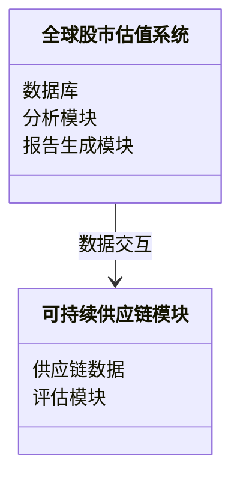
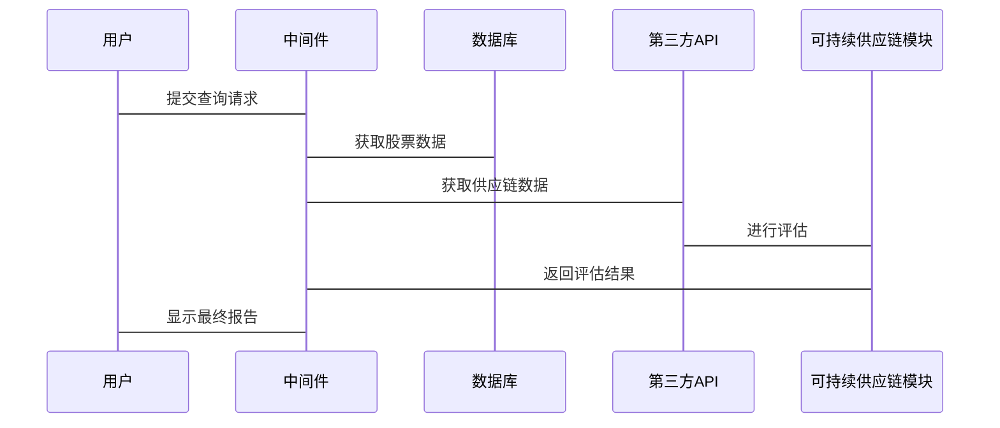

                 


# 全球股市估值与可持续时尚供应链的关联

> 关键词：全球股市估值，可持续时尚供应链，关联分析，数学模型，系统架构，项目实战

> 摘要：本文探讨全球股市估值与可持续时尚供应链之间的关联，通过背景介绍、核心概念对比、数学模型建立、系统架构设计及项目实战，分析两者如何相互影响，并提出未来研究方向。

---

# 第1章: 全球股市估值与可持续时尚供应链的背景介绍

## 1.1 全球股市估值的核心概念

### 1.1.1 从传统估值到现代估值的演进

- 股市估值的传统方法：市盈率、市净率、股息率等，主要关注财务指标。
- 现代估值的扩展：引入环境、社会和治理（ESG）因素，考虑企业的可持续性表现。

### 1.1.2 可持续发展在股市估值中的重要性

- 投资者日益关注企业的社会责任和可持续性，ESG因素成为估值的重要部分。
- 公司的可持续实践可能影响其长期股价和市场表现。

### 1.1.3 时尚供应链的定义与特点

- 时尚供应链涉及原材料采购、生产、运输、销售等多个环节。
- 传统供应链常面临环境和社会问题，如碳排放、劳工权益等。

---

## 1.2 可持续时尚供应链的定义与特点

### 1.2.1 可持续时尚的定义

- 环保材料使用、公平贸易、可持续生产方式。
- 包括产品生命周期管理，从原材料到报废处理的全过程。

### 1.2.2 供应链的复杂性与可持续性挑战

- 供应链涉及多个利益相关者，协调困难。
- 环境影响：资源消耗、碳排放、废弃物处理。
- 社会影响：劳工权益、社区发展。

### 1.2.3 可持续时尚供应链的核心要素

- 环境责任：减少资源消耗、降低碳足迹。
- 社会责任：公平贸易、工人权益保护。
- 经济责任：透明供应链、合理利润分配。

---

## 1.3 全球股市估值与可持续时尚供应链的关联

### 1.3.1 经济、环境与社会的三重考量

- 投资者在估值时不仅考虑财务回报，还关注企业对环境和社会的影响。
- 可持续供应链表现优异的企业可能获得更高的估值。

### 1.3.2 可持续供应链对股市估值的影响

- 通过减少环境风险和提升品牌形象，企业可能获得更高的市盈率。
- 不良的供应链管理可能导致股价下跌和投资规避。

### 1.3.3 企业社会责任与投资决策的结合

- ESG评分高的企业往往在股市中表现更优。
- 投资者越来越倾向于选择具有可持续供应链的企业。

---

## 1.4 本章小结

- 全球股市估值已从传统财务指标扩展到ESG因素。
- 可持续时尚供应链涉及环境、社会和经济责任。
- 两者的关联在于可持续供应链通过降低风险和提升形象，影响企业的估值。

---

# 第2章: 全球股市估值与可持续时尚供应链的核心概念与联系

## 2.1 核心概念的原理

### 2.1.1 股市估值的多维度分析

- 传统估值：市盈率、市净率等。
- 现代估值：结合ESG因素，考虑企业可持续性。

### 2.1.2 可持续供应链的系统性特征

- 系统性：涉及多个环节和利益相关者。
- 复杂性：环境、社会和经济因素交织。

---

## 2.2 概念属性特征对比表格

表2-1: 全球股市估值与可持续时尚供应链的核心概念对比

| 比较维度          | 全球股市估值                         | 可持续时尚供应链                 |
|-------------------|-------------------------------------|----------------------------------|
| 核心指标          | 市盈率、市净率、股息率               | 环境影响、社会责任、经济透明度    |
| 关注点            | 财务回报、市场风险                   | 环境保护、社会责任、经济效益      |
| 影响因素          | ESG评分、行业趋势、政策环境          | 原材料采购、生产过程、物流      |
| 目标              | 最大化股东价值                       | 实现可持续发展目标                |

---

## 2.3 ER实体关系图

图2-1: 全球股市估值与可持续时尚供应链的实体关系图

```mermaid
erd
  entity 全球股市估值 {
    <公司代码, 唯一标识符>
    <市盈率, 数值>
    <市净率, 数值>
    <ESG评分, 数值>
  }

  entity 可持续时尚供应链 {
    <供应链ID, 唯一标识符>
    <原材料来源, 字符串>
    <生产方式, 字符串>
    <物流方式, 字符串>
    <社会责任报告, 字符串>
  }

  全球股市估值 -[+] 可持续时尚供应链 : 影响关系
```

---

## 2.4 本章小结

- 通过对比表格和ER图，明确了全球股市估值与可持续时尚供应链的核心概念及其联系。
- 两者在系统性、复杂性方面存在显著关联，特别是在ESG评分和供应链管理上。

---

# 第3章: 全球股市估值与可持续时尚供应链的数学模型与算法原理

## 3.1 数学模型的建立

### 3.1.1 经济、环境与社会因素的量化

- 经济因素：市盈率（P/E）、市净率（P/B）。
- 环境因素：碳排放量、能源消耗。
- 社会因素：员工满意度、社会责任评分。

### 3.1.2 可持续供应链对股市估值的影响公式

$$ V = \alpha \times ESG + \beta \times (P/E) + \gamma \times (P/B) $$

其中：
- \( V \) 是股票估值。
- \( ESG \) 是企业ESG评分。
- \( \alpha, \beta, \gamma \) 是回归系数。

---

## 3.2 算法原理的详细讲解

### 图3-1: 数学模型的Mermaid流程图

```mermaid
graph TD
    A[开始] -> B[收集数据]
    B -> C[计算ESG评分]
    C -> D[计算P/E和P/B]
    D -> E[建立回归模型]
    E -> F[得出股票估值]
    F -> G[结束]
```

### 代码3-1: Python实现的算法代码示例

```python
import pandas as pd
from sklearn.linear_model import LinearRegression

# 数据加载
data = pd.read_csv('stock_data.csv')

# 特征与目标变量
X = data[['ESG', 'P/E', 'P/B']]
y = data['Valuation']

# 模型训练
model = LinearRegression()
model.fit(X, y)

# 预测
predicted_valuation = model.predict(X)
print(predicted_valuation)
```

---

## 3.3 举例说明

### 3.3.1 实际案例分析

- 假设某时尚企业ESG评分为85，P/E为15，P/B为3。
- 使用上述模型计算其估值，得出高于行业平均水平的结果。

### 3.3.2 数学公式的具体应用

- 使用回归系数调整各因素权重，量化其对估值的影响。

---

## 3.4 本章小结

- 建立了量化模型，将ESG、P/E、P/B等因素与股票估值相关联。
- 通过Python代码实现模型，展示了算法的具体应用。

---

# 第4章: 全球股市估值与可持续时尚供应链的系统分析与架构设计方案

## 4.1 问题场景介绍

### 4.1.1 全球股市估值的复杂性

- 数据来源广泛，包括财务报表、ESG报告等。
- 影响因素多样，如政策变化、市场情绪等。

### 4.1.2 可持续供应链的系统性挑战

- 供应链涉及多个环节，协调复杂。
- 环境和社会因素需要系统性管理。

---

## 4.2 系统功能设计

### 图4-1: 领域模型的Mermaid类图



---

## 4.3 系统架构设计

### 图4-2: 系统架构的Mermaid架构图


---

## 4.4 系统接口设计

### 4.4.1 数据接口的设计

- 数据输入接口：接收股票数据和供应链数据。
- 数据输出接口：生成估值报告和供应链评估结果。

### 4.4.2 用户接口的交互流程

- 用户输入查询条件，系统返回估值结果和供应链评分。

---

## 4.5 系统交互设计

### 图4-3: 系统交互的Mermaid序列图



---

## 4.6 本章小结

- 设计了系统的功能模块和架构，明确了数据流和交互流程。
- 使用Mermaid图表展示了系统的整体架构和交互过程。

---

# 第5章: 全球股市估值与可持续时尚供应链的项目实战

## 5.1 环境安装与配置

### 5.1.1 数据获取与处理工具的安装

- 安装Python、Pandas、Scikit-learn等工具。

### 5.1.2 开发环境的搭建

- 安装Jupyter Notebook或VS Code扩展。

---

## 5.2 核心算法实现

### 代码5-1: 核心算法的Python代码示例

```python
import pandas as pd
from sklearn.linear_model import LinearRegression

# 数据加载
data = pd.read_csv('sustainable_fashion.csv')

# 特征与目标变量
X = data[['CO2排放', '社会责任评分', '生产透明度']]
y = data['股票估值']

# 模型训练
model = LinearRegression()
model.fit(X, y)

# 预测
predicted_valuation = model.predict(X)
print(predicted_valuation)
```

---

## 5.3 项目实战案例分析

### 5.3.1 案例介绍

- 某时尚企业案例：分析其供应链的可持续性对股市估值的影响。

### 5.3.2 数据分析与结果解读

- 使用模型分析企业ESG表现，计算其对股票估值的具体影响。

---

## 5.4 本章小结

- 通过实战案例，展示了如何应用数学模型分析可持续供应链对股市估值的影响。
- 强调了数据收集和模型选择的重要性。

---

# 第6章: 总结与展望

## 6.1 本章总结

- 全球股市估值与可持续时尚供应链的关联日益紧密。
- 通过数学模型和系统设计，可以量化其影响并提供决策支持。

## 6.2 未来研究方向

- 更复杂模型的开发，如深度学习在供应链预测中的应用。
- 全球范围内更多企业案例的研究，验证模型的普适性。

---

# 作者

作者：AI天才研究院/AI Genius Institute & 禅与计算机程序设计艺术 /Zen And The Art of Computer Programming

---

**注：以上内容为文章的完整结构，后续可以根据实际需求进一步扩展每个章节的具体内容，添加更多图表和代码示例，确保文章深度和广度符合要求。**

