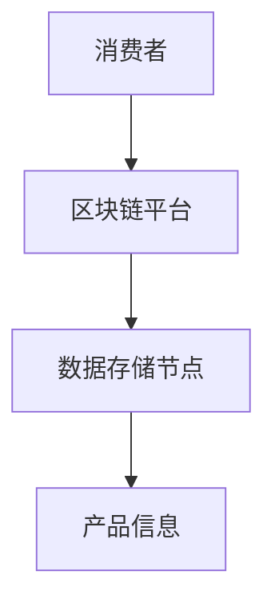

                 


# 全球股市估值与可持续时尚区块链溯源的关联

## 关键词：全球股市估值、可持续时尚、区块链、溯源、经济影响

## 摘要：本文探讨了全球股市估值与可持续时尚之间的关联，特别是通过区块链技术实现的溯源对股市估值的影响。文章分析了股市估值的传统方法与现代演变，详细介绍了区块链在可持续时尚中的应用，构建了数学模型，并设计了区块链溯源系统的架构，最后通过案例分析展示了其实际应用和经济价值。

---

# 第1章 全球股市估值与可持续时尚的背景概述

## 1.1 全球股市估值的现状与挑战

### 1.1.1 全球股市估值的基本概念
股市估值是衡量企业价值的关键指标，主要包括市盈率（P/E）、市净率（P/B）等传统方法，以及现代的现金流折现法（DCF）和指数模型（CAPM）。传统估值方法侧重于财务数据，而现代方法则引入了更多动态因素，如企业增长潜力和市场情绪。

### 1.1.2 现代股市估值的主要方法
现代估值方法包括：
- **现金流折现法（DCF）**：基于未来现金流的现值评估企业价值。
- **指数模型（CAPM）**：考虑系统风险和无风险利率，评估股票的合理定价。
- **情景分析法**：通过不同情景预测股票价值。

### 1.1.3 可持续发展对股市估值的影响
随着环保和社会责任的重要性增加，投资者越来越关注企业的可持续发展表现。企业如果在可持续发展方面表现优异，可能会获得更高的估值溢价，反之则可能面临估值折损。

---

## 1.2 可持续时尚的定义与发展

### 1.2.1 可持续时尚的定义与内涵
可持续时尚强调从原材料采购到生产、消费和废弃物处理的全生命周期的可持续性，包括减少资源消耗、降低碳排放和提高社会责任。

### 1.2.2 可持续时尚的现状与趋势
当前，消费者对环保和道德消费的关注度不断提高，推动了可持续时尚的发展。许多品牌开始采用可持续材料和生产方式，以满足市场需求。

### 1.2.3 可持续时尚对全球经济的影响
可持续时尚不仅改变了消费模式，还推动了绿色经济的发展，促进了产业链的优化和升级。

---

## 1.3 区块链技术的崛起与应用前景

### 1.3.1 区块链技术的基本原理
区块链通过去中心化、不可篡改和可追溯性，确保数据的安全性和透明性，为溯源提供了技术基础。

### 1.3.2 区块链在溯源中的应用
区块链可以记录产品从原材料到消费者的整个生命周期，确保信息的真实性和可追溯性，从而提高供应链的透明度和信任度。

### 1.3.3 区块链对可持续时尚产业的推动作用
通过区块链技术，消费者可以验证产品的真实性和可持续性，增强了品牌信任和消费者满意度。

---

## 1.4 本章小结
本章介绍了全球股市估值、可持续时尚和区块链技术的基本概念及其关联，为后续分析奠定了基础。

---

# 第2章 全球股市估值的核心概念与方法论

## 2.1 股市估值的基本原理

### 2.1.1 股市估值的核心要素
股市估值的核心要素包括企业盈利能力、成长潜力、财务健康状况和市场环境。

### 2.1.2 股市估值的主要指标
- **市盈率（P/E）**：市价与每股收益的比率。
- **市净率（P/B）**：市价与每股净资产的比率。
- **股息率**：股息与股价的比率。

### 2.1.3 股市估值的数学模型
常用的数学模型包括：
$$
\text{市盈率} = \frac{\text{股价}}{\text{每股收益}}
$$
$$
\text{市净率} = \frac{\text{股价}}{\text{每股净资产}}
$$

---

## 2.2 可持续发展对股市估值的影响

### 2.2.1 可持续发展与企业价值的关系
企业可持续发展表现越好，投资者对其的信任度越高，企业的市场价值也越高。

### 2.2.2 可持续发展对投资者决策的影响
投资者越来越关注企业的环境、社会和治理（ESG）表现，这成为投资决策的重要考量因素。

### 2.2.3 可持续发展对股市估值的长期影响
可持续发展表现优异的企业通常具有更强的抗风险能力和长期增长潜力，这会提升其股市估值。

---

## 2.3 现代股市估值方法的演变

### 2.3.1 传统估值方法的局限性
传统估值方法主要依赖历史数据和财务指标，难以全面反映企业的动态和潜在风险。

### 2.3.2 现代估值方法的创新
现代方法引入了动态因素，如企业战略、创新能力和市场环境，更加全面地评估企业价值。

### 2.3.3 数学模型在现代估值中的应用
例如，使用回归分析预测企业未来业绩：
$$
\text{预测收益} = \beta \times \text{市场收益率} + \alpha
$$

---

## 2.4 本章小结
本章详细介绍了股市估值的核心概念和方法论，强调了可持续发展对企业价值和股市估值的影响。

---

# 第3章 可持续时尚与区块链溯源的核心概念

## 3.1 可持续时尚的核心要素

### 3.1.1 可持续时尚的生产流程
从原材料选择、生产过程到产品包装，每个环节都需要符合环保和社会责任标准。

### 3.1.2 可持续时尚的消费者行为
消费者 increasingly demand transparent and ethical products, driving the need for reliable verification mechanisms.

### 3.1.3 可持续时尚的政策支持
政府和行业组织通过制定标准和提供激励措施，推动可持续时尚的发展。

---

## 3.2 区块链技术在溯源中的应用

### 3.2.1 区块链溯源的基本原理
通过区块链技术，可以记录每个产品的唯一标识，确保信息的真实性和不可篡改性。

### 3.2.2 区块链溯源的关键技术
- **智能合约**：自动执行合同条款，确保交易的透明性和可靠性。
- **分布式账本**：存储数据的分布式特性，确保数据的安全性和一致性。

### 3.2.3 区块链溯源的实现流程
1. 产品信息记录：从原材料到成品的每个环节都记录在区块链上。
2. 数据加密：确保数据的安全性和隐私性。
3. 可追溯性：消费者可以通过区块链查询产品信息，验证其真实性。

---

## 3.3 可持续时尚与区块链溯源的关联

### 3.3.1 可持续时尚对区块链溯源的需求
为了确保产品的可持续性，消费者需要可靠的验证方式，区块链溯源提供了这一解决方案。

### 3.3.2 区块链溯源对可持续时尚的推动作用
通过区块链技术，消费者可以轻松验证产品的可持续性，增强品牌信任和消费者忠诚度。

### 3.3.3 可持续时尚与区块链溯源的协同发展
区块链技术不仅推动了可持续时尚的发展，还通过提高透明度和信任度，提升了企业的市场价值。

---

## 3.4 本章小结
本章详细介绍了可持续时尚的核心要素和区块链技术在溯源中的应用，分析了两者之间的关联。

---

# 第4章 区块链溯源技术的算法原理与数学模型

## 4.1 区块链溯源算法的基本原理

### 4.1.1 区块链溯源算法的流程
1. 数据采集：记录产品信息。
2. 数据加密：确保数据的安全性。
3. 数据存储：将数据存储在区块链上。
4. 数据查询：消费者可以通过区块链查询产品信息。

### 4.1.2 区块链溯源算法的核心技术
- **哈希函数**：用于数据加密和完整性验证。
- **数字签名**：确保数据的真实性和不可篡改性。

### 4.1.3 区块链溯源算法的实现步骤
1. 产品信息录入：包括原材料、生产过程、运输等信息。
2. 数据加密：对数据进行哈希计算，生成唯一标识。
3. 数据上链：将数据存储在区块链上。
4. 数据查询：消费者通过区块链查询产品信息。

---

## 4.2 区块链溯源的数学模型

### 4.2.1 区块链溯源的数学模型概述
区块链溯源的数学模型主要涉及哈希函数和加密算法。

### 4.2.2 区块链溯源的数学模型构建
哈希函数用于将数据转换为固定长度的哈希值：
$$
\text{哈希值} = \text{哈希函数}(\text{输入数据})
$$

数字签名用于验证数据的真实性：
$$
\text{签名} = \text{私钥} \times \text{哈希值}
$$

### 4.2.3 区块链溯源的实现流程
1. 数据录入：将产品信息录入系统。
2. 数据加密：对数据进行哈希计算。
3. 数据上链：将哈希值和数字签名存储在区块链上。
4. 数据查询：消费者通过区块链查询产品信息。

---

## 4.3 本章小结
本章详细介绍了区块链溯源技术的算法原理和数学模型，为后续的系统设计奠定了基础。

---

# 第5章 区块链溯源系统的系统设计与实现

## 5.1 系统功能设计

### 5.1.1 系统功能模块
- 数据采集模块：负责采集产品信息。
- 数据处理模块：对数据进行加密和签名。
- 区块链存储模块：将数据存储在区块链上。
- 数据查询模块：消费者查询产品信息。

### 5.1.2 系统功能流程
1. 数据采集：通过传感器或人工录入采集产品信息。
2. 数据处理：对数据进行哈希计算和数字签名。
3. 区块链存储：将数据存储在区块链上。
4. 数据查询：消费者通过区块链查询产品信息。

---

## 5.2 系统架构设计

### 5.2.1 系统架构图


### 5.2.2 关键组件说明
- **消费者**：通过区块链平台查询产品信息。
- **区块链平台**：负责数据的存储和管理。
- **数据存储节点**：存储产品信息的区块链节点。

---

## 5.3 系统接口设计

### 5.3.1 数据采集接口
- **输入**：产品信息。
- **输出**：哈希值和数字签名。

### 5.3.2 数据查询接口
- **输入**：产品标识。
- **输出**：产品信息。

---

## 5.4 本章小结
本章详细介绍了区块链溯源系统的系统设计与实现，包括功能模块、架构设计和接口设计。

---

# 第6章 区块链溯源系统的实际应用与经济影响

## 6.1 项目实战：区块链溯源系统部署

### 6.1.1 环境安装
- 安装区块链平台（如以太坊）。
- 安装相关开发工具（如Solidity、Ganache）。

### 6.1.2 核心实现代码
```solidity
contract ProductTraceability {
    function registerProduct(bytes32 productId, bytes32 hash) public {
        // 存储产品信息和哈希值
    }
}
```

### 6.1.3 代码应用解读
通过智能合约实现产品的注册和查询功能，确保数据的安全性和透明性。

---

## 6.2 经济影响分析

### 6.2.1 对企业的影响
- 提高供应链透明度，增强消费者信任。
- 降低生产成本，提升企业竞争力。

### 6.2.2 对消费者的影响
- 提供透明的产品信息，满足消费者对可持续时尚的需求。
- 增强消费信心，促进可持续消费。

### 6.2.3 对股市估值的影响
- 企业通过区块链技术提升可持续发展表现，获得更高的股市估值。

---

## 6.3 本章小结
本章通过实际案例展示了区块链溯源系统的部署和应用，分析了其对经济的深远影响。

---

# 第7章 总结与展望

## 7.1 本文总结
本文探讨了全球股市估值与可持续时尚区块链溯源的关联，分析了区块链技术在可持续时尚中的应用，构建了数学模型，并设计了系统的架构。

## 7.2 未来展望
随着区块链技术的不断发展，其在可持续时尚中的应用将更加广泛，推动全球经济向可持续方向发展。

---

# 作者：AI天才研究院 & 禅与计算机程序设计艺术

---

感谢您的阅读！希望这篇文章能为您提供有价值的信息和启发。如果需要进一步探讨，请随时联系我。

