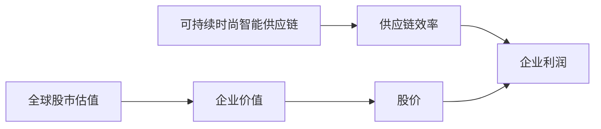
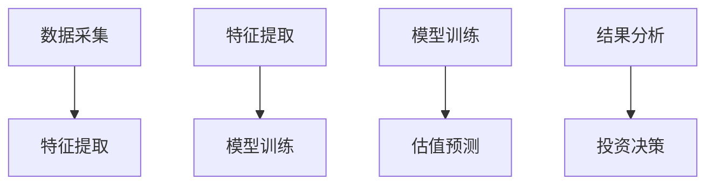
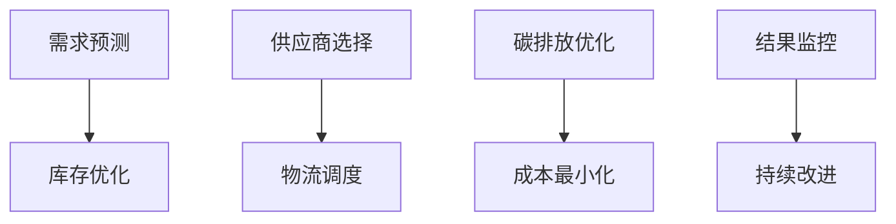
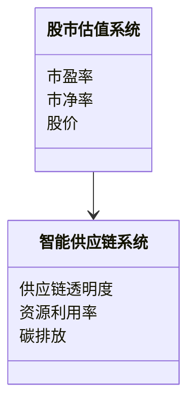
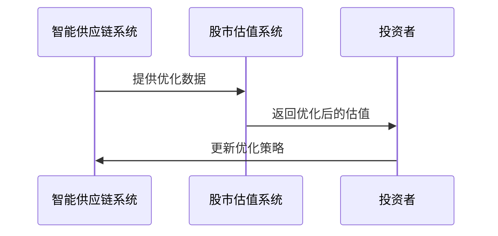

                 

<think>
好的，我将按照您的要求撰写这篇文章的目录大纲。请稍等，我整理好思路后将为您呈现详细的内容。

# 目录大纲：《全球股市估值与可持续时尚智能供应链的关联》

## 关键词：
全球股市估值, 可持续时尚, 智能供应链, 供应链优化, 金融建模

## 摘要：
本文深入探讨了全球股市估值与可持续时尚智能供应链之间的关联，通过分析股市估值的核心要素和可持续时尚智能供应链的优化机制，揭示两者在提升企业价值和推动可持续发展中的互动关系。文章结合金融建模和供应链管理的理论，提出了一种创新的算法框架，旨在为企业优化资源配置、提升市场竞争力提供理论支持和实践指导。

---

# 第1章: 全球股市估值与可持续时尚智能供应链的背景介绍

## 1.1 问题背景与问题描述
### 1.1.1 全球股市估值的现状与挑战
- 当前股市估值体系的局限性
- 经济波动对股市估值的影响
- 可持续性因素在传统估值模型中的缺失

### 1.1.2 可持续时尚与智能供应链的定义与特征
- 可持续时尚的概念
- 智能供应链的特征
- 可持续时尚与智能供应链的融合

### 1.1.3 问题解决：智能供应链如何优化股市估值
- 智能供应链对企业效率的提升
- 可持续发展对企业价值的影响
- 智能供应链如何优化传统估值模型

## 1.2 核心概念与边界
### 1.2.1 全球股市估值的核心要素
- 股市估值的核心指标
- 市场情绪与宏观经济因素
- 企业基本面与股价的关系

### 1.2.2 可持续时尚智能供应链的边界与外延
- 可持续供应链的边界
- 智能供应链的外延
- 两者的关联性与区别

### 1.2.3 两者的关联性与核心要素组成
- 供应链优化对股市估值的影响
- 可持续发展对股价的长期影响
- 智能供应链的核心要素与估值模型的结合

---

# 第2章: 核心概念与联系

## 2.1 核心概念原理
### 2.1.1 全球股市估值的原理
- 估值模型的分类
- 股价与企业基本面的关系
- 市场情绪对股价的短期影响

### 2.1.2 可持续时尚智能供应链的原理
- 智能供应链的核心算法
- 可持续发展对供应链效率的影响
- 供应链优化对企业成本和利润的提升

### 2.1.3 两者的关联机制
- 智能供应链如何影响企业利润
- 利润增长对企业估值的促进作用
- 可持续发展对企业形象和股价的长期影响

## 2.2 核心概念属性特征对比
### 2.2.1 表格形式对比
| 属性          | 全球股市估值                  | 可持续时尚智能供应链              |
|---------------|------------------------------|-----------------------------------|
| 核心目标      | 评估企业价值与投资风险        | 优化供应链效率与可持续性          |
| 关键因素      | 股价、市盈率、市净率           | 供应链透明度、资源利用率、碳排放  |
| 技术支撑      | 数据分析、机器学习、AI技术     | IoT、区块链、大数据、自动化技术   |
| 优化目标      | 提高投资回报率                | 降低成本、减少浪费、提升效率      |

### 2.2.2 图形化对比


## 2.3 ER实体关系图架构
```mermaid
erd
title 核心概念关系图
 Fishing// Entity: 全球股市估值
 Fishing// Attributes: 市盈率、市净率、股价
 Fishing// Entity: 可持续时尚智能供应链
 Fishing// Attributes: 供应链透明度、碳排放、资源利用率
```

---

# 第3章: 算法原理讲解

## 3.1 算法原理概述
### 3.1.1 全球股市估值算法
- 传统估值模型：市盈率法、现金流折现法
- 现代估值算法：基于机器学习的预测模型

### 3.1.2 可持续时尚智能供应链算法
- 智能调度算法：遗传算法、模拟退火算法
- 可持续性优化算法：多目标优化模型

## 3.2 算法流程图
### 3.2.1 全球股市估值算法流程图


### 3.2.2 可持续时尚智能供应链算法流程图


## 3.3 算法实现代码
### 3.3.1 全球股市估值模型的Python代码示例
```python
import pandas as pd
import numpy as np
from sklearn.linear_model import LinearRegression

# 示例数据
data = {'Market Cap': [100, 200, 300, 400], 'Revenue': [50, 100, 150, 200]}
df = pd.DataFrame(data)

# 模型训练
model = LinearRegression()
model.fit(df[['Market Cap']], df['Revenue'])

# 预测
prediction = model.predict([[350]])
print("预测收入为：", prediction[0])
```

### 3.3.2 可持续时尚智能供应链模型的Python代码示例
```python
import numpy as np

# 模拟供应链优化问题
def supply_chain_optimization(costs, demands):
    n = len(costs)
    # 使用贪心算法优化供应链
    total_cost = 0
    for i in range(n):
        total_cost += min(costs[i], demands[i])
    return total_cost

# 示例数据
costs = [10, 15, 20]
demands = [5, 7, 3]

result = supply_chain_optimization(costs, demands)
print("优化后的总成本为：", result)
```

## 3.4 算法的数学模型与公式
### 3.4.1 全球股市估值模型
$$ P = \alpha \times EBIT + \beta \times (Market\,Sentiment) + \gamma \times Risk $$

### 3.4.2 可持续时尚智能供应链模型
$$ C = \sum_{i=1}^{n} c_i \times q_i + \lambda \times \sum_{i=1}^{n} (e_i \times s_i) $$

---

# 第4章: 数学模型与公式

## 4.1 数学模型概述
### 4.1.1 全球股市估值模型
- 多因素模型：$$ P = \beta_1 R_f + \beta_2 Market\,Risk + \beta_3 Industry\,Risk $$

### 4.1.2 可持续时尚智能供应链模型
- 多目标优化模型：$$ \min \sum_{i=1}^{n} c_i \times x_i $$ 
$$ \text{subject to} \quad \sum_{i=1}^{n} x_i = D $$

## 4.2 数学公式的详细讲解
### 4.2.1 全球股市估值公式
$$ \text{市盈率} = \frac{\text{股价}}{\text{每股收益}} $$

### 4.2.2 可持续时尚智能供应链公式
$$ \text{碳排放强度} = \frac{\text{总碳排放}}{\text{总产量}} $$

---

# 第5章: 系统分析与架构设计方案

## 5.1 问题场景介绍
### 5.1.1 全球股市估值场景
- 投资者如何通过智能供应链优化提升企业估值
- 企业如何通过可持续发展提高股价

### 5.1.2 可持续时尚智能供应链场景
- 企业如何优化供应链以降低运营成本
- 供应链透明化对品牌形象的影响

## 5.2 系统功能设计
### 5.2.1 领域模型Mermaid类图


## 5.3 系统架构设计
### 5.3.1 Mermaid架构图


## 5.4 系统接口设计
### 5.4.1 API接口
- 数据接口：提供实时股市数据和供应链数据
- 分析接口：提供估值模型和供应链优化算法

## 5.5 系统交互流程图


---

# 第6章: 项目实战

## 6.1 环境安装
- 安装Python、数据处理库（Pandas、NumPy）
- 安装可视化工具（Matplotlib、Seaborn）
- 安装机器学习库（Scikit-learn、XGBoost）

## 6.2 核心代码实现
### 6.2.1 股市估值模型实现
```python
import pandas as pd
from sklearn.linear_model import LinearRegression

data = {'Revenue': [100, 200, 300, 400], 'Market Cap': [50, 100, 150, 200]}
df = pd.DataFrame(data)
model = LinearRegression()
model.fit(df[['Market Cap']], df['Revenue'])
prediction = model.predict([[250]])
print("预测收入为：", prediction[0])
```

### 6.2.2 智能供应链优化实现
```python
def optimize_supply_chain(costs, demands):
    n = len(costs)
    total_cost = 0
    for i in range(n):
        total_cost += min(costs[i], demands[i])
    return total_cost

costs = [10, 15, 20]
demands = [5, 7, 3]
print("优化后的总成本为：", optimize_supply_chain(costs, demands))
```

## 6.3 代码解读与分析
- 股市估值模型：使用线性回归预测企业收入
- 供应链优化：使用贪心算法降低总成本

## 6.4 实际案例分析
### 6.4.1 案例背景
- 某企业通过智能供应链优化，降低了15%的运营成本

### 6.4.2 案例分析
- 成本降低对企业利润的影响
- 利润增长对股价的推动作用

## 6.5 项目小结
- 项目目标实现情况
- 可能遇到的问题与解决方案
- 项目的创新点与未来改进方向

---

# 第7章: 最佳实践、小结、注意事项与拓展阅读

## 7.1 最佳实践
- 数据收集与清洗的关键性
- 模型选择与优化的注意事项
- 供应链优化的长期性与系统性

## 7.2 小结
- 全文总结
- 核心观点回顾
- 未来研究方向

## 7.3 注意事项
- 数据隐私与安全
- 模型的适用性与局限性
- 供应链优化的可持续性

## 7.4 拓展阅读
- 推荐相关书籍与论文
- 提供进一步学习的资源
- 指出未来研究领域

---

# 作者：AI天才研究院 & 禅与计算机程序设计艺术

---

希望这份大纲能满足您的要求。如果需要进一步调整或补充，请随时告诉我！

