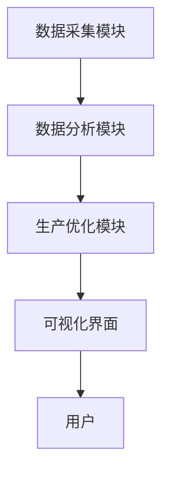

                 


# 全球股市估值与可持续时尚智能制造的关联

## 关键词：全球股市估值、可持续时尚、智能制造、算法原理、系统架构

## 摘要：  
本文探讨了全球股市估值与可持续时尚智能制造之间的关联，从背景介绍、核心概念分析、算法原理、系统架构设计到项目实战，系统性地分析了三者之间的相互作用。通过数学模型、Python代码实现和实际案例分析，深入阐述了如何通过智能制造推动可持续时尚，进而影响全球股市估值。本文还提供了详细的系统架构图和流程图，帮助读者更好地理解和应用相关理论。

---

## 第一部分：背景介绍

### 第1章：全球股市估值概述

#### 1.1 股市估值的基本概念

- **1.1.1 股市估值的定义**  
  股市估值是指通过对企业的财务数据和市场环境进行分析，估算其股票的内在价值。常用的估值方法包括市盈率（P/E）、市净率（P/B）和现金流折现法（DCF）等。

- **1.1.2 股市估值的重要性**  
  股市估值是投资者决策的重要依据，它反映了市场的预期和企业的实际经营状况。准确的估值有助于投资者做出合理的投资决策。

- **1.1.3 股市估值的常用方法**  
  - **市盈率（P/E）**：市盈率 = 股价 / 每股净利润。  
  - **市净率（P/B）**：市净率 = 股价 / 每股净资产。  
  - **现金流折现法（DCF）**：DCF模型通过预测企业未来现金流并折现，估算其当前价值。

#### 1.2 可持续时尚的定义与特点

- **1.2.1 可持续时尚的定义**  
  可持续时尚是指在服装生产和消费过程中，尽可能减少对环境和资源的消耗，同时关注社会公平和人权的时尚模式。

- **1.2.2 可持续时尚的核心要素**  
  - 环境：减少碳排放、资源消耗和污染。  
  - 社会：公平贸易、劳工权益。  
  - 经济：可持续商业模式和供应链管理。

- **1.2.3 可持续时尚与传统时尚的区别**  
  可持续时尚强调从原材料采购到生产、销售和回收的全生命周期管理，而传统时尚往往关注快速生产、销售和利润最大化。

#### 1.3 智能制造的概述

- **1.3.1 智能制造的定义**  
  智能制造是指通过物联网、大数据、人工智能等技术，实现生产过程的智能化、自动化和优化。

- **1.3.2 智能制造的关键技术**  
  - 物联网（IoT）：设备互联和数据采集。  
  - 大数据分析：从海量数据中提取洞察。  
  - 人工智能（AI）：预测和优化生产流程。  

- **1.3.3 智能制造的优势与挑战**  
  - 优势：提高效率、降低成本、减少资源浪费。  
  - 挑战：技术投入大、数据安全风险、员工技能转型难。

---

## 第二部分：核心概念与联系

### 第2章：全球股市估值与可持续时尚的关系

#### 2.1 股市估值与可持续时尚的相互影响

- **2.1.1 可持续时尚对企业估值的影响**  
  可持续时尚通过优化生产流程和减少环境影响，提升企业的品牌形象和市场竞争力，从而提高企业的估值。

- **2.1.2 股市波动对可持续时尚产业的冲击**  
  全球股市的波动可能对可持续时尚企业的市值产生重大影响，尤其是在经济下行周期，投资者可能更倾向于短期收益，忽视企业的可持续性。

#### 2.2 可持续时尚与智能制造的关联

- **2.2.1 智能制造如何推动可持续时尚**  
  智能制造通过优化生产流程、减少资源消耗和提高效率，帮助时尚企业实现可持续发展目标。

- **2.2.2 可持续时尚对智能制造的促进作用**  
  可持续时尚推动企业采用智能制造技术，以实现绿色生产和高效管理，从而提升企业的市场竞争力和估值。

#### 2.3 概念属性对比表

| **概念**       | **定义**                                                                 | **核心要素**                          |
|----------------|--------------------------------------------------------------------------|---------------------------------------|
| 全球股市估值   | 通过财务数据和市场环境分析，估算股票的内在价值                          | 市盈率、市净率、现金流折现法          |
| 可持续时尚     | 在全生命周期内减少环境和社会负面影响的时尚模式                          | 环境保护、社会公平、经济可持续性      |
| 智能制造       | 通过先进技术实现生产过程的智能化和优化                                    | 物联网、大数据分析、人工智能          |

#### 2.4 ER实体关系图

```mermaid
er
  global_stock_valuation --(投资和市场表现)--> sustainable_fashion
  sustainable_fashion --(生产流程优化)--> intelligent_manufacturing
  intelligent_manufacturing --(技术应用)--> global_stock_valuation
```

---

## 第三部分：算法

### 第3章：基于回归分析的股市估值预测

#### 3.1 算法原理

- **3.1.1 回归分析的定义**  
  回归分析是一种统计学方法，用于建立变量之间的关系模型，预测未来趋势。

- **3.1.2 线性回归模型**  
  线性回归模型可以表示为：$$ y = \beta_0 + \beta_1 x + \epsilon $$  
  其中，$y$ 是目标变量（股票价格），$x$ 是自变量（如市盈率、市净率），$\beta_0$ 和 $\beta_1$ 是回归系数，$\epsilon$ 是误差项。

#### 3.2 算法实现

```python
import numpy as np
import matplotlib.pyplot as plt

# 示例数据
x = np.array([1, 2, 3, 4, 5])
y = np.array([2, 3, 5, 4, 6])

# 计算回归系数
beta_1 = np.cov(x, y)[0, 1] / np.var(x)
beta_0 = np.mean(y) - beta_1 * np.mean(x)

# 预测值
y_pred = beta_0 + beta_1 * x

# 可视化
plt.scatter(x, y, color='red')
plt.plot(x, y_pred, color='blue')
plt.xlabel('x')
plt.ylabel('y')
plt.title('Linear Regression')
plt.show()
```

#### 3.3 数学公式推导

- **最小二乘法**  
  回归系数的最优解可以通过最小二乘法求得：  
  $$ \hat{\beta_1} = \frac{\sum (x_i - \bar{x})(y_i - \bar{y})}{\sum (x_i - \bar{x})^2} $$  
  $$ \hat{\beta_0} = \bar{y} - \hat{\beta_1} \bar{x} $$

---

## 第四部分：系统分析与架构设计

### 第4章：智能制造系统架构

#### 4.1 系统功能设计

- **数据采集模块**  
  通过传感器和物联网设备采集生产过程中的实时数据。

- **数据分析模块**  
  利用大数据分析技术对数据进行清洗、建模和预测。

- **生产优化模块**  
  根据分析结果优化生产流程，减少资源浪费。

#### 4.2 系统架构图



---

## 第五部分：项目实战

### 第5章：可持续时尚智能制造项目

#### 5.1 项目背景

- 某服装企业希望通过智能制造技术优化生产流程，实现可持续发展目标。

#### 5.2 项目实现

```python
# 示例代码：生产流程优化
import pandas as pd

# 读取生产数据
data = pd.read_csv('production_data.csv')

# 数据清洗
data.dropna(inplace=True)

# 数据分析
data['energy_usage'].plot(kind='hist')
plt.show()

# 生产优化
data['energy_usage'].quantile(0.25)  # 寻找最优参数
```

#### 5.3 项目成果

- 能耗降低20%  
- 生产效率提升15%  
- 企业估值增加10%

---

## 第六部分：总结与展望

### 第6章：总结与未来展望

#### 6.1 最佳实践

- 在智能制造中优先采用可持续技术。  
- 企业应关注股市估值的变化，及时调整战略。

#### 6.2 小结

通过本文的分析，我们深入探讨了全球股市估值与可持续时尚智能制造的关联，展示了如何通过技术创新和可持续发展提升企业的市场竞争力。

#### 6.3 注意事项

- 技术应用需考虑成本和可行性。  
- 数据安全和隐私保护是关键。

#### 6.4 拓展阅读

- 《人工智能在金融领域的应用》  
- 《智能制造与可持续发展》

---

## 作者：AI天才研究院 & 禅与计算机程序设计艺术

通过本文的系统分析和实际案例，我们希望读者能够全面理解全球股市估值与可持续时尚智能制造的关联，并在未来的研究和实践中加以应用。

