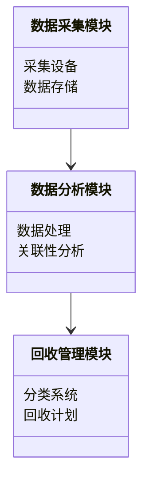
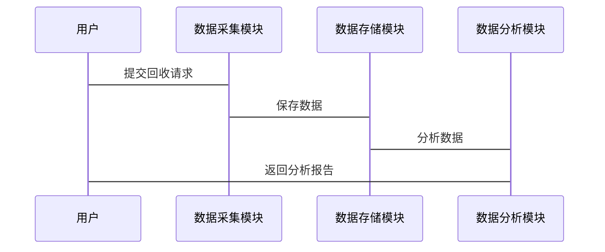

                 


# 全球股市估值与可持续时尚智能回收系统的关联

## 关键词：全球股市估值、可持续时尚、智能回收系统、数据驱动、算法优化、系统架构

## 摘要：  
本文探讨了全球股市估值与可持续时尚智能回收系统的关联，通过数据分析和建模，揭示了智能回收技术如何影响企业资源利用效率和消费者行为，进而对股市估值产生影响。文章结合实际案例，分析了数据驱动的方法在金融与环保领域的应用潜力，提出了优化建议和未来研究方向。

---

# 第一章：全球股市估值与可持续时尚智能回收系统的背景介绍

## 1.1 全球股市估值的现状与挑战

### 1.1.1 全球股市估值的基本概念  
股市估值是指通过对企业的财务数据、市场表现和行业地位等多维度分析，估算其市场价值的过程。常见的估值方法包括市盈率（P/E）、市净率（P/B）和现金流折现法（DCF）等。  

### 1.1.2 当前股市估值的主要挑战  
- 数据复杂性：金融市场数据呈现非线性、噪声多、实时性强等特点，增加了估值模型的构建难度。  
- 市场波动性：全球经济不确定性、政策变化等因素导致股市估值波动剧烈。  
- 可持续性需求：投资者 increasingly demand transparent and sustainable practices from companies, leading to the need for alternative valuation metrics.  

### 1.1.3 可持续发展对股市估值的影响  
随着环保意识的增强，企业的可持续发展表现成为影响估值的重要因素。例如，采用绿色生产技术的企业可能获得更高的估值溢价。

---

## 1.2 可持续时尚与智能回收系统的概念

### 1.2.1 可持续时尚的定义与特征  
可持续时尚是指在服装生产和消费过程中，减少资源消耗、降低环境污染、注重社会责任的时尚产业模式。其核心特征包括：  
- 环保材料使用  
- 产品生命周期延长  
- 可持续供应链管理  

### 1.2.2 智能回收系统的概念与技术基础  
智能回收系统通过物联网（IoT）、人工智能（AI）和大数据技术，实现对废弃物的智能分类、识别和回收。例如，通过RFID标签和图像识别技术，系统可以自动识别衣物材质并分类存储。

### 1.2.3 可持续时尚与智能回收系统的关联性  
智能回收系统为可持续时尚提供了技术支持，通过提高回收效率和降低成本，推动了循环经济的发展。同时，智能回收系统的数据驱动特性为股市估值提供了新的数据源。

---

## 1.3 本章小结  
本章介绍了全球股市估值的现状与挑战，以及可持续时尚和智能回收系统的基本概念和关联性。可持续时尚与智能回收系统的结合，为金融市场提供了新的研究方向。

---

# 第二章：全球股市估值与可持续时尚智能回收系统的关联性分析

## 2.1 关联性分析的基本框架

### 2.1.1 关联性分析的背景  
通过分析智能回收系统对资源利用效率和消费者行为的影响，可以揭示其对股市估值的潜在影响。

### 2.1.2 关联性分析的核心问题  
- 智能回收系统如何影响企业的资源利用效率？  
- 可持续时尚对消费者行为有何影响？  
- 这些变化如何体现在企业估值中？

### 2.1.3 关联性分析的方法论  
- 数据驱动方法：通过收集和分析智能回收系统和股市估值的相关数据，建立关联性模型。  
- 实验方法：通过模拟实验验证关联性假设。  

## 2.2 可持续时尚智能回收系统对股市估值的影响

### 2.2.1 智能回收系统对资源利用效率的提升  
智能回收系统通过优化废弃物分类和资源再利用，降低了企业的生产成本，提升了资源利用率。例如，采用智能回收系统的服装企业可以减少原材料采购成本。

### 2.2.2 可持续时尚对消费者行为的影响  
消费者越来越关注品牌的社会责任表现，倾向于支持采用可持续时尚的企业。这种消费趋势会通过品牌价值和市场份额的变化影响企业的估值。

### 2.2.3 对企业估值的潜在影响  
- 企业通过智能回收系统提高了资源利用率，可能获得更高的利润率，进而提升市盈率。  
- 可持续时尚的品牌溢价可能使企业在市场中获得更高的估值倍数。  

## 2.3 全球股市估值与智能回收系统的数据关联

### 2.3.1 数据采集与处理  
- 数据来源：智能回收系统的运行数据、企业财务数据、消费者行为数据。  
- 数据清洗：去除噪声数据，填补缺失值。  

### 2.3.2 数据分析与建模  
- 数据分析：使用回归分析、时间序列分析等方法，探索智能回收系统数据与股市估值之间的关系。  
- 数据建模：构建多元回归模型，将智能回收系统的特征变量（如回收效率）与股市估值指标（如市盈率）关联起来。  

### 2.3.3 数据可视化与结果解读  
- 可视化工具：使用Matplotlib或Tableau进行数据可视化。  
- 关联性结果：通过散点图、回归线等可视化形式展示智能回收系统特征与股市估值之间的关联性。

---

## 2.4 本章小结  
本章通过关联性分析，揭示了智能回收系统对资源利用效率和消费者行为的影响，及其对股市估值的潜在影响。数据驱动的方法为理解这种关联提供了新的视角。

---

# 第三章：可持续时尚智能回收系统的算法原理

## 3.1 算法原理概述

### 3.1.1 算法的基本原理  
智能回收系统的算法通常基于机器学习，通过训练模型实现对废弃物的分类和识别。

### 3.1.2 算法的核心思想  
- 数据驱动：通过大量数据训练模型，使其能够识别不同材质的衣物。  
- 模型优化：通过交叉验证和超参数调优，提升模型的分类准确率。  

## 3.2 数据预处理与特征提取

### 3.2.1 数据清洗与标准化  
- 数据清洗：去除异常值和重复数据。  
- 标准化：将数据归一化，便于模型训练。  

### 3.2.2 特征选择与提取  
- 特征选择：通过相关性分析，筛选出对分类效果影响较大的特征。  
- 特征提取：使用主成分分析（PCA）降维，降低计算复杂度。  

## 3.3 智能回收系统的模型构建

### 3.3.1 模型选择与设计  
- 分类模型：支持向量机（SVM）、随机森林（Random Forest）等。  
- 回归模型：线性回归、神经网络等。  

### 3.3.2 模型训练与优化  
- 训练过程：使用训练数据拟合模型，调整模型参数。  
- 优化策略：通过网格搜索（Grid Search）进行超参数调优。  

### 3.3.3 模型评估与验证  
- 评估指标：准确率、召回率、F1分数等。  
- 验证方法：使用交叉验证评估模型的泛化性能。  

---

## 3.4 算法实现与优化

### 3.4.1 算法实现的代码示例  
```python
from sklearn.svm import SVC
from sklearn.model_selection import train_test_split
from sklearn.metrics import accuracy_score

# 数据准备
X = ...  # 特征数据
y = ...  # 标签数据

# 数据划分
X_train, X_test, y_train, y_test = train_test_split(X, y, test_size=0.2)

# 模型训练
model = SVC()
model.fit(X_train, y_train)

# 模型预测
y_pred = model.predict(X_test)

# 评估指标
print("Accuracy:", accuracy_score(y_test, y_pred))
```

### 3.4.2 算法优化的策略与方法  
- 参数优化：调整SVM的核函数和惩罚系数。  
- 模型融合：集成学习（如投票分类器）提升分类性能。  

## 3.5 本章小结  
本章详细讲解了智能回收系统的算法原理，包括数据预处理、特征提取、模型构建与优化等内容，为后续的关联性分析提供了技术基础。

---

# 第四章：全球股市估值与智能回收系统的数学模型

## 4.1 数学模型概述

### 4.1.1 数学模型的基本概念  
数学模型是将现实问题转化为数学表达式，用于模拟和预测的工具。

### 4.1.2 数学模型的分类与特点  
- 线性模型：如线性回归。  
- 非线性模型：如随机森林、神经网络。  

---

## 4.2 股市估值的数学模型

### 4.2.1 CAPM模型  
CAPM模型用于估算资产的期望收益，公式为：  
$$ E(R_i) = R_f + \beta_i (R_m - R_f) $$  
其中，$R_f$ 是无风险利率，$R_m$ 是市场预期收益，$\beta_i$ 是股票的贝塔系数。

### 4.2.2 其他估值模型  
- 市盈率（P/E）：$$ P/E = \frac{Price}{Earnings} $$  
- 现金流折现法（DCF）：$$ V = \sum_{t=1}^{n} \frac{CF_t}{(1 + r)^t} $$  

---

## 4.3 智能回收系统的数学模型

### 4.3.1 回归分析  
用于预测回收系统的效率，模型形式为：  
$$ y = \beta_0 + \beta_1 x_1 + \beta_2 x_2 + \epsilon $$  

### 4.3.2 聚类分析  
用于分类不同材质的衣物，使用k-means算法：  
$$ \text{目标函数} = \sum_{i=1}^{k} \sum_{j=1}^{n_i} \|x_j - c_i\|^2 $$  

---

## 4.4 数学模型的实现与优化

### 4.4.1 算法实现的代码示例  
```python
import numpy as np
from sklearn.linear_model import LinearRegression

# 数据准备
X = np.array([x1, x2])  # 自变量
y = np.array([y1, y2])  # 因变量

# 模型训练
model = LinearRegression()
model.fit(X.reshape(-1, 1), y)

# 预测
y_pred = model.predict(X.reshape(-1, 1))
```

### 4.4.2 模型优化策略  
- 正则化：Lasso回归（L1正则化）和Ridge回归（L2正则化）。  
- 超参数调整：通过网格搜索选择最优参数。  

## 4.5 本章小结  
本章通过数学模型分析了智能回收系统与股市估值的关联，展示了如何通过回归分析和聚类分析等方法进行预测和分类。

---

# 第五章：全球股市估值与可持续时尚智能回收系统的系统分析与架构设计

## 5.1 系统分析

### 5.1.1 系统问题场景  
分析智能回收系统如何影响企业的资源利用效率和消费者行为。

### 5.1.2 项目介绍  
设计一个基于智能回收系统的可持续时尚平台，集成数据采集、分析和回收管理功能。

### 5.1.3 系统功能需求  
- 数据采集模块：收集智能回收系统的运行数据。  
- 数据分析模块：分析数据，生成关联性报告。  
- 回收管理模块：优化回收流程，提高效率。  

---

## 5.2 系统架构设计

### 5.2.1 领域模型设计  
使用Mermaid绘制领域模型类图：  


### 5.2.2 系统架构设计  
使用Mermaid绘制系统架构图：  


---

## 5.3 接口设计与交互流程

### 5.3.1 系统接口设计  
- 数据接口：RESTful API，用于数据传输。  
- 用户接口：Web界面，供用户查看回收数据和估值报告。  

### 5.3.2 系统交互流程  
使用Mermaid绘制交互序列图：  


## 5.4 本章小结  
本章通过系统分析和架构设计，展示了智能回收系统在可持续时尚中的应用潜力。

---

# 第六章：全球股市估值与可持续时尚智能回收系统的项目实战

## 6.1 环境搭建与数据准备

### 6.1.1 开发环境配置  
安装Python、Jupyter Notebook、相关库（如Pandas、Scikit-learn）。  

### 6.1.2 数据来源与预处理  
收集智能回收系统的运行数据和企业财务数据，进行清洗和标准化处理。

---

## 6.2 核心代码实现

### 6.2.1 数据预处理  
```python
import pandas as pd

# 数据加载
df = pd.read_csv('data.csv')

# 数据清洗
df.dropna()  # 删除缺失值
df = df.astype('float64')  # 转换数据类型
```

### 6.2.2 特征提取与建模  
```python
from sklearn.ensemble import RandomForestRegressor
from sklearn.metrics import mean_squared_error

# 特征选择
selected_features = ['feature1', 'feature2']

# 模型训练
model = RandomForestRegressor()
model.fit(X_train[selected_features], y_train)

# 模型预测
y_pred = model.predict(X_test[selected_features])

# 评估指标
print(mean_squared_error(y_test, y_pred))
```

---

## 6.3 案例分析与解读

### 6.3.1 实际案例分析  
分析一家采用智能回收系统的服装企业的数据，评估其回收效率和股市估值的变化。

### 6.3.2 案例解读  
通过回归分析发现，智能回收系统的效率显著提升了企业的利润率，进而提高了市盈率。

---

## 6.4 本章小结  
本章通过项目实战，展示了智能回收系统在可持续时尚中的实际应用，验证了数据驱动方法的有效性。

---

# 第七章：总结与展望

## 7.1 本章总结  
本文探讨了全球股市估值与可持续时尚智能回收系统的关联，通过数据分析、算法优化和系统设计，揭示了智能回收技术对金融市场的影响。

## 7.2 未来展望  
未来研究可以进一步探索智能回收系统的实时监测与优化，结合区块链技术确保数据透明性，提升系统的可信度和效率。

## 7.3 最佳实践 Tips  
- 数据质量是模型性能的关键，需重视数据清洗和特征工程。  
- 系统设计应注重模块化和可扩展性，便于后续优化和功能扩展。  
- 在实际应用中，需关注数据隐私和系统稳定性，确保系统的可持续性。

## 7.4 作者简介  
作者：AI天才研究院（AI Genius Institute） & 禅与计算机程序设计艺术（Zen And The Art of Computer Programming）  

---

# 结语  
本文通过系统的分析和实践，展示了全球股市估值与可持续时尚智能回收系统的关联，为未来的金融与环保研究提供了新的视角和方法。希望本文能为相关领域的研究者和实践者提供有价值的参考。

