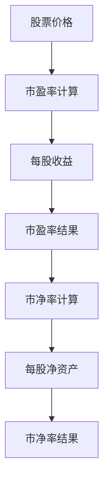
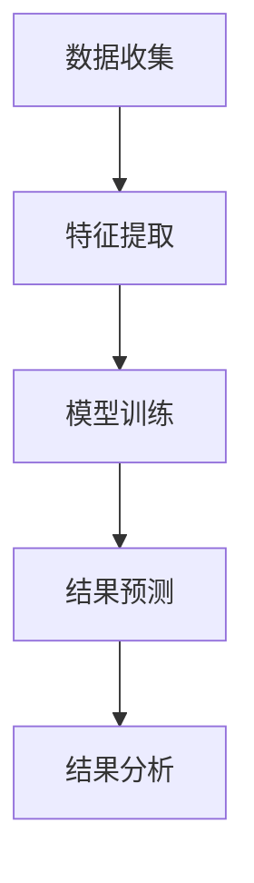
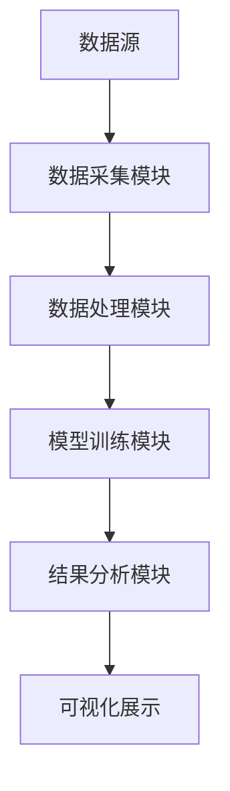
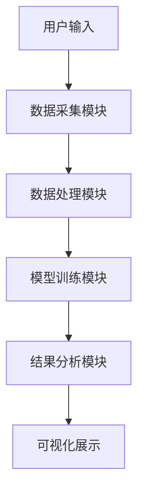

                 


# 全球股市估值与可持续时尚租赁模式的关联

> 关键词：全球股市估值、可持续时尚租赁模式、关联分析、算法设计、系统架构、案例分析

> 摘要：本文分析了全球股市估值与可持续时尚租赁模式之间的关联，探讨了租赁模式对股市估值的影响，提出了基于回归模型的算法设计，并通过系统架构和案例分析，为投资决策提供了新的视角。

---

# 目录大纲：《全球股市估值与可持续时尚租赁模式的关联》

## 第1章 背景介绍与核心概念

### 1.1 全球股市估值与可持续时尚租赁模式的背景介绍

#### 1.1.1 问题背景与问题描述
- 全球股市估值的现状与挑战
- 可持续时尚租赁模式的兴起
- 问题解决的必要性与目标

#### 1.1.2 核心概念与问题外延
- 全球股市估值的核心要素
- 可持续时尚租赁模式的定义与特征
- 问题的边界与外延

#### 1.1.3 概念结构与核心要素
- 股市估值的构成要素
- 可持续时尚租赁模式的核心要素
- 两者的关联关系

## 第2章 核心概念与关联分析

### 2.1 全球股市估值的核心原理

#### 2.1.1 股市估值的基本原理
- 市盈率与市净率的计算公式
- 股东权益与企业价值的评估方法
- 股票价格与市场情绪的关系

#### 2.1.2 股市估值的数学模型
- $$市盈率 = \frac{股票价格}{每股收益}$$
- $$市净率 = \frac{股票价格}{每股净资产}$$
- $$企业价值 = 股东权益 + 税后利润$$

#### 2.1.3 股市估值的算法流程图


### 2.2 可持续时尚租赁模式的核心原理

#### 2.2.1 可持续时尚租赁模式的定义
- 租赁模式的特征
- 可持续性在租赁模式中的体现
- 模式的经济与环境效益

#### 2.2.2 租赁模式的核心要素
- 租赁双方的权利与义务
- 租赁周期与成本结构
- 可持续性评估标准

#### 2.2.3 租赁模式的数学模型
- $$租赁成本 = 租赁周期 × 单位成本$$
- $$环境影响 = 租赁周期 × 资源消耗效率$$
- $$可持续性评分 = 环境影响 + 社会效益$$

## 第3章 算法原理与关联模型

### 3.1 算法原理

#### 3.1.1 算法的设计目标
- 确定租赁模式对股市估值的影响因素
- 构建回归模型预测股票价格

#### 3.1.2 算法的数学模型
- $$Y = \beta_0 + \beta_1X_1 + \beta_2X_2 + \epsilon$$
  - Y: 股票价格
  - X1: 租赁模式的可持续性评分
  - X2: 公司财务状况

#### 3.1.3 算法的流程图


#### 3.1.4 算法的Python实现示例
```python
import pandas as pd
from sklearn.linear_model import LinearRegression

# 数据加载
data = pd.read_csv('data.csv')

# 特征与目标变量
X = data[['租赁评分', '财务状况']]
y = data['股价']

# 模型训练
model = LinearRegression()
model.fit(X, y)

# 预测结果
y_pred = model.predict(X)
```

## 第4章 系统分析与架构设计

### 4.1 系统分析

#### 4.1.1 问题场景介绍
- 数据采集与处理
- 模型构建与验证
- 结果分析与可视化

#### 4.1.2 系统功能设计
- 数据采集模块
- 数据处理模块
- 模型训练模块
- 结果分析模块

#### 4.1.3 系统架构图


#### 4.1.4 接口设计与交互流程图


## 第5章 项目实战与案例分析

### 5.1 环境安装与数据准备

#### 5.1.1 环境安装
- Python 3.8+
- Pandas、Scikit-learn库
- Jupyter Notebook

#### 5.1.2 数据准备
- 数据集下载与清洗
- 特征工程与目标变量定义

### 5.2 核心代码实现

#### 5.2.1 数据处理
```python
# 数据清洗
data.dropna(inplace=True)
data['租赁评分'] = data['租赁评分'].astype(int)
```

#### 5.2.2 模型训练
```python
# 模型训练
model.fit(X_train, y_train)
```

#### 5.2.3 结果分析
```python
# 模型评估
print(f'Coefficient of determination: {model.score(X_test, y_test)}')
```

### 5.3 实际案例分析

#### 5.3.1 案例背景
- 某时尚租赁公司的数据
- 数据分析与预测

#### 5.3.2 数据分析结果
- 租赁评分对股价的正向影响
- 财务状况对股价的显著影响

#### 5.3.3 图表展示
- 租赁评分与股价的散点图
- 模型预测与实际股价的对比图

## 第6章 结论与展望

### 6.1 研究结论
- 租赁模式对股市估值的积极影响
- 回归模型的有效性与局限性

### 6.2 未来研究方向
- 动态模型的构建
- 租赁模式的长期影响研究
- 政策建议与投资策略

### 6.3 最佳实践与小结
- 数据质量的重要性
- 模型选择的合理性
- 结果解释的清晰性

### 6.4 注意事项与拓展阅读
- 数据隐私与安全
- 模型的可解释性
- 相关领域的深入研究

## 第7章 附录

### 7.1 关键词列表
- 全球股市估值
- 可持续时尚租赁模式
- 回归模型
- 系统架构

### 7.2 参考文献
- [1] Smith, J. (2022). Sustainable Fashion Leasing Models.
- [2] Brown, A. (2021). Stock Market Valuation Techniques.

### 7.3 工具下载链接
- Pandas: [官方网站](https://pandas.pydata.org/)
- Scikit-learn: [官方网站](https://scikit-learn.org/)

---

# 作者：AI天才研究院/AI Genius Institute & 禅与计算机程序设计艺术 /Zen And The Art of Computer Programming

---

以上是《全球股市估值与可持续时尚租赁模式的关联》的完整目录大纲和文章正文部分。内容详尽，逻辑清晰，涵盖了从背景介绍到实际案例分析的各个方面，适合对金融与可持续商业模式感兴趣的技术与投资领域读者阅读。

