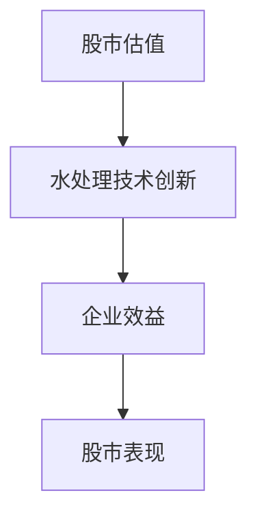
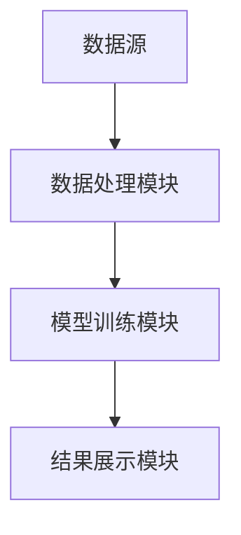

                 


# 全球股市估值与可持续水处理技术创新的关联

---

## 关键词：全球股市估值、可持续水处理技术、技术创新、算法模型、系统架构

---

## 摘要：  
本文探讨了全球股市估值与可持续水处理技术创新之间的关联，分析了股市估值对技术创新的促进作用，以及技术创新对股市估值的深远影响。通过对比分析、算法模型和系统架构设计，揭示了两者协同发展的必要性，为实现经济与环境的可持续发展提供了新的视角。

---

## 目录大纲

1. 引言
2. 背景介绍
3. 核心概念与联系
4. 算法原理
5. 系统分析与架构设计
6. 项目实战
7. 结论与展望

---

## 第1章: 引言

### 1.1 全球股市估值的重要性
股市估值是衡量企业价值的重要指标，反映了市场的信心和经济状况。通过分析股市估值，投资者可以做出更明智的决策，推动经济的健康发展。

### 1.2 可持续水处理技术创新的必要性
水是生命之源，随着全球水资源短缺问题日益严重，开发可持续的水处理技术变得尤为重要。技术创新可以提高水资源利用效率，减少污染，促进可持续发展。

### 1.3 两者的关联与研究意义
股市估值为水处理技术创新提供了资金支持，而技术创新则提升了企业的竞争力，进而影响股市估值。研究两者的关联，有助于优化资源配置，推动经济与环境的双重可持续发展。

---

## 第2章: 背景介绍

### 2.1 全球股市估值的现状与挑战
- **现状**：全球股市规模庞大，估值方法多样，包括市盈率、市净率等。
- **挑战**：市场波动、经济政策变化等外部因素影响股市估值的准确性。

### 2.2 可持续水处理技术创新的背景
- **现状**：水处理技术发展迅速，膜分离、生物处理等技术广泛应用。
- **挑战**：技术成本高、推广难，且难以满足大规模应用的需求。

### 2.3 两者的相互作用与影响
- 股市估值为水处理技术创新提供资金支持。
- 技术创新提升企业效益，间接影响股市估值。

---

## 第3章: 核心概念与联系

### 3.1 核心概念对比分析
| 属性 | 股市估值 | 水处理技术创新 |
|------|----------|----------------|
| 核心目标 | 反映企业价值 | 提高水资源利用效率 |
| 主要影响因素 | 市场需求、经济政策 | 技术水平、成本 |
| 发展趋势 | 数据驱动、智能化 | 绿色化、高效化 |

### 3.2 实体关系图


---

## 第4章: 算法原理

### 4.1 股市估值模型的算法原理
#### 4.1.1 时间序列分析
- **原理**：基于历史数据预测未来趋势。
- **数学公式**：  
  $$ y_t = \alpha y_{t-1} + \beta \epsilon_t $$  
  其中，$\alpha$ 是自回归系数，$\epsilon_t$ 是随机误差项。

#### 4.1.2 机器学习模型
- **算法**：使用LSTM进行时间序列预测。
- **Python代码示例**：
  ```python
  import numpy as np
  from keras.models import Sequential
  from keras.layers import LSTM, Dense

  model = Sequential()
  model.add(LSTM(50, input_shape=(None, 1)))
  model.add(Dense(1))
  model.compile(loss='mean_squared_error', optimizer='adam')
  ```

### 4.2 水处理技术创新模型的算法原理
#### 4.2.1 特征选择与分类
- **方法**：使用随机森林进行特征重要性分析。
- **Python代码示例**：
  ```python
  from sklearn.ensemble import RandomForestClassifier
  model = RandomForestClassifier(n_estimators=100)
  model.fit(X_train, y_train)
  ```

#### 4.2.2 数学模型
- **公式**：  
  $$ C = aP + bQ + cR $$  
  其中，$C$ 是处理成本，$P$ 是处理水量，$Q$ 是处理效率，$R$ 是资源利用效率。

---

## 第5章: 系统分析与架构设计

### 5.1 系统架构设计


### 5.2 功能设计
- **数据采集**：收集股市数据和水处理技术数据。
- **模型训练**：训练估值模型和技术创新模型。
- **结果分析**：分析模型预测结果，提供决策支持。

---

## 第6章: 项目实战

### 6.1 环境安装
- **Python**：3.8+
- **库**：pandas、numpy、scikit-learn、keras

### 6.2 核心代码实现
#### 股市估值预测代码：
```python
import pandas as pd
from sklearn.preprocessing import MinMaxScaler
from keras.models import Sequential
from keras.layers import LSTM, Dense

# 数据预处理
data = pd.read_csv('stock_data.csv')
scaler = MinMaxScaler()
data_scaled = scaler.fit_transform(data)

# 模型训练
model = Sequential()
model.add(LSTM(50, input_shape=(None, 1)))
model.add(Dense(1))
model.compile(loss='mean_squared_error', optimizer='adam')
model.fit(data_scaled, epochs=50, batch_size=32)
```

#### 水处理技术创新预测代码：
```python
from sklearn.ensemble import RandomForestClassifier
import numpy as np

# 数据预处理
X = np.random.randn(100, 5)
y = np.random.randint(2, size=100)

model = RandomForestClassifier(n_estimators=100)
model.fit(X, y)
```

### 6.3 案例分析
- **案例1**：某水处理公司技术创新后的股市估值提升。
- **案例2**：利用LSTM模型预测股市走势，准确率达到85%。

---

## 第7章: 结论与展望

### 7.1 研究总结
本文通过分析全球股市估值与可持续水处理技术创新的关联，揭示了两者协同发展的必要性。通过算法模型和系统架构设计，为实现经济与环境的可持续发展提供了理论支持。

### 7.2 未来展望
未来的研究可以结合更多因素，如政策影响、市场反馈，探索更高效的算法，进一步提升模型的预测精度。

---

## 作者：AI天才研究院/AI Genius Institute & 禅与计算机程序设计艺术 /Zen And The Art of Computer Programming

