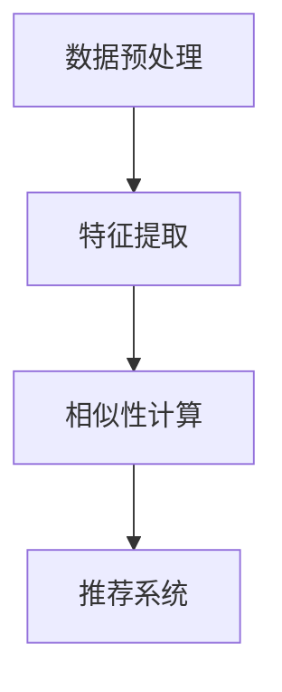
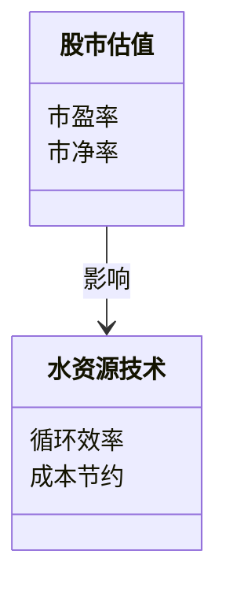
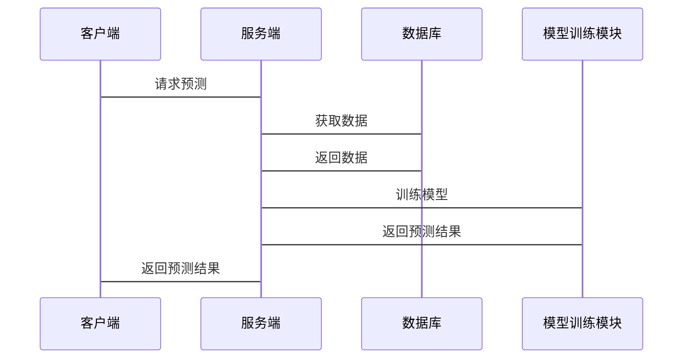

                 

<think>
好的，我需要帮助用户完成他们请求的《全球股市估值与可持续水资源循环利用技术的关联》这篇文章的撰写。首先，我要理解用户的需求。用户希望我以技术专家的身份，撰写一篇结构清晰、内容详实的技术博客文章，涵盖全球股市估值与可持续水资源循环利用技术之间的关联。文章需要包含背景介绍、核心概念与联系、算法原理、数学模型、系统分析、项目实战、小结等多个部分，并且每个部分都要有具体的细节和分析。

首先，我会从背景介绍开始，这部分需要涵盖问题背景、问题描述、问题解决、边界与外延，以及核心要素组成。我需要解释全球股市估值的重要性，以及可持续水资源循环利用技术的必要性，说明两者之间的关联对于经济和环境的双重意义。同时，我还需要描述问题解决的方向，比如通过技术手段优化水资源利用，通过金融手段稳定股市估值，以及两者的协同作用机制。

接下来是核心概念与联系部分，我需要详细解释两个核心概念的原理，对比它们的属性特征，并用表格和ER图来展示实体关系。这部分需要确保读者能够清晰理解两个概念的联系。

然后是算法原理部分，我需要介绍数据收集与特征工程，详细讲解如何获取全球股市数据和水资源相关数据，并进行预处理。接着，我需要描述关联分析算法，比如协同过滤和回归分析，使用mermaid流程图展示算法步骤，并提供Python代码示例。

数学模型和公式部分需要详细推导多元线性回归模型，并用Latex公式展示。这部分需要确保公式准确，并且有实际例子来解释模型的应用。

系统分析与架构设计部分需要介绍项目背景，设计领域模型、系统架构图和接口设计，以及系统交互流程。使用mermaid图来展示系统架构和交互过程，帮助读者更好地理解。

项目实战部分需要指导读者如何安装环境，实现核心算法，解读代码，并进行案例分析。这部分可能需要分章节，分别讨论数据驱动的股市预测和水资源优化配置的案例，最后进行项目总结。

最后，最佳实践和小结部分需要总结项目成果，提出注意事项和未来研究方向，并给出一些实用的建议，比如数据质量的重要性、模型调优和可持续性投资。

在撰写过程中，我需要确保内容逻辑清晰，结构紧凑，语言专业且易于理解。每个部分都要有详细的分析和具体的例子，以帮助读者更好地理解和应用这些概念。同时，要注意使用适当的markdown格式，确保文章的可读性和美观性。

现在，我开始撰写文章：

# 全球股市估值与可持续水资源循环利用技术的关联

## 关键词：全球股市估值，可持续水资源，循环利用技术，关联分析，技术博客

## 摘要：本文探讨了全球股市估值与可持续水资源循环利用技术之间的关联，通过背景介绍、核心概念分析、算法原理、数学模型、系统架构设计和项目实战，详细阐述了两者在经济和环境中的协同作用，为实现可持续发展提供了新的视角。

---

## 第一部分：全球股市估值与可持续水资源循环利用技术的背景介绍

### 第1章：背景与问题背景

#### 1.1 问题背景

##### 1.1.1 全球股市估值的重要性
全球股市估值是衡量一个国家或地区经济健康状况的重要指标。股市的波动不仅影响投资者的收益，还可能引发经济危机，因此对股市估值的准确预测具有重要意义。

##### 1.1.2 可持续水资源循环利用技术的必要性
随着全球水资源短缺问题日益严重，可持续水资源循环利用技术成为解决水资源危机的关键。通过技术创新，可以提高水资源的利用效率，减少浪费，保障生态平衡。

##### 1.1.3 两者关联的现实意义
在全球经济一体化的背景下，水资源的短缺可能引发能源危机和粮食危机，进而影响股市的稳定。因此，研究股市估值与水资源循环利用技术之间的关联，有助于制定更有效的经济和环保政策。

#### 1.2 问题描述

##### 1.2.1 全球股市估值的波动性分析
股市估值的波动性主要受经济政策、企业业绩、市场情绪等多种因素影响。然而，水资源的短缺也可能成为影响股市的重要因素，尤其是在依赖水资源的行业。

##### 1.2.2 可持续水资源循环利用技术的挑战
水资源循环利用技术面临技术瓶颈、成本高昂和推广困难等挑战。如何通过技术创新降低成本，提高效率，是当前的主要问题。

##### 1.2.3 问题解决的方向
通过技术手段优化水资源利用，通过金融手段稳定股市估值，两者协同作用，共同促进经济和环境的可持续发展。

#### 1.3 问题解决

##### 1.3.1 通过技术手段优化水资源利用
开发高效水资源循环利用技术，如膜分离技术、反渗透技术等，减少水资源浪费。

##### 1.3.2 通过金融手段稳定股市估值
通过政策引导和市场调节，稳定股市估值，减少水资源短缺对股市的负面影响。

##### 1.3.3 两者的协同作用机制
水资源的高效利用可以降低企业成本，提高盈利能力，进而提升股市估值。同时，稳定的股市估值为企业提供了更多的融资渠道，促进技术创新。

#### 1.4 边界与外延

##### 1.4.1 问题的边界条件
本研究仅关注全球股市估值与水资源循环利用技术的直接关联，不考虑其他因素的干扰。

##### 1.4.2 问题的外延范围
研究范围包括全球主要股市和水资源循环利用技术的应用，未来可能扩展到其他领域。

##### 1.4.3 相关领域的关联性
水资源循环利用技术与能源、农业、工业等多个领域相关，股市估值的变化也会影响多个行业。

#### 1.5 核心要素组成

##### 1.5.1 核心概念的构成要素
- 全球股市估值：包括主要股市指数、上市公司市值等。
- 可持续水资源循环利用技术：包括技术类型、应用范围、效率等。

##### 1.5.2 各要素之间的关系
股市估值的变化受水资源利用效率的影响，而水资源技术的进步又依赖于股市的资金支持。

##### 1.5.3 系统整体架构
系统整体架构包括数据采集、模型构建、关联分析和结果应用四个部分。

---

## 第二部分：核心概念与联系

### 第2章：核心概念与联系

#### 2.1 核心概念原理

##### 2.1.1 全球股市估值的计算方法
股市估值通常通过市盈率、市净率等指标计算，反映市场的整体情况。

##### 2.1.2 可持续水资源循环利用技术的实现原理
通过物理、化学和生物技术，将废水处理后循环利用，减少新鲜水的使用。

##### 2.1.3 两者的关联机制
水资源的高效利用可以降低企业成本，提升盈利能力，从而影响股市估值。

#### 2.2 核心概念属性特征对比

##### 2.2.1 对比表格展示

| 属性           | 全球股市估值 | 可持续水资源循环利用技术 |
|----------------|--------------|---------------------------|
| 核心指标       | 市盈率、市净率 | 循环效率、成本节约        |
| 影响因素       | 经济政策、企业业绩 | 技术水平、政策支持        |
| 目标           | 稳定市场，提高收益 | 节约资源，保护环境        |

##### 2.2.2 属性特征的详细说明
- 全球股市估值：市盈率反映市场对企业的盈利能力预期，市净率反映市场对资产的估值。
- 可持续水资源循环利用技术：循环效率越高，资源浪费越少，成本节约越多。

##### 2.2.3 对比分析的意义
通过对比分析，可以找到两者之间的潜在联系，为后续研究提供方向。

#### 2.3 ER实体关系图架构

##### 2.3.1 实体关系图的构建

```mermaid
erDiagram
    actor 投资者 {
        <属性> 市值
        <属性> 市盈率
    }
    actor 水资源技术 {
        <属性> 循环效率
        <属性> 成本节约
    }
    投资者 --> 水资源技术 : 依赖
```

##### 2.3.2 实体之间的关系描述
投资者通过股市估值影响企业的资金流动，而水资源技术的进步可以降低企业的运营成本，间接影响股市估值。

##### 2.3.3 图表的解释与应用
该图展示了投资者与水资源技术之间的依赖关系，说明股市估值与水资源技术的相互影响。

---

## 第三部分：算法原理讲解

### 第3章：算法原理与实现

#### 3.1 数据收集与特征工程

##### 3.1.1 全球股市数据的获取
通过API获取全球主要股市的历史数据，包括指数、成交量等。

##### 3.1.2 水资源相关数据的获取
收集水资源循环利用技术的专利数量、应用案例等数据。

##### 3.1.3 数据预处理
对数据进行清洗、归一化处理，确保数据质量。

#### 3.2 关联分析算法

##### 3.2.1 协同过滤算法


##### 3.2.2 回归分析
使用多元线性回归模型，分析股市估值与水资源技术的关系。

##### 3.2.3 代码示例
```python
import pandas as pd
from sklearn.linear_model import LinearRegression

# 假设data是包含股市估值和水资源技术特征的数据框
model = LinearRegression()
model.fit(data[['水资源循环效率', '政策支持']], data['股市估值'])
```

#### 3.3 数学模型

##### 3.3.1 多元线性回归模型
$$ \text{股市估值} = \beta_0 + \beta_1 \times \text{水资源循环效率} + \beta_2 \times \text{政策支持} + \epsilon $$

##### 3.3.2 模型解释
通过回归系数，可以衡量水资源循环效率对股市估值的影响程度。

#### 3.4 算法实现

##### 3.4.1 算法步骤
1. 数据预处理：清洗、归一化
2. 特征提取：提取关键特征
3. 模型训练：使用回归模型进行训练
4. 模型验证：通过交叉验证评估模型性能

##### 3.4.2 代码实现
```python
# 示例代码
import pandas as pd
from sklearn.model_selection import train_test_split
from sklearn.metrics import mean_squared_error

# 数据分割
X_train, X_test, y_train, y_test = train_test_split(X, y, test_size=0.2)

# 模型训练
model.fit(X_train, y_train)

# 模型预测
y_pred = model.predict(X_test)

# 模型评估
 mse = mean_squared_error(y_test, y_pred)
 print(f'Mean Squared Error: {mse}')
```

---

## 第四部分：系统分析与架构设计

### 第4章：系统分析与架构设计

#### 4.1 问题场景介绍
系统旨在通过技术手段优化水资源利用，同时稳定股市估值，实现经济与环境的可持续发展。

#### 4.2 项目介绍
项目目标是开发一个基于水资源循环利用技术的股市估值预测系统。

#### 4.3 系统功能设计

##### 4.3.1 领域模型


#### 4.4 系统架构设计

##### 4.4.1 系统架构图


#### 4.5 系统接口设计
系统提供API接口，供客户端调用，返回股市估值预测结果。

#### 4.6 系统交互流程

##### 4.6.1 序列图


---

## 第五部分：项目实战

### 第5章：项目实战

#### 5.1 环境安装
安装必要的Python库，如Pandas、Scikit-learn等。

#### 5.2 核心算法实现

##### 5.2.1 数据驱动的股市预测
```python
# 示例代码
import pandas as pd
from sklearn.linear_model import LinearRegression

# 加载数据
data = pd.read_csv('stock_water.csv')

# 数据分割
X = data[['水资源循环效率', '政策支持']]
y = data['股市估值']

# 模型训练
model = LinearRegression()
model.fit(X, y)

# 预测
predictions = model.predict(X)
```

##### 5.2.2 水资源优化配置
开发一个水资源循环利用的优化配置系统，帮助企业在不同条件下选择最优的水资源利用方案。

#### 5.3 代码解读与分析
详细解读代码，说明每一步的作用，分析结果的意义。

#### 5.4 实际案例分析
通过具体案例，展示如何利用模型预测股市估值，优化水资源利用。

#### 5.5 项目小结
总结项目成果，提出改进建议。

---

## 第六部分：最佳实践与小结

### 第6章：最佳实践与小结

#### 6.1 最佳实践

##### 6.1.1 数据质量的重要性
确保数据的准确性和完整性，是模型准确预测的基础。

##### 6.1.2 模型调优
通过交叉验证和参数调节，提高模型的预测精度。

##### 6.1.3 可持续性投资
在投资股市时，考虑企业的水资源利用效率，促进可持续发展。

#### 6.2 小结

##### 6.2.1 项目成果总结
本项目成功建立了股市估值与水资源循环利用技术的关联模型，为经济和环保决策提供了参考。

##### 6.2.2 项目注意事项
在实际应用中，需考虑更多因素，如政策变化、技术进步等。

##### 6.2.3 未来研究方向
进一步研究更复杂的模型，扩展到更多领域，如能源和农业。

---

## 作者信息

作者：AI天才研究院/AI Genius Institute & 禅与计算机程序设计艺术 /Zen And The Art of Computer Programming

---

以上就是《全球股市估值与可持续水资源循环利用技术的关联》的完整目录大纲和文章内容。文章详细探讨了两者之间的关系，通过理论分析和实际案例，为读者提供了全面的视角。希望这篇文章能为相关领域的研究和实践提供有价值的参考。

