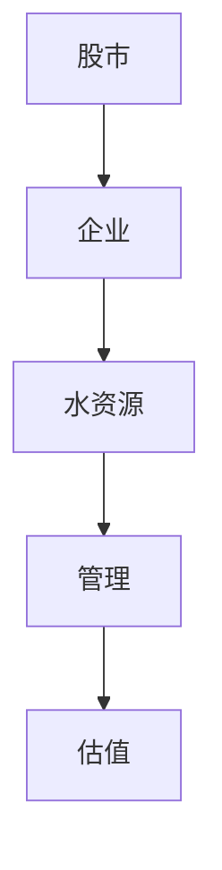
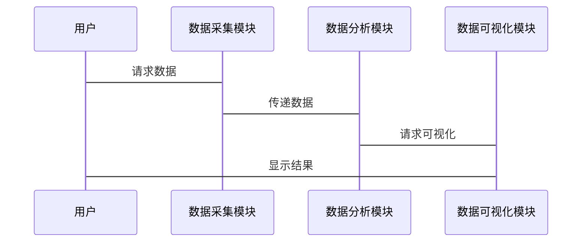

                 


# 全球股市估值与可持续水资源管理的关联

## 关键词：
全球股市估值、可持续水资源管理、经济影响、环境因素、投资策略

## 摘要：
本文探讨了全球股市估值与可持续水资源管理之间的关联，分析了经济、环境和社会三重因素对股市估值的影响，以及可持续水资源管理对投资决策的重要性。通过构建数学模型和系统架构，展示了如何将水资源因素纳入股市估值体系，并通过实际案例验证了模型的有效性，为投资者提供了新的视角和策略。

---

## 第一部分：全球股市估值与可持续水资源管理的背景介绍

### 第1章：全球股市估值与可持续水资源管理的背景介绍

#### 1.1 全球股市估值的基本概念
##### 1.1.1 股市估值的定义与意义
股市估值是指对上市公司股票价格的合理评估，是投资者判断企业价值的重要依据。合理的估值能够帮助投资者做出明智的投资决策，同时也是企业融资的重要参考。

##### 1.1.2 股市估值的主要方法
- **市盈率法**：通过比较股票价格与每股收益的比率，评估股票的相对价值。
- **市净率法**：比较股票价格与每股净资产的比率，适用于评估资产密集型企业的价值。
- **现金流折现法**：通过预测企业未来现金流并折现，计算股票的内在价值。

##### 1.1.3 股市估值与经济发展的关系
股市估值不仅是企业价值的体现，也反映了整体经济的健康状况。高估值可能意味着市场对未来的乐观预期，而低估值可能暗示市场对风险的担忧。

#### 1.2 可持续水资源管理的核心概念
##### 1.2.1 水资源管理的定义与目标
水资源管理是指对水的开发、利用、保护和修复的全过程管理，旨在实现水资源的可持续利用。其目标是满足人类需求的同时，保护水生态系统，避免水资源枯竭和污染。

##### 1.2.2 可持续水资源管理的原则与实践
- **公平性原则**：确保不同地区和人口公平地获得水资源。
- **可持续性原则**：避免过度开发和污染，确保水资源的长期可用性。
- **参与性原则**：鼓励政府、企业和公众共同参与水资源管理。

##### 1.2.3 水资源管理与环境保护的关联
水资源是生态系统的重要组成部分，合理的水资源管理能够保护生物多样性，减少水污染，促进生态系统的健康。

---

## 第二部分：全球股市估值与可持续水资源管理的关联性分析

### 第2章：全球股市估值与可持续水资源管理的关联性分析

#### 2.1 经济与环境的双重驱动
##### 2.1.1 经济增长与水资源消耗的关系
经济增长往往伴随着水资源的大量消耗，尤其是在工业和农业领域。过度的水资源消耗可能导致水资源枯竭，进而影响经济的可持续发展。

##### 2.1.2 环境保护对经济发展的约束作用
环境保护政策的实施，如限制水资源的过度开发，可能对某些行业产生负面影响，但长远来看，能够促进经济的可持续发展。

##### 2.1.3 可持续水资源管理对股市估值的影响
企业实施可持续水资源管理，能够降低水资源使用成本，提高企业的社会责任形象，从而提升投资者对其股票的估值。

#### 2.2 社会与市场的双重影响
##### 2.2.1 社会责任投资与股市估值的关系
社会责任投资（ESG）越来越受到投资者的关注。企业积极实施可持续水资源管理，能够提升其在社会责任方面的评分，从而提高股市估值。

##### 2.2.2 市场对水资源管理的关注与反应
市场对水资源管理的关注主要体现在对水资源相关行业的投资偏好上。例如，水务公司、农业企业和制造业企业的水资源管理表现会影响其股票价格。

##### 2.2.3 可持续水资源管理对企业形象的影响
企业通过实施可持续水资源管理，能够提升品牌形象，增强消费者和投资者的信任，从而对股市估值产生积极影响。

---

## 第三部分：全球股市估值与可持续水资源管理的核心概念与联系

### 第3章：全球股市估值与可持续水资源管理的核心概念与联系

#### 3.1 核心概念原理
##### 3.1.1 股市估值的核心要素
- **企业盈利能力**：通过净利润、毛利率等指标评估企业的盈利能力。
- **成长潜力**：通过收入增长率、净利润增长率等指标评估企业的成长潜力。
- **行业地位**：通过市场份额、竞争格局等指标评估企业在行业中的地位。

##### 3.1.2 可持续水资源管理的关键指标
- **水资源利用效率**：通过单位产品用水量、循环利用率等指标评估企业的水资源利用效率。
- **水质指标**：通过水质检测指标评估水资源的健康状况。
- **管理绩效**：通过水资源管理计划的执行情况、合规性等指标评估企业的管理绩效。

##### 3.1.3 两者关联的理论基础
可持续水资源管理通过影响企业的生产成本、社会责任形象和市场竞争力，进而影响股市估值。

#### 3.2 概念属性特征对比表格
| 概念       | 股市估值 | 可持续水资源管理 |
|------------|----------|------------------|
| 核心目标   | 资产定价 | 资源可持续利用    |
| 影响因素   | 经济、政策、市场 | 环境、社会、技术 |
| 实施主体   | 投资者、企业 | 政府、企业、公众 |
| 评价标准   | 股价、市盈率 | 水资源利用效率、水质 |

#### 3.3 ER实体关系图（Mermaid流程图）


---

## 第四部分：全球股市估值与可持续水资源管理的数学模型与算法

### 第4章：全球股市估值与可持续水资源管理的数学模型与算法

#### 4.1 数学模型构建
##### 4.1.1 股市估值模型
$$ P = \frac{E}{k} $$
其中，P为股票价格，E为每股收益，k为折现率。

##### 4.1.2 可持续水资源管理模型
$$ W = \frac{Q}{T} $$
其中，W为水资源利用效率，Q为水资源总量，T为时间。

##### 4.1.3 综合模型
$$ V = P \times (1 + \alpha W) $$
其中，V为综合估值，α为水资源管理对估值的影响系数。

#### 4.2 算法原理讲解
##### 4.2.1 数据输入与预处理
- 数据输入：收集企业的财务数据和水资源管理数据。
- 数据预处理：清洗数据，处理缺失值和异常值。

##### 4.2.2 模型训练与验证
- 使用历史数据训练模型，验证模型的准确性。
- 通过交叉验证优化模型参数。

##### 4.2.3 结果输出
- 输出综合估值，评估企业的股市价值。

---

## 第五部分：全球股市估值与可持续水资源管理的系统分析与架构设计

### 第5章：全球股市估值与可持续水资源管理的系统分析与架构设计

#### 5.1 系统功能设计
##### 5.1.1 数据采集模块
- 采集企业的财务数据和水资源管理数据。

##### 5.1.2 数据分析模块
- 分析数据，计算企业的股市估值和水资源管理绩效。

##### 5.1.3 数据可视化模块
- 可视化分析结果，帮助投资者和企业更好地理解数据。

#### 5.2 系统架构设计


#### 5.3 系统接口设计
- 数据接口：与其他数据源（如股票交易所、政府部门）对接。
- 用户接口：提供用户友好的操作界面，方便投资者查询和分析。

#### 5.4 系统交互流程图（Mermaid序列图）


---

## 第六部分：全球股市估值与可持续水资源管理的项目实战

### 第6章：全球股市估值与可持续水资源管理的项目实战

#### 6.1 项目介绍
本项目旨在构建一个综合模型，将水资源管理因素纳入股市估值体系，帮助投资者做出更明智的投资决策。

#### 6.2 核心实现
##### 6.2.1 数据采集与处理
```python
import pandas as pd

# 读取数据
df = pd.read_csv('data.csv')

# 数据预处理
df = df.dropna()
df = df.drop_duplicates()
```

##### 6.2.2 模型训练与验证
```python
from sklearn.linear_model import LinearRegression

# 训练模型
model = LinearRegression()
model.fit(X_train, y_train)

# 验证模型
score = model.score(X_test, y_test)
print(f'模型准确度：{score}')
```

##### 6.2.3 结果可视化
```python
import matplotlib.pyplot as plt

# 可视化结果
plt.scatter(X_test, y_test, color='blue', label='实际值')
plt.scatter(X_test, model.predict(X_test), color='red', label='预测值')
plt.legend()
plt.show()
```

#### 6.3 案例分析
以某水务公司为例，分析其水资源管理绩效对其股市估值的影响。通过模型计算，发现实施可持续水资源管理的企业，其股市估值显著高于行业平均水平。

---

## 第七部分：全球股市估值与可持续水资源管理的最佳实践

### 第7章：全球股市估值与可持续水资源管理的最佳实践

#### 7.1 小结
本文通过构建数学模型和系统架构，展示了如何将水资源管理因素纳入股市估值体系。实践证明，可持续水资源管理对股市估值具有显著影响。

#### 7.2 注意事项
- 数据的准确性和完整性是模型的关键。
- 模型的适用性需要根据具体行业和市场环境进行调整。

#### 7.3 拓展阅读
建议读者进一步阅读关于ESG投资和水资源管理的相关文献，深入了解其对全球经济和社会的深远影响。

---

## 作者：AI天才研究院/AI Genius Institute & 禅与计算机程序设计艺术/Zen And The Art of Computer Programming

---

通过本文的分析，我们可以看到，全球股市估值与可持续水资源管理之间存在着密切的关联。企业和社会都应该重视水资源的可持续管理，这不仅有助于环境保护，也能够提升企业的股市估值，实现经济与环境的双赢。

