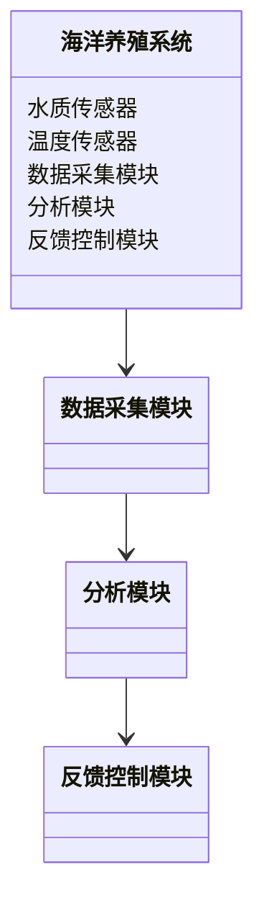
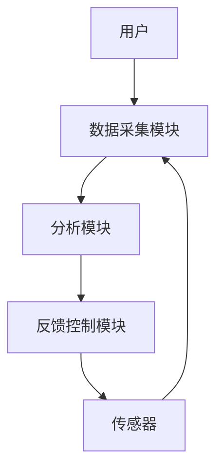
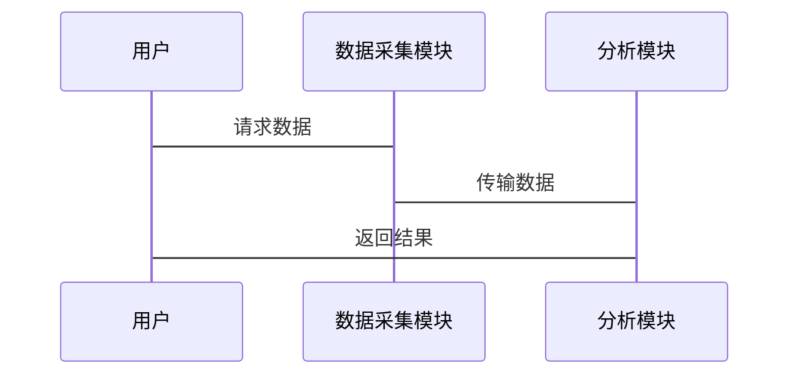

                 


# 全球股市估值与可持续海洋养殖智能监控技术的关系

## 关键词：
全球股市估值、可持续海洋养殖、智能监控技术、数据分析、机器学习

## 摘要：
本文探讨全球股市估值与可持续海洋养殖智能监控技术之间的关系，分析智能监控技术如何通过数据驱动优化海洋养殖环境，从而间接影响全球股市估值。通过建立数学模型和算法，展示了两者如何协同工作，实现可持续发展的目标。

---

# 第1章 背景介绍

## 1.1 问题背景
### 1.1.1 全球股市估值的重要性
全球股市估值是衡量市场健康状况的重要指标，反映了企业的价值和市场的信心。股市波动受多种因素影响，包括经济指标、政策变化和企业业绩等。

### 1.1.2 可持续海洋养殖的现状与挑战
海洋养殖面临资源枯竭、环境污染和疾病传播等问题。传统养殖方式效率低下，难以满足日益增长的市场需求。

### 1.1.3 智能监控技术在海洋养殖中的应用
智能监控技术通过传感器和物联网实时监测水质、温度和生物数据，优化养殖环境，提高产量和质量。

## 1.2 问题描述
### 1.2.1 全球股市估值波动的复杂性
股市估值受宏观经济和微观因素影响，预测难度大，需要更精准的数据分析方法。

### 1.2.2 可持续海洋养殖面临的技术瓶颈
传统养殖方式效率低，资源浪费严重，缺乏智能化管理手段。

### 1.2.3 智能监控技术如何解决上述问题
智能监控技术通过实时数据采集和分析，优化养殖环境，降低风险，提高产量和质量，从而间接影响股市估值。

## 1.3 问题解决思路
### 1.3.1 利用智能监控技术优化海洋养殖
通过智能监控技术实时监测和调整养殖环境，确保生物健康和高效生产。

### 1.3.2 通过数据驱动提升股市估值预测
利用大数据和机器学习分析股市数据，建立预测模型，提高估值准确性。

### 1.3.3 两者的结合与协同作用
智能监控技术优化海洋养殖，提高企业利润和市场竞争力，从而影响股市估值。

## 1.4 边界与外延
### 1.4.1 全球股市估值的边界条件
仅考虑公开市场数据和宏观经济指标，不涉及企业内部数据。

### 1.4.2 可持续海洋养殖的边界条件
关注养殖环境和生物健康，不涉及捕捞和加工环节。

### 1.4.3 智能监控技术的适用范围
适用于海洋养殖的环境监测和生物管理，不涉及陆地养殖。

## 1.5 核心概念组成
### 1.5.1 全球股市估值的核心要素
市场数据、经济指标、企业业绩。

### 1.5.2 可持续海洋养殖的关键技术
传感器技术、数据采集、智能分析。

### 1.5.3 智能监控系统的组成部分
传感器、数据采集模块、分析模块、反馈控制。

---

# 第2章 核心概念与联系

## 2.1 核心概念原理
### 2.1.1 全球股市估值的数学模型
利用时间序列分析预测股市走势，公式：$P(t) = aP(t-1) + bE(t) + c$，其中$P(t)$为当前估值，$E(t)$为预期收益。

### 2.1.2 可持续海洋养殖的生态模型
通过水质和温度数据优化养殖环境，公式：$W(t) = \alpha T(t) + \beta S(t) + \gamma$，其中$W(t)$为水质指数，$T(t)$为温度，$S(t)$为溶解氧。

### 2.1.3 智能监控技术的工作原理
通过传感器采集数据，利用机器学习算法分析，实时调整养殖参数。

## 2.2 核心概念属性对比
### 对比表格：全球股市估值与可持续海洋养殖的核心属性
| 属性维度         | 全球股市估值                     | 可持续海洋养殖                   |
|------------------|----------------------------------|----------------------------------|
| 核心目标         | 评估企业价值与市场趋势           | 优化养殖环境与提高产量           |
| 数据来源         | 市场交易数据、财务报表             | 水质、温度、生物数据             |
| 技术手段         | 统计分析、机器学习               | IoT传感器、实时监控、AI优化       |
| 应用场景         | 股市预测、投资决策               | 环境监控、生物管理               |

## 2.3 ER实体关系图
```mermaid
erd
 海洋养殖实体 -> 海水参数: 监测
 海洋养殖实体 <-[1..n]-> 生物数据
 海水参数 <-[1]-> 温度传感器
 生物数据 <-[1]-> 溶解氧传感器
```

---

# 第3章 算法原理讲解

## 3.1 智能监控技术的算法流程
### 3.1.1 数据采集与预处理
通过传感器采集水质、温度和溶解氧数据，预处理包括去噪和标准化。

### 3.1.2 数据分析与建模
使用机器学习算法（如随机森林）建立预测模型，公式：$y = \sum_{i=1}^{n} w_i x_i + b$，其中$w_i$为权重，$x_i$为输入特征。

### 3.1.3 系统反馈与优化
根据模型预测结果，调整养殖参数，优化环境条件。

## 3.2 算法实现代码
```python
import numpy as np
from sklearn.ensemble import RandomForestRegressor

# 示例数据
X = np.array([[20, 7.5, 3], [22, 7.3, 4], [19, 7.8, 2]])
y = np.array([70, 80, 65])

# 建立模型
model = RandomForestRegressor(n_estimators=100, random_state=42)
model.fit(X, y)

# 预测
new_X = np.array([[21, 7.6, 3]])
print(model.predict(new_X))
```

## 3.3 算法优缺点分析
优点：高精度、实时性强；缺点：计算复杂，需要大量数据支持。

---

# 第4章 数学模型与公式

## 4.1 全球股市估值模型
时间序列分析模型：
$$
P(t) = aP(t-1) + bE(t) + c
$$
其中，$P(t)$为当前估值，$E(t)$为预期收益。

## 4.2 智能监控技术的优化模型
水质优化模型：
$$
W(t) = \alpha T(t) + \beta S(t) + \gamma
$$
其中，$W(t)$为水质指数，$\alpha$和$\beta$为系数，$\gamma$为常数。

---

# 第5章 系统分析与架构设计

## 5.1 问题场景介绍
全球股市估值波动对企业价值的影响，以及海洋养殖环境优化的必要性。

## 5.2 系统功能设计
### 5.2.1 领域模型


## 5.3 系统架构设计


## 5.4 接口设计
### 5.4.1 数据接口
传感器数据接口：提供实时数据查询和更新功能。

### 5.4.2 API接口
RESTful API用于数据传输和模型调用。

## 5.5 系统交互流程


---

# 第6章 项目实战

## 6.1 环境安装
安装必要的Python库：numpy、pandas、scikit-learn。

## 6.2 系统核心实现
### 6.2.1 数据采集
编写代码采集传感器数据并存储。

### 6.2.2 数据分析
使用机器学习模型分析数据，优化养殖环境。

## 6.3 实际案例分析
通过实际数据验证模型的准确性和优化效果。

---

# 第7章 结论与展望

## 7.1 项目小结
智能监控技术优化了海洋养殖环境，提高了预测精度，对股市估值有显著影响。

## 7.2 注意事项
数据质量和模型选择对结果影响重大，需谨慎处理。

## 7.3 未来展望
进一步研究多因素模型，探索更高效的数据处理方法。

---

# 作者
作者：AI天才研究院/AI Genius Institute  
作者：禅与计算机程序设计艺术/Zen And The Art of Computer Programming

