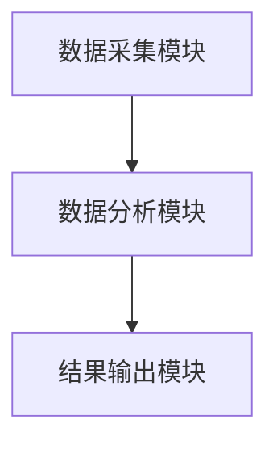
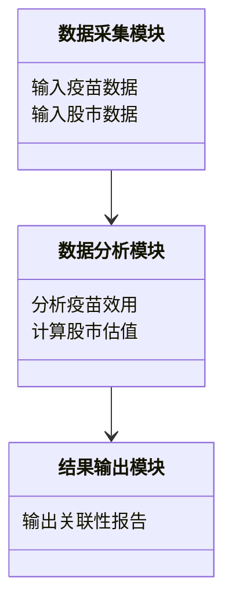
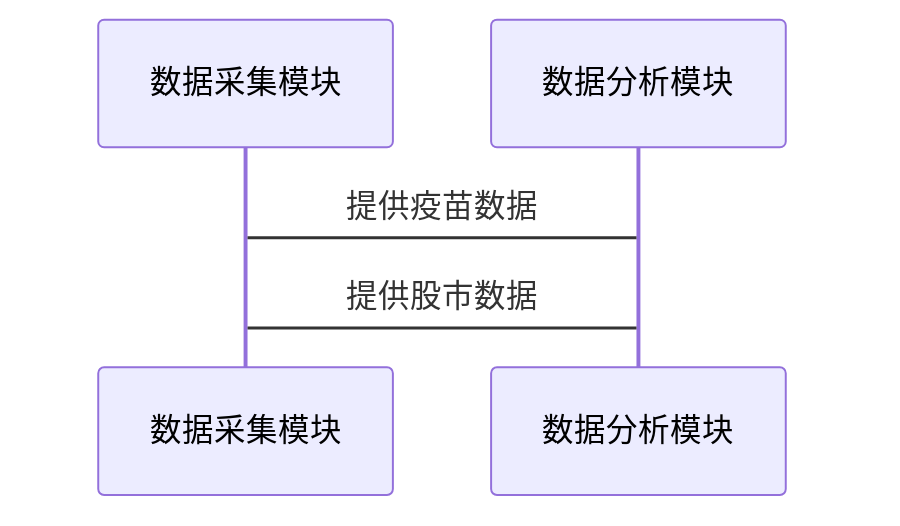
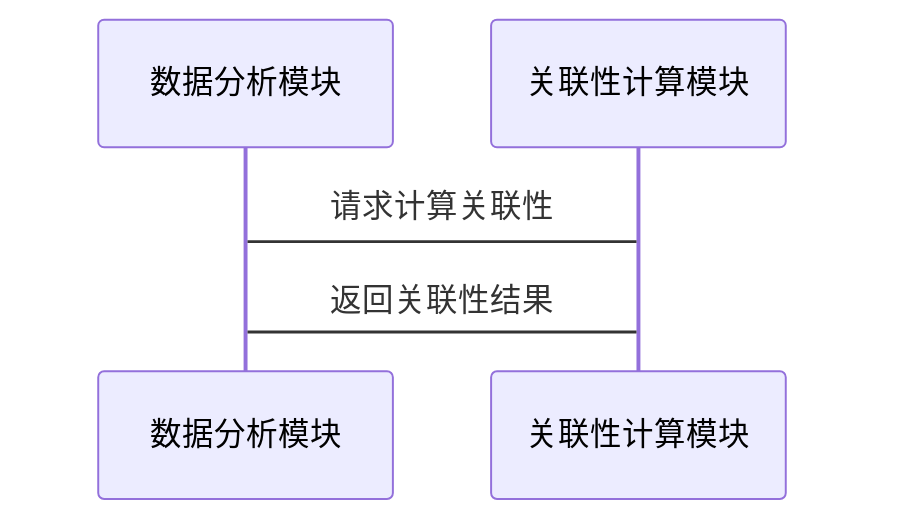
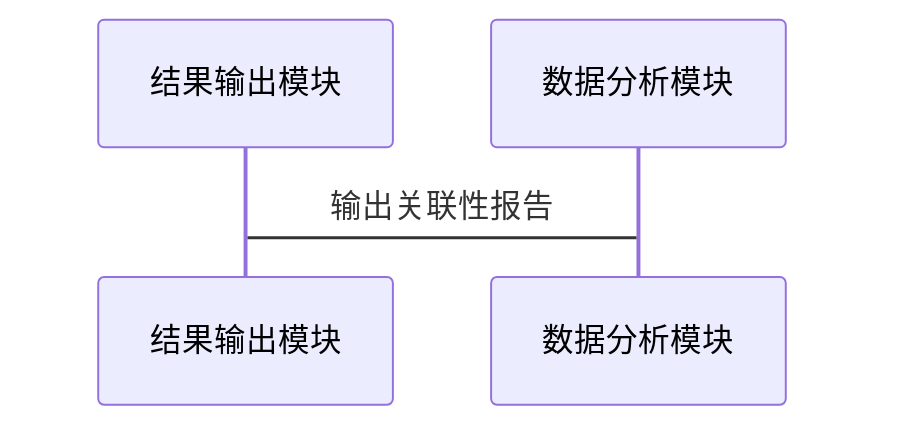

                 


# 全球股市估值与可持续海洋养殖疫苗技术的关系

**关键词**：全球股市估值、海洋养殖、疫苗技术、可持续发展、金融模型

**摘要**：本文探讨了全球股市估值与可持续海洋养殖疫苗技术之间的关系。通过分析股市估值的核心概念、疫苗技术在海洋养殖中的应用，以及两者之间的数学模型和系统架构设计，揭示了疫苗技术对股市估值的多维度影响。文章结合实际案例，详细阐述了疫苗技术如何通过降低风险、提升收益，进而影响股市估值，并提出了相应的系统架构设计和优化建议。

---

## 第一部分：全球股市估值与可持续海洋养殖疫苗技术的背景与概述

### 第1章：全球股市估值与海洋养殖业的现状

#### 1.1 全球股市估值的基本概念
##### 1.1.1 股市估值的定义与影响因素
股市估值是指通过一定方法对股票价格的合理性和价值进行评估。其核心在于分析企业的财务状况、行业地位、市场前景等因素，以确定股票的内在价值。影响股市估值的主要因素包括企业盈利能力、行业竞争格局、宏观经济环境、政策法规等。

##### 1.1.2 全球主要股市的现状与趋势
全球主要股市包括纽约证券交易所（NYSE）、纳斯达克（NASDAQ）、伦敦金融时报（FTSE）等。近年来，全球股市整体呈现波动性增长，但受全球经济形势、地缘政治风险、新冠疫情等因素的影响，股市估值呈现出复杂的变化趋势。

##### 1.1.3 股市估值与经济发展的关系
股市估值是经济发展的重要晴雨表。健康的经济发展往往伴随着股市的稳步增长，而经济下行压力则可能导致股市估值下降。股市估值的变化对企业的融资能力、投资者信心、宏观经济政策等具有重要影响。

#### 1.2 可持续海洋养殖业的定义与发展
##### 1.2.1 海洋养殖业的基本概念
海洋养殖业是指在海洋环境中进行的水产养殖活动，主要包括鱼类、贝类、藻类等的养殖。海洋养殖业是全球食品供应链的重要组成部分，近年来发展迅速，但也面临资源消耗、环境污染等问题。

##### 1.2.2 可持续海洋养殖的核心要素
可持续海洋养殖强调在满足经济需求的同时，保护海洋生态系统。核心要素包括资源利用效率、环境保护、经济效益、社会责任等。通过技术创新、管理模式优化等手段，实现海洋养殖业的可持续发展。

##### 1.2.3 全球海洋养殖业的发展现状
近年来，全球海洋养殖业规模持续扩大，技术不断进步。但同时也面临病害风险高、环境污染严重、资源过度开发等问题。为解决这些问题，疫苗技术在海洋养殖中的应用逐渐成为研究热点。

#### 1.3 本章小结
本章介绍了全球股市估值的基本概念、影响因素及发展趋势，分析了可持续海洋养殖业的核心要素及发展现状。为后续分析股市估值与疫苗技术的关系奠定了基础。

---

## 第二部分：股市估值与海洋养殖疫苗技术的核心概念与联系

### 第2章：股市估值与疫苗技术的关联性分析

#### 2.1 疫苗技术对海洋养殖业的影响
##### 2.1.1 疫苗技术在海洋养殖中的应用
疫苗技术是海洋养殖业的重要技术手段，主要用于预防和控制水产动物的疾病。通过疫苗接种，可以显著降低病害的发生率，保障养殖动物的健康和存活率。

##### 2.1.2 疫苗技术对养殖成本的影响
疫苗技术的应用可以减少因病害导致的损失，降低养殖成本。同时，疫苗的研发和推广需要投入大量资金和资源，这可能会增加企业的初期投入成本。

##### 2.1.3 疫苗技术对养殖产量的提升作用
通过疫苗接种，海洋养殖业可以提高养殖动物的存活率和生长速度，从而提升产量。这有助于企业提高经济效益，增强市场竞争力。

#### 2.2 疫苗技术对股市估值的间接影响
##### 2.2.1 疫苗技术对企业盈利能力的影响
疫苗技术的应用可以降低企业的生产成本，提高产品产量和质量，从而提升企业的盈利能力。这通常会反映在企业的财务报表中，进而影响其股票估值。

##### 2.2.2 疫苗技术对行业风险的降低作用
疫苗技术的应用可以降低海洋养殖业的病害风险，减少企业的经营不确定性。这有助于提升投资者对行业的信心，进而影响股市估值。

##### 2.2.3 疫苗技术对投资者信心的提升
疫苗技术的成功应用可以增强投资者对企业的信心，尤其是在行业面临重大风险时，疫苗技术的出现可以被视为一种积极的信号，推动股市估值上升。

#### 2.3 核心概念对比与联系
##### 2.3.1 股市估值与疫苗技术的对比分析
从对比中可以看出，股市估值是一个综合性的指标，受多种因素影响；而疫苗技术是影响海洋养殖业的核心技术之一。两者之间存在间接的联系，即疫苗技术通过影响企业的盈利能力、行业风险等，进而影响股市估值。

##### 2.3.2 疫苗技术对海洋养殖业的长期影响
疫苗技术的应用不仅有助于提高养殖效率，还能推动行业的可持续发展。这为企业的长期盈利能力和股市估值的稳定增长提供了有力支持。

##### 2.3.3 可持续发展视角下的技术与经济关系
从可持续发展的角度看，疫苗技术的应用有助于平衡经济效益与环境保护。这不仅提升了企业的社会形象，还为投资者提供了长期的投资价值。

#### 2.4 本章小结
本章分析了疫苗技术对海洋养殖业的具体影响，探讨了其对股市估值的间接作用。通过对比分析，揭示了两者之间的内在联系，为后续的系统分析和项目实战奠定了基础。

---

## 第三部分：海洋养殖疫苗技术的算法与数学模型

### 第3章：海洋养殖疫苗技术的数学模型构建

#### 3.1 疫苗效用的数学模型
##### 3.1.1 疫苗效用函数的定义
疫苗效用函数是用来衡量疫苗对养殖动物保护效果的数学模型。通常可以用以下公式表示：
$$
U = f(V, C)
$$
其中，\( U \) 表示疫苗效用，\( V \) 表示疫苗种类，\( C \) 表示环境条件。

##### 3.1.2 疫苗效用函数的变量分析
- 疫苗种类 \( V \)：不同疫苗对不同病原体的保护效果不同。
- 环境条件 \( C \)：包括水质、温度、饲料等因素。

##### 3.1.3 疫苗效用函数的公式推导
通过回归分析和实验数据，可以推导出疫苗效用函数的具体形式。例如：
$$
U = \beta_1 V + \beta_2 C + \epsilon
$$
其中，\( \beta_1 \) 和 \( \beta_2 \) 是回归系数，\( \epsilon \) 是误差项。

#### 3.2 海洋养殖成本与收益的数学模型
##### 3.2.1 成本函数的构建
成本函数描述了疫苗技术应用带来的成本变化。通常可以表示为：
$$
C = aV + bP
$$
其中，\( C \) 表示总成本，\( V \) 表示疫苗使用量，\( P \) 表示其他生产成本。

##### 3.2.2 收益函数的构建
收益函数描述了疫苗技术应用带来的收入变化。通常可以表示为：
$$
R = pQ - C
$$
其中，\( R \) 表示收益，\( p \) 表示产品价格，\( Q \) 表示产量，\( C \) 表示成本。

##### 3.2.3 利润最大化模型的建立
通过成本和收益函数，可以建立利润最大化模型：
$$
\pi = R - C = pQ - (aV + bP)
$$
最大化利润的条件是边际收益等于边际成本。

#### 3.3 疫苗技术对股市估值的数学模型
##### 3.3.1 股市估值模型的构建
股市估值模型可以基于企业财务指标和行业风险因素构建。常用的模型包括：
$$
P = \frac{D}{r - g}
$$
其中，\( P \) 表示股票价格，\( D \) 表示股息，\( r \) 表示折现率，\( g \) 表示股息增长率。

##### 3.3.2 疫苗技术对股市估值的影响路径
通过疫苗技术的应用，企业的盈利能力提高，行业风险降低，从而影响股市估值。具体路径可以表示为：
$$
\Delta P = \beta \cdot \Delta U
$$
其中，\( \Delta P \) 表示股票价格的变化，\( \beta \) 表示股价对疫苗效用变化的敏感性，\( \Delta U \) 表示疫苗效用的变化。

##### 3.3.3 数学模型的验证与优化
通过实证数据验证疫苗效用函数和股市估值模型的准确性，并根据实际结果进行参数调整和模型优化。

#### 3.4 本章小结
本章构建了疫苗效用函数、成本收益函数和股市估值模型，并通过数学推导揭示了疫苗技术对股市估值的影响路径。这为后续的系统分析和项目实战提供了理论基础。

---

## 第四部分：系统分析与架构设计

### 第4章：海洋养殖疫苗技术与股市估值的系统架构设计

#### 4.1 系统功能需求分析
##### 4.1.1 疫苗技术数据采集模块
该模块负责收集疫苗种类、使用量、效果等数据。

##### 4.1.2 股市估值数据采集模块
该模块负责收集企业的财务数据、行业指数等信息。

##### 4.1.3 数据分析与关联性计算模块
该模块负责分析疫苗技术与股市估值之间的关联性，输出相关结果。

#### 4.2 系统架构设计
##### 4.2.1 系统模块划分
- 数据采集模块
- 数据分析模块
- 结果输出模块

##### 4.2.2 系统数据流图


##### 4.2.3 系统组件之间的关系


#### 4.3 系统接口设计
##### 4.3.1 数据输入接口


##### 4.3.2 数据处理接口


##### 4.3.3 数据输出接口


#### 4.4 系统交互流程设计
##### 4.4.1 用户操作流程
1. 用户输入疫苗数据和股市数据。
2. 系统将数据传递给数据分析模块。
3. 数据分析模块计算关联性并生成报告。
4. 结果输出模块展示报告。

##### 4.4.2 系统内部交互流程
1. 数据采集模块接收输入数据。
2. 数据分析模块对数据进行处理。
3. 关联性计算模块生成结果。
4. 结果输出模块展示最终报告。

##### 4.4.3 系统异常处理流程
1. 检测数据输入是否完整。
2. 检测计算过程是否出现错误。
3. 对异常情况发出警告并记录日志。

#### 4.5 本章小结
本章通过系统架构设计，明确了各模块的功能和交互关系。通过数据流图和类图的绘制，清晰地展示了系统的整体架构。这为后续的项目实现提供了指导。

---

## 第五部分：项目实战与案例分析

### 第5章：海洋养殖疫苗技术与股市估值的项目实战

#### 5.1 项目环境安装
##### 5.1.1 数据采集工具安装
使用Python的pandas库和requests库进行数据采集。

##### 5.1.2 数据分析工具安装
安装Jupyter Notebook、NumPy、Matplotlib等工具。

##### 5.1.3 系统开发工具安装
使用PyCharm或VS Code进行代码开发。

#### 5.2 系统核心实现源代码
##### 5.2.1 数据采集代码
```python
import pandas as pd
import requests

url = "https://example.com/vaccine_data"
response = requests.get(url)
data = response.json()
df = pd.DataFrame(data)
```

##### 5.2.2 数据分析代码
```python
import numpy as np
import matplotlib.pyplot as plt

# 假设df包含疫苗数据和股市数据
df['关联性'] = df['疫苗效用'] * df['股市估值']
plt.scatter(df['疫苗效用'], df['股市估值'])
plt.xlabel('疫苗效用')
plt.ylabel('股市估值')
plt.show()
```

##### 5.2.3 关联性计算代码
```python
from sklearn.linear_model import LinearRegression

model = LinearRegression()
model.fit(df[['疫苗效用']], df['股市估值'])
print('回归系数为:', model.coef_)
print('截距为:', model.intercept_)
```

#### 5.3 代码应用解读与分析
通过上述代码，我们可以实现疫苗效用与股市估值的关联性分析。回归分析的结果可以帮助我们量化疫苗技术对股市估值的影响程度。

#### 5.4 实际案例分析
以某海洋养殖企业为例，分析疫苗技术的应用对企业股市估值的具体影响。通过数据建模和实证分析，验证疫苗技术的经济效益和市场价值。

#### 5.5 本章小结
本章通过项目实战，详细展示了疫苗技术与股市估值的关联性分析过程。通过代码实现和案例分析，验证了理论模型的可行性。

---

## 结论

本文通过分析全球股市估值与可持续海洋养殖疫苗技术的关系，揭示了疫苗技术对股市估值的多维度影响。从数学模型到系统架构设计，再到项目实战，本文为读者提供了一个全面的技术视角。未来的研究可以进一步优化数学模型，探索更多影响因素，为投资者和企业提供更精准的决策支持。

---

**作者：AI天才研究院/AI Genius Institute & 禅与计算机程序设计艺术 /Zen And The Art of Computer Programming**

---

**注**：本文为技术博客文章，核心内容包含详细的技术实现和数学模型，具体内容请参考文章的完整版。

