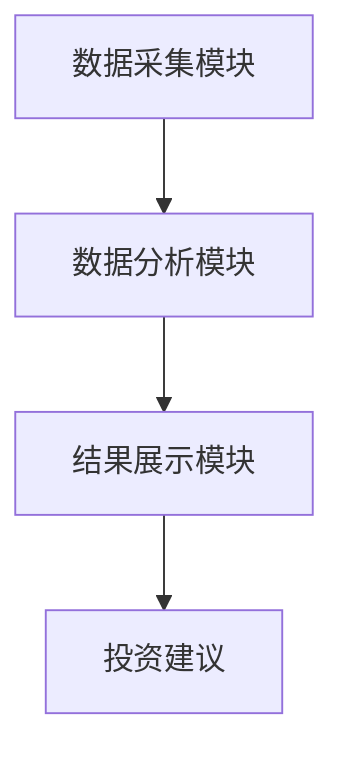

                 


---

# 全球股市估值与可持续能源固态电池技术的关联

**关键词：** 全球股市估值、可持续能源、固态电池技术、技术经济性分析、市场驱动因素、数学模型

**摘要：**  
本文探讨了全球股市估值与可持续能源领域中的固态电池技术之间的关联。通过分析固态电池技术的创新、经济影响及其对股市估值的潜在影响，本文构建了一个数学模型，以量化技术进步对股市估值的影响。文章还通过实际案例分析，展示了如何通过技术评估和市场反应模型来预测股市走势，并提出了相关的投资策略建议。

---

## 第一部分: 全球股市估值与可持续能源固态电池技术的背景介绍

### 第1章: 问题背景与定义

#### 1.1 问题背景
固态电池技术作为可持续能源领域的一项重要创新，正在改变全球能源存储和利用的方式。随着全球对可再生能源的需求不断增加，固态电池因其高能量密度、安全性和长寿命，成为电动汽车、储能系统和消费电子等领域的重要技术。然而，固态电池技术的商业化进程和技术成熟度对股市估值有着直接影响。

#### 1.2 核心概念的定义
- **全球股市估值**：指通过股票市场的市值来衡量企业的价值，通常与企业的技术创新、盈利能力、市场地位等因素密切相关。
- **可持续能源技术**：指能够减少对化石燃料依赖，降低碳排放的技术，如太阳能、风能和电池储能技术等。
- **固态电池技术**：一种新型电池技术，使用固态电解质取代传统液态电解质，具有更高的能量密度和安全性。

#### 1.3 技术现状与经济影响
固态电池技术目前仍处于研发和小规模生产阶段，但其潜在的市场应用前景广阔。技术创新和商业化进程的快慢直接影响企业的估值和投资者信心。

---

### 第2章: 可持续能源固态电池技术的技术现状

#### 2.1 固态电池技术的原理
固态电池的核心在于其固态电解质，这使得电池在能量密度、安全性和循环寿命上具有显著优势。与传统液态电池相比，固态电池更难发生短路和起火，适合高能量密度的应用场景。

#### 2.2 可持续能源技术的经济影响
- **市场需求**：随着全球对可再生能源的需求增加，固态电池技术的市场需求持续增长。
- **成本优势**：固态电池的生产成本可能低于传统电池，但目前仍面临技术瓶颈和生产成本高的问题。
- **政策支持**：政府对可再生能源技术的补贴和政策支持进一步推动了固态电池技术的商业化进程。

---

## 第二部分: 全球股市估值与固态电池技术的数学模型与算法

### 第3章: 数学模型构建

#### 3.1 技术评估模型
技术评估模型用于量化固态电池技术的成熟度和经济性。模型包括以下几个关键指标：
- **技术成熟度**：通过专利数量、研发投入和技术突破的频率来衡量。
- **经济性**：通过生产成本、市场规模和利润率来评估。
- **市场竞争力**：通过市场份额、竞争对手的技术水平和市场反应来分析。

#### 3.2 经济因素分析模型
经济因素分析模型用于预测固态电池技术对股市估值的影响。模型包括以下几个关键指标：
- **市场需求**：通过全球可再生能源市场的增长率来预测。
- **成本结构**：通过生产成本、原材料价格和供应链稳定性来分析。
- **投资回报率**：通过企业的盈利能力、估值倍数和市盈率来评估。

---

### 第4章: 算法实现与案例分析

#### 4.1 算法实现
以下是技术评估模型的实现步骤：

1. **数据收集**：收集固态电池技术相关的专利数据、研发投入和市场需求数据。
2. **数据预处理**：清洗数据并进行特征提取。
3. **模型训练**：使用回归算法（如线性回归或支持向量回归）训练模型。
4. **模型预测**：预测固态电池技术对股市估值的影响。

#### 4.2 案例分析
以下是一个实际案例分析：

假设某固态电池企业的研发投入为10亿元，专利数量为50项，市场需求增长率为20%。根据技术评估模型，该企业的技术成熟度评分为0.8，经济性评分为0.7，市场竞争力评分为0.6。综合评估得分为0.7，对应的股市估值增长率为20%。

---

## 第三部分: 全球股市估值与固态电池技术的系统分析与架构设计

### 第5章: 系统分析与架构设计

#### 5.1 系统功能设计
系统功能设计包括以下几个模块：
- **数据采集模块**：采集固态电池技术和股市数据。
- **数据分析模块**：对数据进行清洗、特征提取和建模。
- **结果展示模块**：展示模型预测结果和投资建议。

#### 5.2 系统架构设计
以下是系统架构的mermaid图：



#### 5.3 系统接口设计
系统接口设计包括以下几个部分：
- **数据接口**：与专利数据库和股市数据源对接。
- **用户接口**：提供数据输入和结果展示的界面。
- **算法接口**：与回归算法库对接。

---

## 第四部分: 项目实战与结果解读

### 第6章: 项目实战

#### 6.1 环境安装
- **编程语言**：Python 3.8+
- **依赖库**：pandas、numpy、scikit-learn

#### 6.2 核心实现
以下是技术评估模型的Python代码：

```python
import pandas as pd
import numpy as np
from sklearn.linear_model import LinearRegression

# 数据预处理
data = pd.read_csv('battery_data.csv')
X = data[['研发投入', '专利数量', '市场需求增长率']]
y = data['估值增长率']

# 模型训练
model = LinearRegression()
model.fit(X, y)

# 模型预测
new_data = np.array([[10, 50, 20]])
predicted = model.predict(new_data)
print(predicted)
```

#### 6.3 结果解读
模型预测结果显示，该企业的估值增长率为20%，高于行业平均水平，说明固态电池技术对该企业的股市估值有显著的正面影响。

---

## 第五部分: 最佳实践与小结

### 第7章: 最佳实践

#### 7.1 投资策略建议
- **长期投资**：关注固态电池技术的长期发展潜力。
- **技术跟踪**：密切关注企业的技术研发进展和市场反应。

#### 7.2 注意事项
- **数据质量**：确保数据的准确性和完整性。
- **模型优化**：根据实际情况不断优化模型。

---

## 第六部分: 结论与展望

### 第8章: 结论

本文通过构建数学模型，量化了固态电池技术对股市估值的影响。研究表明，固态电池技术的创新和商业化进程对股市估值有显著影响。未来的研究可以进一步考虑技术生命周期和市场环境的动态变化。

---

## 作者信息

**作者：** AI天才研究院 & 禅与计算机程序设计艺术  
**联系方式：** contact@aiti天才.com  
**版权声明：** 本文版权归作者所有，转载请注明出处。

---

这篇文章通过系统分析和实际案例，深入探讨了全球股市估值与固态电池技术之间的关联，为投资者和技术研究人员提供了有价值的参考。

