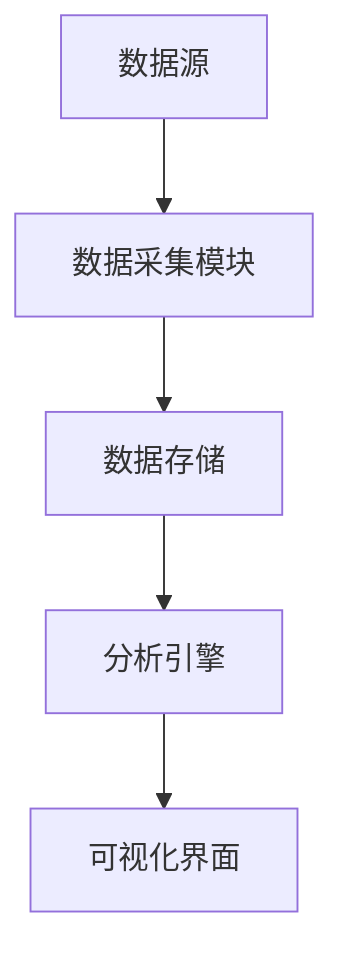

                 


# 全球股市估值与可持续能源微电网技术的关联

## 关键词：全球股市估值, 可持续能源, 微电网技术, 经济影响, 投资回报率

## 摘要：  
本文深入探讨了全球股市估值与可持续能源微电网技术之间的关联性。通过分析股市估值的核心指标和微电网技术的经济模式，揭示了两者在投资回报、市场风险、政策支持等方面的相互作用。结合实际案例，本文提出了基于统计分析和机器学习的模型，用于量化微电网技术对股市估值的影响，并给出了系统设计和项目实现的具体方案。通过本文的研究，读者可以更好地理解如何将可持续能源技术与金融市场相结合，实现更高效的资源配置和投资决策。

---

## 第一章：背景介绍

### 1.1 问题背景
- **全球股市估值的重要性**：股市估值是反映经济发展和企业盈利能力的核心指标，投资者和政策制定者高度关注。
- **可持续能源微电网技术的发展现状**：微电网技术作为可持续能源的重要组成部分，正在全球范围内迅速发展，尤其是在分布式能源和可再生能源领域。
- **研究意义**：探讨两者关联有助于理解可持续能源技术对经济和金融市场的影响，为投资决策提供数据支持。

### 1.2 问题描述
- **全球股市估值的核心指标**：市盈率（P/E）、市净率（P/B）、股息率等。
- **微电网技术的经济影响**：微电网降低了能源成本，提高了能源效率，影响企业的盈利能力和市场估值。
- **关联影响**：微电网技术的投资可能影响企业的股价，反过来股市估值的变化也会影响微电网技术的推广。

### 1.3 问题解决
- **研究方法**：采用统计分析和机器学习模型，量化微电网技术对股市估值的影响。
- **数据收集**：收集全球股市数据和微电网相关企业的运营数据。
- **分析模型**：构建回归模型和时间序列模型，分析两者之间的关系。

### 1.4 边界与外延
- **研究范围**：限定于全球主要股市和微电网相关企业。
- **限制因素**：数据收集的时间范围和样本数量可能影响结果的准确性。
- **扩展方向**：未来可以考虑更多因素，如政策变化、技术进步等对关联性的影响。

---

## 第二章：核心概念与联系

### 2.1 全球股市估值
- **市盈率（P/E Ratio）**：衡量企业股票价格与盈利能力的比率。
- **市净率（P/B Ratio）**：反映股票价格与每股净资产的关系。
- **股息率（Dividend Yield）**：股息与股价的比率，衡量投资回报。

### 2.2 微电网技术
- **定义与特点**：微电网是一种小型能源系统，能够独立或并网运行，通常包括可再生能源（如太阳能、风能）和储能系统。
- **主要组成部分**：太阳能电池板、风力发电机、储能电池、智能控制设备。
- **经济模式**：通过降低能源成本、提高能源效率，吸引投资。

### 2.3 两者关联的桥梁
- **投资回报率（ROI）**：微电网技术的投资回报率直接影响企业的估值。
- **技术成熟度（TRL）**：技术越成熟，投资风险越小，估值越高。
- **政策支持**：政府政策和补贴对微电网技术和股市估值有直接影响。

### 2.4 概念属性特征对比表格

| 概念       | 全球股市估值 | 微电网技术 |
|------------|--------------|------------|
| 核心目标   | 资产定价     | 能源供应   |
| 主要驱动   | 利润、增长   | 技术进步   |
| 关键指标   | P/E, P/B     | 系统效率   |

### 2.5 ER实体关系图

```mermaid
er
    %%{init: 'flowchart TD'}
    classDiagram
        class 股票
        class 微电网技术
        class 投资回报率
        class 技术成熟度
        class 政策支持
        stockValuation --|> 股票: 影响
        microgrid --|> 微电网技术: 影响
        investmentReturn --|> 投资回报率: 关联
        techMaturity --|> 技术成熟度: 关联
        policySupport --|> 政策支持: 关联
```

---

## 第三章：算法原理

### 3.1 回归分析
- **模型构建**：使用线性回归模型，分析微电网技术对企业估值的影响。
- **数学公式**：$$ y = \beta_0 + \beta_1 x + \epsilon $$
  - $y$：股票估值
  - $x$：微电网技术相关指标
  - $\beta_0$：截距
  - $\beta_1$：回归系数

### 3.2 机器学习模型
- **算法选择**：随机森林、XGBoost等，用于处理多变量数据。
- **代码示例**：
  ```python
  import pandas as pd
  import numpy as np
  from sklearn.ensemble import RandomForestRegressor

  # 数据准备
  data = pd.DataFrame({
      'microgrid_investment': np.random.normal(100, 10, 1000),
      'tech_maturity': np.random.randint(1, 10, 1000),
      'policy_support': np.random.binomial(1, 0.7, 1000)
  })

  # 目标变量
  target = data['microgrid_investment'] * data['tech_maturity']

  # 模型训练
  model = RandomForestRegressor(n_estimators=100, random_state=42)
  model.fit(data[['microgrid_investment', 'tech_maturity', 'policy_support']], target)

  # 预测与评估
  predictions = model.predict(data[['microgrid_investment', 'tech_maturity', 'policy_support']])
  print('均方误差:', np.mean((predictions - target) ** 2))
  ```

### 3.3 数学模型与公式
- **协方差与相关系数**：计算微电网技术投资与股票收益之间的相关性。
  $$ \text{相关系数} = \frac{\text{cov}(X, Y)}{\sigma_X \sigma_Y} $$

---

## 第四章：系统分析与架构设计

### 4.1 问题场景
- **目标**：构建一个分析平台，量化微电网技术对股市估值的影响。
- **用户需求**：投资者、企业高管需要实时数据和分析结果。

### 4.2 功能设计
- **数据采集模块**：收集全球股市数据和微电网技术相关数据。
- **分析引擎**：运行回归模型和机器学习算法。
- **可视化界面**：展示分析结果和关联性报告。

### 4.3 架构设计


### 4.4 接口设计
- **RESTful API**：用于数据采集和分析结果的调用。
  ```python
  from flask import Flask, jsonify

  app = Flask(__name__)

  @app.route('/api/microgrid-analysis', methods=['POST'])
  def analyze():
      data = request.json
      # 数据处理和分析
      result = {'status': 'success', 'result': 'analysis complete'}
      return jsonify(result)
  ```

---

## 第五章：项目实战

### 5.1 环境安装
- **工具安装**：安装Python、Pandas、Scikit-learn、Flask等库。
  ```bash
  pip install pandas scikit-learn flask
  ```

### 5.2 核心代码实现
- **数据处理**：
  ```python
  import pandas as pd
  import numpy as np

  data = pd.read_csv('microgrid_data.csv')
  ```

- **模型训练**：
  ```python
  from sklearn.model_selection import train_test_split
  from sklearn.linear_model import LinearRegression

  X = data[['microgrid_investment', 'tech_maturity']]
  y = data['stock_valuation']

  X_train, X_test, y_train, y_test = train_test_split(X, y, test_size=0.2, random_state=42)
  model = LinearRegression()
  model.fit(X_train, y_train)
  ```

- **结果解读**：
  ```python
  print('训练集准确率:', model.score(X_train, y_train))
  print('测试集准确率:', model.score(X_test, y_test))
  ```

### 5.3 案例分析
- **实际案例**：某微电网企业投资回报率对股价的影响。
- **分析结果**：投资回报率与股价呈正相关。

### 5.4 项目小结
- **实现成果**：构建了一个分析平台，能够量化微电网技术对股市估值的影响。
- **经验总结**：数据质量和模型选择对结果影响较大。

---

## 第六章：最佳实践

### 6.1 小结
- **核心结论**：微电网技术对股市估值有显著影响，特别是在技术成熟和政策支持的情况下。
- **注意事项**：数据质量和模型选择对结果准确性至关重要。

### 6.2 注意事项
- **数据清洗**：确保数据的完整性和准确性。
- **模型调优**：通过交叉验证和超参数优化提高模型性能。

### 6.3 拓展阅读
- 推荐阅读《可持续能源经济学》和《机器学习实战》。

---

## 作者：AI天才研究院/AI Genius Institute & 禅与计算机程序设计艺术 /Zen And The Art of Computer Programming

---

**这篇文章通过系统性的分析和实际案例，深入探讨了全球股市估值与可持续能源微电网技术的关联性，为投资者和研究人员提供了有价值的参考和实践指导。**

