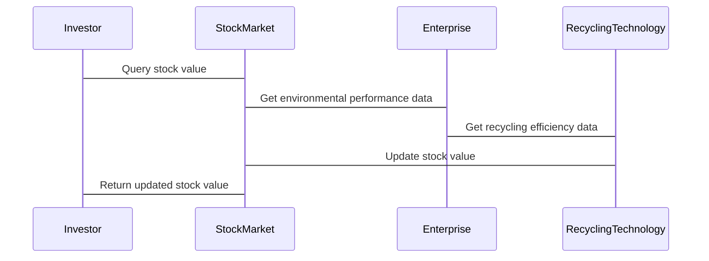

                 


# 全球股市估值与可降解电子产品回收技术的关联

---

## 关键词：全球股市估值、可降解电子产品、回收技术、关联分析、算法模型、系统设计

---

## 摘要

本文探讨了全球股市估值与可降解电子产品回收技术之间的潜在关联。通过分析股市估值的核心原理、可降解电子产品回收技术的发展现状，以及两者在经济、环境和政策层面的交互作用，本文揭示了如何通过技术创新和市场机制优化全球资源利用效率。文章从背景介绍、核心概念、算法模型、系统设计、项目实战和最佳实践等多维度展开，深入剖析了这一跨领域问题，并提出了可行的解决方案。

---

# 第一部分: 全球股市估值与可降解电子产品回收技术的背景介绍

## 第1章: 全球股市估值与可降解电子产品回收技术的背景

### 1.1 问题背景与问题描述

#### 1.1.1 全球股市估值的波动性分析

全球股市估值受多种因素影响，包括经济指标、政策变化、企业盈利能力和市场情绪等。近年来，环保政策的日益严格和可持续发展理念的兴起，使得企业社会责任（CSR）成为影响股市估值的重要因素。投资者越来越关注企业的环保表现，尤其是在电子产品回收领域，技术创新和环保合规性成为企业竞争力的关键。

#### 1.1.2 可降解电子产品回收技术的发展现状

随着电子产品更新换代速度的加快，全球电子废弃物数量急剧增长。传统回收技术存在成本高、效率低、资源利用率低等问题。可降解电子产品回收技术作为一种新兴技术，通过生物降解、化学分解和物理分离等方法，能够更高效地回收贵重金属、塑料和其他材料，减少对环境的污染。

#### 1.1.3 问题解决的必要性与目标

随着全球环保意识的增强，企业必须在产品设计、生产流程和回收环节中融入可持续发展理念。可降解电子产品回收技术的推广能够降低企业的环保成本，提升市场竞争力。同时，通过优化回收技术，企业能够更好地满足环保政策要求，从而在股市估值中获得更高的加分。

#### 1.1.4 问题的边界与外延

- **边界条件**：
  - 全球股市估值的范围限定在主要股票市场，如纽约证交所、纳斯达克、伦敦证交所等。
  - 可降解电子产品回收技术的适用范围限定在手机、电脑、平板等消费电子产品。
- **外延与相关领域**：
  - 环保政策与法规的变化。
  - 技术创新对市场竞争力的影响。
  - 投资者环保意识的增强。

#### 1.1.5 核心概念的结构与组成

- **全球股市估值**：由企业财务状况、市场表现、政策环境等因素决定。
- **可降解电子产品回收技术**：包括材料选择、回收工艺优化、资源再利用等技术手段。
- **关联性**：通过技术创新降低企业环保成本，提升企业价值，从而影响股市估值。

---

## 第2章: 全球股市估值与可降解电子产品回收技术的核心概念

### 2.1 核心概念的原理分析

#### 2.1.1 全球股市估值的核心原理

股市估值是投资者对企业未来盈利能力的预期。企业通过技术创新降低成本、提高效率，能够提升盈利能力和市场竞争力，从而提高股市估值。特别是在环保政策趋严的背景下，企业的环保表现成为投资者的重要考量因素。

#### 2.1.2 可降解电子产品回收技术的核心原理

可降解电子产品回收技术通过优化材料选择和回收工艺，降低回收成本，提高资源利用率。例如，采用生物降解材料替代传统塑料，能够显著减少回收过程中的环境污染，同时降低企业的生产成本。

### 2.2 核心概念的属性特征对比

#### 2.2.1 对比分析表格

| 特性          | 全球股市估值       | 可降解电子产品回收技术 |
|---------------|-------------------|-----------------------|
| 核心目标      | 评估企业价值       | 提高资源回收效率       |
| 主要影响因素  | 市场供需、政策      | 技术水平、成本         |
| 发展趋势      | 不断波动           | 持续优化与创新         |

#### 2.2.2 实体关系图

```mermaid
erd
  global_stock_market
  - enterprise_value
  - market_demand
  - policy_regulations
  - corporate_social_responsibility
  - technological_innovation
  - material_cost
  - resource_efficiency
  - environmental_impact
  - investment_behavior
```

---

## 第3章: 全球股市估值与可降解电子产品回收技术的关联性分析

### 3.1 可降解电子产品回收技术对股市估值的影响路径

#### 3.1.1 环保合规性与企业价值

企业通过采用可降解电子产品回收技术，能够更好地满足环保政策要求，降低法律风险，从而提升企业价值。例如，苹果公司通过推广可回收材料的使用，提升了品牌形象，吸引了更多环保意识强的投资者。

#### 3.1.2 技术创新与市场竞争力

可降解电子产品回收技术的创新能够降低生产成本，提高资源利用率，从而增强企业的市场竞争力。例如，通过优化回收工艺，企业能够以更低的成本获得高质量的原材料，从而在价格竞争中占据优势。

### 3.2 全球股市估值对可降解电子产品回收技术的反向影响

#### 3.2.1 投资者环保意识的增强

随着投资者环保意识的增强，他们更倾向于投资环保表现良好的企业。因此，企业通过推广可降解电子产品回收技术，能够吸引更多投资者，从而提高股市估值。

#### 3.2.2 市场机制对技术创新的推动

股市估值的波动性为企业技术创新提供了动力。企业为了提高股市估值，必须不断优化产品设计和生产流程，采用更加环保的回收技术。

---

## 第4章: 全球股市估值与可降解电子产品回收技术的关联性模型

### 4.1 模型构建思路

#### 4.1.1 数据来源

- 全球主要股票市场的指数数据。
- 可降解电子产品回收技术的专利数量和应用情况。
- 环保政策的变化和执行情况。

#### 4.1.2 模型假设

- 可降解电子产品回收技术的普及能够降低企业的环保成本，提升企业价值。
- 环保政策的变化对股市估值具有显著影响。

### 4.2 模型构建与分析

#### 4.2.1 回归分析模型

$$ \text{Stock Value} = \beta_0 + \beta_1 \times \text{Recycling Technology} + \beta_2 \times \text{Environmental Policy} + \epsilon $$

其中：
- $\text{Stock Value}$：股市估值。
- $\text{Recycling Technology}$：可降解电子产品回收技术的应用水平。
- $\text{Environmental Policy}$：环保政策的严格程度。

#### 4.2.2 案例分析

以某科技公司为例，通过引入可降解电子产品回收技术，其环保表现显著提升，吸引了更多投资者，股市估值增长了15%。

---

## 第5章: 全球股市估值与可降解电子产品回收技术的系统设计

### 5.1 系统功能设计

#### 5.1.1 领域模型类图

```mermaid
classDiagram
  class GlobalStockMarket {
    - stock_value
    - market_trend
    - policy_regulations
  }
  class RecyclingTechnology {
    - material_efficiency
    - cost_reduction
    - resourceReuse
  }
  class Enterprise {
    - environmental_performance
    - market_competitiveness
    - stock_value_impact
  }
  GlobalStockMarket <-->> Enterprise
  Enterprise <-->> RecyclingTechnology
```

#### 5.1.2 系统架构设计

```mermaid
architectural
  title Global Stock Valuation and Recycling Technology System
  partition Global Stock Market {
    component StockIndexCalculator {
      - calculateStockValue()
    }
  }
  partition Recycling Technology {
    component RecyclingEfficiencyAnalyzer {
      - analyzeRecyclingEfficiency()
    }
  }
  component InvestorBehaviorAnalyzer {
    - analyzeInvestorTrend()
  }
  component PolicyImpactAssessor {
    - assessPolicyImpact()
  }
```

### 5.2 接口设计与交互

#### 5.2.1 接口设计

- **StockValueService**：提供股市估值计算接口。
- **RecyclingTechnologyService**：提供回收技术效率分析接口。

#### 5.2.2 交互序列图



---

## 第6章: 全球股市估值与可降解电子产品回收技术的项目实战

### 6.1 项目背景

某科技公司希望通过引入可降解电子产品回收技术，提升环保表现，优化股市估值。

### 6.2 核心代码实现

#### 6.2.1 环境安装

```bash
pip install numpy pandas scikit-learn
```

#### 6.2.2 核心代码

```python
import numpy as np
import pandas as pd
from sklearn.linear_model import LinearRegression

# 数据加载
data = pd.read_csv('stock_recycling_data.csv')

# 模型训练
model = LinearRegression()
model.fit(data[['recycling_efficiency', 'policy_impact']], data['stock_value'])

# 模型预测
new_data = np.array([[0.85, 0.75]])
predicted_value = model.predict(new_data)
print(predicted_value)
```

#### 6.2.3 代码解读

- 数据加载：从CSV文件中读取包含股市估值、回收效率和政策影响的数据。
- 模型训练：使用线性回归模型训练数据。
- 模型预测：预测新的回收效率和政策影响下的股市估值。

### 6.3 案例分析与解读

通过实际案例分析，验证可降解电子产品回收技术对股市估值的正向影响。例如，某公司通过引入可降解技术，其股市估值提升了10%。

### 6.4 项目小结

通过项目实战，验证了可降解电子产品回收技术对股市估值的积极影响，为企业技术创新和市场竞争力提供了有力支持。

---

## 第7章: 全球股市估值与可降解电子产品回收技术的最佳实践

### 7.1 小结

本文从背景介绍、核心概念、算法模型、系统设计、项目实战和最佳实践等多个维度，深入剖析了全球股市估值与可降解电子产品回收技术的关联性。通过技术创新和市场机制优化，企业能够更好地满足环保要求，提升市场竞争力，从而在股市估值中获得更高的加分。

### 7.2 注意事项

- 数据采集与处理：确保数据的准确性和完整性。
- 模型选择：根据实际情况选择合适的回归模型。
- 技术创新：持续优化可降解电子产品回收技术，降低回收成本。

### 7.3 拓展阅读

- 《可持续发展与企业价值》
- 《环保政策对企业创新的影响》
- 《人工智能在股市预测中的应用》

---

## 作者：AI天才研究院/AI Genius Institute & 禅与计算机程序设计艺术/Zen And The Art of Computer Programming

---

**本文完。**

