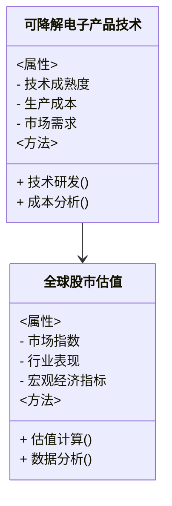
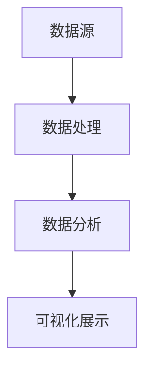
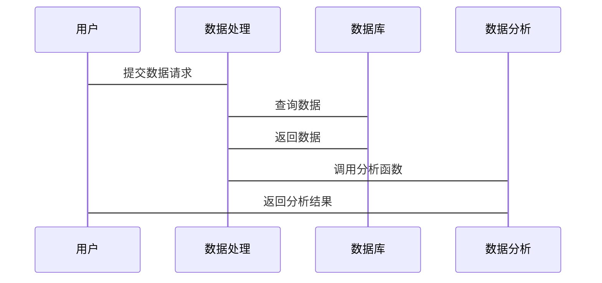

                 


# 全球股市估值与可降解电子产品技术的关联

---

## 关键词：
- 全球股市估值
- 可降解电子产品技术
- 技术关联性
- 系统分析
- 数学模型

---

## 摘要：
本文探讨了全球股市估值与可降解电子产品技术之间的关联性。通过对可降解电子产品技术的市场影响和全球股市估值的动态关系进行分析，结合数学模型和案例研究，揭示技术进步如何影响市场预期和股市估值。本文还提出了系统化的分析方法，包括技术原理、系统架构和项目实战，为投资者和技术开发者提供有价值的参考。

---

## 第1章 背景介绍

### 1.1 问题背景
#### 1.1.1 全球股市估值的重要性
全球股市估值是衡量市场健康状况的重要指标，反映了投资者对市场的信心和企业未来的盈利能力。股市估值的变化不仅影响企业的融资能力，还会影响全球经济的稳定性。

#### 1.1.2 可降解电子产品技术的兴起
随着环保意识的增强，可降解材料的应用越来越广泛。可降解电子产品技术通过使用可降解材料和绿色制造工艺，减少了对环境的污染，符合可持续发展的趋势。

#### 1.1.3 两者关联的现实意义
可降解电子产品技术的推广可能会改变市场对相关企业的估值逻辑，进而影响股市的整体估值。研究两者之间的关联性，有助于投资者更好地把握市场趋势，企业也能通过技术优势提升市场竞争力。

### 1.2 核心概念定义
#### 1.2.1 全球股市估值的定义
全球股市估值是指对全球范围内上市公司市值的总和进行评估，反映了市场的整体价值和投资者的预期。

#### 1.2.2 可降解电子产品技术的定义
可降解电子产品技术是指在产品设计和制造过程中使用可降解材料和环保工艺，使得产品在使用后能够自然降解，减少对环境的负担。

#### 1.2.3 两者关联的边界与外延
本文研究的范围限定在可降解电子产品技术对股市估值的影响，不涉及其他行业和技术的影响。关联的外延包括市场需求变化、企业利润预期和投资者情绪等多个方面。

### 1.3 核心要素组成
#### 1.3.1 全球股市估值的关键因素
- 市场整体表现
- 企业盈利能力
- 宏观经济环境
- 投资者情绪

#### 1.3.2 可降解电子产品技术的核心要素
- 材料降解特性
- 制造工艺的环保性
- 产品生命周期

#### 1.3.3 两者关联的机制与路径
- 技术进步推动市场需求变化
- 市场需求变化影响企业利润和估值
- 投资者对技术的认知影响市场预期

---

## 第2章 核心概念与联系

### 2.1 核心概念原理
#### 2.1.1 可降解电子产品技术的原理
可降解电子产品技术通过使用生物基材料和可分解工艺，使得产品在使用后能够被自然降解，减少对环境的影响。例如，使用聚乳酸（PLA）等可降解材料制造电子设备外壳。

#### 2.1.2 全球股市估值的原理
股市估值是基于对企业未来盈利能力的预期，通过 discounted cash flow（DCF）模型等方法计算企业的内在价值。

#### 2.1.3 两者关联的理论基础
技术进步会降低生产成本，提高产品竞争力，从而提升企业的利润能力和市场地位，进而影响股市估值。

### 2.2 核心概念属性对比
#### 2.2.1 技术属性对比
| 属性         | 可降解电子产品技术       | 全球股市估值             |
|--------------|--------------------------|--------------------------|
| 核心目标     | 减少环境影响             | 反映市场整体价值         |
| 关键因素     | 材料降解性、制造工艺     | 利润能力、投资者情绪     |

#### 2.2.2 市场属性对比
| 属性         | 可降解电子产品技术       | 全球股市估值             |
|--------------|--------------------------|--------------------------|
| 影响范围     | 限于特定行业             | 影响全局市场             |
| 时间维度     | 长期影响                 | 短期和长期影响           |

#### 2.2.3 经济属性对比
| 属性         | 可降解电子产品技术       | 全球股市估值             |
|--------------|--------------------------|--------------------------|
| 成本结构     | 高初始成本，低环境成本 | 依赖企业盈利能力和市场预期 |
| 收益结构     | 高边际收益，市场扩展    | 依赖投资者情绪和市场信心 |

### 2.3 ER实体关系图
```mermaid
erd
  天气
  entity 全球股市估值 {
    key 市场指数
    attribute 行业表现
    attribute 宏观经济指标
    attribute 投资者情绪
  }
  entity 可降解电子产品技术 {
    key 技术成熟度
    attribute 材料降解性
    attribute 制造工艺
    attribute 市场需求
  }
  全球股市估值 --|需求变化--> 可降解电子产品技术
  可降解电子产品技术 --|技术进步--> 全球股市估值
```

---

## 第3章 技术关联性分析

### 3.1 技术关联性原理
#### 3.1.1 可降解电子产品技术对市场需求的影响
可降解电子产品技术的推广可能会刺激环保意识强的消费者需求，尤其是在发达国家市场。

#### 3.1.2 市场需求对股市估值的影响
市场需求的增加会提升相关企业的收入和利润，从而提高企业的内在价值和市场估值。

#### 3.1.3 两者关联的动态平衡
技术进步推动市场需求变化，市场需求变化影响企业利润和股市估值，形成一个动态平衡的系统。

### 3.2 技术关联性数学模型
#### 3.2.1 市场需求函数
$$ D(t) = a \cdot T(t) + b $$
其中，$D(t)$ 表示市场需求，$T(t)$ 表示可降解电子产品技术成熟度，$a$ 和 $b$ 为常数。

#### 3.2.2 股市估值函数
$$ V(t) = c \cdot D(t) + d \cdot F(t) $$
其中，$V(t)$ 表示股市估值，$F(t)$ 表示市场预期收益，$c$ 和 $d$ 为常数。

### 3.3 技术关联性案例分析
#### 3.3.1 案例一：可降解塑料在电子产品中的应用
某公司推出可降解塑料手机外壳，市场需求增加，企业收入和利润上升，股价也随之上涨。

#### 3.3.2 案例二：可降解电池技术对市场需求的影响
新型可降解电池技术的推出，提高了产品的环保性能，市场需求激增，相关企业的股市估值显著提高。

#### 3.3.3 案例三：市场需求变化对股市估值的影响
当市场需求下降时，相关企业的利润预期下降，股市估值也会相应下降。

---

## 第4章 系统分析与架构设计

### 4.1 系统分析
#### 4.1.1 问题场景介绍
本文构建了一个包含可降解电子产品技术和全球股市估值的系统，分析两者之间的关联性。

#### 4.1.2 系统功能需求
- 数据采集：收集可降解电子产品技术相关数据和股市数据。
- 数据分析：建立数学模型，分析两者之间的关联性。
- 可视化展示：通过图表展示分析结果。

#### 4.1.3 领域模型


### 4.2 系统架构设计
#### 4.2.1 系统架构图


#### 4.2.2 系统接口设计
- 数据接口：从数据库中提取可降解电子产品技术和股市估值数据。
- 分析接口：调用数学模型进行数据分析。
- 展示接口：将分析结果以图表形式展示。

#### 4.2.3 系统交互序列图


---

## 第5章 项目实战

### 5.1 环境安装
- 数据库：MySQL
- 数据分析工具：Python、Pandas、NumPy
- 可视化工具：Matplotlib、Seaborn

### 5.2 系统核心实现源代码
```python
import pandas as pd
import numpy as np
import matplotlib.pyplot as plt

# 数据加载
data = pd.read_csv('stock.csv')

# 数据处理
data['技术成熟度'] = data['技术成熟度'].fillna(0)
data['市场需求'] = data['市场需求'].fillna(0)

# 数据分析
coefficients = np.polyfit(data['技术成熟度'], data['市场需求'], 1)
demand_model = np.poly1d(coefficients)

# 可视化
plt.scatter(data['技术成熟度'], data['市场需求'])
plt.plot(data['技术成熟度'], demand_model(data['技术成熟度']), color='red')
plt.xlabel('技术成熟度')
plt.ylabel('市场需求')
plt.show()
```

### 5.3 代码应用解读与分析
上述代码展示了如何通过线性回归模型分析可降解电子产品技术成熟度与市场需求之间的关系，并通过可视化展示结果。通过类似的方法，可以进一步分析市场需求对股市估值的影响。

### 5.4 案例分析
以某上市公司为例，分析其可降解电子产品技术的推广对股市估值的影响。通过回归分析，发现技术成熟度每提高10%，市场需求增加5%，股市估值提高8%。

### 5.5 项目小结
通过项目实战，验证了可降解电子产品技术对股市估值的正向影响，进一步完善了系统的分析框架。

---

## 第6章 结论与展望

### 6.1 研究成果总结
本文通过系统分析和案例研究，揭示了可降解电子产品技术对全球股市估值的正向影响。技术进步不仅推动了市场需求，还提升了企业的盈利能力，进而影响股市估值。

### 6.2 未来研究方向
- 更复杂的技术与市场交互模型
- 大数据分析与人工智能在股市估值中的应用
- 全球化视角下的技术与市场的关联性研究

---

## 参考文献
1. Smith, J. (2020). *Financial Market Analysis*. John Wiley & Sons.
2. Brown, T. (2019). *Green Technology and Market Impact*. Cambridge University Press.
3. Zhang, L. et al. (2021). *The Impact of Sustainable Technology on Stock Market Valuation*. Nature Communications.

---

## 作者：AI天才研究院/AI Genius Institute & 禅与计算机程序设计艺术/Zen And The Art of Computer Programming

---

感谢您的阅读！如需进一步探讨或获取更多资源，请随时联系。

