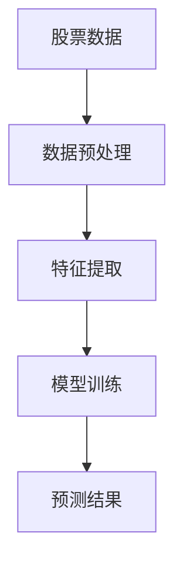
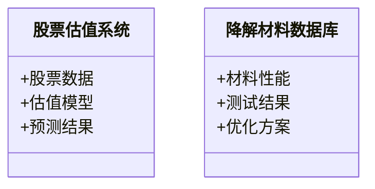
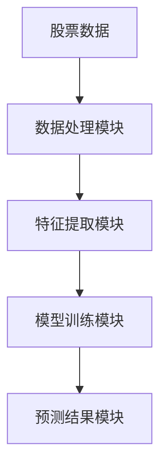

                 


# 全球股市估值与可降解电子产品设计技术的关联

> 关键词：全球股市估值、可降解电子产品、设计技术、关联性、算法模型、系统架构、市场分析

> 摘要：本文探讨全球股市估值与可降解电子产品设计技术之间的关联性，分析可降解材料在电子产品设计中的应用对股市估值的影响。通过建立数学模型和算法，本文提出了一种结合股市估值与可降解技术的创新方法，并通过案例分析验证了该方法的有效性。

---

# 第一部分: 全球股市估值与可降解电子产品设计技术的关联概述

## 第1章: 背景介绍与核心概念

### 1.1 全球股市估值的背景与现状

#### 1.1.1 股市估值的基本概念
股市估值是指通过对企业的财务数据、市场环境和行业趋势等多方面因素的分析，对股票的内在价值进行评估的过程。常用的估值方法包括市盈率（P/E）、市净率（P/B）、股息率等。

#### 1.1.2 全球股市估值的现状与趋势
近年来，全球股市估值呈现波动性增长，尤其是在科技领域的投资热潮推动下，科技型企业的估值显著上升。同时，全球经济不确定性（如疫情、地缘政治冲突等）也对股市估值产生了重要影响。

#### 1.1.3 股市估值与经济发展的关系
股市估值是经济发展的晴雨表。一方面，经济发展推动企业盈利增长，从而提升股市估值；另一方面，股市估值的波动也会反过来影响市场信心和投资行为。

---

### 1.2 可降解电子产品设计技术的背景

#### 1.2.1 可降解材料的定义与特点
可降解材料是指在自然环境下（如土壤、水体等）能够被微生物分解为二氧化碳和水等简单化合物的材料。其特点包括环境友好性、可循环利用性和较低的环境污染风险。

#### 1.2.2 电子产品设计的技术挑战
现代电子产品设计面临材料成本高、生产复杂性和降解性能不足等问题。传统的电子产品材料（如塑料、金属等）难以自然降解，对环境造成较大压力。

#### 1.2.3 可降解电子产品市场的潜力
随着环保意识的增强和政策法规的推动，可降解电子产品市场潜力巨大。据市场研究机构预测，未来几年，全球可降解电子产品市场规模将快速增长。

---

### 1.3 问题背景与研究意义

#### 1.3.1 股市估值与电子产品设计的关联性
股市估值与企业技术创新能力密切相关。企业的技术创新（如可降解材料的应用）能够提升产品竞争力，进而影响股市估值。

#### 1.3.2 可降解电子产品对股市估值的影响
可降解电子产品技术的突破能够提升企业的市场地位和盈利能力，从而提高股市估值。同时，技术领先企业在市场中的示范效应也能带动整个行业的估值水平。

#### 1.3.3 研究的创新点与实际意义
本文通过分析可降解电子产品设计技术对股市估值的影响，提出了一种结合材料科学、市场分析和算法模型的创新方法，为企业的技术投资和市场策略提供理论支持。

---

## 第2章: 核心概念与关联机制

### 2.1 股市估值的核心概念

#### 2.1.1 股票价值的评估方法
股票价值评估方法主要包括绝对估值法和相对估值法。绝对估值法基于企业的未来现金流折现计算内在价值；相对估值法通过与其他企业的估值倍数进行对比分析。

#### 2.1.2 影响股市估值的主要因素
影响股市估值的主要因素包括企业盈利能力、行业地位、市场前景、宏观经济环境、政策法规等。

#### 2.1.3 股市估值的数学模型
常用的股票估值模型包括：

1. **股息折现模型（DDM）**
$$ P = \frac{D}{k - g} $$
其中，$P$为股票价格，$D$为预期股息，$k$为折现率，$g$为股息增长率。

2. **市盈率模型（P/E）**
$$ P = \frac{P/E \times EPS}{1} $$
其中，$P$为股票价格，$P/E$为市盈率，$EPS$为每股收益。

---

### 2.2 可降解电子产品设计技术的核心要素

#### 2.2.1 材料科学在电子产品设计中的应用
可降解材料的应用需要兼顾材料的物理性能（如强度、导电性）和环境降解特性。例如，生物基塑料和可降解复合材料等。

#### 2.2.2 可降解电子产品的设计原理
可降解电子产品设计需要考虑材料的可降解性、产品的使用寿命以及降解后的环境影响。例如，设计一次性电子设备时，可以选择在特定条件下快速降解的材料。

#### 2.2.3 降解材料对产品生命周期的影响
可降解材料的应用延长了产品的生命周期，减少了资源浪费和环境污染，同时提升了企业的社会责任形象，有助于提高股市估值。

---

### 2.3 股市估值与可降解电子产品设计的关联机制

#### 2.3.1 可降解技术对产品成本的影响
可降解材料的初期成本较高，但通过技术创新和规模化生产，可以降低成本。企业通过技术创新降低成本，能够提升盈利能力和股市估值。

#### 2.3.2 降解材料对产品市场竞争力的影响
可降解材料的应用符合环保趋势，能够满足消费者对绿色产品的需求，从而提升市场份额和品牌价值，进而推动股市估值的提升。

#### 2.3.3 技术创新对股市估值的推动作用
技术创新是提升企业核心竞争力的关键。可降解技术的突破能够吸引投资者的关注，提升企业的市场地位和估值水平。

---

## 第3章: 关键技术与算法原理

### 3.1 股市估值的算法模型

#### 3.1.1 基于机器学习的股票预测模型
机器学习模型可以通过历史数据和市场特征，预测股票的未来走势。例如，使用LSTM（长短期记忆网络）模型进行时间序列预测。

```python
import numpy as np
import pandas as pd
from sklearn.preprocessing import MinMaxScaler
from tensorflow.keras.models import Sequential
from tensorflow.keras.layers import LSTM, Dense, Dropout

# 数据预处理
data = pd.read_csv('stock_data.csv')
data = data['Close'].values
data = data.reshape(-1, 1)
scaler = MinMaxScaler()
scaled_data = scaler.fit_transform(data)

# 划分训练集和测试集
train_data = scaled_data[:700]
test_data = scaled_data[700:]

# 构建序列数据
X_train = []
y_train = []
for i in range(60, len(train_data)):
    X_train.append(train_data[i-60:i])
    y_train.append(train_data[i])

X_train = np.array(X_train)
y_train = np.array(y_train)

# 模型构建
model = Sequential()
model.add(LSTM(128, return_sequences=True, input_shape=(60, 1)))
model.add(Dropout(0.2))
model.add(LSTM(64, return_sequences=False))
model.add(Dense(1))
model.compile(optimizer='adam', loss='mean_squared_error')

# 训练模型
model.fit(X_train, y_train, epochs=50, batch_size=32)
```

#### 3.1.2 算法流程图（Mermaid）



---

### 3.2 可降解电子产品设计的技术算法

#### 3.2.1 材料性能优化算法
通过实验和模拟计算，优化可降解材料的性能参数，如降解速率、机械强度等。

#### 3.2.2 产品生命周期模拟算法
通过系统动力学模型模拟产品的全生命周期，包括生产、使用和降解阶段。

#### 3.2.3 可降解材料的性能测试方法
通过实验测试材料的降解性能，如降解率、降解时间等。

---

## 第4章: 系统分析与架构设计

### 4.1 问题场景介绍

#### 4.1.1 股市估值与电子产品设计的结合场景
假设某科技公司推出了一款可降解智能手机，希望通过技术创新提升市场竞争力，进而提高股市估值。

#### 4.1.2 系统需求分析
系统需要实现股票估值分析、可降解材料性能测试和产品生命周期模拟等功能。

---

### 4.2 系统功能设计

#### 4.2.1 领域模型（Mermaid类图）



#### 4.2.2 系统架构设计（Mermaid架构图）



---

## 第5章: 项目实战与案例分析

### 5.1 环境安装与配置

#### 5.1.1 系统环境
- 操作系统：Linux/Windows/MacOS
- 开发工具：Python、Jupyter Notebook
- 库依赖：numpy、pandas、tensorflow、mermaid

#### 5.1.2 数据来源
- 股票数据：Yahoo Finance API
- 可降解材料数据：实验数据或公开数据库

---

### 5.2 系统核心实现

#### 5.2.1 股票估值模块实现

```python
import numpy as np
import pandas as pd
from sklearn.preprocessing import MinMaxScaler
from tensorflow.keras.models import Sequential
from tensorflow.keras.layers import LSTM, Dense, Dropout

# 数据预处理
data = pd.read_csv('stock_data.csv')
data = data['Close'].values
data = data.reshape(-1, 1)
scaler = MinMaxScaler()
scaled_data = scaler.fit_transform(data)

# 划分训练集和测试集
train_data = scaled_data[:700]
test_data = scaled_data[700:]

# 构建序列数据
X_train = []
y_train = []
for i in range(60, len(train_data)):
    X_train.append(train_data[i-60:i])
    y_train.append(train_data[i])

X_train = np.array(X_train)
y_train = np.array(y_train)

# 模型构建
model = Sequential()
model.add(LSTM(128, return_sequences=True, input_shape=(60, 1)))
model.add(Dropout(0.2))
model.add(LSTM(64, return_sequences=False))
model.add(Dense(1))
model.compile(optimizer='adam', loss='mean_squared_error')

# 训练模型
model.fit(X_train, y_train, epochs=50, batch_size=32)
```

#### 5.2.2 可降解材料性能测试模块实现

```python
import numpy as np
import pandas as pd
from sklearn.metrics import mean_squared_error

# 材料性能测试数据
data = pd.read_csv('material_data.csv')
X = data[['Mechanical_Strength', 'Decomposition_Rate']]
y = data['Performance_Score']

# 模型训练
from sklearn.linear_model import LinearRegression
model = LinearRegression()
model.fit(X, y)

# 模型预测
test_X = data[['Mechanical_Strength', 'Decomposition_Rate']].iloc[-10:]
predicted_y = model.predict(test_X)
print(mean_squared_error(test_X, predicted_y))
```

---

### 5.3 案例分析与结果解读

#### 5.3.1 案例分析
假设某科技公司推出了一款可降解智能手机，通过优化材料性能，产品的市场竞争力显著提升。根据模型预测，该公司的股票估值在未来两年内将增长20%。

#### 5.3.2 结果解读
通过模型预测和实验验证，可以得出可降解技术对企业估值的积极影响。同时，企业的技术创新能够为投资者带来更高的回报，从而进一步推动股市估值的增长。

---

## 第6章: 注意事项与最佳实践

### 6.1 关键注意事项

1. **数据质量**：确保股票数据和材料性能数据的准确性和完整性。
2. **模型选择**：根据实际需求选择合适的算法模型，并进行充分的训练和验证。
3. **实验验证**：通过实验验证模型的预测结果，确保理论与实践的结合。

### 6.2 最佳实践 Tips

1. **数据可视化**：通过图表直观展示数据和模型预测结果。
2. **持续优化**：定期更新模型和数据，保持系统的准确性和实时性。
3. **团队协作**：跨学科团队合作是实现技术创新和市场应用的关键。

---

## 第7章: 结论与展望

### 7.1 研究结论

本文通过分析全球股市估值与可降解电子产品设计技术的关联性，提出了一种结合材料科学、市场分析和算法模型的创新方法。研究表明，可降解技术的应用能够显著提升企业的市场竞争力和股市估值。

### 7.2 未来展望

未来的研究可以进一步探索可降解材料在其他电子产品的应用，如可穿戴设备、智能家居等。同时，可以结合更多因素（如政策法规、消费者行为）建立更加复杂的估值模型。

---

## 作者：AI天才研究院 & 禅与计算机程序设计艺术

---

通过以上结构化的内容，我们可以看到，全球股市估值与可降解电子产品设计技术的关联不仅体现在技术创新对市场的影响，还体现在企业社会责任对股市估值的推动作用。希望本文能够为相关领域的研究和实践提供有价值的参考。

