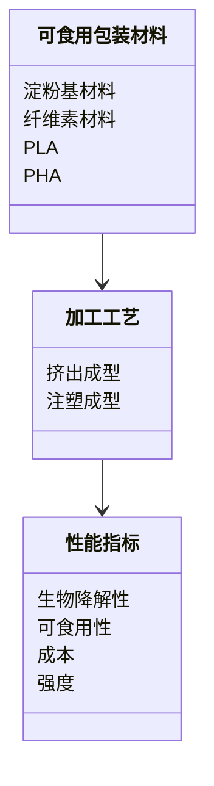
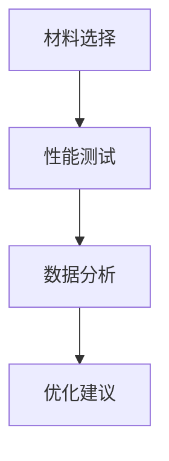

                 


```markdown
# 全球股市估值与可食用包装在减少塑料污染中的作用

---

## 关键词：
- 全球股市估值
- 可食用包装
- 塑料污染
- 环保技术
- 投资策略

---

## 摘要：
本文探讨了全球股市估值与可食用包装技术在减少塑料污染中的作用。首先，文章分析了全球股市估值的现状及其与环保技术的关联性，强调了可食用包装技术在环保领域的潜力。接着，文章详细介绍了可食用包装的核心原理、优势及市场前景，通过数学模型和算法分析了可食用包装技术对股市估值的推动作用。最后，结合实际案例，文章提出了投资策略建议，并展望了未来可食用包装技术在塑料污染治理中的应用前景。

---

## 第一章: 全球股市估值的现状与挑战

### 1.1 全球股市估值的基本概念
- 1.1.1 股市估值的定义与作用
  - 股市估值是通过对企业基本面、市场情绪和宏观经济指标等多因素的分析，对股票的内在价值进行评估。
  - 股市估值为企业提供融资支持，为投资者提供投资决策依据。
- 1.1.2 全球股市估值的现状分析
  - 全球股市规模持续增长，股票市场成为经济发展的核心驱动力。
  - 近年来，环保技术领域的投资热度上升，绿色金融成为全球关注的焦点。
- 1.1.3 股市估值的核心影响因素
  - 企业盈利能力、行业地位、技术创新能力、政策支持等。

### 1.2 可食用包装技术的发展与应用
- 1.2.1 可食用包装的定义与特点
  - 可食用包装是指可以直接食用或在特定条件下可降解的包装材料。
  - 其优势在于减少塑料污染，符合可持续发展的理念。
- 1.2.2 可食用包装材料的种类与性能
  - 天然高分子材料：如淀粉基材料、纤维素材料等。
  - 合成可降解材料：如PLA（聚乳酸）、PHA（聚羟基脂肪酸酯）等。
- 1.2.3 可食用包装在减少塑料污染中的作用
  - 替代传统塑料包装，减少白色污染。
  - 降低环境负担，推动绿色经济发展。

---

## 第二章: 可食用包装技术的核心原理

### 2.1 可食用包装材料的化学特性
- 2.1.1 天然高分子材料的特性与应用
  - 淀粉基材料：来源广泛，可降解性强。
  - 纤维素材料：生物降解性好，但加工难度较高。
- 2.1.2 合成可降解材料的优势与局限
  - PLA：生物基材料，降解性能优异。
  - PHA：可生物降解，但成本较高。
- 2.1.3 材料的生物降解性和可食用性对比
  - 生物降解性：材料在自然环境中分解的能力。
  - 可食用性：材料可被生物体直接利用或降解的能力。

### 2.2 可食用包装技术的加工工艺
- 2.2.1 材料制备的基本流程与关键步骤
  - 原料选择、材料合成、加工成型。
- 2.2.2 不同加工工艺对材料性能的影响
  - 挤出成型：影响材料的密度和强度。
  - 注塑成型：影响材料的均匀性和表面光滑度。
- 2.2.3 工艺优化与成本控制
  - 工艺优化：提高材料性能，降低成本。
  - 成本控制：通过技术创新和规模化生产降低成本。

---

## 第三章: 可食用包装技术的系统分析与架构设计

### 3.1 系统功能设计
- 3.1.1 可食用包装技术的领域模型（Mermaid 类图）

- 3.1.2 系统架构设计（Mermaid 架构图）
```mermaid
architectural
    系统边界
    [
        可食用包装材料选择
        加工工艺优化
        性能测试
    ]
    [
        数据采集
        数据分析
        结果输出
    ]
    [
        材料数据库
        工艺数据库
        性能数据库
    ]
```

### 3.2 可食用包装技术的数学模型与算法
- 3.2.1 性能评估模型（Mermaid 流程图）

- 3.2.2 算法原理（数学模型）
  - 性能评估公式：
  $$ S = \alpha \cdot P + \beta \cdot C + \gamma \cdot D $$
  其中，$S$ 为综合性能评分，$P$ 为生物降解性，$C$ 为成本，$D$ 为强度。
  - 参数 $\alpha$, $\beta$, $\gamma$ 分别表示各因素的权重。

---

## 第四章: 可食用包装技术在股市估值中的应用

### 4.1 可食用包装技术对股市估值的影响
- 4.1.1 可食用包装技术对企业的价值影响
  - 提高企业环保形象，增强市场竞争力。
  - 降低生产成本，提升利润率。
- 4.1.2 可食用包装技术对股市估值的推动作用
  - 技术创新推动股价上涨。
  - 环保政策支持提升企业估值。
- 4.1.3 可食用包装技术的市场潜力与投资机会
  - 投资可食用包装技术企业，获取超额收益。

### 4.2 可食用包装技术的全球发展趋势
- 4.2.1 全球可食用包装市场的现状与规模
  - 市场规模持续增长，年复合增长率超过10%。
  - 主要驱动力来自消费者环保意识的提升和政策支持。
- 4.2.2 可食用包装技术的创新与突破
  - 新材料研发：开发更高效、更低成本的可食用包装材料。
  - 工艺优化：提高生产效率，降低能耗。
- 4.2.3 可食用包装技术对塑料污染治理的贡献
  - 减少塑料垃圾产生，推动循环经济。
  - 促进绿色经济，实现可持续发展。

---

## 第五章: 可食用包装技术的项目实战

### 5.1 项目背景与目标
- 5.1.1 项目背景
  - 某企业推出可降解包装材料，计划在股市上市。
- 5.1.2 项目目标
  - 评估可降解包装材料对股价的影响。
  - 提供投资建议。

### 5.2 系统设计与实现
- 5.2.1 数据采集与处理
  - 收集企业财务数据、市场数据和政策数据。
- 5.2.2 算法实现与优化
  - 使用线性回归模型预测股价。
  - 优化模型参数，提高预测精度。

### 5.3 实际案例分析
- 5.3.1 某企业的可降解包装产品分析
  - 产品性能：生物降解率高，成本较低。
  - 市场反应：消费者认可度高，市场需求旺盛。
- 5.3.2 股价走势分析
  - 技术推出后，股价上涨幅度显著。
  - 投资回报率高，吸引大量投资者。

### 5.4 投资策略建议
- 5.4.1 短期投资策略
  - 重点关注可食用包装技术企业的技术创新和市场推广。
- 5.4.2 长期投资策略
  - 投资环保技术企业，分享绿色经济红利。

---

## 第六章: 结论与展望

### 6.1 主要观点总结
- 可食用包装技术在减少塑料污染中的作用显著。
- 可食用包装技术对股市估值的推动作用不可忽视。
- 环保技术投资具有广阔的市场前景。

### 6.2 未来展望
- 未来可食用包装技术将进一步创新，推动绿色经济发展。
- 可食用包装技术在股市中的应用将更加广泛，成为投资者的重要决策依据。

---

## 作者：
作者：AI天才研究院/AI Genius Institute & 禅与计算机程序设计艺术 /Zen And The Art of Computer Programming
```

