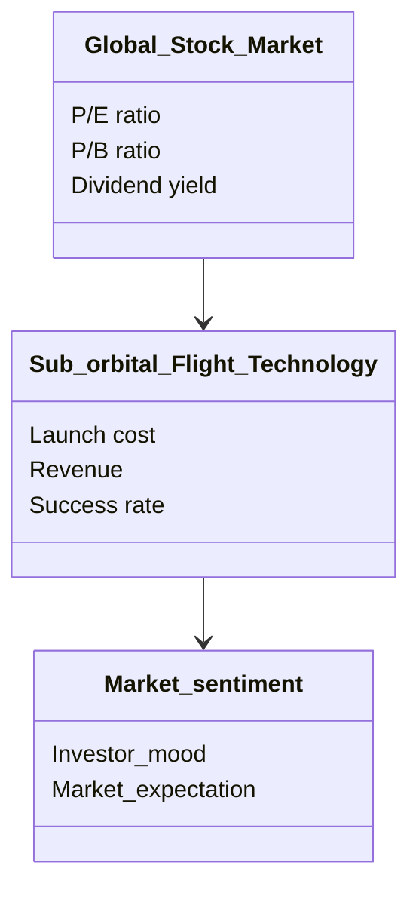

                 


# 全球股市估值与商业亚轨道飞行技术的关系

> 关键词：全球股市估值，商业亚轨道飞行技术，股市与技术关联，投资模型，数据驱动决策，技术影响市场

> 摘要：本文深入探讨了全球股市估值与商业亚轨道飞行技术之间的复杂关系。通过分析股市估值的核心指标和亚轨道飞行技术的关键特征，结合数学模型和系统设计，揭示了技术进步如何影响股市波动，以及股市如何反映技术发展的潜在经济价值。文章还通过实际案例分析，展示了如何利用数据驱动的方法进行投资决策，并提出了最佳实践建议。

---

# 第1章: 全球股市估值与商业亚轨道飞行技术的背景介绍

## 1.1 全球股市估值的基本概念

### 1.1.1 什么是全球股市估值
全球股市估值是指对全球范围内股票市场的整体价值进行评估。它通常通过市盈率（P/E）、市净率（P/B）、股息率等指标来衡量市场的整体健康状况。

### 1.1.2 全球股市估值的主要指标
- **市盈率（P/E）**：衡量股票价格相对于每股收益的比率。
- **市净率（P/B）**：衡量股票价格相对于每股净资产的比率。
- **股息率**：衡量股票的股息收益率。

### 1.1.3 全球股市估值的计算方法
股市估值通常基于市场参与者的预期和市场整体表现。例如，计算全球股市的平均市盈率可以帮助投资者了解市场的整体估值水平。

## 1.2 商业亚轨道飞行技术的基本概念

### 1.2.1 什么是商业亚轨道飞行技术
商业亚轨道飞行技术指的是利用火箭或其他飞行器在地球大气层以上但未达到地球同步轨道的区域进行商业运营的技术。

### 1.2.2 亚轨道飞行技术的核心要素
- **发射与回收技术**：火箭的发射和可重复使用技术。
- **载人与载货能力**：支持载人或货物的运输。
- **运营成本**：降低飞行成本以实现商业可行性。

### 1.2.3 商业亚轨道飞行技术的发展现状
近年来，SpaceX等公司推动了亚轨道飞行技术的商业化，降低了发射成本，提高了发射频率。

## 1.3 两者的联系与区别

### 1.3.1 全球股市估值与商业亚轨道飞行技术的关联性
- 亚轨道技术的进步可能会影响相关股票的估值。
- 股市的波动可能反映市场对新技术发展的预期。

### 1.3.2 两者的区别与互补性
- **区别**：股市估值是市场行为的结果，而亚轨道技术是技术创新的结果。
- **互补性**：股市为技术发展提供资金，技术进步推动股市增长。

---

# 第2章: 全球股市估值与商业亚轨道飞行技术的核心概念与联系

## 2.1 全球股市估值的核心原理

### 2.1.1 市场情绪对股市估值的影响
市场情绪可以通过投资者的心理预期影响股市估值。例如，乐观情绪可能导致市盈率上升。

### 2.1.2 公司基本面与股市估值的关系
公司基本面如盈利能力和财务状况直接影响其股票估值。

### 2.1.3 宏观经济指标对股市估值的驱动作用
GDP增长率、通货膨胀率等宏观经济指标会影响股市的整体估值。

## 2.2 商业亚轨道飞行技术的核心原理

### 2.2.1 亚轨道飞行的技术挑战
- 高度复杂的技术要求。
- 高昂的研发和运营成本。

### 2.2.2 商业化运营的模式与特点
- 降低成本以实现盈利。
- 提高发射频率以满足市场需求。

### 2.2.3 技术进步对商业亚轨道飞行的影响
技术进步如可重复使用火箭降低了发射成本，提高了市场竞争力。

## 2.3 两者的联系与相互作用

### 2.3.1 商业亚轨道飞行技术对全球股市的影响
- **直接投资影响**：投资者对相关公司的投资影响股市估值。
- **间接影响**：技术进步可能推动相关产业增长，间接影响股市整体估值。

### 2.3.2 全球股市对商业亚轨道飞行技术的支持作用
- **资金支持**：股市为技术发展提供资金。
- **市场预期**：股市波动反映市场对技术发展的预期。

### 2.3.3 两者关系的动态变化
随着技术进步和市场变化，两者的关联可能发生变化。

---

# 第3章: 全球股市估值与商业亚轨道飞行技术的数学模型与公式

## 3.1 全球股市估值的数学模型

### 3.1.1 市盈率模型
$$ P/E = \frac{\text{股价}}{\text{每股收益}} $$

### 3.1.2 市净率模型
$$ P/B = \frac{\text{股价}}{\text{每股净资产}} $$

### 3.1.3 股息率模型
$$ \text{股息率} = \frac{\text{每股股息}}{\text{股价}} \times 100\% $$

## 3.2 商业亚轨道飞行技术的数学模型

### 3.2.1 飞行成本模型
$$ \text{总成本} = \text{研发成本} + \text{生产成本} + \text{运营成本} $$

### 3.2.2 飞行收益模型
$$ \text{总收益} = \text{发射服务收入} + \text{技术授权收入} $$

### 3.2.3 技术成熟度模型
$$ \text{技术成熟度} = \frac{\text{成功发射次数}}{\text{总发射次数}} \times 100\% $$

## 3.3 两者的关联模型

### 3.3.1 综合估值模型
$$ \text{综合估值} = \alpha \times P/E + \beta \times \text{技术成熟度} $$

### 3.3.2 技术与市场的相互作用模型
$$ \Delta P/E = \gamma \times (\Delta \text{技术成熟度}) $$

---

# 第4章: 全球股市估值与商业亚轨道飞行技术的系统分析与架构设计

## 4.1 系统功能设计

### 4.1.1 领域模型（Mermaid类图）


### 4.1.2 系统架构设计（Mermaid架构图）


---

# 第5章: 全球股市估值与商业亚轨道飞行技术的项目实战

## 5.1 环境安装与数据准备

### 5.1.1 环境安装
- 安装Python和相关库（如Pandas、Matplotlib、Scikit-learn）。

### 5.1.2 数据准备
- 获取全球股市数据和亚轨道飞行技术相关的市场数据。

## 5.2 核心实现源代码

### 5.2.1 数据分析代码
```python
import pandas as pd
import matplotlib.pyplot as plt

# 加载数据
df = pd.read_csv('stock_data.csv')

# 计算市盈率
df['PE'] = df['Price'] / df['EPS']
df['PB'] = df['Price'] / df['BVPS']
df['Dividend_Yield'] = df['Dividend'] / df['Price']

# 绘制图表
plt.figure(figsize=(10, 6))
plt.plot(df['Date'], df['PE'], label='PE Ratio')
plt.plot(df['Date'], df['PB'], label='PB Ratio')
plt.xlabel('Date')
plt.ylabel('Ratio')
plt.legend()
plt.show()
```

### 5.2.2 技术分析代码
```python
from sklearn.linear_model import LinearRegression
import numpy as np

# 数据准备
X = np.array(df['Tech_Maturity']).reshape(-1, 1)
y = np.array(df['PE'])

# 模型训练
model = LinearRegression()
model.fit(X, y)

# 预测
predicted_PE = model.predict(X)
```

---

# 第6章: 总结与展望

## 6.1 最佳实践 tips
- 数据的准确性和及时性对模型的准确性至关重要。
- 定期更新模型以反映市场和技术的最新变化。

## 6.2 小结
本文探讨了全球股市估值与商业亚轨道飞行技术之间的关系，提出了数学模型和系统设计，并通过案例分析展示了如何利用数据驱动的方法进行投资决策。

## 6.3 注意事项
- 本模型仅供参考，实际投资需谨慎。
- 结合其他因素如政策和行业趋势进行综合分析。

## 6.4 拓展阅读
- 《股市技术分析》
- 《商业航天技术发展》

---

作者：AI天才研究院 & 禅与计算机程序设计艺术

