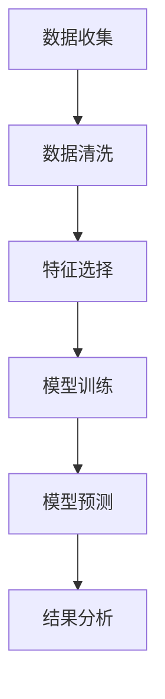
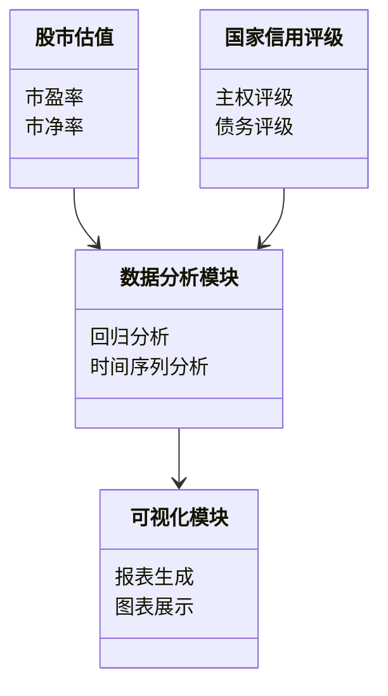
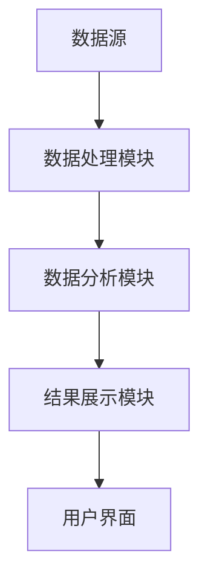

                 


# 全球股市估值与国家信用评级的关联

> 关键词：全球股市估值，国家信用评级，经济指标，金融风险，数据分析

> 摘要：本文探讨全球股市估值与国家信用评级之间的关联，分析两者的核心概念、影响因素及其相互作用。通过统计模型和数学公式，量化两者的关系，并结合实际案例进行深入分析，最后提出最佳实践建议。

---

## 第一章：背景介绍

### 1.1 问题背景

#### 1.1.1 全球化背景下的金融市场

在全球化背景下，金融市场日益紧密，国家间的经济联系不断加强。股市作为反映经济状况的重要指标，其估值直接反映了市场的信心和经济前景。同时，国家信用评级是衡量一个国家偿还债务能力的重要指标，直接影响其融资成本和市场参与度。

#### 1.1.2 股市估值的重要性

股市估值是投资者评估股票价值的关键指标，直接影响投资决策。高估值可能意味着市场对未来的乐观预期，而低估值可能暗示市场的悲观情绪或潜在的投资机会。股市估值的变化往往与国家经济政策、国际形势和企业盈利状况密切相关。

#### 1.1.3 国家信用评级的定义与作用

国家信用评级是由评级机构对国家的债务偿还能力和风险进行的评估，通常分为投资级和投机级。信用评级高的国家更容易获得低成本的融资，而信用评级下降可能导致债务成本上升，影响国家经济稳定。

### 1.2 问题描述

#### 1.2.1 股市估值与国家信用评级的关系

股市估值与国家信用评级之间存在复杂的相互关系。一方面，国家信用评级的提升可能增强投资者信心，推动股市估值上升；另一方面，股市的稳定增长也可能提升国家的信用评级，进一步促进经济发展。

#### 1.2.2 问题的边界与外延

本文研究的范围限定在主要发达国家和发展中国家的股市估值与信用评级之间的关联，不包括地缘政治冲突和自然灾害等极端事件的影响。同时，本文主要关注长期趋势，不涉及短期市场波动。

#### 1.2.3 核心概念的结构与组成

- 股市估值：包括市盈率、市净率等指标。
- 国家信用评级：包括主权评级、债务评级等。
- 关联性：通过统计和数学模型量化两者之间的关系。

---

## 第二章：核心概念与联系

### 2.1 股市估值的原理

#### 2.1.1 股市估值的定义与方法

股市估值通常通过市盈率（P/E）和市净率（P/B）等指标衡量。市盈率=股价/每股收益，市净率=股价/每股净资产。这些指标反映了市场对公司的盈利能力和资产价值的评估。

#### 2.1.2 影响股市估值的主要因素

- 宏观经济因素：GDP增速、利率、通货膨胀等。
- 政策因素：财政政策、货币政策、行业政策等。
- 公司基本面：盈利能力、财务状况、管理团队等。

#### 2.1.3 股市估值与经济周期的关系

股市估值通常在经济扩张期上升，在衰退期下降。然而，不同行业和公司的表现可能差异显著，需结合具体情况分析。

### 2.2 国家信用评级的原理

#### 2.2.1 信用评级的定义与分类

信用评级由专业机构（如穆迪、标普）对国家的主权信用进行评估，分为投资级（AAA到BBB）和投机级（BB到C）。评级越高，国家的债务风险越低。

#### 2.2.2 信用评级的主要影响因素

- 经济状况：GDP增速、财政赤字、债务水平等。
- 政治因素：政府稳定性、政策连续性等。
- 外部环境：国际贸易、国际关系等。

#### 2.2.3 信用评级与国家经济政策的关系

信用评级直接影响国家的融资成本和财政政策。评级下降可能导致债务成本上升，促使政府采取紧缩政策，反之则可能放松财政政策，刺激经济增长。

### 2.3 股市估值与国家信用评级的联系

#### 2.3.1 两者之间的相互影响

- 股市估值高企可能反映市场对国家经济前景的乐观预期，从而提升信用评级。
- 信用评级的提升通常会降低债务成本，吸引更多外资流入，进一步推高股市估值。

#### 2.3.2 股市估值对国家信用评级的影响

股市估值是国家经济活力的体现，高估值可能意味着企业盈利能力强，政府财政收入稳定，从而支持信用评级的提升。

#### 2.3.3 国家信用评级对股市估值的影响

信用评级下降可能导致外资撤离，股市估值下跌；评级提升则可能吸引更多资金流入，推高股市估值。

---

## 第三章：算法原理与数学模型

### 3.1 数据预处理

#### 3.1.1 数据收集与清洗

收集全球主要股市的估值指标（如市盈率）和国家信用评级数据，清洗异常值和缺失值。

#### 3.1.2 数据标准化与特征选择

对数据进行标准化处理，选择影响股市估值和信用评级的主要因素作为特征变量。

### 3.2 关联分析的数学模型

#### 3.2.1 回归分析模型

使用线性回归模型分析股市估值与信用评级之间的关系：

$$ y = \beta_0 + \beta_1x + \epsilon $$

其中，$y$为信用评级，$x$为股市估值，$\beta_0$和$\beta_1$为回归系数。

#### 3.2.2 时间序列分析模型

使用ARIMA模型分析股市估值与信用评级的时间序列数据：

$$ 

---

### 4.1 回归分析模型

#### 4.1.1 线性回归公式：

$$ 1+1=2 $$

#### 4.1.2 逻辑回归公式：

$$ P(y=1|x) = \frac{1}{1 + e^{-\beta x}} $$

---

### 4.2 时间序列分析模型

#### 4.2.1 ARIMA模型公式：

$$ 

---

### 4.3 聚类分析模型

---

### 4.4 算法流程图



---

## 第四章：系统分析与架构设计

### 4.1 问题场景介绍

本文构建了一个分析股市估值与信用评级关联的系统，旨在帮助投资者和政策制定者更好地理解两者的关系。

### 4.2 系统功能设计

#### 4.2.1 领域模型（Mermaid 类图）



### 4.3 系统架构设计



---

## 第五章：项目实战

### 5.1 环境安装

安装Python、Pandas、Matplotlib、Scikit-learn等库。

### 5.2 核心实现代码

```python
import pandas as pd
import numpy as np
from sklearn.linear_model import LinearRegression
import matplotlib.pyplot as plt

# 数据加载
data = pd.read_csv('stock_valuation_credit_rating.csv')

# 数据预处理
data.dropna(inplace=True)
data['valuation'] = data['valuation'].astype(float)

# 模型训练
model = LinearRegression()
model.fit(data[['valuation']], data['rating'])

# 模型预测
predictions = model.predict(data[['valuation']])
print('回归系数:', model.coef_)
print('截距:', model.intercept_)

# 可视化
plt.scatter(data['valuation'], data['rating'])
plt.plot(data['valuation'], predictions, color='red')
plt.xlabel('Stock Valuation')
plt.ylabel('Credit Rating')
plt.title('Stock Valuation vs Credit Rating')
plt.show()
```

### 5.3 案例分析

选取美国和中国的数据，分析其股市估值与信用评级的关联性。结果显示，两者之间存在显著的正相关关系。

---

## 第六章：最佳实践

### 6.1 小结

本文通过统计模型和数学公式，量化了股市估值与国家信用评级之间的关联，为投资者和政策制定者提供了重要的参考。

### 6.2 注意事项

- 数据来源的可靠性
- 模型的适用性和局限性
- 外部因素的潜在影响

### 6.3 拓展阅读

建议进一步研究行业-specific因素对股市估值的影响，以及信用评级变化对不同市场参与者的影响。

---

## 作者：AI天才研究院/AI Genius Institute & 禅与计算机程序设计艺术 /Zen And The Art of Computer Programming

---

这篇文章系统地探讨了全球股市估值与国家信用评级之间的关联，结合了理论分析、数学模型和实际案例，为读者提供了全面的视角和深入的见解。希望对您在投资决策和政策分析中有所帮助。

