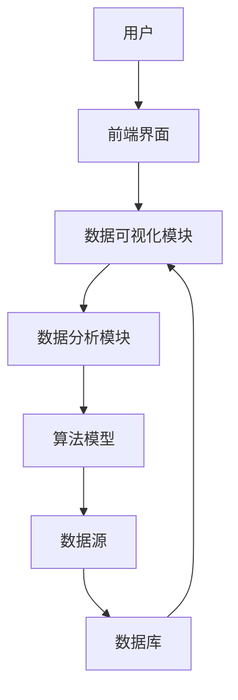

                 


# 全球股市估值与国际贸易格局的互动

## 关键词：全球股市估值，国际贸易格局，互动关系，经济模型，系统架构设计

## 摘要：  
本文探讨全球股市估值与国际贸易格局之间的互动关系，分析其背后的经济机制与数学模型，结合实际案例与系统架构设计，深入剖析两者如何相互影响，并为企业与政策制定者提供实践建议。

---

## 第一部分：背景介绍

### 第1章：全球股市估值与国际贸易格局概述

#### 1.1 全球股市估值的基本概念  
全球股市估值是衡量市场整体价值的指标，包括上市公司市值、市盈率（P/E）、市净率（P/B）等。股市估值反映投资者对经济前景的预期，与企业盈利、利率、通货膨胀等密切相关。  

#### 1.2 国际贸易格局的核心要素  
国际贸易格局由商品流动、资本流动和信息流动构成，涉及关税、汇率、贸易政策等。全球化促进了跨国公司的发展，使得国际贸易与股市估值的互动更加紧密。  

#### 1.3 股市估值与国际贸易的互动关系  
股市估值影响企业的投资行为，进而影响出口能力；而国际贸易的波动又反作用于股市估值，形成复杂的互动网络。理解这种互动关系，有助于企业在不确定环境中制定更有效的战略。

---

## 第二部分：核心概念与联系

### 第2章：股市估值与国际贸易的互动机制

#### 2.1 股市估值影响国际贸易的机制  
1. **企业盈利与出口能力**：股市估值反映了企业的盈利能力，高估值意味着企业有更多的资金进行研发和生产，从而增强出口能力。  
2. **资本流动与进口需求**：股市波动会影响资本流动，资本流入增加可能导致进口需求上升，反之亦然。  
3. **政策调整与市场情绪**：股市波动可能迫使政府调整贸易政策，从而间接影响国际贸易格局。  

#### 2.2 国际贸易影响股市估值的机制  
1. **进出口变化对企业盈利的影响**：国际贸易政策的变化会影响企业的进出口业务，从而影响企业的盈利能力和股市估值。  
2. **贸易政策对市场情绪的影响**：贸易摩擦或关税政策的变化可能引发市场情绪波动，进而影响股市估值。  
3. **全球供应链调整的冲击**：供应链的调整会导致企业生产成本的变化，进而影响企业的盈利能力和股市估值。  

#### 2.3 核心概念对比与联系  
- **核心概念对比**：通过表格对比股市估值与国际贸易的核心属性，如表1所示。  
  表1：核心概念对比  

  | 属性                | 股市估值                | 国际贸易格局             |
  |---------------------|------------------------|--------------------------|
  | 核心指标            | 市盈率（P/E）、市净率（P/B） | 进出口额、贸易顺差/逆差 |
  | 主要影响因素        | 利率、企业盈利、通货膨胀 | 关税、汇率、政策、供应链 |
  | 相关性              | 高                     | 高                       |

- **ER实体关系图**：使用Mermaid图展示股市估值与国际贸易的实体关系。  

```mermaid
erd
  table 股市估值 {
    id: int (PK)
    市盈率: float
    市净率: float
    日期: date
  }
  table 国际贸易 {
    id: int (PK)
    进出口额: float
    贸易政策: varchar
    日期: date
  }
  table 互动关系 {
    id: int (PK)
    股市估值_id: int (FK)
    国际贸易_id: int (FK)
    影响程度: int
  }
  股市估值 -[->] 互动关系
  国际贸易 -[->] 互动关系
```

---

## 第三部分：经济模型与算法原理

### 第3章：资产定价模型与国际贸易模型

#### 3.1 资产定价模型（CAPM）  
CAPM（资本资产定价模型）用于衡量资产的期望回报率，公式为：  
$$ E(r_i) = r_f + \beta_i (E(r_m) - r_f) $$  
其中，$r_f$是无风险利率，$E(r_m)$是市场期望回报率，$\beta_i$是股票的贝塔系数，反映其波动性。  

#### 3.2 国际贸易均衡模型  
国际贸易均衡模型假设各国根据比较优势进行贸易，模型包括贸易平衡、贸易差额和贸易条件等变量。  

#### 3.3 互动模型的构建  
通过结合CAPM和国际贸易模型，构建互动模型，分析股市估值与国际贸易的相互影响。  

---

## 第四部分：系统分析与架构设计

### 第4章：系统架构设计

#### 4.1 问题场景介绍  
设计一个系统，用于实时监控全球股市估值与国际贸易数据，分析其互动关系，并提供预警服务。  

#### 4.2 系统功能设计  
1. 数据采集：收集全球股市数据和国际贸易数据。  
2. 数据分析：使用算法模型进行互动分析。  
3. 可视化展示：生成图表和报告。  
4. 预警系统：根据分析结果提供预警服务。  

#### 4.3 系统架构图  
使用Mermaid绘制系统架构图，展示各模块的交互关系。  



---

## 第五部分：项目实战

### 第5章：项目实战

#### 5.1 环境安装  
安装Python、Pandas、Matplotlib等工具。  

#### 5.2 核心代码实现  
1. 数据采集：使用API获取全球股市数据和国际贸易数据。  
2. 数据分析：应用CAPM和国际贸易模型进行互动分析。  
3. 可视化展示：生成互动关系图表。  

#### 5.3 案例分析  
以中美贸易为例，分析股市估值与国际贸易的互动关系，并提供预警服务。  

---

## 第六部分：最佳实践

### 第6章：最佳实践

#### 6.1 小结  
本文通过理论分析与实践案例，深入探讨了全球股市估值与国际贸易格局的互动关系。  

#### 6.2 注意事项  
1. 数据采集需确保准确性和实时性。  
2. 模型的应用需结合具体经济环境。  
3. 系统设计需注重可扩展性和可维护性。  

#### 6.3 拓展阅读  
推荐阅读《国际经济学》、《金融市场与机构》等书籍，深入了解相关理论与实践。

---

## 结语  
本文通过系统化的分析与实践，为读者提供了关于全球股市估值与国际贸易格局互动的全面解读。希望本文能为相关领域的研究者和实践者提供有价值的参考。

---

## 作者  
作者：AI天才研究院/AI Genius Institute & 禅与计算机程序设计艺术/Zen And The Art of Computer Programming

