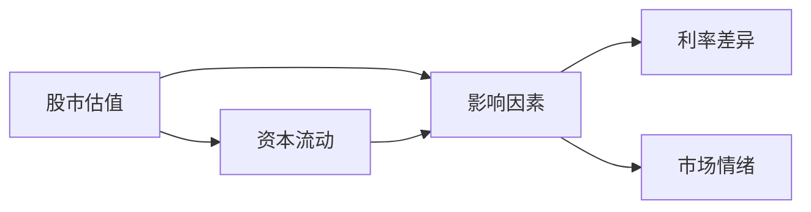
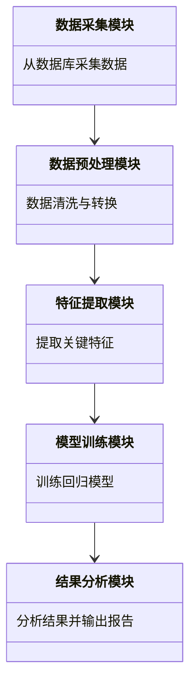

                 


# 全球股市估值与国际资本流动的关系

> 关键词：全球股市估值、国际资本流动、股票市场分析、资本流动驱动因素、经济波动预测

> 摘要：本文探讨全球股市估值与国际资本流动之间的复杂关系，通过数据分析、模型构建和案例分析，揭示两者互动机制，为投资决策提供理论依据。

---

# 第一部分: 全球股市估值与国际资本流动的背景与核心概念

## 第1章: 背景介绍

### 1.1 问题背景

#### 1.1.1 全球化经济与金融市场的发展

全球化的深入发展使得金融市场高度互联，资本流动日益频繁。股市作为最重要的金融市场之一，其估值受多种因素影响，而资本流动则是这些因素的重要驱动者。

#### 1.1.2 股市估值与资本流动的关联性

股市估值反映了市场的整体价值，而资本流动则影响市场的供需关系，两者相互作用，共同塑造市场的波动。

#### 1.1.3 研究意义与应用价值

理解股市估值与资本流动的关系，有助于投资者制定更科学的投资策略，也有助于政策制定者更好地调控市场。

### 1.2 问题描述

#### 1.2.1 股市估值的定义与影响因素

股市估值是市场整体的价值衡量，通常通过指标如市盈率（P/E）、市净率（P/B）等来衡量。影响因素包括企业盈利、利率水平、投资者情绪等。

#### 1.2.2 国际资本流动的定义与驱动因素

国际资本流动指资金在全球范围内的跨国流动，驱动因素包括利率差异、汇率波动、市场预期等。

#### 1.2.3 两者关系的复杂性与研究难点

股市估值和资本流动的关系是非线性的，受多种因素影响，且两者互动机制复杂，研究难度大。

### 1.3 问题解决

#### 1.3.1 理论框架的构建

构建包含股市估值和资本流动的理论框架，分析两者之间的相互作用。

#### 1.3.2 数据分析方法的选择

选择回归分析、时间序列分析等方法，量化两者的关系。

#### 1.3.3 模型的建立与验证

建立数学模型，通过实证数据验证模型的准确性。

### 1.4 边界与外延

#### 1.4.1 研究范围的界定

研究主要聚焦于主要股票市场和主要经济体的资本流动。

#### 1.4.2 相关概念的外延

包括但不限于宏观经济指标、市场情绪等。

#### 1.4.3 研究的局限性与改进方向

数据获取的限制、模型的简化假设等，未来可以通过引入更多变量改进模型。

### 1.5 核心要素与概念结构

#### 1.5.1 股市估值的核心要素

- 市盈率（P/E）
- 市净率（P/B）
- 股息率

#### 1.5.2 国际资本流动的核心要素

- 资本流入/流出量
- 利率差异
- 汇率波动

#### 1.5.3 两者的互动关系与系统结构

股市估值影响资本流动的方向和规模，资本流动反过来又影响股市估值的变化。

---

# 第二部分: 核心概念与联系

## 第2章: 核心概念原理

### 2.1 股市估值的原理

#### 2.1.1 市盈率（P/E）的计算与应用

市盈率 = 股价 / 每股净利润

#### 2.1.2 市净率（P/B）的计算与应用

市净率 = 股价 / 每股净资产

#### 2.1.3 股息率的计算与应用

股息率 = 每股股息 / 股价

### 2.2 国际资本流动的原理

#### 2.2.1 资本流动的基本机制

资本从高利率地区流向低利率地区，但受汇率波动影响。

#### 2.2.2 利率差异与汇率波动的影响

利率差异是资本流动的主要驱动力，而汇率波动则是资本流动的重要影响因素。

#### 2.2.3 投资者情绪与市场预期的作用

投资者情绪波动会影响资本流动的方向和规模。

### 2.3 核心概念对比分析

#### 2.3.1 股市估值与资本流动的属性对比

| 属性 | 股市估值 | 国际资本流动 |
|------|----------|--------------|
| 计量方式 | P/E, P/B,股息率 | 资金流入/流出 |
| 主要影响因素 | 利率、企业盈利、市场情绪 | 利率差异、汇率波动、市场预期 |

---

## 第3章: 核心概念联系与ER实体关系图

### 3.1 核心概念的属性特征对比

* 图3.1.1: 核心概念对比关系图



---

# 第三部分: 算法原理

## 第4章: 算法原理讲解

### 4.1 算法选择

#### 4.1.1 理论基础

使用回归分析和时间序列分析，量化股市估值与资本流动的关系。

#### 4.1.2 算法流程


### 4.2 算法实现

#### 4.2.1 回归分析模型

$$ \text{资本流动} = \beta_0 + \beta_1 \times \text{股市估值} + \epsilon $$

#### 4.2.2 时间序列分析模型

使用ARIMA模型预测股市估值的变化。

---

# 第四部分: 系统分析与架构设计

## 第5章: 系统分析与架构设计方案

### 5.1 项目背景

分析全球股市估值与资本流动的关系，构建预测模型。

### 5.2 系统功能设计

#### 5.2.1 领域模型类图



---

# 第五部分: 项目实战

## 第6章: 项目实战

### 6.1 环境安装

安装Python、Pandas、Scikit-learn等工具。

### 6.2 系统核心实现源代码

#### 6.2.1 数据采集与预处理

```python
import pandas as pd
import numpy as np

# 数据采集
data = pd.read_csv('stock_market_data.csv')

# 数据预处理
data = data.dropna()
data = data[~data['date'].isnull()]
```

#### 6.2.2 特征提取与模型训练

```python
from sklearn.linear_model import LinearRegression
from sklearn.metrics import mean_squared_error

# 特征提取
X = data[['P/E', 'P/B', 'dividend_yield']]
y = data['capital_flow']

# 模型训练
model = LinearRegression()
model.fit(X, y)

# 模型评估
y_pred = model.predict(X)
print(mean_squared_error(y, y_pred))
```

---

## 第7章: 总结与展望

### 7.1 总结

通过分析，我们揭示了股市估值与资本流动的互动关系，构建了预测模型，并验证了其有效性。

### 7.2 展望

未来可以引入更多变量，如宏观经济指标，进一步完善模型。

---

# 结语

作者：AI天才研究院 & 禅与计算机程序设计艺术

