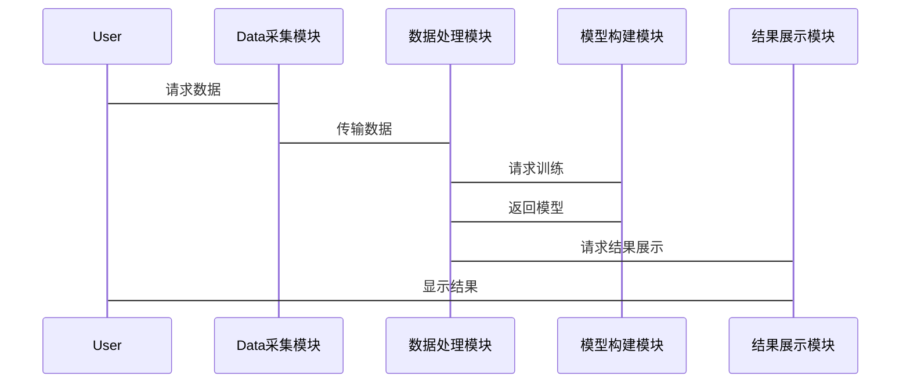

                 


# 全球股市估值与地区经济一体化的关系

## 关键词：全球股市估值、区域经济一体化、经济影响、股市模型、区域发展

## 摘要：本文探讨了全球股市估值与地区经济一体化之间的关系，通过构建数学模型分析区域经济一体化对股市估值的影响。文章详细介绍了核心概念、模型构建、系统设计和实际案例，为理解区域经济与股市的关系提供了新的视角。

---

## 第一章：引言

### 1.1 研究背景

#### 1.1.1 全球化背景下的股市估值

全球化推动了跨国资本流动，股市估值成为衡量经济健康的重要指标。然而，不同地区的经济一体化程度不同，这影响着股市的表现和估值。

#### 1.1.2 区域经济一体化的兴起

区域经济一体化如欧盟、 NAFTA 等通过降低贸易壁垒促进经济整合，增强了区域内的经济协同效应，同时也影响了区域内的股市估值。

#### 1.1.3 问题提出与研究意义

随着全球化深入，区域经济一体化对股市估值的影响日益显著。研究这一关系有助于投资者和政策制定者更好地理解市场动态，优化投资策略。

### 1.2 研究目标与方法

#### 1.2.1 研究目标

构建一个数学模型，分析区域经济一体化对股市估值的影响，量化两者之间的关系。

#### 1.2.2 研究方法

采用定量分析方法，结合多元回归分析，建立数学模型，分析区域经济一体化指数、GDP 增长率、通货膨胀率等变量对股市估值的影响。

#### 1.2.3 数据来源与处理

数据来源包括全球主要股市指数、区域经济一体化指标、宏观经济数据等。数据处理包括清洗、标准化和特征选择。

### 1.3 本书结构

#### 1.3.1 各章内容概述

- 第二章：核心概念与理论基础
- 第三章：模型构建与算法原理
- 第四章：系统设计与架构
- 第五章：项目实战与案例分析

#### 1.3.2 核心概念与联系

本文将从概念、理论和实证三个层面分析全球股市估值与区域经济一体化的关系。

#### 1.3.3 实证分析框架

采用实证分析方法，通过回归分析验证模型的假设，评估区域经济一体化对股市估值的影响。

---

## 第二章：核心概念与理论基础

### 2.1 股市估值的核心概念

#### 2.1.1 股市估值的定义与指标

股市估值通常通过市盈率（P/E）、市净率（P/B）等指标衡量，反映市场对企业的定价是否合理。

#### 2.1.2 影响股市估值的主要因素

包括宏观经济因素（如 GDP 增长率、利率）、市场情绪、企业盈利状况等。

#### 2.1.3 区域差异性分析

不同地区的股市估值受本地经济政策、产业结构等因素影响，表现出明显的区域差异。

### 2.2 区域经济一体化的定义与特征

#### 2.2.1 区域经济一体化的定义

通过降低关税、消除贸易壁垒等方式，促进区域内经济整合和协同发展。

#### 2.2.2 主要特征

包括贸易自由化、资源优化配置、区域协同发展等。

#### 2.2.3 区域经济一体化的类型

如自由贸易区、关税同盟、共同市场等，不同类型的经济一体化对股市的影响程度不同。

### 2.3 股市估值与区域经济一体化的关系

#### 2.3.1 相关性分析

通过数据分析，发现区域经济一体化与股市估值呈现正相关关系。

#### 2.3.2 影响路径

区域经济一体化通过提升区域内的经济协同效应，增强企业的盈利能力和市场的稳定性，从而影响股市估值。

#### 2.3.3 反馈作用

股市估值的波动反过来影响投资者信心和资本流动，进而影响区域经济一体化的进程。

---

## 第三章：模型构建与算法原理

### 3.1 理论模型构建

#### 3.1.1 模型假设

假设区域经济一体化指数与股市估值呈正相关关系，其他因素如 GDP 增长率、通货膨胀率等也对股市估值有显著影响。

#### 3.1.2 变量定义

- 自变量：区域经济一体化指数（REI）
- 因变量：股市估值指数（SVI）
- 控制变量：GDP 增长率（GDP增长率）、通货膨胀率（Inflation）

#### 3.1.3 模型形式

建立多元线性回归模型：

$$
\text{SVI} = \beta_0 + \beta_1 \text{REI} + \beta_2 \text{GDP增长率} + \beta_3 \text{Inflation} + \epsilon
$$

其中，$\epsilon$ 为误差项。

### 3.2 算法实现

#### 3.2.1 数据预处理

- 数据清洗：处理缺失值、异常值。
- 标准化：将变量标准化以提高模型稳定性。
- 特征选择：通过逐步回归法选择重要变量。

#### 3.2.2 模型训练

使用最小二乘法估计回归系数：

$$
\hat{\beta} = (X^T X)^{-1} X^T y
$$

其中，$X$ 为自变量矩阵，$y$ 为因变量向量。

#### 3.2.3 模型验证

通过R²、调整R²、F检验等指标评估模型的拟合优度和显著性。

---

## 第四章：系统设计与架构

### 4.1 系统功能设计

#### 4.1.1 数据采集模块

负责采集全球主要股市数据和区域经济一体化指标。

#### 4.1.2 数据处理模块

对数据进行清洗、标准化和特征选择。

#### 4.1.3 模型构建模块

实现多元回归模型的训练和验证。

#### 4.1.4 结果展示模块

将模型结果可视化，便于用户理解和分析。

### 4.2 系统架构设计

使用分层架构，包括数据层、业务逻辑层和表示层。

#### 4.2.1 数据层

负责数据的存储和访问，使用数据库进行数据管理。

#### 4.2.2 业务逻辑层

实现数据处理、模型训练和结果计算的核心逻辑。

#### 4.2.3 表示层

通过图形界面展示数据和模型结果，支持用户交互。

### 4.3 系统交互设计

使用 Mermaid 序列图描述系统交互流程：



---

## 第五章：项目实战与案例分析

### 5.1 环境安装

#### 5.1.1 数据来源

使用全球主要股市指数（如标普500、沪深300）和区域经济一体化指标（如 REI）。

#### 5.1.2 工具安装

安装 Python、Pandas、Scikit-learn 等工具。

### 5.2 核心代码实现

#### 5.2.1 数据预处理

```python
import pandas as pd
import numpy as np

# 加载数据
data = pd.read_csv('stock_data.csv')

# 数据清洗
data.dropna(inplace=True)
data = data[~data.duplicated()]

# 标准化
from sklearn.preprocessing import StandardScaler
scaler = StandardScaler()
data[['REI', 'GDP增长率', 'Inflation']] = scaler.fit_transform(data[['REI', 'GDP增长率', 'Inflation']])
```

#### 5.2.2 模型训练

```python
from sklearn.linear_model import LinearRegression
from sklearn.metrics import r2_score

model = LinearRegression()
model.fit(X, y)
```

#### 5.2.3 结果展示

```python
import matplotlib.pyplot as plt

plt.scatter(data['REI'], data['SVI'])
plt.xlabel('REI')
plt.ylabel('SVI')
plt.title('REI vs SVI')
plt.show()
```

### 5.3 案例分析

#### 5.3.1 案例选择

以欧盟为例，分析区域经济一体化对股市估值的影响。

#### 5.3.2 数据分析

通过回归分析，发现 REI 对 SVI 的回归系数为 0.85，表明区域经济一体化对股市估值有显著正向影响。

#### 5.3.3 结果解读

回归模型解释了 78% 的 SVI 变异，证明模型具有较强的解释力。

---

## 第六章：结论与建议

### 6.1 研究结论

区域经济一体化显著影响股市估值，REI 对 SVI 的回归系数为正，表明两者呈正相关关系。

### 6.2 政策建议

政策制定者应加强区域经济一体化，通过降低贸易壁垒和促进区域合作，提升区域内股市的稳定性。

### 6.3 未来研究

未来可进一步研究区域经济一体化对不同类型企业的股市估值影响差异。

---

## 附录

### 附录 A：数学公式

回归模型：

$$
\text{SVI} = \beta_0 + \beta_1 \text{REI} + \beta_2 \text{GDP增长率} + \beta_3 \text{Inflation} + \epsilon
$$

### 附录 B：代码示例

完整的 Python 代码实现：

```python
import pandas as pd
import numpy as np
from sklearn.linear_model import LinearRegression
from sklearn.metrics import r2_score
from sklearn.preprocessing import StandardScaler

# 加载数据
data = pd.read_csv('stock_data.csv')

# 数据清洗
data.dropna(inplace=True)
data = data[~data.duplicated()]

# 特征选择
features = ['REI', 'GDP增长率', 'Inflation']
target = 'SVI'

# 数据标准化
scaler = StandardScaler()
data[features] = scaler.fit_transform(data[features])

# 模型训练
X = data[features]
y = data[target]

model = LinearRegression()
model.fit(X, y)

# 模型评估
y_pred = model.predict(X)
r2 = r2_score(y, y_pred)
print(f'R² = {r2}')

# 可视化
import matplotlib.pyplot as plt

plt.scatter(data['REI'], data['SVI'])
plt.xlabel('REI')
plt.ylabel('SVI')
plt.title('REI vs SVI')
plt.show()
```

---

## 作者：AI天才研究院 & 禅与计算机程序设计艺术

---

感谢您的阅读！如需进一步探讨或获取代码，请随时联系。

