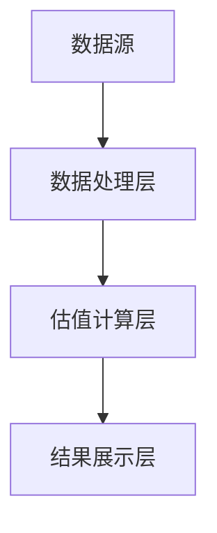
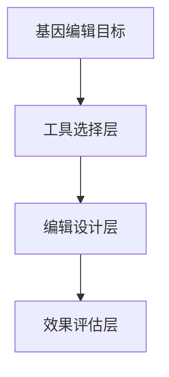

                 

# 全球股市估值与基因编辑技术在农业中的监管框架

## 关键词
- 全球股市估值
- 基因编辑技术
- 农业应用
- 监管框架
- 数学模型
- 项目实战

## 摘要
本文探讨了全球股市估值的核心概念与方法，以及基因编辑技术在农业中的应用及其监管框架。通过分析股市估值的数学模型和系统架构，结合基因编辑技术的实际案例，本文旨在为投资者和科学家提供理论与实践的双重指导，帮助他们更好地理解这两领域的复杂性和相互联系。

---

## 第一部分: 全球股市估值概述

### 第1章: 股市估值的基本概念

#### 1.1 股市估值的定义与重要性
- 股市估值的定义
- 估值在投资决策中的作用
- 市场风险评估与企业价值发现

#### 1.2 股市估值的核心要素
- 公司基本面分析
- 市场情绪与宏观经济因素
- 历史与未来业绩对比

#### 1.3 股市估值的分类与特点
- 市盈率、市净率、股息率等指标的分类
- 不同估值方法的优缺点对比

---

### 第2章: 股市估值的主要方法

#### 2.1 市盈率（P/E）法
- 公式与计算步骤
- 实际应用中的注意事项
- 案例分析：某上市公司的P/E估值

#### 2.2 市净率（P/B）法
- 公式与计算步骤
- 与P/E法的对比分析
- 案例分析：银行行业的P/B估值

#### 2.3 现金流折现法（DCF）
- 基本原理与步骤
- 折现率的确定方法
- 案例分析：科技公司的DCF估值

#### 2.4 其他估值方法
- EV/EBITDA法
- 股权价值法
- 方法对比与适用场景

---

### 第3章: 股市估值的核心概念与数学模型

#### 3.1 股市估值的关键指标
- 市盈率（P/E）公式：
  $$ P/E = \frac{Share Price}{Earnings Per Share} $$
- 市净率（P/B）公式：
  $$ P/B = \frac{Share Price}{Book Value Per Share} $$
- 股息率公式：
  $$ Dividend Yield = \frac{Dividend Per Share}{Share Price} \times 100\% $$

#### 3.2 股市估值的数学模型
- CAPM模型：
  $$ E(r) = r_f + β (R_m - r_f) $$
- WACC模型：
  $$ WACC = \frac{E}{V} r_d (1 - t) + \frac{D}{V} r_e $$

#### 3.3 案例分析：某上市公司的估值
- 使用不同方法进行估值并对比结果
- 通过数学模型计算公司的期望回报率

---

### 第4章: 股市估值的系统分析与架构设计

#### 4.1 股市估值系统的功能设计
- 数据采集模块：收集公司财务数据和市场数据
- 指标计算模块：计算P/E、P/B等指标
- 风险评估模块：评估市场风险和公司特有风险

#### 4.2 股市估值系统的架构设计

#### 4.3 股市估值系统的接口设计
- 数据接口：从数据库或API获取数据
- 用户接口：用户输入参数和查看结果
- 输出接口：生成报告和可视化图表

---

## 第二部分: 基因编辑技术在农业中的监管框架

### 第5章: 基因编辑技术的基础

#### 5.1 基因编辑技术的定义
- 基因编辑技术的概述
- CRISPR-Cas9技术的工作原理
- 基因编辑在农业中的应用前景

#### 5.2 基因编辑技术的核心要素
- DNA剪辑工具
- 基因表达调控
- 基因编辑的精确性和效率

#### 5.3 基因编辑技术的分类
- CRISPR-Cas9
- TALEN
- Cas9 nickase

---

### 第6章: 基因编辑技术在农业中的应用

#### 6.1 基因编辑技术在作物改良中的应用
- 抗病虫害作物的开发
- 营养强化作物的培育
- 农业可持续性提升

#### 6.2 基因编辑技术在动物改良中的应用
- 抗疫病动物的培育
- 畜牧业效率提升
- 动物性状优化

#### 6.3 基因编辑技术在农业中的实际案例
- 某农作物的基因编辑改良案例
- 某畜牧品种的基因编辑改良案例

---

### 第7章: 基因编辑技术的监管框架

#### 7.1 基因编辑技术的监管需求
- 产品安全评估
- 环境影响评估
- 食品安全评估

#### 7.2 不同国家的监管框架对比
- 美国、欧盟、中国等国家的监管政策
- 监管框架的异同点分析

#### 7.3 基因编辑技术的监管流程
- 产品审批流程
- 环境释放试验
- 食品安全评估

---

### 第8章: 基因编辑技术的系统分析与架构设计

#### 8.1 基因编辑技术系统的功能设计
- 基因编辑工具选择模块
- 基因编辑目标设计模块
- 基因编辑效果评估模块

#### 8.2 基因编辑技术系统的架构设计

#### 8.3 基因编辑技术系统的接口设计
- 工具接口：与CRISPR-Cas9等工具的交互
- 数据接口：基因数据的输入与输出
- 用户接口：用户输入目标基因和查看结果

---

## 第三部分: 项目实战与系统实现

### 第9章: 股市估值的项目实战

#### 9.1 环境安装与数据准备
- 数据源选择：Yahoo Finance API
- 数据清洗与预处理
- 数据存储：MySQL数据库

#### 9.2 股市估值系统的实现
- 数据采集模块实现：使用Python的requests库
- 指标计算模块实现：使用Pandas库进行数据分析
- 风险评估模块实现：使用Matplotlib进行可视化

#### 9.3 项目实战案例
- 某上市公司的多指标估值
- 不同估值方法的对比分析
- 系统交互流程设计

---

### 第10章: 基因编辑技术在农业中的项目实战

#### 10.1 环境安装与数据准备
- 工具安装：CRISPR-Cas9相关软件
- 数据源选择：公开的基因数据库
- 数据清洗与预处理

#### 10.2 基因编辑技术的实现
- 基因编辑工具选择：使用CRISPR-Cas9进行目标基因编辑
- 基因编辑设计：设计sgRNA序列
- 基因编辑效果评估：通过PCR和测序验证

#### 10.3 项目实战案例
- 某农作物的基因编辑改良
- 基因编辑效果的系统评估
- 监管框架下的项目实施

---

## 第四部分: 总结与展望

### 第11章: 总结与注意事项

#### 11.1 股市估值的核心总结
- 不同估值方法的优缺点
- 系统设计的关键点
- 项目实战中的经验教训

#### 11.2 基因编辑技术的总结
- 技术优势与挑战
- 监管框架的重要性
- 未来发展趋势

#### 11.3 综合总结
- 股市估值与基因编辑技术的联系
- 系统设计与项目实施的关键点
- 未来的研究方向

---

## 作者：AI天才研究院 & 禅与计算机程序设计艺术

---

* 本文为AI天才研究院及禅与计算机程序设计艺术的联合创作，转载请注明出处。

