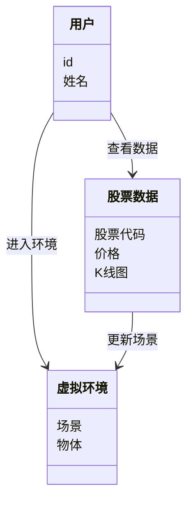
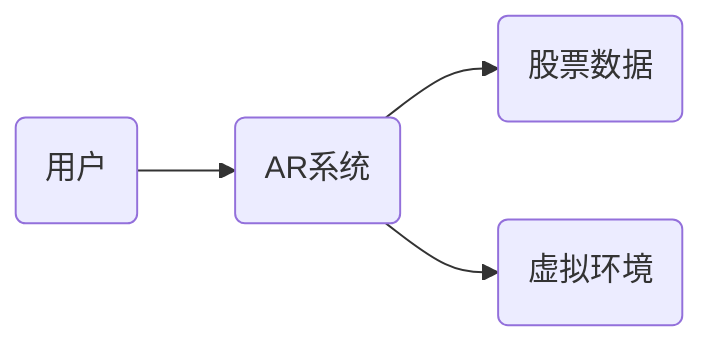
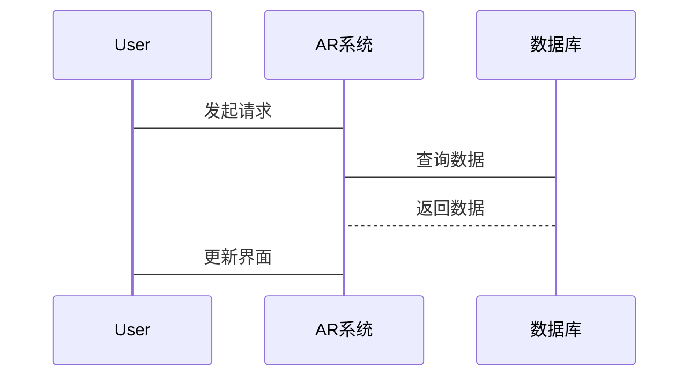

                 


# 全球股市估值与增强现实在远程协作中的应用

## 关键词：全球股市估值，增强现实，远程协作，数据可视化，实时协作，虚拟会议

## 摘要：本文深入探讨了全球股市估值与增强现实在远程协作中的应用，结合增强现实技术的核心原理，分析了其在股市数据可视化、实时协作和沉浸式体验中的实际应用。通过系统设计与项目实战，详细讲解了增强现实技术在远程协作中的具体实现方法，旨在为读者提供一个全面的技术视角，帮助他们理解如何利用增强现实技术提升股市估值与远程协作的效率和质量。

---

# 第1章: 全球股市估值与增强现实概述

## 1.1 全球股市估值的基本概念

### 1.1.1 股市估值的定义与核心要素
股市估值是指通过对公司基本面、市场环境和财务数据的分析，对股票的内在价值进行评估的过程。其核心要素包括：
- **公司基本面**：收入、利润、资产负债表等。
- **市场环境**：宏观经济指标、行业趋势等。
- **估值方法**：市盈率（P/E）、市净率（P/B）等。

### 1.1.2 增强现实的定义与核心原理
增强现实（AR）是指通过计算机技术将虚拟信息叠加在真实环境中，以提供更丰富的用户体验。其核心原理包括：
- **传感器输入**：摄像头、加速度计等。
- **计算机视觉**：图像识别、特征匹配。
- **渲染与叠加**：将虚拟内容与真实环境对齐并显示。

### 1.1.3 增强现实在股市估值中的潜力
通过增强现实技术，用户可以在虚拟环境中直观地查看和分析股市数据，提升数据可视化和决策效率。

---

## 1.2 增强现实技术的发展现状

### 1.2.1 增强现实技术的起源与演进
增强现实技术起源于20世纪60年代，随着计算机图形学和传感器技术的进步，逐步发展为当前的成熟技术。

### 1.2.2 增强现实在股市估值中的应用需求
- **实时数据可视化**：用户需要实时查看股票价格、K线图等数据。
- **沉浸式体验**：通过AR技术提供身临其境的股市分析环境。
- **远程协作**：支持多地团队通过AR技术进行实时协作。

### 1.2.3 远程协作中的增强现实应用前景
增强现实技术可以通过虚拟会议室、共享AR界面等方式，提升远程协作的效率和用户体验。

---

## 1.3 增强现实与全球股市估值的结合

### 1.3.1 问题描述
传统股市估值依赖于复杂的数学模型和数据分析工具，但在远程协作中存在以下问题：
- **数据可视化不足**：难以直观呈现复杂的数据关系。
- **协作效率低下**：团队成员难以实时共享和分析数据。
- **沉浸式体验缺失**：缺乏直观的交互和沉浸式体验。

### 1.3.2 问题解决的路径
通过增强现实技术，将股市数据与虚拟环境相结合，提供实时、直观的交互体验。

### 1.3.3 技术边界与外延
增强现实技术在股市估值中的应用边界包括：
- **数据可视化**：通过AR技术展示K线图、财务报表等。
- **实时协作**：支持多地团队通过AR界面实时协作。
- **沉浸式体验**：提供身临其境的虚拟环境，提升用户体验。

---

# 第2章: 增强现实的核心概念与原理

## 2.1 增强现实的核心概念

### 2.1.1 增强现实的定义与特征
增强现实通过将虚拟内容叠加在真实环境中，提供直观的交互体验。其主要特征包括：
- **实时性**：数据实时更新。
- **沉浸性**：用户沉浸在虚拟与真实结合的环境中。
- **交互性**：用户可以通过手势、语音等方式与虚拟内容交互。

### 2.1.2 增强现实与虚拟现实的对比分析
| 特性          | 增强现实（AR）         | 虚拟现实（VR）         |
|---------------|------------------------|------------------------|
| 环境          | 真实环境叠加虚拟内容   | 完全虚拟环境           |
| 交互方式      | 手势、语音、触控       | 手势、语音、触控       |
| 应用场景      | 教育、医疗、金融等     | 游戏、模拟训练等       |

### 2.1.3 增强现实的关键技术
- **计算机视觉**：用于定位和跟踪真实环境中的物体。
- **图形渲染**：将虚拟内容与真实环境对齐并渲染。
- **传感器技术**：用于获取真实环境中的数据。

---

## 2.2 增强现实的系统架构

### 2.2.1 增强现实系统的组成模块
- **传感器模块**：摄像头、加速度计等。
- **数据处理模块**：计算机视觉算法、图形渲染引擎。
- **用户界面模块**：AR显示界面、交互界面。

### 2.2.2 增强现实系统的功能流程


### 2.2.3 增强现实系统的数据流设计


---

## 2.3 增强现实与远程协作的结合

### 2.3.1 远程协作的核心概念
远程协作是指团队成员通过网络进行实时互动和合作，其核心包括：
- **实时通信**：通过网络实现数据同步。
- **共享界面**：团队成员共享相同的协作界面。
- **交互操作**：支持手势、语音等方式的协作。

### 2.3.2 增强现实在远程协作中的应用场景
- **虚拟会议室**：团队成员可以通过AR技术进入虚拟会议室，进行实时讨论。
- **共享数据可视化**：通过AR技术共享K线图、财务报表等数据。
- **协作工具**：支持团队成员在虚拟环境中共同编辑文档、图表等。

### 2.3.3 增强现实与远程协作的系统交互设计
```mermaid
sequenceDiagram
User1 -> AR系统: 发起协作请求
AR系统 -> User2: 发送邀请
User2 -> AR系统: 确认加入
AR系统 -> User1, User2: 显示共享界面
User1 -> AR系统: 发布数据
AR系统 -> User2: 更新界面
```

---

# 第3章: 全球股市估值的理论与方法

## 3.1 股市估值的基本理论

### 3.1.1 股票估值的定义
股票估值是通过对公司财务数据和市场环境的分析，评估股票的内在价值。

### 3.1.2 常见的股票估值方法
- **市盈率（P/E）**：股价除以每股收益。
- **市净率（P/B）**：股价除以每股净资产。
- **现金流折现法（DCF）**：通过现金流折现计算公司价值。

### 3.1.3 股票估值的数学模型
$$ V = \sum_{t=1}^{n} \frac{CF_t}{(1 + r)^t} $$
其中，\( V \) 是公司价值，\( CF_t \) 是第 \( t \) 年的现金流，\( r \) 是折现率。

---

## 3.2 市场分析与数据处理

### 3.2.1 市场分析的核心指标
- **宏观经济指标**：GDP、利率等。
- **行业趋势**：行业增长、竞争格局等。

### 3.2.2 数据处理的技术与工具
- **数据清洗**：处理缺失值、异常值。
- **数据可视化**：使用图表展示数据。
- **数据分析**：使用统计方法分析数据。

### 3.2.3 数据分析的流程
1. 数据采集。
2. 数据清洗。
3. 数据分析。
4. 数据可视化。

---

## 3.3 增强现实技术在股市估值中的应用

### 3.3.1 数据可视化
通过AR技术，用户可以在虚拟环境中直观地查看K线图、财务报表等数据。

### 3.3.2 实时协作
团队成员可以通过AR技术实时共享数据和分析结果。

### 3.3.3 沉浸式体验
用户可以通过AR技术身临其境地体验股市环境，提升分析效率。

---

# 第4章: 增强现实技术在股市估值中的应用

## 4.1 数据可视化

### 4.1.1 K线图的AR展示
通过AR技术，用户可以在虚拟环境中查看股票的K线图。

### 4.1.2 财务报表的AR展示
通过AR技术，用户可以在虚拟环境中查看公司财务报表。

---

## 4.2 实时协作

### 4.2.1 虚拟会议室
团队成员可以通过AR技术进入虚拟会议室，进行实时讨论。

### 4.2.2 数据共享
团队成员可以通过AR技术共享股票数据和分析结果。

---

## 4.3 沉浸式体验

### 4.3.1 虚拟股票交易所
用户可以通过AR技术身临其境地体验虚拟股票交易所。

### 4.3.2 沉浸式数据分析
用户可以通过AR技术沉浸式地分析股票数据。

---

# 第5章: 增强现实与远程协作的结合

## 5.1 虚拟会议室

### 5.1.1 进入虚拟会议室
团队成员可以通过AR技术进入虚拟会议室。

### 5.1.2 实时讨论
团队成员可以在虚拟会议室中进行实时讨论。

---

## 5.2 数据共享

### 5.2.1 股票数据共享
团队成员可以通过AR技术共享股票数据。

### 5.2.2 分析结果共享
团队成员可以通过AR技术共享分析结果。

---

## 5.3 协作工具

### 5.3.1 虚拟白板
团队成员可以通过AR技术在虚拟白板上共同编辑内容。

### 5.3.2 虚拟文档编辑
团队成员可以通过AR技术在虚拟文档中共同编辑内容。

---

# 第6章: 增强现实系统的架构设计

## 6.1 系统功能设计

### 6.1.1 领域模型


---

## 6.2 系统架构设计

### 6.2.1 系统架构


---

## 6.3 系统接口设计

### 6.3.1 用户接口
- **输入接口**：用户输入指令。
- **输出接口**：AR显示界面。

### 6.3.2 数据接口
- **数据输入接口**：接收股票数据。
- **数据输出接口**：输出分析结果。

---

## 6.4 系统交互设计

### 6.4.1 用户与AR系统交互


---

# 第7章: 项目实战

## 7.1 环境搭建

### 7.1.1 开发环境
- **操作系统**：Windows 10或更高版本。
- **开发工具**：Unity、Unreal Engine。

### 7.1.2 依赖安装
- **AR库**：OpenCV、ARKit。
- **数据处理库**：Pandas、NumPy。

---

## 7.2 核心代码实现

### 7.2.1 数据处理代码
```python
import pandas as pd
import numpy as np

def calculate_stock_value(data):
    # 计算股票价值
    return np.mean(data)
```

### 7.2.2 AR渲染代码
```python
import cv2

def ar_rendering(image, overlay):
    # 将.overlay图像叠加到.image上
    return cv2.addWeightedImage(image, 0.5, overlay)
```

---

## 7.3 案例分析

### 7.3.1 案例背景
分析某公司股票数据，使用AR技术进行实时估值。

### 7.3.2 分析过程
1. 数据采集。
2. 数据处理。
3. 数据可视化。
4. 实时协作。

### 7.3.3 分析结果
通过AR技术，团队成员可以实时查看股票数据并进行协作分析。

---

## 7.4 项目总结

### 7.4.1 核心代码总结
- 数据处理代码：使用Pandas和NumPy进行数据处理。
- AR渲染代码：使用OpenCV进行图像叠加。

### 7.4.2 项目成果
- 提升了股市估值的效率。
- 提高了团队协作的效率。

---

# 第8章: 扩展与未来趋势

## 8.1 前沿技术

### 8.1.1 AI与增强现实的结合
通过AI技术优化增强现实的性能和用户体验。

### 8.1.2 区块链与增强现实的结合
通过区块链技术确保增强现实数据的安全性和可信度。

---

## 8.2 挑战与未来趋势

### 8.2.1 当前挑战
- **技术成熟度**：增强现实技术仍需进一步成熟。
- **数据安全**：需要确保数据的安全性。

### 8.2.2 未来趋势
- **智能化**：增强现实将更加智能化。
- **普及化**：增强现实技术将更加普及。

---

## 8.3 最佳实践

### 8.3.1 小结
增强现实技术在股市估值和远程协作中的应用前景广阔。

### 8.3.2 注意事项
- **技术选型**：选择合适的技术和工具。
- **数据安全**：确保数据的安全性和隐私性。

### 8.3.3 拓展阅读
- 《增强现实技术与金融应用》
- 《远程协作的未来趋势》

---

# 作者：AI天才研究院/AI Genius Institute & 禅与计算机程序设计艺术 /Zen And The Art of Computer Programming

