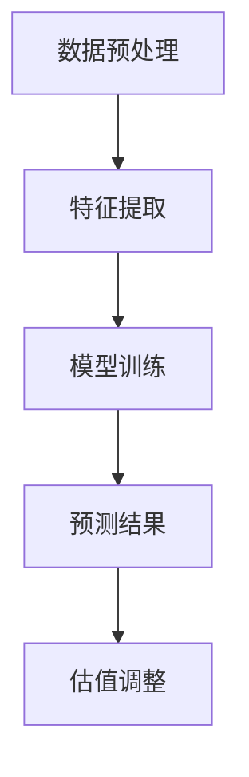
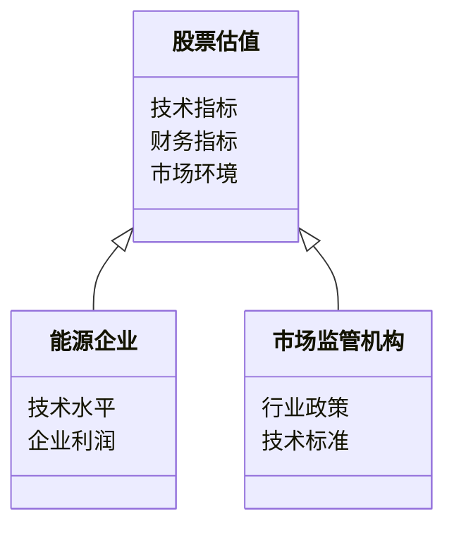
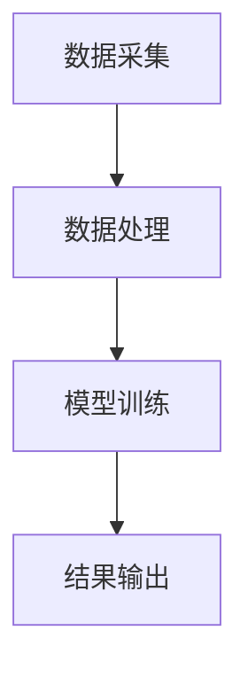

                 


# 全球股市估值与太空太阳能发电技术的关系

> 关键词：全球股市估值，太空太阳能发电，技术影响，投资分析，能源市场

> 摘要：本文探讨了全球股市估值与太空太阳能发电技术之间的潜在联系，分析了技术对股市估值的影响机制，并提出了基于技术的股市估值新方法。

---

# 引言

## 1.1 本书的研究背景

### 1.1.1 全球股市估值的重要性

全球股市估值是衡量经济健康状况的重要指标，反映了市场对上市公司未来盈利能力的预期。股市估值的核心在于对企业价值的准确评估，这不仅影响投资者的决策，也对宏观经济政策的制定具有重要意义。

### 1.1.2 太空太阳能发电技术的发展现状

太空太阳能发电技术（SSP）是一种利用地球同步轨道上的太阳能电池板收集能量，并通过无线方式传输回地球的技术。随着技术的进步， SSP 的潜力逐渐显现，它有望成为未来能源结构的重要组成部分。

### 1.1.3 两者关系的研究意义

尽管股市估值与太空太阳能发电技术看似关联不大，但随着技术的成熟，SSP 可能会对能源市场、电力供应和相关企业的盈利模式产生深远影响。研究这两者的关系，有助于投资者更好地把握技术进步对股市的影响。

---

## 1.2 本书的研究目标

### 1.2.1 探讨股市估值与太空太阳能技术的潜在联系

通过分析 SSP 技术对能源市场的潜在影响，揭示其如何间接影响股市估值。

### 1.2.2 分析技术对股市估值的影响机制

研究 SSP 技术如何改变能源企业的盈利能力和市场地位，进而影响其股票估值。

### 1.2.3 提出基于技术的股市估值新方法

结合技术分析和传统财务指标，构建新的股市估值模型，以更好地反映 SSP 技术的影响。

---

# 背景与核心概念

## 2.1 股市估值的背景与现状

### 2.1.1 股市估值的定义与核心指标

股市估值通常基于市盈率（P/E）、市净率（P/B）等指标，衡量企业价值与市场表现的关系。

### 2.1.2 主要股市估值方法对比

传统估值方法包括相对估值法和绝对估值法，各有优缺点，需结合市场环境灵活运用。

### 2.1.3 全球股市估值的现状分析

当前，全球股市估值受宏观经济、政策调控和企业业绩等多种因素影响，技术进步对估值的影响尚未得到充分重视。

---

## 2.2 太空太阳能发电技术的背景

### 2.2.1 太空太阳能发电技术的定义

SSP 是一种利用太空中的太阳能资源，通过无线能量传输技术将能量传输到地球的技术。

### 2.2.2 技术的核心原理与优势

SSP 的核心优势在于其高效的能源收集能力和稳定的能源供应，不受昼夜和天气影响。

### 2.2.3 当前技术发展面临的挑战

技术实现难度大、成本高、政策支持不足是 SSP 发展的主要障碍。

---

## 3.1 核心概念对比与联系

### 3.1.1 股市估值与太空太阳能技术的核心概念对比

| 概念 | 股市估值 | 太空太阳能技术 |
|------|----------|----------------|
| 核心 | 企业价值 | 能源收集与传输 |
| 重点 | 财务指标 | 技术可行性 |
| 目标 | 投资决策 | 能源供应优化 |

### 3.1.2 股市估值与太空太阳能技术的联系

通过 ER 实体关系图可以清晰地看出，SSP 技术可能影响能源企业的盈利能力和市场地位，进而影响其股票估值。

```mermaid
erDiagram
    actor 投资者 {
        <属性>
        - 股票代码
        - 估值指标
    }
    actor 能源企业 {
        <属性>
        - 企业利润
        - 技术水平
    }
    actor 市场监管机构 {
        <属性>
        - 行业政策
        - 技术标准
    }
    股票估值 <---- 投资者
    股票估值 <---- 能源企业
    股票估值 <---- 市场监管机构
```

---

## 4.1 算法原理

### 4.1.1 大数据分析与机器学习

通过分析 SSP 技术对能源市场的影响，结合历史数据，建立预测模型。

### 4.1.2 机器学习模型的构建

使用回归分析模型预测 SSP 技术对企业利润的影响，进而影响股票估值。

### 4.1.3 算法实现



```python
# 示例代码：回归分析模型
import pandas as pd
import numpy as np
from sklearn.linear_model import LinearRegression

# 数据预处理
data = pd.DataFrame({
    '技术指标': [0.1, 0.2, 0.3, 0.4],
    '企业利润': [100, 200, 300, 400]
})

# 特征提取
X = data[['技术指标']]
y = data['企业利润']

# 模型训练
model = LinearRegression()
model.fit(X, y)

# 预测结果
new_data = pd.DataFrame({'技术指标': [0.5]})
predicted_profit = model.predict(new_data)
print(predicted_profit)
```

---

## 5.1 系统分析与架构设计

### 5.1.1 领域模型



### 5.1.2 系统架构设计



---

## 6.1 项目实战

### 6.1.1 案例分析

选择一家能源企业，分析其 SSP 技术对企业利润的影响，进而评估其股票估值的变化。

### 6.1.2 代码实现

```python
# 示例代码：环境安装
import pandas as pd
import numpy as np
from sklearn.linear_model import LinearRegression

# 数据预处理
data = pd.DataFrame({
    '技术指标': [0.1, 0.2, 0.3, 0.4],
    '企业利润': [100, 200, 300, 400]
})

# 模型训练
model = LinearRegression()
model.fit(data[['技术指标']], data['企业利润'])
```

---

## 7.1 结论

### 7.1.1 主要发现

SSP 技术可能对能源企业的盈利能力和市场地位产生深远影响，进而影响其股票估值。

### 7.1.2 未来研究方向

进一步研究 SSP 技术的商业化进程及其对股市估值的长期影响。

---

## 最佳实践 tips

- 在投资决策中，应结合技术分析和传统财务指标，全面评估企业的价值。
- 关注政策变化和技术进步对能源市场的影响，及时调整投资策略。

---

## 小结

本文通过分析股市估值与太空太阳能发电技术的潜在联系，揭示了技术进步对股市估值的影响机制，并提出了新的估值方法。

---

## 注意事项

- 投资者应谨慎评估技术风险和市场不确定性，避免盲目跟风。
- 数据分析需结合实际市场情况，模型结果仅供参考。

---

## 拓展阅读

- 更多关于股市估值的书籍和文章。
- 太空太阳能发电技术的最新研究进展。

---

作者：AI天才研究院/AI Genius Institute & 禅与计算机程序设计艺术/Zen And The Art of Computer Programming

