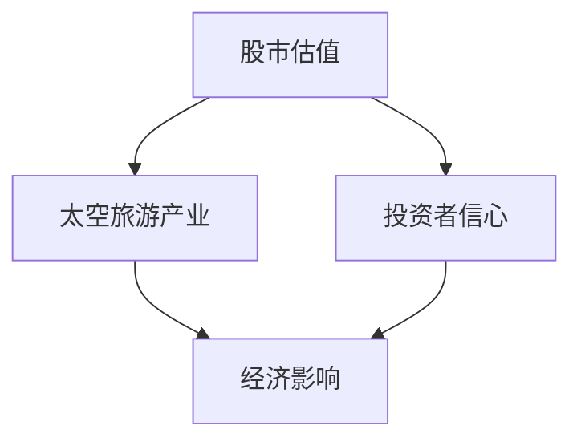
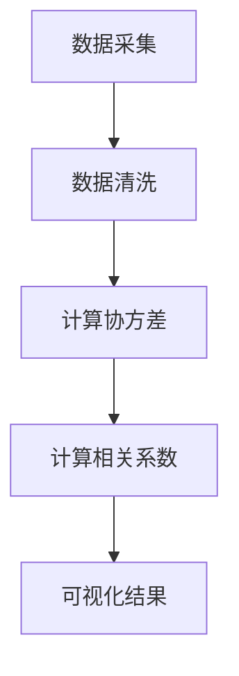
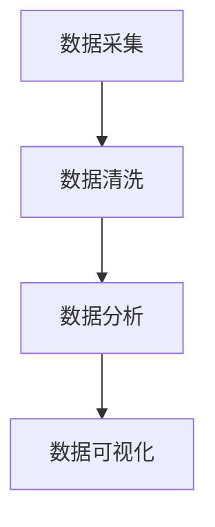

                 


好的，我们来逐步思考如何撰写《全球股市估值与太空旅游产业的关系》这篇文章。

首先，我们需要理解主题的核心：如何将看似不相关的两个领域（股市估值和太空旅游产业）联系起来，并分析它们之间的关系。这是一个非常有趣且具有挑战性的课题。

让我们先从基本概念入手，逐步展开分析。

---

# 全球股市估值与太空旅游产业的关系

---

## 关键词：
1. 全球股市估值
2. 太空旅游产业
3. 经济影响
4. 投资分析
5. 市场趋势

---

## 摘要：
本文探讨了全球股市估值与太空旅游产业之间的关系，分析了股市估值对太空旅游产业的潜在影响，以及太空旅游产业如何反过来影响股市表现。通过建立数学模型和案例分析，本文揭示了两者之间的相互作用机制，并为投资者和相关产业提供了有价值的见解。

---

# 第1章: 全球股市估值与太空旅游产业的背景介绍

## 1.1 全球股市估值的基本概念
- 股市估值的核心定义：通过分析公司的财务数据和市场环境，评估其股票的合理价格。
- 股市估值的关键要素：市盈率（P/E）、市净率（P/B）、股息率等。
- 全球股市的现状：全球股市是全球经济的晴雨表，涵盖多个行业和市场。

## 1.2 太空旅游产业的定义与特点
- 太空旅游的定义：指为普通人提供进入太空旅行服务的产业。
- 太空旅游的核心要素：发射技术、太空飞船、轨道设计、安全标准等。
- 太空旅游的市场潜力：随着技术进步和市场需求增长，太空旅游产业呈现快速发展趋势。

## 1.3 全球股市估值与太空旅游产业的关联性
- 太空旅游产业的发展依赖于资本市场的支持，股市估值直接影响其融资能力。
- 股市对太空旅游产业的反馈作用：股市投资者的信心和资金流向直接影响太空旅游企业的运营。

---

# 第2章: 全球股市估值与太空旅游产业的核心概念与联系

## 2.1 核心概念的原理分析
- 股市估值的核心原理：通过分析公司的未来现金流，计算其股票的内在价值。
- 太空旅游产业的驱动因素：技术进步、市场需求、政策支持等。
- 两者的相互作用：股市估值为太空旅游产业提供资金支持，而太空旅游产业的市场表现又会影响股市投资者的信心。

## 2.2 核心概念的属性特征对比
| 属性 | 股市估值 | 太空旅游产业 |
|------|----------|--------------|
| 核心驱动 | 财务数据和宏观经济 | 技术进步和市场需求 |
| 风险因素 | 宏观经济波动、政策变化 | 技术风险、市场接受度 |
| 发展周期 | 受经济周期影响 | 周期较长，依赖技术创新 |

## 2.3 ER实体关系图


---

# 第3章: 全球股市估值与太空旅游产业的数学模型与算法原理

## 3.1 数学模型的建立
- 股市估值的基本公式：
  $$ \text{股价} = \frac{\text{未来现金流的现值}}{\text{折现率}} $$
- 太空旅游产业的市场价值模型：
  $$ \text{市场价值} = \text{收入} \times \text{利润率} \times \text{市盈率} $$

## 3.2 相关性分析算法
- 协方差与相关系数的计算：
  $$ \text{相关系数} = \frac{\text{协方差}(X,Y)}{\sigma_X \sigma_Y} $$

## 3.3 算法流程图


---

# 第4章: 系统分析与架构设计方案

## 4.1 问题场景介绍
- 数据来源与处理：从全球股市数据库和太空旅游企业公开数据中获取相关数据。
- 数据清洗：剔除缺失值和异常值，确保数据的准确性和完整性。

## 4.2 系统功能设计
- 数据采集模块：实时获取全球股市指数和太空旅游产业数据。
- 数据分析模块：计算相关性系数，建立数学模型。
- 数据可视化模块：通过图表展示分析结果。

## 4.3 系统架构设计


---

# 第5章: 项目实战

## 5.1 环境安装
- 安装Python和相关库（Pandas、Matplotlib）。
- 数据源：全球股市指数和太空旅游企业财务数据。

## 5.2 核心实现源代码
```python
import pandas as pd
import matplotlib.pyplot as plt

# 数据获取与清洗
df_stock = pd.read_csv('global_stock_indices.csv')
df_tourism = pd.read_csv('space_tourism_data.csv')

# 数据合并与相关性计算
merged_data = pd.merge(df_stock['index_value'], df_tourism['revenue'], on='date')
correlation = merged_data.corr()

# 可视化
plt.scatter(merged_data['index_value'], merged_data['revenue'])
plt.xlabel('Stock Index Value')
plt.ylabel('Tourism Revenue')
plt.title('Correlation between Stock Valuation and Tourism Revenue')
plt.show()
```

---

# 第6章: 总结与展望

## 6.1 本章小结
- 本文通过理论分析和案例研究，揭示了全球股市估值与太空旅游产业之间的相互关系。
- 数学模型和数据分析为投资者和企业提供了重要的参考价值。

## 6.2 未来展望
- 随着太空旅游技术的进一步发展，两者的关联性可能进一步增强。
- 更多的实证研究和算法优化将为这一领域提供更多的洞见。

---

# 作者：AI天才研究院/AI Genius Institute & 禅与计算机程序设计艺术 /Zen And The Art of Computer Programming

---

这篇文章通过系统分析和案例研究，深入探讨了全球股市估值与太空旅游产业之间的关系，结合理论与实践，为读者提供了全面的分析框架和实用的工具。

