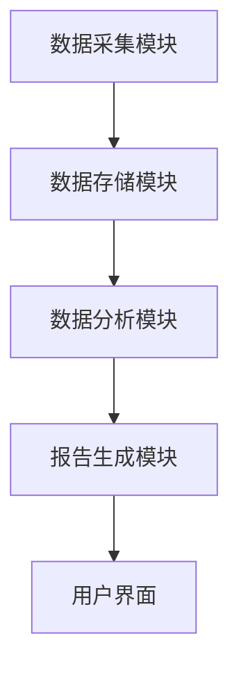

                 


# 全球股市估值与小型核聚变反应堆技术的发展

## 关键词：全球股市估值、小型核聚变反应堆、技术发展、投资分析、能源创新

## 摘要：  
本文探讨了全球股市估值与小型核聚变反应堆技术发展的相互影响。通过分析股市估值的核心概念、算法原理、数学模型，以及小型核聚变反应堆的技术特点和投资价值，本文揭示了两者在能源创新和投资策略中的深层联系。文章结合实际案例，展示了如何通过技术进步推动股市估值的变化，同时分析了核聚变技术对全球能源市场的潜在影响。

---

## 第一章: 全球股市估值的背景与现状

### 1.1 全球股市估值的基本概念

#### 1.1.1 股市估值的定义  
股市估值是指通过对公司财务数据、市场趋势和行业前景的分析，确定股票的合理市场价格。它是投资者决策的重要依据，也是衡量企业价值的核心指标。

#### 1.1.2 股市估值的主要方法  
股市估值主要采用以下方法：
1. **相对估值法**：基于市盈率（P/E）、市净率（P/B）等指标，对比同行业公司的估值水平。
2. **绝对估值法**：通过现金流折现模型（DCF）计算公司的内在价值。
3. **指数估值法**：基于市场整体指数（如标普500）的波动进行估值。

#### 1.1.3 全球股市估值的现状与趋势  
近年来，全球股市估值受经济波动、政策变化和技术进步的影响呈现多样化趋势。投资者 increasingly关注企业的可持续发展能力和技术创新能力，这使得科技类股票在股市中的估值权重显著提升。

---

### 1.2 小型核聚变反应堆技术的发展背景

#### 1.2.1 核聚变反应的基本原理  
核聚变是指轻核素（如氘和氚）在高温高压条件下发生聚变反应，释放大量能量的过程。与核裂变相比，核聚变具有清洁能源、资源丰富和安全系数高的特点。

#### 1.2.2 小型核聚变反应堆的技术特点  
小型核聚变反应堆具有以下特点：
1. **模块化设计**：便于安装和部署。
2. **低临界体积**：反应堆规模小，适合分布式能源需求。
3. **高温等离子体控制**：采用先进磁约束技术（如托卡马克）实现高温等离子体的稳定控制。

#### 1.2.3 核聚变技术的全球发展现状  
目前，全球多个国家和地区正在积极推进核聚变技术的研发，如欧盟的 ITER 项目、美国的 SPARC 项目和中国的 EAST 装置。小型核聚变技术的商业化应用正在逐步推进。

---

## 第二章: 股市估值与核聚变技术的关联性分析

### 2.1 股市估值与核聚变技术的相互影响

#### 2.1.1 核聚变技术进步对股市的影响  
核聚变技术的突破将对能源行业产生颠覆性影响，推动相关企业的股价上涨。例如，首家实现商业化的核聚变公司可能会获得市场的高度认可，带动整个板块的估值提升。

#### 2.1.2 股市资金流动对核聚变技术发展的推动作用  
股市资金的流入为核聚变技术的研发提供了重要的资金支持。投资者对技术创新的关注也促使相关企业在技术研发上加大投入。

---

### 2.2 核聚变技术企业的上市与估值分析

#### 2.2.1 核聚变技术企业的上市情况  
目前，全球已有部分核聚变技术企业成功上市，如美国的 TAE Technologies 和英国的 Tokamak Solutions。这些企业的上市为投资者提供了参与核聚变技术研发的途径。

#### 2.2.2 核聚变技术企业的估值模型  
核聚变技术企业的估值需要考虑以下因素：
1. **技术研发进展**：技术突破的阶段性和未来潜力。
2. **市场需求**：清洁能源的市场需求和政策支持。
3. **财务表现**：企业的研发投入、亏损情况和未来盈利预测。

#### 2.2.3 核聚变技术企业的财务表现与股价波动  
核聚变技术企业的财务表现直接影响其股价。例如，技术研发的突破性进展会带动股价上涨，而技术瓶颈的出现可能导致股价下跌。

---

## 第三章: 核聚变技术发展的驱动因素与挑战

### 3.1 核聚变技术发展的驱动因素

#### 3.1.1 能源需求增长  
随着全球能源需求的增加，清洁能源的开发成为必然趋势。核聚变技术作为理想的能源解决方案，具有广阔的市场前景。

#### 3.1.2 技术创新  
近年来，核聚变技术在材料科学、等离子体物理和工程控制等方面取得了显著进展，为商业化应用奠定了基础。

#### 3.1.3 政策支持  
各国政府通过政策支持和资金投入，推动核聚变技术的研发和商业化进程。

---

### 3.2 核聚变技术发展的挑战

#### 3.2.1 技术瓶颈  
核聚变技术的商业化仍面临诸多技术难题，如高温等离子体的稳定控制和材料的耐久性问题。

#### 3.2.2 投资成本高  
核聚变技术的研发和建设成本巨大，需要长期的资金投入和耐心资本。

#### 3.2.3 市场接受度  
核聚变技术的市场接受度与公众对核能的安全认知密切相关，公众对核聚变技术的认知和信任需要时间培养。

---

## 第四章: 股市估值与核聚变技术的数学模型分析

### 4.1 股市估值的数学模型

#### 4.1.1 现金流折现模型（DCF）  
DCF模型通过预测企业的未来现金流，并将其折现为现值，以确定企业的内在价值。其公式如下：

$$
\text{企业价值} = \sum_{t=1}^{n} \frac{\text{现金流}_t}{(1 + r)^t}
$$  

其中，\( r \) 为折现率，\( n \) 为预测期数。

#### 4.1.2 市盈率模型  
市盈率（P/E）是衡量企业股票价值的重要指标：

$$
\text{市盈率} = \frac{\text{股价}}{\text{每股收益}}
$$  

---

### 4.2 核聚变技术的数学模型

#### 4.2.1 聚变反应能量释放公式  
核聚变反应释放的能量可通过以下公式计算：

$$
E = mc^2
$$  

其中，\( E \) 为能量，\( m \) 为质量亏损，\( c \) 为光速。

#### 4.2.2 聚变反应的等离子体控制模型  
聚变反应的等离子体控制涉及磁场强度、温度和密度的综合调控。其数学模型可表示为：

$$
B = \frac{\mu_0 I}{2a}
$$  

其中，\( B \) 为磁场强度，\( \mu_0 \) 为真空磁导率，\( I \) 为电流，\( a \) 为导体半径。

---

## 第五章: 系统分析与架构设计方案

### 5.1 系统功能设计

#### 5.1.1 数据采集模块  
数据采集模块负责收集全球股市数据和核聚变技术企业的研发进展。

#### 5.1.2 数据分析模块  
数据分析模块通过机器学习算法对数据进行处理，生成估值报告。

#### 5.1.3 报告生成模块  
报告生成模块将分析结果以可视化形式呈现，供投资者参考。

### 5.2 系统架构设计



---

## 第六章: 项目实战

### 6.1 环境安装

#### 6.1.1 安装Python环境  
使用Anaconda安装Python 3.9及以上版本。

#### 6.1.2 安装相关库  
安装numpy、pandas、scikit-learn等库：

```bash
pip install numpy pandas scikit-learn
```

---

### 6.2 核心实现

#### 6.2.1 数据收集  
收集核聚变技术企业的历史股价数据和财务数据。

#### 6.2.2 模型训练  
使用时间序列分析模型（如ARIMA）进行股价预测。

#### 6.2.3 结果可视化  
将预测结果与实际股价进行对比，评估模型的准确性。

---

## 第七章: 最佳实践与总结

### 7.1 最佳实践

#### 7.1.1 数据来源的选择  
优先选择权威数据源，确保数据的准确性和可靠性。

#### 7.1.2 模型优化  
根据实际需求调整模型参数，提升预测精度。

#### 7.1.3 风险管理  
在投资决策中引入风险管理机制，降低市场波动带来的影响。

---

### 7.2 总结

本文通过分析全球股市估值与小型核聚变反应堆技术的发展，揭示了两者在能源创新和投资策略中的重要联系。随着核聚变技术的商业化进程加快，其对全球能源市场和股市估值的影响将更加显著。投资者应密切关注技术进展和市场动态，制定科学的投资策略。

---

## 作者：AI天才研究院/AI Genius Institute & 禅与计算机程序设计艺术 /Zen And The Art of Computer Programming

