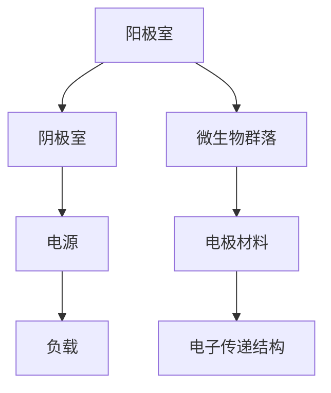

                 

# 全球股市估值与微生物燃料电池在废水处理中的应用

## 关键词：全球股市估值，微生物燃料电池，废水处理，投资策略，环境工程

## 摘要：本文探讨了全球股市估值与微生物燃料电池在废水处理中的应用。通过分析股市估值的基本概念、方法及其在全球范围内的应用，结合微生物燃料电池的工作原理和实际案例，揭示了两者在技术与经济上的潜在联系。文章旨在为投资者和环境工程师提供理论支持和实践指导。

---

## 第一部分：全球股市估值与投资策略

### 第1章：股市估值基础

#### 1.1 股市估值的基本概念

##### 1.1.1 股票的定义与分类
股票是公司的一部分所有权，分为普通股和优先股。普通股代表投票权和分红权，优先股则优先获得股息和本金偿还。

##### 1.1.2 股市估值的定义与意义
股市估值是评估股票内在价值的过程，帮助投资者判断股票是否被高估或低估。

##### 1.1.3 股市估值的核心要素
- **市盈率（P/E）**：股价与每股收益的比率。
- **市净率（P/B）**：股价与每股净资产的比率。
- **股息率**：每年股息与股价的比率。

#### 1.2 股市估值的主要方法

##### 1.2.1 市盈率法
通过比较股票的P/E与行业平均水平，判断其估值是否合理。

##### 1.2.2 市净率法
适用于资产密集型行业，评估股价与资产净值的匹配程度。

##### 1.2.3 股息率法
用于评估股票的分红能力，通常用于成熟行业。

##### 1.2.4 内在价值法
通过DCF模型估算企业未来现金流的现值，确定股票的合理估值。

#### 1.3 影响股市估值的主要因素

##### 1.3.1 宏观经济因素
包括GDP增长率、利率水平、通货膨胀率等。

##### 1.3.2 行业因素
行业周期、政策法规、技术进步等影响股票估值。

##### 1.3.3 公司基本面因素
收入、利润、资产负债率、ROE等财务指标。

---

### 第2章：全球股市估值分析

#### 2.1 全球主要股市概况

##### 2.1.1 美国股市
以纳斯达克和纽交所为代表，科技股占比较大，市盈率较高。

##### 2.1.2 欧洲股市
以德国DAX和法国CAC为代表，传统制造业和金融股较多。

##### 2.1.3 亚洲股市
以中国A股、日本日经指数为代表，成长股和蓝筹股并存。

#### 2.2 全球股市估值趋势

##### 2.2.1 长期趋势分析
长期趋势受经济发展、技术创新和政策影响，呈现波动上升。

##### 2.2.2 短期波动分析
受市场情绪、突发事件影响，呈现短期波动。

##### 2.2.3 市场情绪对估值的影响
投资者情绪通过买卖行为影响市场估值。

#### 2.3 估值指标对比

##### 2.3.1 不同市场的市盈率对比
比较各市场的P/E值，分析投资价值。

##### 2.3.2 市净率对比
评估各市场的资产定价合理性。

---

### 第3章：投资策略

#### 3.1 股票投资的基本策略

##### 3.1.1 长期投资策略
选择基本面良好、成长性强的股票，长期持有。

##### 3.1.2 短期交易策略
通过技术分析捕捉短期价格波动。

##### 3.1.3 被动投资与主动投资
被动投资跟踪指数，主动投资精选个股。

#### 3.2 技术分析与基本面分析

##### 3.2.1 技术分析方法
使用K线图、均线、RSI等指标预测价格走势。

##### 3.2.2 基本面分析方法
通过财务报表评估公司盈利能力。

##### 3.2.3 综合分析策略
结合技术与基本面分析，提高投资决策的准确性。

#### 3.3 风险管理与投资组合优化

##### 3.3.1 风险管理的基本原则
分散投资、设置止损、定期调整仓位。

##### 3.3.2 投资组合的构建与优化
根据风险偏好选择资产配置，优化收益与风险比。

##### 3.3.3 有效前沿理论与应用
通过有效前沿理论选择最优投资组合。

---

## 第二部分：微生物燃料电池在废水处理中的应用

### 第4章：微生物燃料电池的基本原理

#### 4.1 微生物燃料电池的定义与分类

##### 4.1.1 微生物燃料电池的定义
微生物燃料电池（MFC）是一种利用微生物的代谢活动产生电能的装置。

##### 4.1.2 不同类型微生物燃料电池的介绍
包括好氧型和厌氧型，根据电子传递路径分为直接和间接型。

#### 4.2 微生物燃料电池的工作原理

##### 4.2.1 电化学反应过程
阳极氧化反应和阴极还原反应，产生电流。

##### 4.2.2 微生物在燃料电池中的作用
将有机物分解为电子供体，驱动电路中的电子流动。

##### 4.2.3 电子传递机制
通过导电材料传递电子，维持电路的闭合。

### 第5章：微生物燃料电池在废水处理中的应用

#### 5.1 微生物燃料电池在废水处理中的优势

##### 5.1.1 环保性
减少化学处理，降低二次污染。

##### 5.1.2 能源回收潜力
利用微生物产生的电能，实现能源自给。

##### 5.1.3 处理效率
高效降解有机物，提高处理效果。

#### 5.2 微生物燃料电池在不同废水处理中的应用

##### 5.2.1 工业废水处理
应用于电子、化工等行业的废水处理。

##### 5.2.2 生活污水处理
处理居民生活污水，减少能源消耗。

---

### 第6章：微生物燃料电池的系统优化与应用

#### 6.1 系统设计与优化

##### 6.1.1 系统组成模块
包括阳极室、阴极室、微生物群落、电极材料等。

##### 6.1.2 工程设计与优化
通过调整微生物种类、电极材料和结构，提升处理效率。

#### 6.2 运行优化策略

##### 6.2.1 温度与pH优化
维持最佳运行条件，提高处理效率。

##### 6.2.2 电子受体选择
选择合适的电子受体，增强电化学反应。

#### 6.3 废水处理效果评估

##### 6.3.1 COD与BOD去除率
评估处理效果。

##### 6.3.2 能源回收效率
计算电能产出，评估经济性。

---

### 第7章：项目实战与案例分析

#### 7.1 项目实施

##### 7.1.1 环境搭建
设计实验装置，选择适合的微生物和电极材料。

##### 7.1.2 系统调试
调整参数，确保系统正常运行。

##### 7.1.3 数据收集与分析
记录处理效果和电能产出，分析优化方向。

#### 7.2 案例分析

##### 7.2.1 某工业园区废水处理项目
详细分析设计、实施和效果，总结经验。

---

## 结语

本文系统地探讨了全球股市估值与微生物燃料电池在废水处理中的应用，结合理论分析与实际案例，为投资者和环境工程师提供了有价值的参考。未来的研究可以进一步探索两者的结合，推动技术与经济的协同发展。

---

## 作者：AI天才研究院/AI Genius Institute & 禅与计算机程序设计艺术 /Zen And The Art of Computer Programming

---

### **附录：**

#### **附录A：股市估值计算公式**

市盈率（P/E）= 股价 / 每股收益  
市净率（P/B）= 股价 / 每股净资产  

#### **附录B：微生物燃料电池反应方程式**

阳极反应：有机物 → CO₂ + H₂O + 电子  
阴极反应：O₂ + 电子 → H₂O  

#### **附录C：系统架构图**

---

通过以上内容，希望为读者提供一个全面而深入的技术博客文章，涵盖股市估值与微生物燃料电池的理论与实践。

