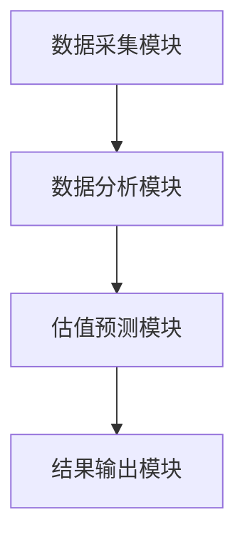
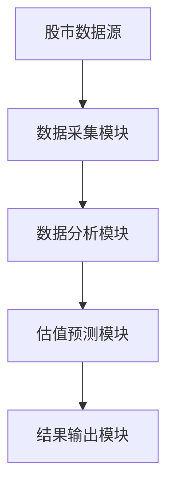

                 


# 全球股市估值与微生物燃料电池在环境修复中的应用

> 关键词：全球股市估值、微生物燃料电池、环境修复、系统架构、算法优化

> 摘要：本文探讨了全球股市估值与微生物燃料电池在环境修复中的应用。首先，介绍了全球股市估值的基本概念、主要方法及其数学模型。接着，详细讲解了微生物燃料电池的原理、设计优化及其在环境修复中的应用。最后，分析了两者之间的结合与优化，提出了系统的架构设计和实际应用案例。

---

## 第一部分: 背景与概述

### 第1章: 全球股市估值概述

#### 1.1 股市估值的基本概念
- 股市估值的定义
- 股市估值的核心要素
- 股市估值的分类与特点

#### 1.2 股市估值的主要方法
- 市盈率法
- 市净率法
- 现金流折现法
- 其他估值方法对比

#### 1.3 股市估值的数学模型与公式
- 市盈率公式
  $$ P/E = \frac{Price}{Earnings} $$
- 现金流折现模型
  $$ V = \sum_{t=1}^{n} \frac{CF_t}{(1+r)^t} + \frac{TV}{(1+r)^n} $$

#### 1.4 股市估值的挑战与边界
- 数据的实时性与准确性
- 市场波动对估值的影响
- 经济周期对估值的影响

#### 1.5 股市估值的核心要素对比
| 核心要素 | 描述 |
|---------|------|
| 市盈率 | 当前股价与每股收益的比值 |
| 市净率 | 当前股价与每股净资产的比值 |
| 现金流 | 企业未来现金流的折现值 |

### 第2章: 微生物燃料电池在环境修复中的应用

#### 2.1 微生物燃料电池的基本原理
- 微生物燃料电池的定义
- 微生物燃料电池的工作原理
- 微生物燃料电池的核心组件

#### 2.2 微生物燃料电池在环境修复中的应用
- 水处理中的应用
- 废气处理中的应用
- 土壤修复中的应用

#### 2.3 微生物燃料电池的优势与局限性
- 优势：高效、环保、低成本
- 局限性：技术复杂性、稳定性问题

#### 2.4 微生物燃料电池的设计优化
- 电极材料的选择
- 微生物群落的优化
- 反应条件的优化

---

## 第二部分: 核心技术与算法

### 第3章: 微生物燃料电池的优化设计与应用

#### 3.1 微生物燃料电池的设计优化
- 电极材料的选择
- 微生物群落的优化
- 反应条件的优化

#### 3.2 微生物燃料电池的系统集成
- 系统架构设计
- 系统功能模块
- 系统性能测试

#### 3.3 微生物燃料电池的优化算法
- 遗传算法优化
- 粒子群优化
- 模拟退火算法

### 第4章: 全球股市估值的系统分析与架构设计

#### 4.1 股市估值系统的功能需求
- 数据采集模块
- 数据分析模块
- 估值预测模块

#### 4.2 股市估值系统的架构设计
- 系统架构图（Mermaid）


#### 4.3 股市估值系统的接口设计
- 数据接口：API接口设计
- 用户接口：Web界面设计

#### 4.4 股市估值系统的交互流程
- 用户请求数据
- 系统处理数据
- 系统返回结果

---

## 第三部分: 项目实战与最佳实践

### 第5章: 全球股市估值的项目实战

#### 5.1 环境安装与配置
- 数据库安装：MySQL/MongoDB
- 开发工具安装：Python、Jupyter Notebook
- 网络数据获取：API接口调用

#### 5.2 系统核心实现源代码
```python
# 示例代码：市盈率计算
import pandas as pd

def calculate_pe_ratio(stock_data):
    pe_ratio = stock_data['Price'] / stock_data['Earnings']
    return pe_ratio

# 示例数据
data = {
    'Price': [100, 200, 300],
    'Earnings': [20, 30, 40]
}
df = pd.DataFrame(data)
print(calculate_pe_ratio(df))  # 输出：5.0, 6.666..., 7.5
```

#### 5.3 代码解读与分析
- 数据获取与预处理
- 数据分析与建模
- 结果展示与解释

#### 5.4 实际案例分析
- 某行业龙头企业的估值分析
- 市场波动对估值的影响
- 经济周期对估值的影响

#### 5.5 项目小结
- 项目成果总结
- 经验与教训
- 改进建议

### 第6章: 微生物燃料电池的优化设计与应用

#### 6.1 项目背景与目标
- 项目背景：环境修复需求
- 项目目标：优化微生物燃料电池性能

#### 6.2 优化算法实现
```python
# 示例代码：粒子群优化算法
import numpy as np

def fitness_function(position):
    # 定义适应度函数
    return np.sum(position**2)

def particle_swarm_optimization(n_particles, n_iterations):
    # 初始化粒子位置和速度
    positions = np.random.rand(n_particles, 2)
    velocities = np.zeros((n_particles, 2))
    best_positions = positions.copy()
    best_fitness = np.inf
    
    for _ in range(n_iterations):
        fitness = np.apply_along_axis(fitness_function, 1, positions)
        if fitness.min() < best_fitness:
            best_positions = positions.copy()
            best_fitness = fitness.min()
        
        # 更新速度和位置
        velocities = 0.5 * velocities + 0.3 * np.random.rand(n_particles, 2)
        positions = positions + velocities
    
    return best_positions, best_fitness

# 示例调用
best_positions, best_fitness = particle_swarm_optimization(100, 50)
print("最优位置:", best_positions)
print("最优适应度:", best_fitness)
```

#### 6.3 优化结果分析
- 算法收敛性分析
- 优化效果对比
- 实际应用中的表现

#### 6.4 项目小结
- 项目成果总结
- 经验与教训
- 改进建议

---

## 第四部分: 系统架构与交互流程

### 第7章: 全球股市估值与微生物燃料电池的系统架构

#### 7.1 系统架构设计
- 系统架构图（Mermaid）


#### 7.2 系统功能模块
- 数据采集模块
- 数据分析模块
- 估值预测模块
- 结果输出模块

#### 7.3 系统接口设计
- 数据接口：API接口设计
- 用户接口：Web界面设计

#### 7.4 系统交互流程
- 用户请求数据
- 系统处理数据
- 系统返回结果

---

## 第五部分: 最佳实践与小结

### 第8章: 最佳实践与总结

#### 8.1 小结
- 股市估值的核心要点
- 微生物燃料电池的核心要点
- 两者的结合与优化

#### 8.2 注意事项
- 数据的准确性和及时性
- 技术的可行性和经济性
- 系统的稳定性和可扩展性

#### 8.3 拓展阅读
- 推荐书籍：《股票估值入门》、《微生物燃料电池技术》
- 推荐网站：Financing Analytics、Environmental Science

---

## 作者

作者：AI天才研究院/AI Genius Institute & 禅与计算机程序设计艺术 /Zen And The Art of Computer Programming

---

感谢您的阅读！希望本文能为您提供有价值的见解和启示！

