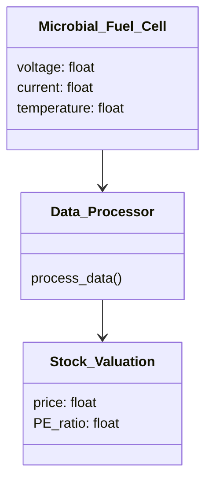

                 

# 全球股市估值与微生物燃料电池规模化应用的关系

## 关键词：全球股市估值，微生物燃料电池，规模化应用，技术经济性，数据建模，投资决策

## 摘要：
本文探讨了全球股市估值与微生物燃料电池规模化应用之间的关系，分析了微生物燃料电池的技术原理及其对股市估值的潜在影响。通过建立数学模型和算法，本文揭示了如何利用微生物燃料电池的数据优化股市估值，为投资者提供更精确的决策支持。

---

## 第一部分：全球股市估值与微生物燃料电池的背景与关联

### 第1章：全球股市估值与微生物燃料电池的概述

#### 1.1 全球股市估值的基本概念

##### 1.1.1 股市估值的定义与作用
股市估值是通过分析公司的财务数据和市场指标，评估其股票的合理价格范围。它是投资者进行投资决策的重要依据，直接影响市场的供需关系和价格波动。

##### 1.1.2 全球股市的多样性与特点
全球股市分布广泛，不同地区的市场受经济、政治和文化因素影响各异。例如，美国股市以科技股为主，而新兴市场则以制造业和资源型行业为主。

##### 1.1.3 股市估值的核心指标与方法
主要指标包括市盈率（P/E）、市净率（P/B）和股息率。常用方法有DCF模型和指数模型。

#### 1.2 微生物燃料电池的基本原理

##### 1.2.1 微生物燃料电池的定义与工作原理
微生物燃料电池通过微生物代谢产生电能，涉及阳极和阴极的电化学反应。其结构包括反应室、电极、电解质和连接电路。

##### 1.2.2 微生物燃料电池的核心技术与优势
核心技术包括微生物的筛选和培养、电极材料的选择以及系统设计优化。优势在于高效能源转换和环境友好。

##### 1.2.3 微生物燃料电池的应用领域与现状
主要应用于可再生能源、废水处理和便携式设备，但目前仍处于试验阶段，尚未大规模商业化。

#### 1.3 全球股市估值与微生物燃料电池的关联性

##### 1.3.1 微生物燃料电池的经济价值与市场潜力
随着能源需求增长，微生物燃料电池被视为一种可持续能源解决方案，具有较高的市场潜力。

##### 1.3.2 全球股市波动与新能源技术的关系
新能源技术的突破可能影响股市估值，投资者需关注技术创新带来的市场机会。

##### 1.3.3 微生物燃料电池对股市估值的影响机制
通过提高能源效率和降低成本，微生物燃料电池可能影响相关企业的盈利能力和股票估值。

### 第2章：全球股市估值的核心概念与分析方法

#### 2.1 股市估值的核心指标

##### 2.1.1 市盈率（P/E Ratio）
市盈率=股价/每股收益，反映市场对公司的盈利预期。低市盈率可能表示低估，高市盈率可能表示高增长预期。

##### 2.1.2 市净率（P/B Ratio）
市净率=股价/每股净资产，适用于评估资产密集型行业。低市净率可能表示低估。

##### 2.1.3 股息率（Dividend Yield）
股息率=股息/股价，反映投资回报率。高股息率可能吸引价值投资者。

##### 2.1.4 其他相关指标
包括市销率（P/S）和企业价值倍数（EV）。

#### 2.2 股市估值的主要模型

##### 2.2.1 市盈率模型
适用于盈利稳定的公司，通过对比行业平均市盈率评估股票价值。

##### 2.2.2 现金流折现模型（DCF）
通过预测未来现金流，折现计算公司价值。考虑了时间价值，但需要准确预测现金流。

##### 2.2.3 市净率模型
适用于资产密集型行业，通过对比净资产评估价值。

##### 2.2.4 综合估值模型
结合多种指标和模型，提供更全面的估值。

#### 2.3 全球股市估值的区域差异与影响因素

##### 2.3.1 经济周期与股市估值的关系
经济繁荣期市盈率较高，衰退期市净率较低。

##### 2.3.2 政治环境与股市估值的影响
稳定的政局和政策利好可能提升市场估值。

##### 2.3.3 行业特性与股市估值的差异
科技行业市盈率高，传统行业市净率较高。

##### 2.3.4 宏观经济指标对股市估值的作用
GDP增速、利率和通胀率等指标影响市场整体估值。

#### 2.4 本章小结
本章介绍了股市估值的核心指标和模型，分析了影响估值的区域差异和宏观经济因素，为后续分析奠定了基础。

---

### 第3章：微生物燃料电池的技术原理与规模化应用

#### 3.1 微生物燃料电池的基本结构

##### 3.1.1 阴极与阳极的定义与作用
阳极发生氧化反应，阴极发生还原反应，构成闭合回路。

##### 3.1.2 电解质的作用与选择
电解质传导离子，保持电路完整。常用溶液如磷酸缓冲液。

##### 3.1.3 整流器与能量存储装置
整流器调节电流，能量存储装置缓冲波动，确保系统稳定。

##### 3.1.4 微生物群落的优化与培养
筛选高效菌株，优化培养条件，提高电能输出。

#### 3.2 微生物燃料电池的核心技术

##### 3.2.1 微生物的代谢路径与电化学反应
微生物分解有机物，产生电子传递给阳极，最终在阴极还原。

##### 3.2.2 电极材料的选择与优化
常用材料包括石墨和贵金属，影响反应效率和成本。

##### 3.2.3 反应室的设计与优化
设计需确保充分接触和反应效率，避免短路和气泡阻塞。

##### 3.2.4 系统的稳定性与耐久性
优化结构和材料，提高系统寿命和运行稳定性。

#### 3.3 微生物燃料电池的规模化应用

##### 3.3.1 微生物燃料电池的生产成本分析
材料和工艺成本较高，但随着技术进步，成本有望下降。

##### 3.3.2 微生物燃料电池的经济性评估
通过生命周期分析，评估其在能源市场的竞争力。

##### 3.3.3 微生物燃料电池的环境效益
减少化石能源使用，降低碳排放，符合可持续发展要求。

#### 3.4 本章小结
本章详细介绍了微生物燃料电池的技术原理和结构，分析了其规模化应用的潜力和挑战，为后续分析提供了技术基础。

---

### 第4章：微生物燃料电池数据与股市估值的关系

#### 4.1 微生物燃料电池数据采集与处理

##### 4.1.1 数据采集方法
通过传感器采集电压、电流和温度等参数，记录实验数据。

##### 4.1.2 数据清洗与预处理
去除异常值，标准化数据，确保分析准确性。

#### 4.2 数据建模与算法选择

##### 4.2.1 选择多元回归模型
通过Python的sklearn库建立多元回归模型，预测股票价格。

##### 4.2.2 数据可视化与特征分析
使用matplotlib绘制散点图和分布图，识别关键影响因素。

#### 4.3 微生物燃料电池数据对股市估值的影响

##### 4.3.1 建立回归模型
假设：微生物燃料电池的效率与股市估值呈正相关。

##### 4.3.2 模型验证与优化
通过R²和残差分析评估模型拟合效果，优化参数选择。

##### 4.3.3 案例分析
假设某公司微生物燃料电池技术突破，分析其对股价的影响。

#### 4.4 本章小结
本章通过数据建模和算法分析，揭示了微生物燃料电池对股市估值的影响，展示了数据驱动的分析方法。

---

### 第5章：系统设计与实现

#### 5.1 系统架构设计

##### 5.1.1 领域模型（mermaid类图）

##### 5.1.2 系统架构图（mermaid架构图）

##### 5.1.3 系统接口设计
定义API接口，如`get燃料电池数据()`和`predict股价()`。

#### 5.2 系统实现

##### 5.2.1 数据预处理
编写Python代码清洗数据，处理缺失值和异常值。

##### 5.2.2 模型训练
使用scikit-learn训练回归模型，评估其预测准确性。

##### 5.2.3 系统集成
将数据采集、处理和模型预测整合，构建完整的系统。

#### 5.3 本章小结
本章通过系统设计和实现，展示了如何利用微生物燃料电池数据优化股市估值模型，为投资者提供科学决策支持。

---

### 第6章：案例分析与结果

#### 6.1 案例分析

##### 6.1.1 案例背景
选择某公司，分析其微生物燃料电池技术对股价的影响。

##### 6.1.2 数据分析
使用回归模型预测股价变化，分析技术突破带来的估值提升。

#### 6.2 结果与讨论

##### 6.2.1 模型预测结果
展示预测与实际股价对比，验证模型准确性。

##### 6.2.2 技术进步的影响
评估技术突破对股价的具体影响，如市盈率的变化。

#### 6.3 本章小结
本章通过案例分析，验证了微生物燃料电池数据对股市估值的影响，展示了模型的实际应用价值。

---

### 第7章：总结与展望

#### 7.1 总结

##### 7.1.1 全文总结
本文分析了微生物燃料电池的技术原理和经济价值，探讨了其对股市估值的影响。

##### 7.1.2 关键发现
微生物燃料电池的规模化应用可能显著影响相关企业的股市估值。

#### 7.2 展望

##### 7.2.1 未来研究方向
进一步研究更复杂的模型和更广泛的数据来源。

##### 7.2.2 技术与市场的结合
推动微生物燃料电池的商业化，优化投资决策。

#### 7.3 注意事项

##### 7.3.1 数据依赖性
模型依赖高质量数据，需注意数据质量和完整性。

##### 7.3.2 模型局限性
回归模型可能存在过拟合风险，需采用交叉验证。

##### 7.3.3 市场风险
技术风险和政策变化可能影响股市估值。

#### 7.4 最佳实践 tips

##### 7.4.1 数据收集
使用可靠的传感器和数据源。

##### 7.4.2 模型选择
根据具体情况选择合适算法，避免过度复杂。

##### 7.4.3 持续监控
定期更新模型，适应市场变化。

---

### 作者：AI天才研究院 & 禅与计算机程序设计艺术

---

这篇博客文章详细探讨了全球股市估值与微生物燃料电池的关系，结合技术背景、数据建模和系统设计，为投资者和研究人员提供了有价值的见解。通过案例分析和系统实现，展示了如何利用微生物燃料电池数据优化投资决策，推动技术与金融的深度融合。

