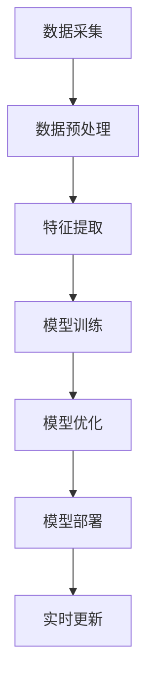

                 


# 全球股市估值与数字孪生技术的关联

> 关键词：全球股市估值，数字孪生，数据驱动，金融建模，实时分析

> 摘要：  
> 本文探讨了数字孪生技术在全球股市估值中的应用，分析了数字孪生如何通过实时数据处理、模型构建与动态调整提升股市估值的准确性。文章从数字孪生的基本概念出发，结合股市估值的核心指标与方法，深入剖析了数字孪生技术在数据采集、模型训练与可视化分析等方面的优势。通过实际案例与算法实现，展示了数字孪生技术如何为投资者提供更精准的估值支持，助力投资决策。

---

## 第一部分：全球股市估值与数字孪生技术的关联概述

### 第1章：全球股市估值的基础知识

#### 1.1 什么是全球股市估值

股市估值是通过对公司基本面、市场趋势、行业动态等多方面因素的分析，评估股票的内在价值，从而确定其合理的价格区间。全球股市估值的核心目标是帮助投资者在复杂的市场环境中做出更明智的投资决策。

- **1.1.1 股市估值的定义与意义**  
  股市估值是通过分析公司的财务数据、行业地位、市场前景等因素，计算出股票的理论价值，帮助投资者判断其价格是否被高估或低估。

- **1.1.2 全球股市估值的特点**  
  - 全球性：涉及全球多个市场的数据，具有跨市场的复杂性。  
  - 实时性：股市波动频繁，估值需要快速响应。  
  - 不确定性：受宏观经济、政策变化等多种因素影响，具有高度的不确定性。  

- **1.1.3 股市估值的核心指标**  
  - 市盈率（P/E）：股价与每股净利润的比率。  
  - 市净率（P/B）：股价与每股净资产的比率。  
  - 股息率：股息与股价的比率。  

#### 1.2 股市估值的主要方法

- **1.2.1 市盈率法**  
  通过比较公司股价与市盈率的行业平均水平，判断股票的估值高低。  

- **1.2.2 市净率法**  
  适用于重资产行业，通过比较股价与净资产的比率，评估股票的内在价值。  

- **1.2.3 股息率法**  
  通过比较股息与股价的比率，评估股票的收益能力。  

- **1.2.4 现金流折现法**  
  通过预测未来现金流，计算股票的内在价值。  

---

### 第2章：数字孪生技术的基本概念

#### 2.1 数字孪生的定义与特点

- **2.1.1 数字孪生的定义**  
  数字孪生是指通过物理世界的数据建模，构建一个虚拟的数字模型，实时反映物理对象的状态、性能和行为。  

- **2.1.2 数字孪生的核心特点**  
  - 实时性：能够实时反映物理对象的状态变化。  
  - 可视化：通过三维模型和数据可视化工具，直观展示对象的动态。  
  - 可预测性：通过模拟和预测，帮助用户做出决策。  

- **2.1.3 数字孪生与传统数字化的区别**  
  数字孪生不仅是一个数字表示，还包括实时数据的动态更新和模型的动态调整，具有更强的交互性和预测能力。  

#### 2.2 数字孪生技术的主要应用领域

- **2.2.1 制造业中的数字孪生**  
  通过数字孪生技术，实时监控生产线的状态，优化生产流程。  

- **2.2.2 建筑业中的数字孪生**  
  在建筑设计和施工过程中，通过数字孪生技术进行实时模拟和优化。  

- **2.2.3 智慧城市中的数字孪生**  
  通过数字孪生技术构建城市三维模型，实现城市规划和管理的数字化。  

---

### 第3章：全球股市估值与数字孪生技术的关联

#### 3.1 数字孪生技术在股市估值中的潜在应用

- **3.1.1 数据采集与处理**  
  通过数字孪生技术，实时采集全球股市的交易数据、公司财务数据、行业动态等，构建一个动态的数据模型。  

- **3.1.2 模型构建与分析**  
  利用数字孪生技术，构建股票估值的数学模型，分析股票的内在价值和市场趋势。  

- **3.1.3 可视化与决策支持**  
  通过数据可视化工具，将股票估值的结果以直观的方式呈现，辅助投资者做出决策。  

#### 3.2 数字孪生技术如何提升股市估值的准确性

- **3.2.1 数据实时性与完整性**  
  数字孪生技术能够实时更新数据，确保模型的准确性和完整性。  

- **3.2.2 模型的动态调整能力**  
  数字孪生技术可以根据市场变化动态调整模型参数，提高估值的实时性和准确性。  

- **3.2.3 可视化与决策支持的辅助作用**  
  通过可视化工具，投资者可以更直观地理解股票估值的结果，做出更明智的投资决策。  

---

## 第二部分：数字孪生技术在股市估值中的核心概念与联系

### 第4章：数字孪生技术在股市估值中的核心概念与联系

#### 4.1 核心概念原理

- **4.1.1 数字孪生的模型构建原理**  
  数字孪生模型通过数据采集、特征提取、模型训练等步骤，构建一个能够反映物理对象状态的数学模型。  

- **4.1.2 数据流的处理与分析**  
  数据流的处理包括数据清洗、特征提取、数据增强等步骤，确保模型的准确性和稳定性。  

- **4.1.3 可视化与决策支持的实现机制**  
  通过数据可视化工具，将模型的输出结果以图形化的方式呈现，辅助投资者做出决策。  

#### 4.2 数字孪生与传统估值方法的对比分析

- **4.2.1 核心概念对比表格**  
  | 对比维度 | 数字孪生 | 传统估值方法 |  
  |----------|----------|--------------|  
  | 数据来源 | 实时数据 | 历史数据 |  
  | 模型复杂度 | 高 | 低 |  
  | 决策支持 | 强 | 弱 |  

- **4.2.2 实体关系图（ER图）架构**  
  下面是一个简化的实体关系图：  
  ```mermaid
  graph TD
      A(Stock) --> B(Valuation)
      B --> C(Method)
      C --> D(Data)
  ```

---

## 第三部分：数字孪生技术在股市估值中的算法原理

### 第5章：数字孪生技术在股市估值中的算法原理

#### 5.1 算法原理概述

- **5.1.1 数据预处理与特征提取**  
  数据预处理包括数据清洗、缺失值处理等，特征提取则包括选择与股票估值相关的特征，如市盈率、市净率等。  

- **5.1.2 模型训练与优化**  
  使用机器学习算法（如随机森林、神经网络等）对特征数据进行训练，优化模型的准确性和稳定性。  

- **5.1.3 模型部署与实时更新**  
  将训练好的模型部署到生产环境，实时更新数据，确保模型的准确性和及时性。  

#### 5.2 算法流程图（mermaid）



#### 5.3 算法实现代码示例

```python
import pandas as pd
from sklearn.model import Model

# 数据预处理
data = pd.read_csv('stock_data.csv')
data = data.dropna()

# 特征提取
features = data[['feature1', 'feature2']]
target = data['target']

# 模型训练
model = Model()
model.fit(features, target)

# 模型预测
predictions = model.predict(features)
```

---

## 第四部分：数字孪生技术在股市估值中的系统分析与架构设计

### 第6章：数字孪生技术在股市估值中的系统分析与架构设计

#### 6.1 问题场景介绍

- **6.1.1 系统目标**  
  构建一个基于数字孪生的股市估值系统，实现股票的实时估值和预测。  

- **6.1.2 问题描述**  
  当前股市估值方法多基于历史数据，缺乏实时性和动态性，难以应对复杂的市场变化。  

#### 6.2 系统功能设计

- **6.2.1 领域模型类图**  
  下面是一个简化的领域模型类图：  
  ```mermaid
  classDiagram
      class Stock {
          - name: String
          - price: Float
          - valuation: Float
      }
      class ValuationMethod {
          + method: String
          + parameters: Map<String, Float>
      }
      class DataProvider {
          + provideData(): DataFrame
      }
  ```

- **6.2.2 系统架构图**  
  下面是一个简化的系统架构图：  
  ```mermaid
  architecture
      Client -->> WebServer: HTTP请求
      WebServer -->> ValuationService: 股票估值请求
      ValuationService -->> Database: 数据查询
      ValuationService -->> Model: 模型预测
  ```

- **6.2.3 系统接口设计**  
  - 输入接口：股票代码、时间范围等。  
  - 输出接口：股票估值结果、模型预测结果等。  

- **6.2.4 系统交互序列图**  
  下面是一个简化的系统交互序列图：  
  ```mermaid
  sequenceDiagram
      Client ->> WebServer: 发送股票代码
      WebServer ->> ValuationService: 请求股票估值
      ValuationService ->> Database: 查询历史数据
      ValuationService ->> Model: 进行模型预测
      ValuationService ->> Client: 返回估值结果
  ```

---

## 第五部分：数字孪生技术在股市估值中的项目实战

### 第7章：数字孪生技术在股市估值中的项目实战

#### 7.1 项目环境安装

- **7.1.1 环境要求**  
  - Python 3.8+  
  - Pandas、NumPy、Scikit-learn等库  

- **7.1.2 安装依赖**  
  ```bash
  pip install pandas numpy scikit-learn
  ```

#### 7.2 项目核心实现代码

```python
import pandas as pd
from sklearn.ensemble import RandomForestRegressor

# 数据加载
data = pd.read_csv('stock_data.csv')

# 数据预处理
data = data.dropna()

# 特征提取
features = data[['PE', 'PB', 'ROE']]
target = data['Price']

# 模型训练
model = RandomForestRegressor()
model.fit(features, target)

# 模型预测
new_features = pd.DataFrame({'PE': [15], 'PB': [2], 'ROE': [0.1]})
predicted_price = model.predict(new_features)
print(f'预测股价：{predicted_price[0]:.2f}')
```

#### 7.3 代码功能解读与分析

- **代码功能解读**  
  该代码通过随机森林回归模型，基于市盈率（PE）、市净率（PB）和净资产收益率（ROE）三个特征，预测股票的市场价格。  

- **模型分析**  
  随机森林是一种集成学习方法，能够有效处理非线性关系，适合股票估值这种复杂的问题。  

---

## 第六部分：数字孪生技术在股市估值中的最佳实践

### 第8章：数字孪生技术在股市估值中的最佳实践

#### 8.1 最佳实践 tips

- 数据质量是关键：确保数据的准确性和完整性。  
- 模型选择要谨慎：根据实际问题选择合适的算法。  
- 可视化工具要直观：帮助用户更好地理解数据和结果。  

#### 8.2 小结

数字孪生技术通过实时数据处理、动态模型调整和数据可视化，为全球股市估值提供了全新的思路和方法。它不仅提高了估值的准确性和实时性，还为投资者提供了更直观的决策支持工具。

#### 8.3 注意事项

- 数据隐私与安全：在处理敏感数据时，需要注意数据的隐私和安全问题。  
- 模型的可解释性：复杂的模型可能难以解释，需要在模型选择时权衡复杂性和可解释性。  

#### 8.4 拓展阅读

- 推荐阅读《机器学习实战》（《Hands-On Machine Learning with Scikit-Learn, Keras, and TensorFlow》），了解更多机器学习算法的应用。  
- 推荐阅读《数字孪生：智能制造的数字化双胞胎》（《Digital Twin: The Digital Simulation of Things》），深入理解数字孪生技术的核心概念。

---

## 第七部分：总结

### 第9章：总结

数字孪生技术通过实时数据处理、动态模型调整和数据可视化，为全球股市估值提供了全新的思路和方法。它不仅提高了估值的准确性和实时性，还为投资者提供了更直观的决策支持工具。未来，随着技术的不断发展，数字孪生技术将在股市估值中发挥更大的作用，为投资者带来更多的价值。

---

## 作者信息

作者：AI天才研究院/AI Genius Institute & 禅与计算机程序设计艺术 /Zen And The Art of Computer Programming

