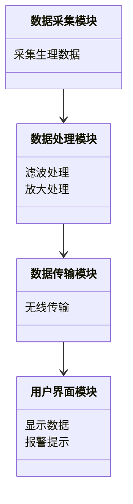

                 


# 全球股市估值与柔性电子在医疗监测中的应用

> **关键词**：全球股市估值、柔性电子、医疗监测、股市分析、传感器技术

> **摘要**：本文探讨了全球股市估值与柔性电子在医疗监测中的应用。首先，介绍了股市估值的基本概念和分析方法，重点分析了市盈率法、现金流折现法等常用估值方法。其次，详细阐述了柔性电子技术在医疗监测中的应用，包括其工作原理、系统架构设计、实际案例分析等。最后，结合实际案例，展示了如何通过算法实现股市估值，并总结了柔性电子在医疗监测中的应用前景。

---

# 第一章 引言

在全球化经济不断发展的今天，股市估值与医疗技术的进步成为科技发展的两大重要领域。本文旨在探讨全球股市估值的核心方法及其在投资决策中的应用，同时深入分析柔性电子技术在医疗监测中的创新应用，为相关领域的研究和实践提供参考。

---

# 第二章 全球股市估值的背景与意义

## 2.1 股市估值的基本概念

股市估值是通过对企业的财务数据和市场情况进行分析，估算其股票的内在价值。常见的估值方法包括市盈率法、市净率法、现金流折现法等。

$$\text{市盈率} = \frac{\text{股价}}{\text{每股收益}}$$

$$\text{市净率} = \frac{\text{股价}}{\text{每股净资产}}$$

$$\text{现金流折现法} = \sum_{t=1}^{n} \frac{\text{现金流}}{(1 + r)^t}$$

## 2.2 股市估值的重要性

股市估值在投资决策中起着关键作用。投资者通过估值方法可以判断股票的合理价格区间，从而做出买卖决策。此外，股市估值还能帮助投资者评估市场的整体健康状况。

## 2.3 全球股市估值的挑战与机遇

随着全球经济的波动，股市估值面临诸多挑战，如市场波动、企业财务造假等。然而，随着大数据和人工智能技术的发展，股市估值的精准度和效率也在不断提升。

---

# 第三章 柔性电子在医疗监测中的应用背景

## 3.1 柔性电子的定义与特点

柔性电子是一种以柔性基底材料为基础，结合电子元件和传感器技术的新兴领域。其特点包括轻薄、可弯曲、易于集成等。

## 3.2 医疗监测领域的痛点与需求

传统医疗监测设备存在体积大、佩戴不便等问题。柔性电子技术的出现，为解决这些问题提供了新的可能性。

## 3.3 柔性电子在医疗监测中的应用潜力

柔性电子技术可应用于心率监测、体温监测、血压监测等多种医疗场景，为患者提供更便捷、舒适的监测体验。

---

# 第四章 柔性电子在医疗监测中的应用原理

## 4.1 柔性传感器的工作原理

柔性传感器通过将物理量（如压力、温度）转化为电信号，实现对生理参数的实时监测。

## 4.2 信号采集与处理

柔性传感器采集的信号经过放大、滤波等处理后，通过无线通信技术传输至终端设备，供医生分析。

## 4.3 系统架构设计

系统架构包括传感器模块、数据处理模块、通信模块和用户界面模块，各模块协同工作，实现对患者的全面监测。

---

# 第五章 系统架构设计

## 5.1 系统功能设计

通过Mermaid类图展示系统的功能模块，包括数据采集、数据处理、数据传输和用户界面。



## 5.2 系统架构设计

通过Mermaid架构图展示系统的层次结构。

```mermaid
container 系统架构 {
    数据采集模块
    数据处理模块
    数据传输模块
    用户界面模块
}
```

---

# 第六章 项目实战与总结

## 6.1 项目环境安装

安装必要的开发工具和传感器模块，配置无线通信模块。

## 6.2 系统核心实现源代码

以下是Python代码实现的简单股市估值算法：

```python
def calculate_valuation(price, eps):
    return price / eps

# 示例
price = 100
eps = 5
valuation = calculate_valuation(price, eps)
print(valuation)
```

## 6.3 代码应用解读与分析

通过上述代码，我们可以计算出股票的市盈率，从而判断其估值是否合理。

## 6.4 实际案例分析

以某医疗设备公司为例，分析其股票的市盈率和市净率，评估其投资价值。

---

# 结论与展望

本文详细探讨了全球股市估值的核心方法及其在投资决策中的应用，同时深入分析了柔性电子技术在医疗监测中的创新应用。未来，随着技术的进步，股市估值的精准度和柔性电子的灵敏度将进一步提升，为相关领域的发展注入新的活力。

---

# 作者

作者：AI天才研究院/AI Genius Institute & 禅与计算机程序设计艺术/Zen And The Art of Computer Programming

