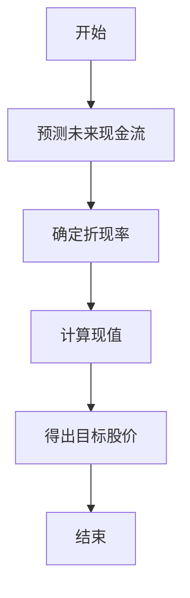
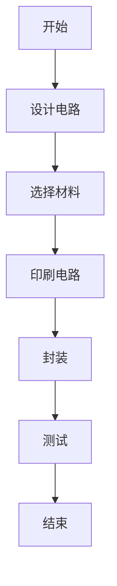

                 

# 全球股市估值与柔性电子在可穿戴医疗设备中的应用

---

## 关键词

- 全球股市估值
- 柔性电子
- 可穿戴医疗设备
- 股市分析
- 电子材料
- 医疗技术

---

## 摘要

全球股市估值与柔性电子在可穿戴医疗设备中的应用是当前科技与金融交叉领域的热点话题。本文将从全球股市估值的基础理论出发，结合柔性电子技术的最新进展，详细探讨其在可穿戴医疗设备中的实际应用。通过分析柔性电子材料、制造工艺、医疗设备设计以及市场案例，本文旨在揭示柔性电子技术如何推动医疗设备的发展，同时为投资者提供股市估值的实用方法和见解。

---

## 正文

### 第一部分：全球股市估值基础

#### 第1章：全球股市估值概述

##### 1.1 股市估值的基本概念

股市估值是评估公司股票内在价值的过程，旨在确定其在市场上的合理价格。股票的价值受到多种因素影响，包括公司财务状况、行业趋势和宏观经济环境等。

**核心概念对比表格**

| 概念           | 描述                                       |
|----------------|------------------------------------------|
| 市盈率（P/E）   | 每股价格与每股收益的比率，衡量股价是否合理 |
| 市净率（P/B）   | 每股价格与每股净资产的比率，反映资产价值   |
| 股息率         | 每股股息与股价的比率，衡量投资回报率       |

##### 1.2 股市估值的重要性

股市估值是投资者做出决策的重要依据。通过估值，投资者可以判断股票是否被高估或低估，从而制定买入或卖出策略。

##### 1.3 股市估值的挑战

股市波动性高，且受多种因素影响，如政策变化、市场情绪等，增加了估值的难度。此外，不同行业和公司的估值方法也存在差异。

---

#### 第2章：全球股市估值模型

##### 2.1 现金流折现模型（DCF）

现金流折现模型是评估公司价值的常用方法，通过将未来现金流折现到现值，确定股票的合理价格。

**DCF模型流程图**

##### 2.2 相对估值法

相对估值法通过比较公司与同行业公司的估值指标，判断其股价是否合理。

**相对估值法对比表格**

| 公司名称 | P/E比率 | P/B比率 | 与行业平均对比 |
|----------|----------|----------|----------------|
| 公司A    | 15       | 2        | 高于行业平均    |
| 公司B    | 12       | 1.5       | 接近行业平均    |

##### 2.3 市场估值法

市场估值法基于市场整体情况，如市盈率和市净率等指标，评估市场的整体估值水平。

---

#### 第3章：影响股市估值的因素

##### 3.1 宏观经济因素

宏观经济因素如GDP增长率、通货膨胀率和利率等，对股市估值有重要影响。例如，低利率环境通常会推高股市估值。

##### 3.2 行业与公司因素

行业趋势和公司财务状况直接影响股市估值。例如，科技行业的高增长潜力通常会导致其股票估值较高。

---

### 第二部分：柔性电子技术与可穿戴医疗设备

#### 第4章：柔性电子材料与制造工艺

##### 4.1 柔性电子材料

柔性电子材料是可穿戴医疗设备的核心，包括有机电子材料和纳米材料。这些材料具有柔韧性、轻薄和可拉伸性，适合人体穿戴。

**柔性电子材料对比表格**

| 材料类型   | 特性           | 应用场景         |
|------------|----------------|------------------|
| 有机材料   | 柔性、透明      | 柔性显示屏、传感器 |
| 纳米材料   | 高灵敏度、轻薄 | 压力传感器、温度传感器 |

##### 4.2 柔性电子制造工艺

柔性电子的制造工艺包括印刷电子技术和转移打印技术。这些工艺能够实现高精度、低成本的批量生产。

**柔性电子制造工艺流程图**

---

#### 第5章：可穿戴医疗设备的设计与应用

##### 5.1 可穿戴医疗设备的设计原则

可穿戴医疗设备的设计需考虑用户体验和设备耐用性。例如，智能手表的设计需兼顾功能性和舒适性。

**可穿戴医疗设备设计原则**

- 用户体验：设备需易用，界面友好。
- 耐用性：设备需具备防水、防汗功能。

##### 5.2 柔性电子在医疗设备中的应用

柔性电子技术广泛应用于医疗设备，如智能绷带和可穿戴心电监测设备。这些设备能够实时监测患者健康状况，并将数据传输到医生端。

**医疗设备应用案例**

- 智能绷带：用于伤口监测，实时反馈温度和湿度数据。
- 可穿戴心电监测设备：实时监测心率，预防心脏疾病。

---

#### 第6章：柔性电子与医疗设备的结合

##### 6.1 柔性电子在医疗设备中的优势

柔性电子材料的柔韧性和可拉伸性使其适合应用于复杂的人体表面，如皮肤和关节。此外，柔性电子能够实现高灵敏度的传感器，提供精准的健康数据。

##### 6.2 医疗设备的未来发展趋势

未来，柔性电子技术将进一步推动医疗设备的发展，实现更精准的诊断和治疗。例如，可植入式柔性传感器将用于实时监测体内健康状况。

---

## 结论

全球股市估值与柔性电子在可穿戴医疗设备中的应用是科技与金融交叉融合的重要领域。通过深入理解股市估值的理论和实际应用，结合柔性电子技术的最新进展，我们可以更好地推动医疗设备的发展，为投资者提供更精准的估值方法和见解。

---

## 作者

作者：AI天才研究院/AI Genius Institute & 禅与计算机程序设计艺术 /Zen And The Art of Computer Programming

