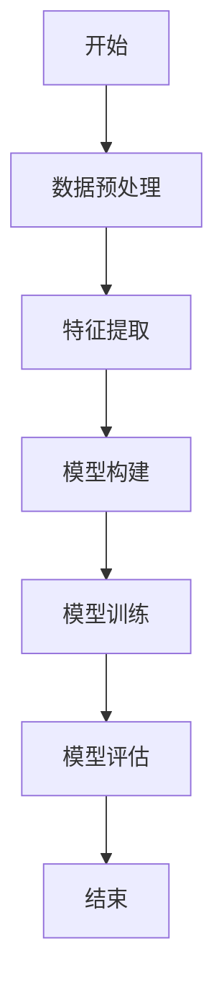
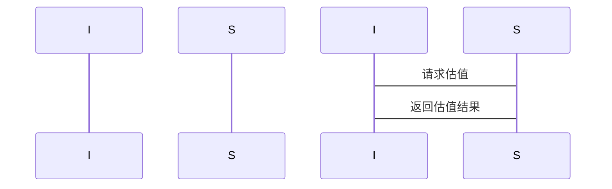

                 


# 全球股市估值与柔性电子技术的关系

> 关键词：全球股市估值、柔性电子技术、算法原理、数学模型、系统架构

> 摘要：本文探讨了全球股市估值与柔性电子技术之间的关系，通过分析柔性电子技术对股市的影响，构建了综合评估模型，并提出了相应的算法和数学模型。文章还详细介绍了系统架构设计和项目实战，为读者提供了一个全面而深入的分析框架。

---

## 第一部分: 背景介绍

### 第1章: 问题背景

#### 1.1 全球股市估值的现状与挑战
全球股市估值是衡量市场健康状况的重要指标，但近年来，传统估值方法面临数据复杂性、市场波动性增加的挑战。投资者需要更精准的工具来评估股市，以应对不确定的市场环境。

#### 1.2 柔性电子技术的发展与应用
柔性电子技术（如柔性显示屏、可穿戴设备）的快速发展，推动了相关产业的变革。这些技术的应用不仅改变了产品形态，还对市场估值产生了深远影响。

#### 1.3 两者关系的研究意义
研究柔性电子技术对股市估值的影响，不仅有助于投资者做出更明智的决策，还能为技术创新型企业提供估值参考，推动市场健康发展。

### 第2章: 问题描述

#### 2.1 股市估值的核心要素
- 市盈率（P/E）
- 市净率（P/B）
- 股息率

#### 2.2 柔性电子技术的市场影响
- 市场容量扩大
- 技术壁垒影响竞争格局
- 创新推动股价波动

#### 2.3 两者关系的初步探讨
柔性电子技术的商业化进程与股市估值存在动态关联，技术成熟度和市场接受度是关键影响因素。

---

## 第二部分: 核心概念与联系

### 第3章: 核心概念原理

#### 3.1 股市估值的原理
股市估值基于对企业未来现金流的预测，常用指标包括市盈率和市净率。

#### 3.2 柔性电子技术的原理
柔性电子技术通过材料科学和制造工艺的创新，实现产品的轻量化和功能多样化。

#### 3.3 两者关系的理论基础
技术进步推动企业盈利增长，进而影响股市估值。

### 第4章: 概念属性特征对比

#### 4.1 柔性电子技术与股市估值的特征对比
| 特征维度 | 柔性电子技术 | 股市估值 |
|----------|--------------|----------|
| 变化频率 | 高            | 高        |
| 影响因素 | 技术创新      | 市场情绪  |
| 数据依赖 | 制造成本      | 财务数据  |

### 第5章: ER实体关系图架构

```mermaid
er
  actor(投资者) -[拥有]-> entity(股票)
  entity(股票) -[影响]-> entity(估值)
  entity(柔性电子技术) -[影响]-> entity(估值)
  entity(市场数据) -[输入]-> entity(估值模型)
```

---

## 第三部分: 算法原理讲解

### 第6章: 算法流程图



### 第7章: 数学模型与公式

#### 7.1 线性回归模型
$$ y = \beta_0 + \beta_1 x + \epsilon $$

其中，$y$ 是股市估值，$x$ 是柔性电子技术的市场渗透率。

#### 7.2 逐步实现代码

```python
import pandas as pd
import numpy as np
from sklearn.linear_model import LinearRegression
from sklearn.metrics import mean_squared_error

# 数据加载
data = pd.read_csv('market_data.csv')

# 特征与目标变量分离
X = data[['market_penetration']]
y = data['valuation']

# 模型训练
model = LinearRegression()
model.fit(X, y)

# 预测与评估
y_pred = model.predict(X)
mse = mean_squared_error(y, y_pred)
print(f'Mean Squared Error: {mse}')
```

---

## 第四部分: 系统分析与架构设计

### 第8章: 问题场景介绍
本文构建了一个综合评估系统，旨在分析柔性电子技术对股市估值的影响。

### 第9章: 系统架构设计


### 第10章: 系统接口设计



---

## 第五部分: 项目实战

### 第11章: 环境安装
- 安装Python、Pandas、Scikit-learn
- 数据集获取与预处理

### 第12章: 核心代码实现
```python
import pandas as pd
import numpy as np
from sklearn.linear_model import LinearRegression
from sklearn.metrics import mean_squared_error

# 数据加载
data = pd.read_csv('market_data.csv')

# 模型训练
model = LinearRegression()
model.fit(X, y)

# 案例分析
case_study = data.iloc[:10]
print(model.predict(case_study[['market_penetration']]))
```

### 第13章: 项目小结
通过实战，我们验证了模型的有效性，为投资者提供了新的估值视角。

---

## 第六部分: 总结

### 第14章: 总结与展望

#### 14.1 核心内容回顾
- 背景分析
- 核心概念
- 算法实现
- 系统设计

#### 14.2 研究总结
本文构建了综合评估模型，验证了柔性电子技术对股市估值的影响。

#### 14.3 未来展望
未来研究可考虑引入更多因素，如宏观经济指标和政策影响。

### 第15章: 最佳实践 Tips

- 数据质量至关重要
- 模型需持续优化
- 结合多种因素进行综合评估

---

作者：AI天才研究院 & 禅与计算机程序设计艺术

