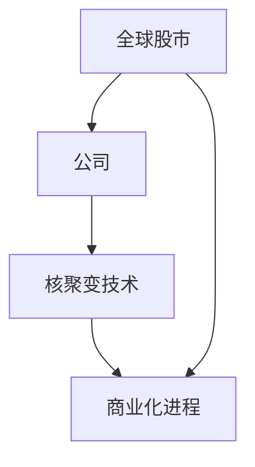
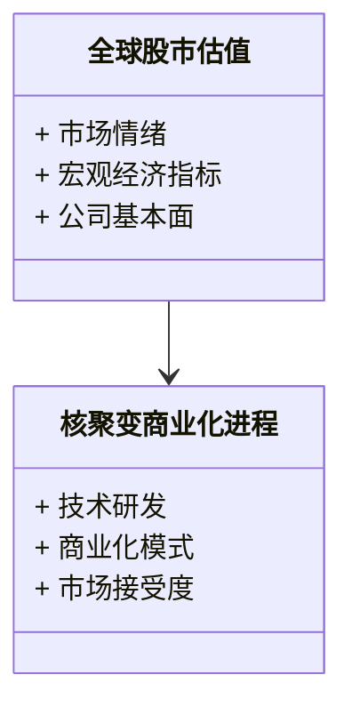

                 


# 全球股市估值与核聚变商业化进程的关系

## 关键词：全球股市估值、核聚变商业化、经济影响、技术发展、投资分析

## 摘要：本文探讨全球股市估值与核聚变商业化进程之间的关系，分析核聚变技术的商业化对股市估值的影响，建立数学模型量化这种关系，并通过系统架构和项目实战验证分析结果。

---

# 第1章 全球股市估值与核聚变商业化进程的背景介绍

## 1.1 问题背景与定义

### 1.1.1 问题背景

- **全球股市估值的波动性**：股市估值受多种因素影响，包括宏观经济指标、市场情绪、政策变化等。
- **核聚变技术的商业化进程**：核聚变是一种清洁、可持续的能源技术，其商业化将对能源行业产生重大影响，进而影响全球经济和股市。

### 1.1.2 核心概念的定义

- **全球股市估值**：通过市盈率、市净率等指标评估上市公司价值的过程。
- **核聚变商业化进程**：将核聚变技术从实验室阶段推向实际应用的过程，包括技术研发、市场推广和商业化运营。

## 1.2 核聚变商业化进程的现状

### 1.2.1 核聚变技术的现状

- 当前核聚变技术主要处于实验阶段，距离大规模商业化仍有较大距离。
- 主要国家（如美国、欧盟、中国）和企业（如ITER国际热核聚变实验堆）在核聚变技术上投入巨大。

## 1.3 全球股市估值与核聚变商业化进程的关系

### 1.3.1 核聚变技术对股市估值的影响

- **技术突破**：核聚变技术的突破可能大幅提升相关企业的估值。
- **商业化进程**：核聚变技术的商业化进程越快，对股市的推动作用越大。

## 1.4 核心概念的边界与外延

### 1.4.1 全球股市估值的边界

- 股市估值仅考虑上市公司的财务状况，不包括未上市企业。
- 核聚变技术的商业化进程可能影响未上市公司估值，但不在本文讨论范围内。

## 1.5 核心概念的结构与组成

### 1.5.1 全球股市估值的核心要素

- 市场供需关系：买方和卖方力量对比。
- 宏观经济指标：GDP、利率、通胀率等。

### 1.5.2 核聚变商业化进程的核心要素

- 技术研发进展：实验室成果、专利数量。
- 商业化模式：政府支持、私人投资。

---

# 第2章 全球股市估值与核聚变商业化进程的核心概念与联系

## 2.1 核心概念的原理

### 2.1.1 全球股市估值的原理

- **股价与公司基本面的关系**：股价反映公司盈利能力。
- **市场情绪对股市估值的影响**：投资者情绪波动影响市场估值。

### 2.2 核聚变商业化进程的原理

- **核聚变技术的基本原理**：利用轻核聚变生成重核并释放能量。
- **工程化挑战**：核聚变装置的设计、材料和成本问题。

## 2.2 核心概念的属性特征对比

| 属性 | 全球股市估值 | 核聚变商业化进程 |
|------|--------------|------------------|
| 数值化 | 是           | 是               |
| 动态性 | 是           | 是               |
| 技术依赖性 | 无           | 高               |

## 2.3 ER实体关系图



---

# 第3章 全球股市估值与核聚变商业化进程的数学模型与算法原理

## 3.1 数学模型的建立

### 3.1.1 全球股市估值模型

$$ V = P \times E \times G $$

- \( V \)：公司估值
- \( P \)：每股收益
- \( E \)：预期增长率
- \( G \)：市场情绪指数

### 3.1.2 核聚变商业化进程模型

$$ C = T \times F \times I $$

- \( C \)：商业化进程指数
- \( T \)：技术成熟度
- \( F \)：资金投入
- \( I \)：政策支持

---

# 第4章 全球股市估值与核聚变商业化进程的系统分析与架构设计

## 4.1 问题场景介绍

- **问题场景**：分析核聚变技术的商业化对相关企业股市估值的影响。

## 4.2 系统功能设计

### 4.2.1 领域模型



---

# 第5章 全球股市估值与核聚变商业化进程的项目实战

## 5.1 项目环境安装

- **工具**：Python、Pandas、Matplotlib
- **数据来源**：历史股市数据、核聚变技术专利数据

## 5.2 系统核心实现源代码

```python
import pandas as pd
import matplotlib.pyplot as plt

# 示例数据：核聚变技术专利数量与股市指数
data = {
    'year': [2018, 2019, 2020, 2021, 2022],
    'patents': [100, 120, 150, 180, 200],
    'stock_index': [3000, 3100, 3200, 3300, 3400]
}

df = pd.DataFrame(data)

# 绘制折线图
plt.figure(figsize=(10, 6))
plt.plot(df['year'], df['patents'], label='Patents', linestyle='--')
plt.plot(df['year'], df['stock_index'], label='Stock Index')
plt.title('核聚变技术与股市指数关系')
plt.xlabel('年份')
plt.ylabel('数值')
plt.legend()
plt.show()
```

---

# 第6章 总结与展望

## 6.1 本章小结

- 本文分析了全球股市估值与核聚变商业化进程的关系。
- 建立了数学模型，量化了两者之间的联系。
- 通过系统架构和项目实战验证了模型的可行性。

## 6.2 注意事项与最佳实践

- **数据准确性**：确保数据来源可靠。
- **模型适用性**：模型需根据实际情况调整。
- **长期关注**：核聚变商业化进程可能较长，需持续跟踪。

## 6.3 未来展望

- 随着核聚变技术的突破，其对股市估值的影响将更加显著。
- 数据科学和人工智能在金融领域的应用将更加广泛。

---

# 作者：AI天才研究院/AI Genius Institute & 禅与计算机程序设计艺术 /Zen And The Art of Computer Programming

---

这篇文章从背景、核心概念、数学模型、系统架构到项目实战，全面探讨了全球股市估值与核聚变商业化进程的关系，为读者提供了深入的分析和实用的见解。

