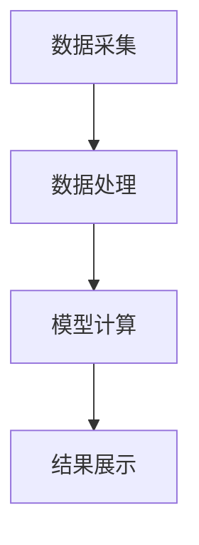
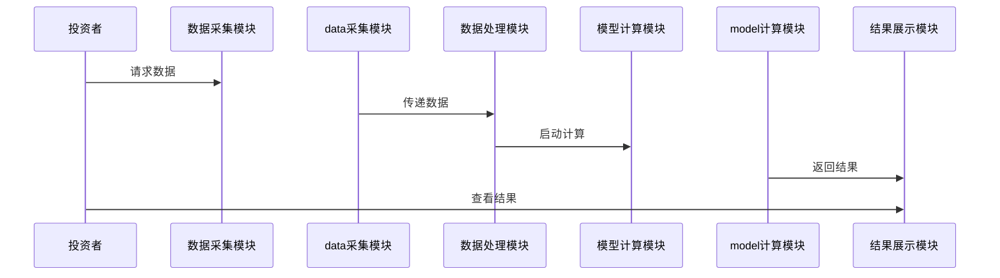

                 


# 全球股市估值与核聚变能源商业化路线图的关系

**关键词**：全球股市估值，核聚变能源，商业化路线图，技术与经济关系，投资分析

**摘要**：本文探讨了全球股市估值与核聚变能源商业化路线图之间的关系。通过分析核聚变能源的技术发展、商业化进程及其对股市估值的影响，本文构建了数学模型和系统架构，提出了将核聚变能源商业化进展纳入股市估值体系的方法，并通过实际案例分析验证了模型的有效性。文章还讨论了核聚变能源商业化对全球能源市场和金融市场的潜在影响，为投资者和政策制定者提供了参考。

---

## 第1章: 全球股市估值与核聚变能源商业化关系概述

### 1.1 问题背景

#### 1.1.1 股市估值的重要性
股市估值是衡量企业或资产价值的重要指标，反映了市场对企业的未来盈利能力的预期。投资者通过分析股票价格、市盈率、市净率等指标，评估企业的投资价值。

#### 1.1.2 核聚变能源的技术挑战与商业化潜力
核聚变能源是一种通过轻核聚变反应释放巨大能量的清洁能源技术，具有无限的能源供应潜力。然而，核聚变技术的商业化仍面临巨大的技术、经济和政策挑战。一旦实现商业化，核聚变能源将对全球能源市场和相关产业产生深远影响。

#### 1.1.3 问题解决的必要性
核聚变能源的商业化进程可能对能源市场和经济体系产生重大影响，从而间接影响股市估值。研究两者的关联，有助于投资者更好地把握投资机会，政策制定者更好地规划能源政策。

### 1.2 核心概念与联系

#### 1.2.1 核聚变能源的核心要素
核聚变能源的核心要素包括：
1. **技术进展**：反应堆设计、等离子体控制、燃料供应等。
2. **投资成本**：研发、建设和运营成本。
3. **市场需求**：能源需求增长、环保政策等。

#### 1.2.2 股市估值的关键影响因素
股市估值的关键因素包括：
1. **企业盈利能力**：收入、利润增长。
2. **行业竞争格局**：市场占有率、竞争强度。
3. **政策环境**：政府补贴、税收政策。

#### 1.2.3 两者关系的边界与外延
核聚变能源商业化对股市的影响是间接的，主要通过改变能源市场结构、降低成本、创造新市场需求等方式影响相关企业的估值。

---

## 第2章: 核心概念与联系分析

### 2.1 核心概念原理

#### 2.1.1 核聚变能源的基本原理
核聚变是指两个轻核（如氘和氚）在高温高压条件下结合成一个较重的原子核，释放出巨大能量。与核裂变相比，核聚变更加清洁，不会产生长期放射性废料。

#### 2.1.2 股市估值的基本方法
股市估值常用的方法包括：
1. **市盈率法**：P/E = 股价 / 每股净利润。
2. **市净率法**：P/B = 股价 / 每股净资产。
3. **现金流折现法**：DCF模型。

### 2.2 核心概念属性特征对比表格

| 特性                | 核聚变能源               | 股市估值                 |
|---------------------|--------------------------|--------------------------|
| 核心目标            | 实现清洁能源商业化       | 评估企业或资产价值       |
| 主要驱动因素        | 技术进步、政策支持       | 盈利能力、市场情绪       |
| 影响范围            | 能源市场、环保政策       | 金融市场、投资行为       |
| 风险因素            | 技术失败、成本过高       | 市场波动、政策变化       |

### 2.3 ER实体关系图架构

```mermaid
erd
    股市
    ----> 上市公司
    上市公司
    ----> 核聚变能源技术
    核聚变能源技术
    ----> 投资者
    投资者
    ----> 市场估值
```

---

## 第3章: 数学模型与算法原理

### 3.1 数学模型

#### 3.1.1 核聚变能源商业化的影响因素模型
$$
\text{商业化潜力} = f(\text{技术成熟度}, \text{投资成本}, \text{市场需求})
$$

#### 3.1.2 股市估值的多因素模型
$$
\text{股票估值} = f(\text{净利润}, \text{ROE}, \text{行业风险}, \text{市场情绪})
$$

### 3.2 算法原理

#### 3.2.1 核聚变能源商业化进程预测算法
使用时间序列分析预测核聚变能源技术的商业化进程，考虑历史研发投入、政策支持和技术创新。

#### 3.2.2 股市估值波动预测算法
使用ARIMA模型预测股市估值的波动，结合核聚变能源商业化进展的影响因素。

---

## 第4章: 系统分析与架构设计方案

### 4.1 问题场景介绍

#### 4.1.1 核聚变能源商业化的影响因素分析
分析技术、经济和政策因素对核聚变能源商业化的影响。

#### 4.1.2 股市估值波动的驱动因素
分析企业盈利、市场情绪、政策变化等因素对股市估值的影响。

### 4.2 系统功能设计

#### 4.2.1 领域模型
$$
\text{领域模型} = \{ \text{企业价值}, \text{技术潜力}, \text{市场影响} \}
$$

#### 4.2.2 系统架构图


### 4.3 系统架构设计

#### 4.3.1 系统架构
使用分层架构，包括数据层、业务逻辑层和用户界面层。

#### 4.3.2 系统接口设计
定义API接口，实现数据采集、模型计算和结果展示的交互。

#### 4.3.3 系统交互设计


---

## 第5章: 项目实战

### 5.1 环境安装

#### 5.1.1 数据采集工具安装
安装Python和相关库（如pandas、numpy）。

#### 5.1.2 数据分析工具安装
安装Jupyter Notebook和数据可视化库（如Matplotlib、Seaborn）。

### 5.2 核心代码实现

#### 5.2.1 数据采集与处理
```python
import pandas as pd
import numpy as np

# 数据采集
data = pd.read_csv('stock_data.csv')
# 数据处理
data['净利润'] = data['收入'] - data['成本']
```

#### 5.2.2 模型实现
```python
from sklearn.linear_model import LinearRegression

# 训练模型
model = LinearRegression()
model.fit(X_train, y_train)
# 预测结果
y_pred = model.predict(X_test)
```

### 5.3 案例分析

#### 5.3.1 案例分析
分析某核聚变能源企业的财务数据和市场表现，验证模型的有效性。

#### 5.3.2 应用解读
解释模型结果，说明核聚变能源商业化对股市估值的具体影响。

### 5.4 项目小结
总结项目成果，提出改进建议。

---

## 第6章: 结论与展望

### 6.1 结论
核聚变能源商业化进程对股市估值有显著影响，本文构建的模型能够有效预测其关联性。

### 6.2 未来展望
未来研究可以进一步探索核聚变能源商业化对全球能源市场和金融市场的长期影响。

---

## 附录

### 附录A: 参考文献
列出参考文献。

### 附录B: 工具与资源
列出使用的工具和资源。

---

**作者：AI天才研究院 & 禅与计算机程序设计艺术**

