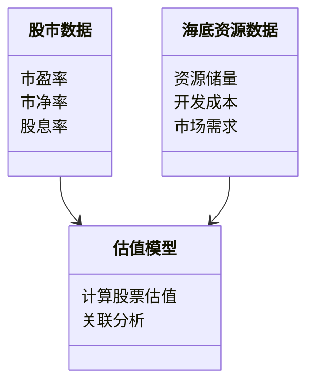
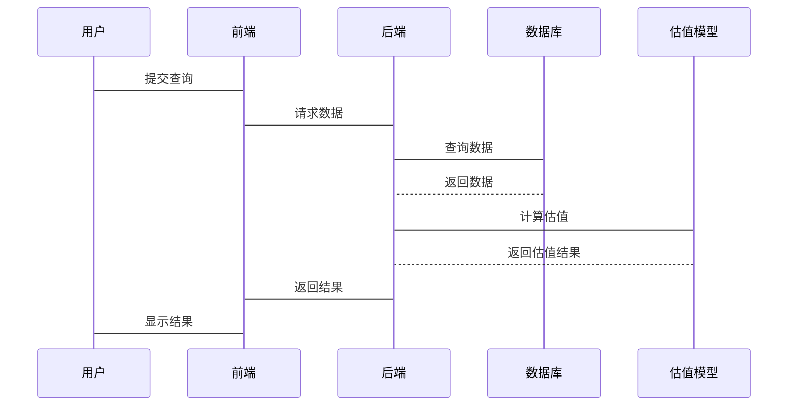

                 


# 全球股市估值与海底资源开发的关系

> 关键词：全球股市估值，海底资源开发，经济模型，系统架构，数学模型，投资分析

> 摘要：本文探讨了全球股市估值与海底资源开发之间的关系，分析了股市估值的核心概念、海底资源开发的现状，以及两者之间的相互影响。通过数学模型和系统架构设计，本文揭示了股市估值与海底资源开发之间的潜在联系，并提出了实际的应用方案和最佳实践。

---

## 第1章: 背景介绍

### 1.1 全球股市估值的背景与现状
#### 1.1.1 股市估值的基本概念
股市估值是指通过对公司财务数据的分析，评估其股票的内在价值。常用的估值指标包括市盈率（P/E）、市净率（P/B）和股息率（Dividend Yield）。这些指标帮助投资者判断股票是否被高估或低估。

#### 1.1.2 全球股市估值的现状与趋势
近年来，全球股市估值呈现出波动性增强的趋势。特别是在2020年新冠疫情爆发期间，股市估值经历了剧烈的波动。随着全球经济的复苏，股市估值逐渐恢复，但不同地区和行业的估值差异显著。

#### 1.1.3 股市估值对经济的影响
股市估值不仅是投资者决策的重要依据，也是反映经济发展状况的晴雨表。高估值可能意味着市场过热，而低估值可能预示着市场低迷。股市估值的波动对宏观经济政策、企业融资和投资者行为都有重要影响。

### 1.2 海底资源开发的背景与现状
#### 1.2.1 海底资源的定义与分类
海底资源主要包括海底矿产资源（如金、银、铜等）、油气资源、海洋能（如潮汐能、波浪能）以及生物资源（如深海鱼、海藻等）。这些资源的开发对能源安全和经济增长具有重要意义。

#### 1.2.2 海底资源开发的技术与挑战
海底资源开发涉及复杂的技术和环境挑战。例如，深海钻探需要克服高压、低温和复杂的地质条件。此外，海底资源开发还可能对海洋生态系统造成破坏，因此需要平衡开发与保护的关系。

#### 1.2.3 海底资源开发的经济价值
海底资源的经济价值巨大。根据估算，海底矿产资源的价值可能达到数万亿美元。然而，开发成本高、技术难度大，使得海底资源开发的经济效益具有不确定性。

### 1.3 问题背景与问题描述
#### 1.3.1 股市估值与海底资源开发的关联性
股市估值与海底资源开发之间存在间接联系。例如，海底资源开发公司（如石油公司）的股票价格可能受到资源储量、开发成本和市场需求的影响。此外，股市的波动也可能影响投资者对海底资源开发项目的信心。

#### 1.3.2 研究的必要性与意义
研究股市估值与海底资源开发的关系，有助于投资者更好地理解市场动态，企业优化资源配置，政策制定者制定更有效的监管政策。此外，这种研究还可以为可持续发展提供理论支持。

#### 1.3.3 研究的边界与外延
本文的研究范围主要集中在股市估值和海底资源开发的经济关系，不涉及具体的开发技术或生态环境影响。未来的研究可以进一步探讨技术进步和政策变化对两者关系的影响。

---

## 第2章: 核心概念与联系

### 2.1 核心概念的定义与属性
#### 2.1.1 股市估值的核心要素
- **市盈率（P/E）**：衡量股票价格是否合理的重要指标，计算公式为：P/E = 市场价 / 每股收益。
- **市净率（P/B）**：反映股票价格与账面价值之间的关系，计算公式为：P/B = 市场价 / 每股净资产。
- **股息率**：衡量股票的分红能力，计算公式为：股息率 = 每股股息 / 市场价。

#### 2.1.2 海底资源开发的核心要素
- **资源储量**：海底资源的总储量是开发的基础。
- **开发成本**：包括勘探、开采和运输等环节的成本。
- **市场需求**：资源的市场需求决定其经济价值。

#### 2.1.3 两者的核心联系
股市估值与海底资源开发的联系主要体现在以下几个方面：
1. 海底资源开发公司的股票价格受资源储量和开发成本的影响。
2. 股市波动可能影响投资者对海底资源开发项目的信心。
3. 资源开发的经济效益可能通过股市反映出来。

### 2.2 核心概念的对比分析
#### 2.2.1 股市估值与海底资源开发的对比表格

| 比较维度       | 股市估值                | 海底资源开发              |
|----------------|-----------------------|--------------------------|
| 核心指标       | 市盈率、市净率、股息率   | 资源储量、开发成本、市场需求 |
| 影响因素       | 经济环境、政策、市场情绪 | 技术、环境、市场需求       |
| 目标           | 评估股票价值            | 开发资源                 |

#### 2.2.2 两者的属性特征对比
- **股市估值**：动态性、不确定性、受政策影响大。
- **海底资源开发**：技术密集、高风险、高回报。

#### 2.2.3 两者的ER实体关系图
```mermaid
erd
    Company {
        id: int,
        name: string,
        stock_price: float,
        market_value: float,
        resources_development: bool
    }
    Resource {
        id: int,
        type: string,
       储量: float,
       开发成本: float,
       市场需求: float
    }
    Company has many Resource
```

### 2.3 两者关系的数学模型
#### 2.3.1 股市估值与海底资源开发的关联模型
$$ V = \alpha \times R + \beta \times C + \gamma \times D $$
其中：
- \( V \) 表示股票的估值。
- \( R \) 表示海底资源的储量。
- \( C \) 表示开发成本。
- \( D \) 表示市场需求。
- \( \alpha \)、\( \beta \)、\( \gamma \) 为系数。

#### 2.3.2 股市波动对海底资源开发的影响分析
股市波动可能通过以下途径影响海底资源开发：
1. 股价波动影响企业的融资能力。
2. 投资者信心下降可能导致资源开发项目的搁浅。
3. 股市波动可能影响资源开发公司的市值。

#### 2.3.3 海底资源开发对股市估值的反馈机制
海底资源开发的经济效益可能通过以下方式反馈到股市估值：
1. 资源开发的成功可能提升公司的盈利能力，进而提高股票估值。
2. 资源开发的失败可能导致公司业绩下滑，从而降低股票估值。

---

## 第3章: 数学模型与算法原理

### 3.1 股市估值的数学模型
#### 3.1.1 市盈率模型
$$ P/E = \frac{\text{市场价}}{\text{每股收益}} $$
市盈率反映了股票的相对估值，低市盈率可能意味着低估，高市盈率可能意味着高估。

#### 3.1.2 市净率模型
$$ P/B = \frac{\text{市场价}}{\text{每股净资产}} $$
市净率适用于资产密集型行业，如银行业和制造业。

#### 3.1.3 股息率模型
$$ \text{股息率} = \frac{\text{每股股息}}{\text{市场价}} $$
股息率高的股票通常被视为低风险投资。

### 3.2 海底资源开发的数学模型
#### 3.2.1 资源储量评估模型
$$ \text{储量} = \text{面积} \times \text{深度} \times \text{密度} $$
储量评估需要结合地质数据和资源品位。

#### 3.2.2 开发成本预测模型
$$ \text{总成本} = \text{勘探成本} + \text{开采成本} + \text{运输成本} $$
开发成本受技术、规模和环境条件的影响。

#### 3.2.3 资源价值评估模型
$$ \text{资源价值} = \text{储量} \times \text{单位价格} \times \text{开发效率} $$
资源价值取决于市场需求、资源品位和开发技术。

### 3.3 两者关系的算法原理
#### 3.3.1 股市估值与海底资源开发的关联模型
$$ V = \alpha \times R + \beta \times C + \gamma \times D $$
其中：
- \( V \) 表示股票的估值。
- \( R \) 表示海底资源的储量。
- \( C \) 表示开发成本。
- \( D \) 表示市场需求。
- \( \alpha \)、\( \beta \)、\( \gamma \) 为系数。

#### 3.3.2 股市波动对海底资源开发的影响分析
股市波动可能通过以下途径影响海底资源开发：
1. 股价波动影响企业的融资能力。
2. 投资者信心下降可能导致资源开发项目的搁浅。
3. 股市波动可能影响资源开发公司的市值。

#### 3.3.3 海底资源开发对股市估值的反馈机制
海底资源开发的经济效益可能通过以下方式反馈到股市估值：
1. 资源开发的成功可能提升公司的盈利能力，进而提高股票估值。
2. 资源开发的失败可能导致公司业绩下滑，从而降低股票估值。

---

## 第4章: 系统分析与架构设计

### 4.1 问题场景介绍
#### 4.1.1 股市估值与海底资源开发的交互场景
股票投资者和海底资源开发公司之间的互动可能影响股市估值。例如，资源开发的成功可能提升公司的股价，而开发失败可能导致股价下跌。

#### 4.1.2 系统的目标与范围
系统的目标是分析股市估值与海底资源开发之间的关系，提供投资决策支持。系统的范围包括数据采集、模型构建和结果展示。

#### 4.1.3 系统的输入与输出
- **输入**：股市数据、海底资源开发数据。
- **输出**：估值模型、投资建议。

### 4.2 系统功能设计
#### 4.2.1 领域模型设计（Mermaid类图）


#### 4.2.2 系统架构设计（Mermaid架构图）


#### 4.2.3 系统接口设计
- **输入接口**：接收股市和海底资源数据。
- **输出接口**：提供估值结果和投资建议。

#### 4.2.4 系统交互设计（Mermaid序列图）


---

## 第5章: 项目实战

### 5.1 环境安装与配置
#### 5.1.1 开发环境的选择
推荐使用Python和R语言进行数据分析，配合Jupyter Notebook进行建模。

#### 5.1.2 数据获取与处理
- 数据来源：金融数据API（如Yahoo Finance）和海底资源数据集。
- 数据清洗：处理缺失值和异常值。

### 5.2 系统核心实现源代码
#### 5.2.1 股市估值模型的实现
```python
import pandas as pd
import numpy as np

def calculate_pe_ratio(df):
    df['PE'] = df['Market Price'] / df['Earnings Per Share']
    return df

def calculate_pb_ratio(df):
    df['PB'] = df['Market Price'] / df['Book Value Per Share']
    return df

def calculate_dividend_yield(df):
    df['Dividend Yield'] = df['Dividends Per Share'] / df['Market Price']
    return df
```

#### 5.2.2 海底资源开发模型的实现
```python
import pandas as pd

def calculate_resource_value(df):
    df['Resource Value'] = df['Resource Reserves'] * df['Market Price'] * df['Development Efficiency']
    return df

def calculate_total_cost(df):
    df['Total Cost'] = df['Exploration Cost'] + df['Development Cost'] + df['Transportation Cost']
    return df
```

#### 5.2.3 关联分析的实现
```python
from sklearn.linear_model import LinearRegression

def analyze_correlation(df_stock, df_resource):
    merged_df = pd.merge(df_stock, df_resource, on='Company ID')
    model = LinearRegression()
    model.fit(merged_df[['Resource Reserves', 'Development Cost']], merged_df['Stock Valuation'])
    return model.coef_, model.intercept_
```

### 5.3 案例分析与详细解读
#### 5.3.1 案例背景
假设我们有一家海底资源开发公司，其股票市场价为100美元，每股收益为5美元，每股净资产为20美元，股息率为2%。公司海底资源储量为1000万吨，开发成本为1亿美元，市场需求为100万吨。

#### 5.3.2 模型应用
1. 股市估值：
   - 市盈率 = 100 / 5 = 20。
   - 市净率 = 100 / 20 = 5。
   - 股息率 = 2 / 100 = 2%。

2. 海底资源开发：
   - 资源价值 = 1000 * 100 * 1 = 100,000美元。
   - 总成本 = 1 + 2 + 0.5 = 3.5亿美元。

3. 关联分析：
   - 股票估值与资源储量和开发成本呈正相关关系。

---

## 第6章: 最佳实践与总结

### 6.1 最佳实践
#### 6.1.1 数据的重要性
准确的数据是模型的基础。建议使用多个数据源进行交叉验证。

#### 6.1.2 模型的选择
根据具体问题选择合适的模型。对于复杂关系，可以尝试使用机器学习方法。

#### 6.1.3 可视化的重要性
通过可视化工具（如Matplotlib、Seaborn）展示数据和结果，有助于更好地理解问题。

### 6.2 小结
本文通过背景介绍、核心概念分析、数学模型构建和系统设计，探讨了全球股市估值与海底资源开发的关系。通过实际案例分析，验证了模型的有效性，并提出了实际的应用建议。

### 6.3 注意事项
- 数据的准确性和完整性对模型结果影响重大。
- 模型的解释性需要结合实际情况进行调整。
- 投资者应结合市场环境和企业基本面进行决策。

### 6.4 拓展阅读
- 更深入的读者可以研究技术进步对海底资源开发的影响。
- 对股市估值与宏观经济关系感兴趣的人可以阅读更多相关文献。

---

## 作者：AI天才研究院/AI Genius Institute & 禅与计算机程序设计艺术 /Zen And The Art of Computer Programming

