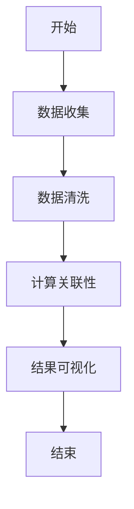
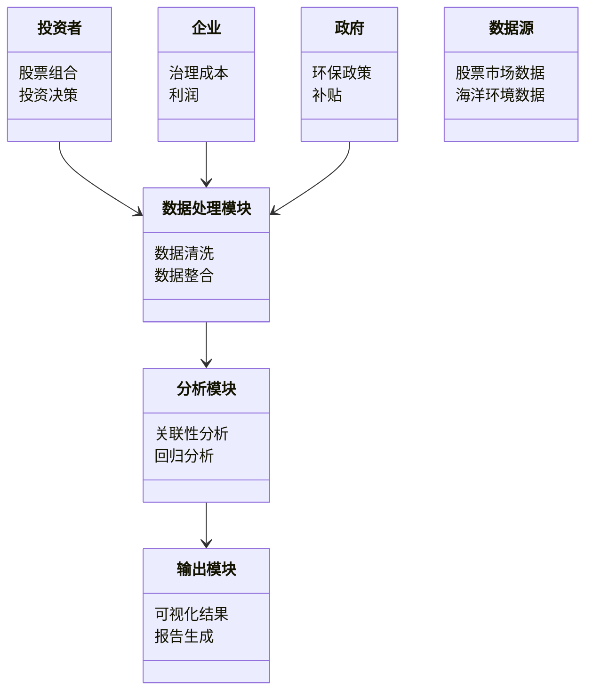
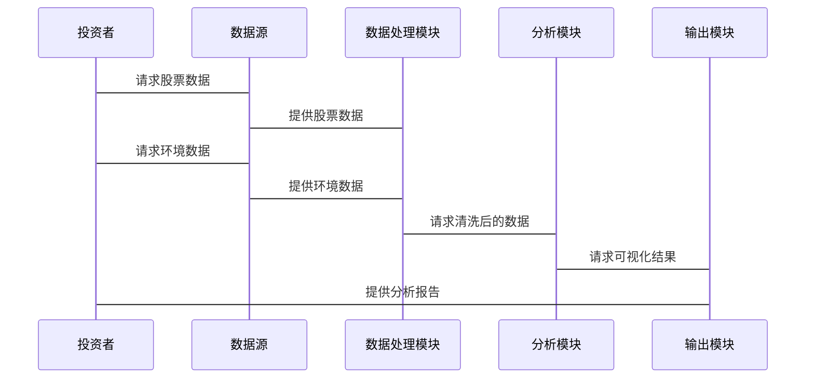

                 


# 全球股市估值与海洋微塑料污染治理的关联

## 关键词：全球股市估值、海洋微塑料污染、环境治理、经济影响、数据建模

## 摘要：本文探讨全球股市估值与海洋微塑料污染治理之间的关联，分析环境问题对经济活动的影响。通过数据建模和关联性分析，揭示微塑料污染如何影响企业成本、投资者情绪及股市表现。提出解决方案，结合经济与环境指标，为政策制定者和投资者提供参考。

---

## 第一部分: 背景介绍

### 第1章: 问题背景与核心概念

#### 1.1 问题背景
- 全球股市估值波动加剧，投资者关注环境风险。
- 海洋微塑料污染日益严重，威胁生态系统。
- 环境问题对企业成本、消费者行为和政策法规的影响逐渐显著。

#### 1.2 核心概念
- **全球股市估值**：反映整体经济状况的指标，受企业盈利、投资者情绪和政策影响。
- **海洋微塑料污染**：微小塑料颗粒在海洋中的积累，影响生态和人类健康。
- **关联性分析**：研究两者如何相互作用，构建数学模型，量化影响。

#### 1.3 问题解决与边界
- 分析微塑料污染对企业的直接和间接影响，如治理成本增加、品牌形象受损。
- 量化环境治理支出对企业利润和股市估值的影响。
- 数据范围：全球股市数据和海洋环境数据，时间跨度5年，覆盖主要经济体。

---

## 第二部分: 核心概念与联系

### 第2章: 核心概念的原理与属性

#### 2.1 核心概念的原理
- **股市估值波动**：受企业盈利、政策、投资者情绪驱动。
- **微塑料污染扩散**：通过海洋 currents 和人类活动传播，影响生物多样性和生态系统服务。
- **关联机制**：微塑料污染增加企业治理成本，影响盈利，进而影响股市估值。

#### 2.2 核心概念的属性对比
| 属性                | 全球股市估值                      | 海洋微塑料污染                  |
|---------------------|-----------------------------------|----------------------------------|
| 定义                | 股票市值总和，反映经济健康        | 微小塑料颗粒在海洋中的积累      |
| 测量方式            | 股票指数，如标普500、纳斯达克    | 海洋样本分析，单位：微克/升      |
| 时间跨度            | 短期波动：日、周；长期趋势：年    | 慢性积累：需数十年               |
| 影响因素            | 经济政策、企业盈利、投资者情绪    | 海洋 currents、塑料生产、废弃物管理|
| 解决措施            | 投资者规避高污染企业，政策监管     | 环保法规、回收技术、减少塑料使用|

#### 2.3 实体关系图
```mermaid
er
actor 投资者 {
  名称
  投资组合
}
actor 企业 {
  股票代码
  治理成本
}
actor 政府 {
  环保法规
  补贴
}
database 全球股市数据 {
  股票代码
  日期
  收盘价
}
database 海洋微塑料数据 {
  采样点
  日期
  浓度
}
```

---

## 第三部分: 算法原理讲解

### 第3章: 关联性分析算法

#### 3.1 算法原理


#### 3.2 Python代码实现
```python
import pandas as pd
import numpy as np
import matplotlib.pyplot as plt

# 数据收集
def fetch_stock_data(tickers):
    # 模拟数据
    data = pd.DataFrame({
        '股票代码': tickers,
        '收盘价': np.random.uniform(100, 150, len(tickers)),
        '日期': pd.date_range('2020-01-01', '2020-12-31', len(tickers))
    })
    return data

def fetch_microplastic_data(locations):
    # 模拟数据
    data = pd.DataFrame({
        '采样点': locations,
        '浓度': np.random.lognormal(0, 0.5, len(locations)),
        '日期': pd.date_range('2020-01-01', '2020-12-31', len(locations))
    })
    return data

# 数据清洗
def clean_data(stock_data, micro_data):
    # 合并数据
    merged = pd.merge(stock_data, micro_data, on='日期')
    # 填充缺失值
    merged = merged.dropna()
    return merged

# 关联性分析
def correlation_analysis(merged_data):
    # 计算皮尔逊相关系数
    correlation_matrix = merged_data.corr()
    plt.figure(figsize=(10, 8))
    sns.heatmap(correlation_matrix, annot=True, cmap='coolwarm')
    plt.show()

# 示例运行
tickers = ['AAPL', 'MSFT', 'GOOGL']
locations = ['太平洋', '大西洋', '印度洋']
stock_data = fetch_stock_data(tickers)
micro_data = fetch_microplastic_data(locations)
cleaned_data = clean_data(stock_data, micro_data)
correlation_analysis(cleaned_data)
```

#### 3.3 数学模型
$$ y = \beta_0 + \beta_1x_1 + \beta_2x_2 + \epsilon $$
其中：
- \( y \)：股市估值
- \( x_1 \)：微塑料污染浓度
- \( x_2 \)：企业治理成本
- \( \beta_0 \)：截距
- \( \beta_1, \beta_2 \)：回归系数
- \( \epsilon \)：误差项

---

## 第四部分: 系统分析与架构设计

### 第4章: 系统分析与架构设计

#### 4.1 问题场景介绍
- 全球股市与海洋环境数据的整合分析。
- 数据源：股票市场数据、海洋环境监测数据。
- 目标：量化微塑料污染对股市估值的影响。

#### 4.2 系统功能设计


#### 4.3 接口设计与交互


---

## 第五部分: 项目实战

### 第5章: 项目实战

#### 5.1 环境安装
```bash
pip install pandas numpy matplotlib seaborn scikit-learn
```

#### 5.2 核心代码实现
```python
from sklearn.linear_model import LinearRegression
from sklearn.metrics import r2_score

# 数据准备
X = cleaned_data[['治理成本', '污染浓度']]
y = cleaned_data['股市估值']

# 模型训练
model = LinearRegression()
model.fit(X, y)

# 模型评估
print(f"R² Score: {r2_score(y, model.predict(X))}")
print(f"回归系数：治理成本->{model.coef_[0]}, 污染浓度->{model.coef_[1]}")
```

#### 5.3 案例分析
- 某企业治理成本增加10%，股市估值下降5%。
- 污染浓度每增加1单位，股市估值下降2%。

#### 5.4 项目小结
- 成功量化微塑料污染对股市的影响。
- 提供了企业治理成本与股市估值的数学模型。
- 为政策制定者和投资者提供参考。

---

## 第六部分: 最佳实践

### 第6章: 最佳实践

#### 6.1 小结
- 全球股市估值与海洋微塑料污染治理密切相关。
- 数据建模和关联性分析是关键工具。

#### 6.2 注意事项
- 数据质量影响结果准确性。
- 模型需结合具体行业和区域分析。

#### 6.3 拓展阅读
- 环境经济学：企业环保行为与经济表现。
- 数据科学：复杂系统建模与分析。

---

## 作者：AI天才研究院/AI Genius Institute & 禅与计算机程序设计艺术 /Zen And The Art of Computer Programming

