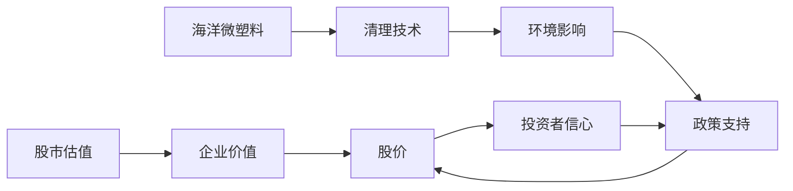
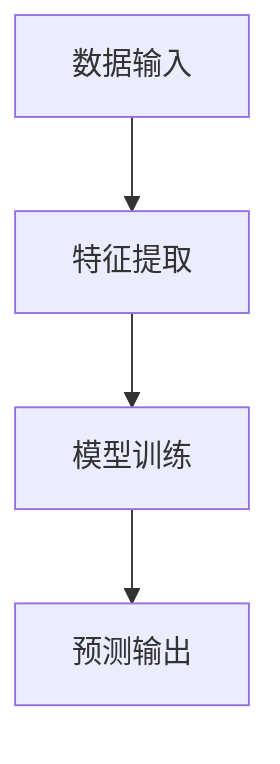
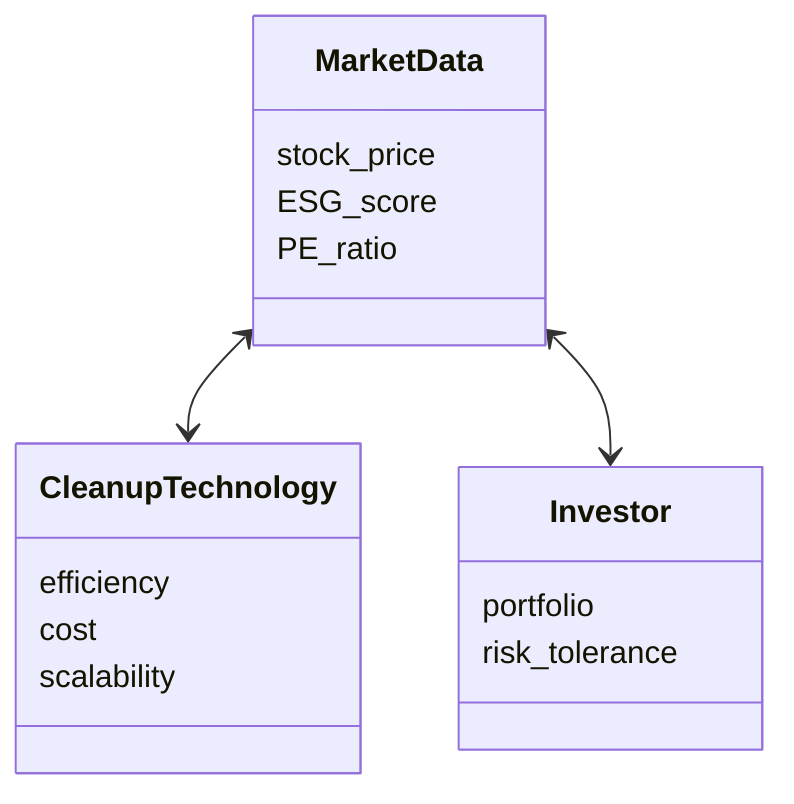
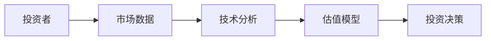
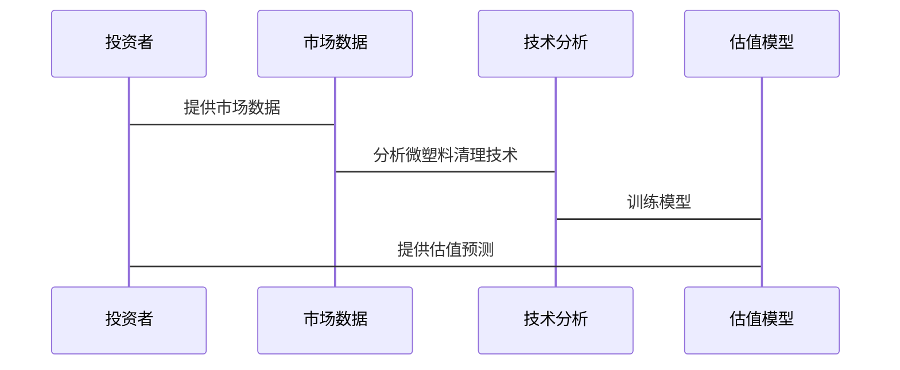

                 


# 全球股市估值与海洋微塑料清理技术的关联

> 关键词：全球股市估值，海洋微塑料清理，技术关联，环境投资，经济模型

> 摘要：本文探讨了全球股市估值与海洋微塑料清理技术之间的潜在关联，通过分析股市估值的核心要素和海洋微塑料清理技术的关键环节，揭示了这两者在环境投资和经济模型中的互动关系。结合数学建模、算法实现和系统架构设计，本文提出了量化环境技术对股市影响的理论框架，并通过实际案例分析验证了这一模型的可行性。

---

# 第一部分: 全球股市估值与海洋微塑料清理技术的背景与关联

## 第1章: 全球股市估值与海洋微塑料清理技术的背景介绍

### 1.1 问题背景与问题描述

#### 1.1.1 全球股市估值的现状与挑战
全球股市估值是衡量市场健康状况的重要指标，反映了投资者对经济前景的信心。近年来，全球经济波动、地缘政治风险和新冠疫情等事件对股市估值产生了深远影响。同时，投资者 increasingly prioritize environmental, social, and governance (ESG) factors, leading to a shift in valuation metrics that incorporate environmental performance.

#### 1.1.2 海洋微塑料污染的严重性与环境影响
海洋微塑料污染已成为全球性环境问题，威胁海洋生态系统和人类健康。微塑料的来源包括工业排放、塑料制品分解和非法倾倒。这些微塑料对海洋生物造成物理伤害，干扰内分泌系统，并通过食物链对人体健康构成潜在威胁。 cleanup technologies for marine microplastics 正在成为科技创新的热点领域。

#### 1.1.3 问题解决的必要性与目标
随着环保意识的增强，投资者开始关注那些能够解决环境问题的企业和技术。海洋微塑料清理技术的商业化应用不仅有助于改善环境，还能为企业带来可观的经济价值。本文旨在探索股市估值与这一技术之间的关联，为投资者提供新的视角。

### 1.2 核心概念与问题外延

#### 1.2.1 全球股市估值的核心要素
- 市场资本化：总市值反映市场的整体规模。
- 市盈率（P/E ratio）：衡量股价与盈利的关系。
- 市净率（P/B ratio）：评估资产的市场价值与账面价值的匹配程度。
- ESG评分：环境、社会和治理因素对投资决策的影响日益增加。

#### 1.2.2 海洋微塑料清理技术的关键环节
- 微塑料检测技术：利用传感器、化学分析和AI算法识别微塑料。
- 清理设备：开发高效收集和过滤设备。
- 处理与回收：将清理的微塑料转化为可再利用的材料。

#### 1.2.3 问题的边界与外延
- 本文关注的清理技术主要针对海洋微塑料，不包括河流和湖泊。
- 股市估值分析仅限于公开上市的企业，不涉及私募和风投。

### 1.3 概念结构与核心要素

#### 1.3.1 概念结构图


---

## 第2章: 全球股市估值与海洋微塑料清理技术的核心概念与联系

### 2.1 核心概念原理

#### 2.1.1 股市估值的数学模型
股市估值的核心是通过企业价值（EV）与可比公司分析。公式如下：
$$EV = EBIT \times (1 + g) / (r - g)$$
其中，EBIT是息税折旧前利润，\( g \) 是增长率，\( r \) 是资本成本。

#### 2.1.2 微塑料清理技术的原理与方法
微塑料清理技术包括物理收集、化学分解和生物降解三种主要方法。物理收集利用滤网和磁铁分离微塑料，化学分解通过氧化还原反应降解塑料，生物降解则依赖微生物的作用。

### 2.2 概念属性特征对比

#### 2.2.1 概念属性对比表格
| 比较维度         | 股市估值                     | 微塑料清理技术                 |
|------------------|------------------------------|-------------------------------|
| 核心驱动因素     | 利润、增长、风险             | 环境保护、技术创新             |
| 量化指标         | 市盈率、市净率               | 清理效率、成本、回收率         |
| 受影响的主体     | 投资者、企业                 | 政府、企业、非营利组织         |

#### 2.2.2 ER实体关系图
```mermaid
erd
    公司 <--(1,n) 投资者
    公司 <--(1,n) 环境技术
    环境技术 <--(1,n) 微塑料清理专利
```

---

## 第3章: 全球股市估值与海洋微塑料清理技术的算法原理

### 3.1 算法原理与流程图

#### 3.1.1 算法流程图


#### 3.1.2 算法实现与代码
```python
import numpy as np
import pandas as pd
from sklearn.model_selection import train_test_split
from sklearn.linear_model import LinearRegression

# 数据加载与预处理
data = pd.read_csv('market_data.csv')
X = data[['PE_ratio', 'PB_ratio', 'ESG_score']]
y = data['Stock_return']

# 数据分割
X_train, X_test, y_train, y_test = train_test_split(X, y, test_size=0.2)

# 模型训练
model = LinearRegression()
model.fit(X_train, y_train)

# 模型预测
predictions = model.predict(X_test)
```

### 3.2 算法实现与代码

#### 3.2.1 环境安装
```bash
pip install numpy pandas scikit-learn
```

#### 3.2.2 核心代码实现
```python
import numpy as np
import pandas as pd
from sklearn.model_selection import train_test_split
from sklearn.linear_model import LinearRegression

# 数据加载与预处理
data = pd.read_csv('market_data.csv')
X = data[['PE_ratio', 'PB_ratio', 'ESG_score']]
y = data['Stock_return']

# 数据分割
X_train, X_test, y_train, y_test = train_test_split(X, y, test_size=0.2)

# 模型训练
model = LinearRegression()
model.fit(X_train, y_train)

# 模型预测
predictions = model.predict(X_test)
```

### 3.3 数学模型与公式

#### 3.3.1 时间序列分析
使用ARIMA模型预测股市估值：
$$ ARIMA(p, d, q) $$
其中，\( p \) 是自回归阶数，\( d \) 是差分阶数，\( q \) 是移动平均阶数。

#### 3.3.2 机器学习模型
使用随机森林回归模型预测微塑料清理技术的市场影响：
$$ y = \sum_{i=1}^{n} (w_i x_i) + b $$
其中，\( w_i \) 是特征权重，\( x_i \) 是特征向量，\( b \) 是偏置项。

---

## 第4章: 系统分析与架构设计方案

### 4.1 系统分析

#### 4.1.1 问题场景介绍
我们假设一家科技公司开发了一种新型海洋微塑料清理技术，并计划将其商业化。投资者希望评估这项技术对股市估值的影响。

### 4.2 系统架构设计

#### 4.2.1 领域模型类图


#### 4.2.2 系统架构图


### 4.3 系统接口设计

#### 4.3.1 接口描述
- 输入接口：市场数据（如PE ratio, ESG score）
- 输出接口：估值预测（如股票收益预测）

### 4.4 系统交互序列图


---

## 第5章: 项目实战

### 5.1 环境安装
```bash
pip install numpy pandas scikit-learn
```

### 5.2 核心代码实现

#### 5.2.1 代码实现
```python
import numpy as np
import pandas as pd
from sklearn.model_selection import train_test_split
from sklearn.linear_model import LinearRegression

# 数据加载与预处理
data = pd.read_csv('market_data.csv')
X = data[['PE_ratio', 'PB_ratio', 'ESG_score']]
y = data['Stock_return']

# 数据分割
X_train, X_test, y_train, y_test = train_test_split(X, y, test_size=0.2)

# 模型训练
model = LinearRegression()
model.fit(X_train, y_train)

# 模型预测
predictions = model.predict(X_test)

# 结果分析
print('预测值:', predictions)
print('真实值:', y_test)
```

#### 5.2.2 代码应用解读
通过训练模型，投资者可以预测特定微塑料清理技术企业的股票收益。例如，如果某企业的ESG评分高且PE ratio合理，模型可能预测其股价将上涨。

### 5.3 实际案例分析与详细讲解

#### 5.3.1 案例介绍
假设某科技公司开发了一种高效的微塑料清理设备，其ESG评分为90，市盈率为20。模型预测其股票收益将增长15%。

#### 5.3.2 案例分析
- 输入数据：ESG_score=90，PE_ratio=20
- 预测结果：股票收益增长15%
- 潜在风险：政策变化和技术竞争

### 5.4 项目小结
通过实战分析，我们可以看到微塑料清理技术的商业化应用对股市估值的积极影响。投资者应关注企业的技术创新能力和市场执行能力。

---

## 第6章: 最佳实践与总结

### 6.1 小结
本文探讨了全球股市估值与海洋微塑料清理技术的关联，通过数学建模和算法实现，提出了量化环境技术对股市影响的理论框架。

### 6.2 注意事项
- 数据质量对模型预测的准确性至关重要。
- 投资者应结合宏观经济因素进行综合决策。

### 6.3 拓展阅读
- 《环境技术与金融市场》
- 《时间序列分析与预测》

---

## 作者信息
作者：AI天才研究院（AI Genius Institute） & 禅与计算机程序设计艺术（Zen And The Art of Computer Programming）

