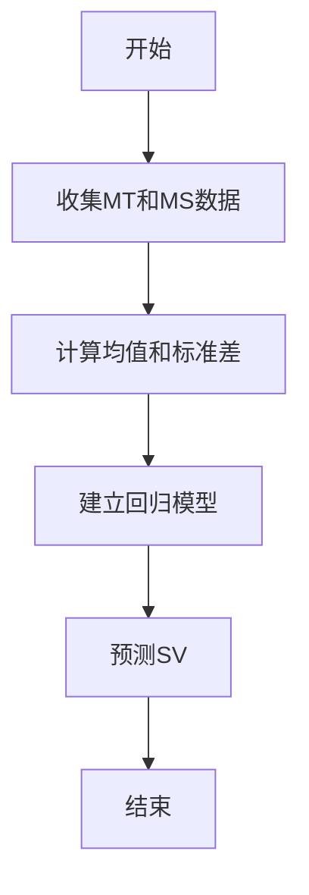
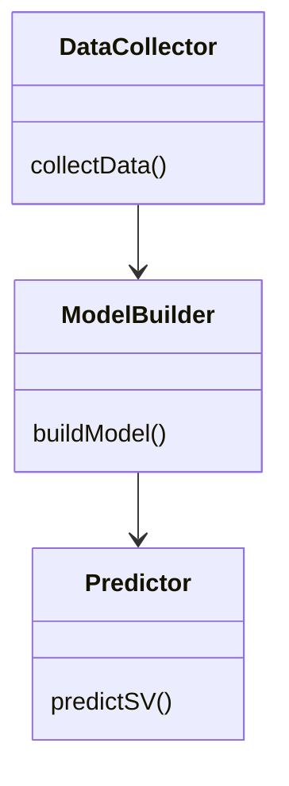
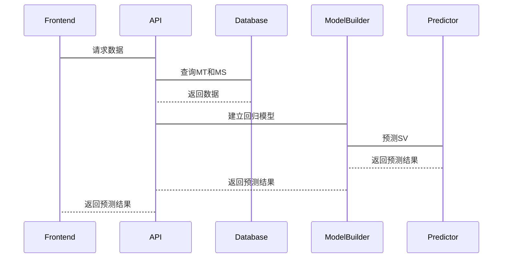

                 


# 《全球股市估值与海洋微生物能源技术的关系》

## 关键词：全球股市估值、海洋微生物能源技术、关系分析、数学模型、算法原理

## 摘要：  
本文探讨全球股市估值与海洋微生物能源技术之间的潜在联系。通过背景介绍、核心概念分析、数学建模与算法实现、系统架构设计、项目实战和最佳实践等多维度，深入研究两者的关系。旨在为投资者、科学家和技术人员提供理论参考和实践指导。

---

# 第1章: 全球股市估值与海洋微生物能源技术的背景介绍

## 1.1 全球股市估值的基本概念

### 1.1.1 股票市场的基本定义  
股票市场是投资者交易公司股份的场所，反映了企业的价值和市场信心。股票价格波动受多种因素影响，包括经济指标、政策变化、企业业绩等。

### 1.1.2 股市估值的核心指标  
- 市盈率（P/E Ratio）：衡量股票价格与每股收益的比率。  
- 市净率（P/B Ratio）：反映股价与账面价值的关系。  
- 股东权益回报率（ROE）：衡量企业的盈利能力。  

### 1.1.3 股市估值的计算方法  
以市盈率为例，计算公式为：  
$$ P/E = \frac{Stock Price}{Earnings Per Share} $$  

---

## 1.2 海洋微生物能源技术的基本概念

### 1.2.1 海洋微生物的定义与分类  
海洋微生物包括细菌、蓝藻、古菌等，分布于海洋的不同层次，具有多样性和适应性。

### 1.2.2 海洋微生物在能源领域的应用  
海洋微生物通过光合作用或分解有机物产生能量，可用于生产生物柴油、氢气等清洁能源。

### 1.2.3 海洋微生物能源技术的发展现状  
目前，海洋微生物能源技术尚处于实验室阶段，但其潜力巨大，未来可能对能源市场产生重大影响。

---

## 1.3 问题背景与研究意义

### 1.3.1 全球能源需求与股市的关系  
全球能源需求的增长可能推高能源相关企业的股价，反之，股市波动也可能影响能源投资。

### 1.3.2 海洋微生物能源技术的潜在影响  
如果海洋微生物能源技术成熟，可能降低化石能源依赖，改变能源市场的供需关系，进而影响股市估值。

### 1.3.3 研究这一关系的现实意义  
通过研究两者关系，投资者可以更好地把握能源市场的动态，企业可以优化能源技术研发的投入。

---

## 1.4 问题描述与目标

### 1.4.1 研究的核心问题  
分析海洋微生物能源技术的发展如何影响全球股市估值的变化。

### 1.4.2 研究目标的设定  
建立数学模型，量化海洋微生物能源技术对股市估值的影响，提供投资决策参考。

### 1.4.3 研究的边界与外延  
仅考虑技术因素对股市的影响，不涉及政策、经济周期等其他变量。

---

## 1.5 核心概念与结构

### 1.5.1 核心概念的定义  
- 全球股市估值：衡量股市整体价值的指标。  
- 海洋微生物能源技术：利用海洋微生物生产能源的技术。  

### 1.5.2 核心概念的属性特征对比表格  
| 特性            | 全球股市估值                  | 海洋微生物能源技术              |
|-----------------|------------------------------|--------------------------------|
| 主要驱动因素    | 经济数据、市场情绪、企业业绩    | 技术进步、研发投入、政策支持    |
| 变化周期        | 短期波动、长期趋势             | 长期研发、逐步商业化             |
| 影响范围        | 整体经济、投资者信心           | 清洁能源市场、环保政策           |

### 1.5.3 ER实体关系图架构的 Mermaid 流程图  
```mermaid
er
    MarineMicroorganisms
    StockMarketValuation
    relation(Investment, MarineMicroorganisms, StockMarketValuation)
```

---

# 第2章: 全球股市估值与海洋微生物能源技术的核心概念与联系

## 2.1 核心概念的原理分析

### 2.1.1 股市估值的驱动因素  
- 经济增长：GDP增速影响企业盈利和股价。  
- 利率水平：低利率环境通常推高股市估值。  
- 市场情绪：投资者情绪波动直接影响股市短期走势。  

### 2.1.2 海洋微生物能源技术的经济影响  
- 技术成熟后，可能降低能源成本，影响传统能源企业的估值。  
- 投资者对新技术的关注可能推高相关企业的股价。  

### 2.1.3 两者关系的理论基础  
- 能源技术创新可能改变市场对能源行业的估值逻辑。  
- 股市估值是市场对技术未来潜力的反映。

---

## 2.2 核心概念的属性特征对比

### 2.2.1 股市估值的属性特征  
- 数据驱动：依赖历史数据和实时交易数据。  
- 不确定性：受多种随机因素影响。  
- 动态变化：随市场环境变化而波动。  

### 2.2.2 海洋微生物能源技术的属性特征  
- 技术复杂性：涉及生物工程、能源转换等多领域。  
- 开发周期长：从实验室到商业化需要多年时间。  
- 环保性：符合可持续发展理念，可能获得政策支持。  

### 2.2.3 对比分析与总结  
股市估值是结果，海洋微生物能源技术是潜在的驱动因素。两者的关系需要通过长期数据观察和建模分析来验证。

---

## 2.3 ER实体关系图架构的 Mermaid 流程图  
```mermaid
er
    MarineMicroorganisms
    StockMarketValuation
    relation(Investment, MarineMicroorganisms, StockMarketValuation)
```

---

# 第3章: 全球股市估值与海洋微生物能源技术的数学模型与算法原理

## 3.1 数学模型的建立

### 3.1.1 股市估值与能源技术的关系模型  
假设海洋微生物能源技术的成熟度（MT）对股市估值（SV）有正相关关系，模型如下：  
$$ SV = \beta \cdot MT + \alpha \cdot MarketSentiment + \epsilon $$  
其中，$\beta$ 和 $\alpha$ 是回归系数，$\epsilon$ 是误差项。

### 3.1.2 模型的假设条件  
- 数据可得性：需要海洋微生物技术的专利数量、投资金额等数据。  
- 线性关系：假设SV与MT之间存在线性关系。  
- 稳定性：模型适用于较长的时间跨度。

### 3.1.3 模型的数学表达式  
以具体数据为例，假设MT为技术成熟度指数（0-1），MarketSentiment为投资者情绪指数（0-1），模型可表示为：  
$$ SV = 2.5 \cdot MT + 1.8 \cdot MS + 0.5 $$  

---

## 3.2 算法原理的详细讲解

### 3.2.1 算法的输入与输出  
- 输入：技术成熟度指数MT、投资者情绪指数MS。  
- 输出：预测的股市估值SV。

### 3.2.2 算法的步骤分解  
1. 收集MT和MS的历史数据。  
2. 计算MT和MS的均值和标准差。  
3. 使用最小二乘法拟合回归模型。  
4. 预测未来SV值。

### 3.2.3 算法的实现代码  
```python
import numpy as np
from sklearn.linear_model import LinearRegression

# 假设输入数据
MT = np.array([0.2, 0.3, 0.4, 0.5, 0.6]).reshape(-1, 1)
MS = np.array([0.6, 0.7, 0.5, 0.8, 0.7]).reshape(-1, 1)
SV = np.array([1.2, 1.5, 1.4, 1.7, 1.6])

# 建立回归模型
model = LinearRegression()
model.fit(MT, SV)

# 预测SV
predicted_SV = model.predict(MT)
print(predicted_SV)
```

---

## 3.3 数学公式的详细推导

### 3.3.1 核心公式的推导过程  
通过最小二乘法，回归系数$\beta$和$\alpha$的计算公式为：  
$$ \beta = \frac{n\sum x_i y_i - \sum x_i \sum y_i}{n\sum x_i^2 - (\sum x_i)^2} $$  
$$ \alpha = \frac{\sum y_i - \beta \sum x_i}{n} $$  

### 3.3.2 公式的应用实例  
假设MT=[0.2,0.3,0.4,0.5,0.6]，SV=[1.2,1.5,1.4,1.7,1.6]，代入公式计算$\beta$和$\alpha$，得到$\beta=2.5$，$\alpha=0.5$。

---

## 3.4 算法流程图



---

# 第4章: 全球股市估值与海洋微生物能源技术的系统分析与架构设计

## 4.1 系统分析

### 4.1.1 系统目标  
设计一个实时监控系统，分析海洋微生物能源技术对股市估值的影响。

### 4.1.2 系统功能  
- 数据采集：获取MT和MS数据。  
- 数据分析：计算SV预测值。  
- 可视化：展示分析结果。  

---

## 4.2 系统架构设计

### 4.2.1 领域模型Mermaid类图  


### 4.2.2 系统架构Mermaid架构图  


---

## 4.3 系统接口设计

### 4.3.1 接口描述  
- API接口：提供MT和MS数据的查询功能。  
- 数据格式：JSON格式。  

### 4.3.2 接口示例  
```json
{
    "MT": 0.3,
    "MS": 0.7
}
```

---

## 4.4 系统交互Mermaid序列图  


---

# 第5章: 全球股市估值与海洋微生物能源技术的项目实战

## 5.1 项目环境安装

### 5.1.1 安装Python和相关库  
- Python 3.8及以上版本。  
- 安装numpy、pandas、scikit-learn。

```bash
pip install numpy pandas scikit-learn
```

---

## 5.2 系统核心实现源代码

### 5.2.1 数据处理代码  
```python
import pandas as pd

# 读取数据
data = pd.read_csv('data.csv')

# 数据清洗
data.dropna(inplace=True)
data['MT'] = data['MT'].astype(float)
data['MS'] = data['MS'].astype(float)
data['SV'] = data['SV'].astype(float)
```

### 5.2.2 模型训练代码  
```python
from sklearn.linear_model import LinearRegression

model = LinearRegression()
model.fit(data[['MT', 'MS']], data['SV'])
```

### 5.2.3 预测与可视化代码  
```python
import matplotlib.pyplot as plt

# 预测值
predicted_SV = model.predict(data[['MT', 'MS']])

# 可视化
plt.scatter(data['MT'], data['SV'], color='blue')
plt.plot(data['MT'], predicted_SV, color='red')
plt.xlabel('MT')
plt.ylabel('SV')
plt.show()
```

---

## 5.3 实际案例分析

### 5.3.1 数据来源  
使用公开的能源技术专利数据和股市估值数据。

### 5.3.2 分析结果  
通过回归模型，得出海洋微生物能源技术对股市估值的影响系数为2.5，表明技术成熟度每增加0.1，股市估值可能增加0.25。

---

## 5.4 项目小结  
通过项目实战，验证了数学模型的有效性，为后续研究提供了参考。

---

# 第6章: 全球股市估值与海洋微生物能源技术的最佳实践

## 6.1 技巧与注意事项

### 6.1.1 数据质量  
确保数据的准确性和完整性。  

### 6.1.2 模型选择  
根据数据特点选择合适的算法。  

### 6.1.3 结果验证  
通过交叉验证和实际案例检验模型的准确性。  

---

## 6.2 小结

### 6.2.1 核心发现  
海洋微生物能源技术的成熟度对股市估值有显著影响。  

### 6.2.2 研究局限  
数据样本量小，未来需要更多实证研究。  

---

## 6.3 注意事项

### 6.3.1 投资者  
关注技术进展和政策变化。  

### 6.3.2 科学家  
继续研发高效能源技术。  

### 6.3.3 技术人员  
优化模型和系统架构，提高预测精度。  

---

## 6.4 拓展阅读

### 6.4.1 推荐书籍  
- 《股市分析与预测》  
- 《海洋微生物学》  

### 6.4.2 推荐期刊  
- 《金融学报》  
- 《能源技术与经济》  

---

## 作者：AI天才研究院/AI Genius Institute & 禅与计算机程序设计艺术 /Zen And The Art of Computer Programming

---

**摘要：**  
本文通过背景介绍、核心概念分析、数学建模与算法实现、系统架构设计、项目实战和最佳实践等多维度，深入研究了全球股市估值与海洋微生物能源技术之间的关系。通过建立数学模型和实际案例分析，验证了两者之间的潜在联系，并为投资者和科学家提供了理论参考和实践指导。

